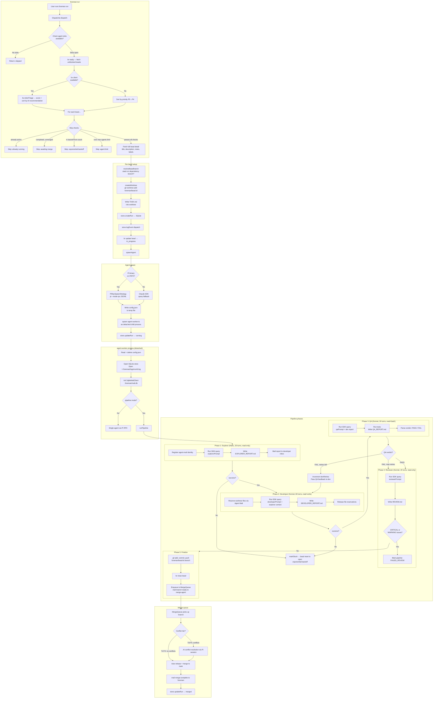

# Foreman 👷

> The foreman doesn't write the code — they manage the crew that does.

Multi-agent coding orchestrator. Decomposes development work into parallelizable tasks, dispatches them to AI coding agents in isolated git worktrees, and automatically merges results back — all driven by a real-time pipeline and inter-agent messaging.

## Why Foreman?

You already have AI coding agents. What you don't have is a way to run several of them simultaneously on the same codebase without them stepping on each other. Foreman solves this:

- **Work decomposition** — PRD → TRD → beads (structured, dependency-aware tasks)
- **Git isolation** — each agent gets its own worktree (zero conflicts during development)
- **Pipeline phases** — Explorer → Developer ↔ QA → Reviewer → Finalize
- **Pi runtime** — agents run via `pi --mode rpc` (JSONL over stdin/stdout); falls back to Claude SDK if Pi is not installed
- **Agent Mail** — inter-agent messaging, phase-to-phase coordination, file reservations
- **Auto-merge** — completed branches rebase onto main and merge automatically
- **Progress tracking** — every task, agent, and phase tracked in SQLite + beads_rust

## Architecture

```
Foreman CLI / Dispatcher
  │
  ├─ per task: spawn  pi --mode rpc  ──► Pi process (or Claude SDK fallback)
  │               JSONL stdin/stdout         │
  │                                    Extensions:
  │                                    ├─ foreman-tool-gate   (enforce allowed tools per phase)
  │                                    ├─ foreman-budget      (turn + token hard limits)
  │                                    └─ foreman-audit       (stream events → Agent Mail)
  │
  ├─ Agent Mail (SQLite, .foreman/mail.db — no external server)
  │    Mailboxes: foreman, merge-agent, phase agents
  │    Phase transitions: explorer→developer→qa→reviewer→merge
  │    File reservations: prevent concurrent worktree conflicts
  │
  └─ Merge Agent (auto-merge daemon)
       Receives "branch-ready" messages from Agent Mail
       T1/T2: TypeScript auto-merge (fast path, no LLM)
       T3/T4: AI conflict resolution via Pi session
```

**Pipeline phases** (orchestrated by TypeScript, not AI):
1. **Explorer** (Haiku, 30 turns, read-only) — codebase analysis → `EXPLORER_REPORT.md`
2. **Developer** (Sonnet, 80 turns, read+write) — implementation + tests
3. **QA** (Sonnet, 30 turns, read+bash) — test verification → `QA_REPORT.md`
4. **Reviewer** (Sonnet, 20 turns, read-only) — code review → `REVIEW.md`
5. **Finalize** — git add/commit/push, br close

Dev ↔ QA retries up to 2x before proceeding to Review.

## Dispatch Flow

The following diagram shows the full lifecycle of a bead from `foreman run` to merged branch:



**Key decision points:**

| Decision | Outcome |
|---|---|
| **Backoff check** | Bead recently failed/stuck → exponential delay before retry |
| **Dependency stacking** | Bead depends on open bead → worktree branches from that dependency's branch |
| **Pi vs SDK** | `pi` binary on PATH → JSONL RPC protocol; otherwise Claude SDK `query()` |
| **Pipeline vs single** | `--pipeline` flag → 4-phase orchestration; otherwise single agent |
| **Dev↔QA retry** | Max 2 retries; QA feedback injected into next developer prompt |
| **Reviewer FAIL** | CRITICAL/WARNING issues → run marked failed, bead reset to open |
| **Merge tiers T1-T4** | T1/T2 = TypeScript auto-merge; T3/T4 = AI-assisted conflict resolution |

## Prerequisites

- **Node.js 20+**
- **[beads_rust](https://github.com/Dicklesworthstone/beads_rust)** (`br`) — task tracking CLI
  ```bash
  cargo install beads_rust
  # or: download binary to ~/.local/bin/br
  ```
- **[Pi](https://github.com/badlogic/pi-mono)** _(optional but recommended)_ — agent runtime
  ```bash
  # macOS with Homebrew:
  brew install pi
  # or follow Pi's install instructions for your platform
  ```
- **Agent Mail** — inter-agent messaging is now **built-in** via SQLite (`SqliteMailClient`). No external server required. State stored in `.foreman/mail.db`.
- **Claude Code** — `npm install -g @anthropic-ai/claude-code`
- **Anthropic API key** — `export ANTHROPIC_API_KEY=sk-ant-...`

## Quick Start

```bash
# 1. Install Foreman
git clone https://github.com/ldangelo/foreman
cd foreman
npm install && npm run build

# 2. Initialize in your project
cd ~/your-project
foreman init --name my-project

# 3. Create tasks (beads)
br create --title "Add user auth" --description "Implement JWT-based auth" --type feature --priority 1
br create --title "Write auth tests" --type task --priority 2

# 4. Dispatch agents to ready tasks
foreman run

# 5. Monitor progress
foreman status

# 6. Merge completed branches (runs automatically in foreman run loop)
foreman merge
```

## Agent Mail

Agent Mail provides inter-agent messaging, phase-to-phase coordination, and file reservation leases. As of the SQLite migration, it is **fully embedded** — no external server or Python dependency required. State is stored in `.foreman/mail.db`.

### What Foreman uses Agent Mail for

| Message Subject | From → To | When |
|---|---|---|
| `phase-complete` | phase agent → foreman | Pi agent_end success=true |
| `agent-error` | phase agent → foreman | Pi agent_end success=false |
| `branch-ready` | foreman → merge-agent | Phase pipeline complete |
| `merge-complete` | merge-agent → foreman | Branch merged to main |
| `audit-event` | foreman-audit extension → foreman | Every tool call / turn |

## Running with Pi

When `pi` is on PATH, Foreman automatically uses `PiRpcSpawnStrategy` instead of the Claude SDK. Each agent becomes:

```bash
pi --mode rpc --provider anthropic --model claude-sonnet-4-6
```

Pi extensions loaded via `PI_EXTENSIONS` env var:
- `foreman-tool-gate` — blocks disallowed tools per phase (Explorer = read-only enforced)
- `foreman-budget` — enforces turn and token limits
- `foreman-audit` — streams all events to Agent Mail

### Verifying Pi is detected

```bash
foreman doctor     # Shows "Pi binary: found" or "Pi binary: not found (using Claude SDK)"
```

### Pi phase configs

| Phase | Model | Max Turns | Max Tokens | Allowed Tools |
|---|---|---|---|---|
| Explorer | claude-haiku-4-5-20251001 | 30 | 100K | Read, Grep, Glob, LS, WebFetch, WebSearch |
| Developer | claude-sonnet-4-6 | 80 | 500K | Read, Write, Edit, Bash, Grep, Glob, LS |
| QA | claude-sonnet-4-6 | 30 | 200K | Read, Grep, Glob, LS, Bash |
| Reviewer | claude-sonnet-4-6 | 20 | 150K | Read, Grep, Glob, LS |

## Commands

For the complete CLI reference with all options and examples, see **[CLI Reference](docs/cli-reference.md)**.

For common problems and solutions, see **[Troubleshooting Guide](docs/troubleshooting.md)**.

### `foreman init`
Initialize Foreman in a project directory. Runs `br init` and registers the project.

```bash
foreman init --name "my-project"
```

### `foreman run`
Dispatch AI coding agents to ready tasks. Enters a watch loop that auto-merges completed branches.

```bash
foreman run                              # Dispatch to all ready tasks
foreman run --bead bd-abc               # Dispatch one specific task
foreman run --max-agents 3               # Limit concurrent agents
foreman run --model claude-opus-4-6      # Override model for all agents
foreman run --no-tests                   # Skip test suite in merge step
foreman run --dry-run                    # Preview without dispatching
```

Each agent gets:
- Its own git worktree (branch: `foreman/<bead-id>`)
- A `TASK.md` with task instructions, phase prompts, and bead context
- `br` CLI for status updates
- Phase-specific tool restrictions (via Pi extension or SDK `disallowedTools`)

### `foreman status`
Show current task and agent status.

```bash
foreman status
foreman status --watch                   # Live-updating display
```

### `foreman merge`
Merge completed work branches back to main. Runs automatically in the `foreman run` loop.

```bash
foreman merge                           # Merge all completed
foreman merge --target-branch develop    # Merge to develop
foreman merge --no-tests                 # Skip test suite
foreman merge --test-command "npm test"  # Custom test command
```

Auto-merge tiers (T1–T4):
- **T1**: Fast-forward or trivial rebase — no conflicts
- **T2**: Auto-resolve report-file conflicts (`.beads/`, `EXPLORER_REPORT.md`, etc.)
- **T3**: AI-assisted conflict resolution via Pi session
- **T4**: Create PR for human review (true code conflicts)

### `foreman plan`
Run the PRD → TRD pipeline using Ensemble slash commands.

```bash
foreman plan "Build a user auth system with OAuth2"
foreman plan docs/description.md              # From file
foreman plan --from-prd docs/PRD.md "unused"  # Skip to TRD
foreman plan --prd-only "Build a REST API"    # Stop after PRD
```

### `foreman sling trd`
Parse a TRD and create seeds + beads task hierarchy.

```bash
foreman sling trd docs/TRD.md           # Parse and create tasks
foreman sling trd docs/TRD.md --dry-run # Preview without creating
foreman sling trd docs/TRD.md --auto    # Skip confirmation
```

### `foreman doctor`
Check environment health: br binary, Pi binary, Agent Mail server, SQLite integrity.

```bash
foreman doctor
foreman doctor --fix                    # Auto-fix recoverable issues
```

### `foreman reset`
Reset failed/stuck runs: kill agents, remove worktrees, reset beads to open.

```bash
foreman reset                           # Reset failed/stuck runs
foreman reset --all                     # Reset ALL active runs
foreman reset --detect-stuck            # Detect stuck runs first, then reset
foreman reset --detect-stuck --timeout 20  # Stuck after 20 minutes
```

### `foreman pr`
Create pull requests for completed branches that couldn't be auto-merged.

```bash
foreman pr
```

## Task Tracking with beads_rust

Foreman uses [beads_rust](https://github.com/Dicklesworthstone/beads_rust) (`br`) for task tracking. Tasks are stored in `.beads/beads.jsonl` (git-tracked).

```bash
# View ready tasks (open, unblocked)
br ready

# Create tasks
br create --title "Implement feature X" --type feature --priority 1
br create --title "Fix bug Y" --type bug --priority 0

# Work lifecycle
br update bd-abc --status=in_progress
br close bd-abc --reason="Completed"

# Dependencies
br dep add bd-tests bd-feature    # tests depend on feature

# Sync with git
br sync --flush-only               # Export DB to JSONL before committing
```

Priority scale: 0 (critical) → 1 (high) → 2 (medium) → 3 (low) → 4 (backlog).

## Configuration

### Workflow YAML

Foreman pipelines are configured via workflow YAML files. See the **[Workflow YAML Reference](docs/workflow-yaml-reference.md)** for complete documentation with examples for Node.js, .NET, Go, Python, and Rust.

Workflows define:
- **Setup steps** — dependency installation, build commands (stack-agnostic)
- **Setup cache** — symlink dependency directories from a shared cache
- **Phase sequence** — which agents run in what order
- **Model selection** — per-phase models with priority-based overrides
- **Retry loops** — QA/Reviewer failure → Developer retry with feedback
- **Mail hooks** — lifecycle notifications and artifact forwarding

```yaml
# .foreman/workflows/default.yaml (project-local override)
name: default
setup:
  - command: npm install --prefer-offline --no-audit
    failFatal: true
setupCache:
  key: package-lock.json
  path: node_modules
phases:
  - name: developer
    prompt: developer.md
    models:
      default: sonnet
      P0: opus
    maxTurns: 80
  - name: qa
    prompt: qa.md
    verdict: true
    retryWith: developer
    retryOnFail: 2
```

### Environment variables

```bash
export ANTHROPIC_API_KEY=sk-ant-...          # Required
export FOREMAN_AGENT_MAIL_URL=http://localhost:8766  # Agent Mail (default)
export FOREMAN_PI_BIN=/path/to/pi            # Override Pi binary path
export FOREMAN_MAX_AGENTS=5                  # Max concurrent agents (default: 5)
```

### Storage locations

| Path | Contents |
|---|---|
| `.beads/` | beads_rust task database (JSONL, git-tracked) |
| `.foreman/foreman.db` | SQLite: runs, merge_queue, projects |
| `.foreman-worktrees/` | Git worktrees for active agents |
| `~/.foreman/logs/` | Per-run agent logs |

## Project Structure

```
foreman/
├── src/
│   ├── cli/                        # CLI entry point + commands
│   │   └── commands/
│   │       ├── run.ts              # Main dispatch + merge loop
│   │       ├── status.ts           # Status display
│   │       ├── merge.ts            # Manual merge trigger
│   │       └── doctor.ts           # Health checks
│   ├── orchestrator/               # Core orchestration engine
│   │   ├── dispatcher.ts           # Task → agent spawning strategies
│   │   ├── pi-rpc-spawn-strategy.ts  # Pi RPC spawn (primary)
│   │   ├── agent-worker.ts         # Claude SDK pipeline (fallback)
│   │   ├── agent-mail-client.ts    # Agent Mail HTTP wrapper
│   │   ├── refinery.ts             # Merge + test + cleanup
│   │   ├── conflict-resolver.ts    # T1-T4 conflict resolution
│   │   ├── roles.ts                # Phase prompts + tool configs
│   │   └── sentinel.ts             # Background health monitor
│   └── lib/
│       ├── beads-rust.ts           # br CLI wrapper
│       ├── git.ts                  # Git worktree management
│       └── store.ts                # SQLite state store
├── packages/
│   └── foreman-pi-extensions/      # Pi extension package
│       ├── src/tool-gate.ts        # Block disallowed tools per phase
│       ├── src/budget-enforcer.ts  # Turn + token limits
│       └── src/audit-logger.ts     # Audit trail → Agent Mail
└── docs/
    ├── TRD/                        # Technical Requirements Documents
    └── PRD/                        # Product Requirements Documents
```

## Development

```bash
npm run build          # TypeScript compile
npm test               # vitest run (128 test files)
npm run dev            # tsx watch mode
npx tsc --noEmit       # Type check only
```

**Rules:**
- TypeScript strict mode — no `any` escape hatches
- ESM only — all imports use `.js` extensions
- TDD — RED-GREEN-REFACTOR cycle
- Test coverage — unit ≥ 80%, integration ≥ 70%
- `br sync --flush-only` before every git commit

## License

MIT

---

Built by [Leo D'Angelo](https://www.linkedin.com/in/leo-d-angelo-5a0a83) at [Fortium Partners](https://fortiumpartners.com).
