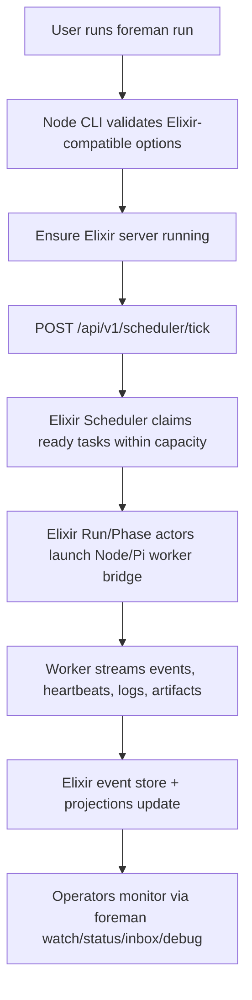

# Foreman 👷

[](https://github.com/ldangelo/foreman/actions/workflows/ci.yml)

> The foreman doesn't write the code — they manage the crew that does.

**What it does:** Foreman is a multi-agent coding orchestrator. It coordinates multiple AI coding agents to work in parallel on the same codebase using git worktrees for isolation, orchestrating a 5-phase pipeline (Explorer → Developer ↔ QA → Reviewer → Finalize) with automatic merging, inter-agent messaging, and progress tracking.

Foreman decomposes development work into parallelizable tasks, dispatches them to AI coding agents in isolated git worktrees, and automatically merges results back — all coordinated through the Elixir backend and rendered by the Node CLI.

## Why Foreman?

You already have AI coding agents. What you don't have is a way to run several of them simultaneously on the same codebase without them stepping on each other. Foreman solves this:

- **Work decomposition** — PRD → TRD → Elixir-backed native tasks
- **Git isolation** — each agent gets its own worktree (zero conflicts during development)
- **Pipeline phases** — Explorer → Developer ↔ QA → Reviewer → Finalize
- **Pi SDK runtime** — agents run in-process via `@mariozechner/pi-coding-agent` SDK (`createAgentSession`)
- **Bundled Foreman skills** — repo-specific Pi guidance for Elixir backend, workflow pipeline, worker/Pi SDK, diagnosis, safe recovery, VCS backend, and documentation gate work; installed by `foreman init`
- **Built-in messaging** — Agent Mail with phase lifecycle notifications and file reservations through Elixir-backed projections
- **Native task storage** — Elixir-backed tasks/events/projections
- **Auto-merge** — completed branches rebase onto target and merge automatically via the refinery
- **PR reconciliation** — the Elixir server periodically checks recorded GitHub PRs and marks Foreman runs/tasks merged when GitHub reports `MERGED`
- **Documentation gate** — workflows include a documentation phase that checks `CLAUDE.md`, `AGENTS.md`, `README.md`, and the Foreman User Guide before finalization
- **Progress tracking** — every task, agent, and phase tracked through Elixir events/projections; structured phase-report events let Elixir Overwatch send next-phase Agent Mail steering, and Overwatch records tool policy decisions/nudges when workers drift


## Architecture

```
Node CLI / frontend
  │
  ├─ Elixir/OTP server
  │    ├─ authenticated HTTP JSON API
  │    ├─ durable event store + CQRS projections
  │    ├─ scheduler, run/phase actors, recovery, inbox/debug views
  │    └─ launches Node/Pi worker bridge
  │
  ├─ per task: agent-worker.ts (detached child process)
  │    └─ Pi SDK (in-process)
  │       createAgentSession() → session.prompt()
  │       Tools: read, write, edit, bash, grep, find, ls, send_mail
  │
  ├─ Pipeline Executor (workflow YAML-driven)
  │    Phases defined in ~/.foreman/workflows/*.yaml
  │    Model selection, retries, mail hooks, artifacts — all YAML config
  │    Per-phase reports/traces → ~/.foreman/reports/... (outside repo commits)
  │
  └─ Refinery + autoMerge
       Triggers immediately after finalize phase
       T1/T2: TypeScript auto-merge (fast path, no LLM)
       T3/T4: AI conflict resolution via Pi session
```

### Elixir Backend Migration Roles

TRD-2026-014 adds an Elixir/OTP orchestration server alongside the existing Node CLI and Node/Pi workers. The target split is:

- **Node CLI**: parses operator commands, starts or locates the Elixir server, sends authenticated JSON commands/reads, renders projection responses, and keeps deprecated aliases pointing at replacements.
- **Elixir server**: owns durable commands, append-only events, CQRS projections, all database access, run/phase actors, scheduler capacity, automatic 5-second scheduler ticks that claim dispatchable `ready` tasks and launch the Node/Pi worker bridge, VCS/PR state machines, inbox/debug/attach views, recovery, doctor/metrics, and authorization audit events.
- **Node/Pi worker layer**: executes Pi SDK-backed phases, receives worker protocol starts, streams ordered events/heartbeats/tool calls/assistant messages/artifacts back to Elixir, exposes Foreman-specific Pi tools (`mail_send`, `mail_read`, `phase_handoff`, `artifact_write`, `validation_result`, `task_block`, `progress_update`, `safe_command_run`) for typed workflow behavior, asks Elixir overwatch for tool policy decisions before execution, and emits authoritative terminal run/task events. Workers and Node clients use Elixir HTTP commands/projections for task/run/mail state and do not connect directly to the database or drain DB-backed merge queues; they enqueue/report and let Elixir/refinery processing continue. Raw worker log files are compatibility/debug projections of that stream; the Elixir launcher records process-exit facts and emits a diagnostic fallback failure only when the worker exits without an authoritative terminal event.

See [Elixir Backend Architecture](./docs/guides/elixir-backend-architecture.md) for the migration architecture, deprecated command mapping, and event/projection/recovery troubleshooting model.

**Legacy daemon lifecycle:** `foreman daemon start/restart` was removed after Elixir cutover. Use `foreman server start` and `foreman server doctor`; `foreman daemon stop/status` only inspect or stop stray legacy processes.

**Pipeline phases** (orchestrated by TypeScript, not AI):
1. **Explorer** (Haiku, 12 turns, read-only) — concise developer handoff → `EXPLORER_REPORT.md`
2. **Developer** (Sonnet, 50 turns default / 60 turns feature, read+write) — implementation only; QA/finalize own tests
3. **QA** (Sonnet, 30 turns, read+bash) — targeted test verification only → `QA_REPORT.md`
4. **Reviewer** (Sonnet, 20 turns, read-only) — code review → `REVIEW.md`
5. **Documentation** — update required operator/developer docs or explain why no docs changed → `DOCUMENTATION_REPORT.md`
6. **Finalize** — git add/commit/push, native task merge/close update

Dev ↔ QA retries up to 2x before proceeding to Review. Documentation runs before finalization so fixes/features do not merge without an explicit documentation decision.

## Dispatch Flow

Default `foreman run` is Elixir-backed after cutover: the Node CLI validates options, ensures the Elixir server is running, sends a scheduler tick, and operators monitor progress through Elixir-backed projections (`foreman watch`, `foreman status --watch`, inbox/events/debug views). Elixir owns ready-task claiming, capacity, run/phase actors, recovery state, and worker launches; the Node/Pi worker process remains an execution bridge launched by Elixir.



The historical Node dispatcher/tRPC server flow has been removed from the operator surface after Elixir cutover. The retained Node code is the CLI/frontend and the Elixir-launched Node/Pi worker bridge.

**Key decision points:**

| Decision | Outcome |
|---|---|
| **Backoff check** | Task recently failed/stuck → exponential delay before retry |
| **Dependency stacking** | Task depends on open task → worktree branches from that dependency's branch |
| **Pi vs SDK** | `pi` binary on PATH → JSONL RPC protocol; otherwise Claude SDK `query()` |
| **Pipeline vs single** | Legacy Node dispatcher option; default Elixir scheduler owns dispatch policy |
| **Dev↔QA retry** | Max 2 retries; QA feedback injected into next developer prompt |
| **Reviewer FAIL** | CRITICAL/WARNING issues → run marked failed, task reset to open |
| **Merge tiers T1-T4** | T1/T2 = TypeScript auto-merge; T3/T4 = AI-assisted conflict resolution |

## Prerequisites

- **Node.js 20+**
- **Elixir/OTP backend** — started automatically by CLI paths or explicitly with `foreman server start`
- **[Pi](https://pi.dev)** _(installed as npm dependency)_ — agent runtime via `@mariozechner/pi-coding-agent` SDK. No separate binary needed.
- **Anthropic API key** — `export ANTHROPIC_API_KEY=sk-ant-...` or log in via Pi: `pi /login`

## Installation

### Homebrew (macOS / Linux — recommended)

```bash
brew tap oftheangels/tap
brew install foreman
```

### npm

```bash
npm install -g @oftheangels/foreman
```

### curl (macOS / Linux)

```bash
curl -fsSL https://raw.githubusercontent.com/ldangelo/foreman/main/install.sh | sh
```

## Development with Devbox + Docker

Foreman includes a checked-in local development environment:

- `devbox.json` — reproducible local shell with Node 20, PostgreSQL client tools, git, jq, and helper scripts
- `compose.yaml` — shared local Postgres + Hindsight stack
- `.envrc` — direnv hook that loads Devbox and starts the local containers when you enter the repository

The shared Postgres service uses `pgvector/pgvector:pg16`, exposes Foreman's database on `127.0.0.1:55432` by default (`FOREMAN_POSTGRES_PORT` overrides it), and also creates a separate `hindsight` database with the `vector` extension enabled. Hindsight connects to that same Postgres container over Docker's internal network.

### Prerequisites

- [Devbox](https://www.jetify.com/devbox/)
- [direnv](https://direnv.net/) with `direnv allow` run once for this repository
- A Docker runtime on your machine (Docker Desktop, Colima, or OrbStack)

### Quickstart

```bash
direnv allow
devbox run install
devbox run db:migrate
foreman server start
```

### Common Devbox commands

```bash
foreman server start        # start Elixir backend
foreman server status       # check backend health
foreman run --dry-run       # verify CLI ↔ backend connectivity
devbox run dev:up          # start Postgres + Hindsight now
devbox run db:up           # start only shared Postgres
devbox run hindsight:logs   # tail Hindsight logs
devbox run test             # run the full test suite
```

Hindsight exposes its API at <http://localhost:8888> and control plane at <http://localhost:9999>. The compose default uses `HINDSIGHT_API_LLM_PROVIDER=none` so the service can start without stealing a general-purpose API key; set `HINDSIGHT_API_LLM_PROVIDER`, `HINDSIGHT_API_LLM_API_KEY`, `HINDSIGHT_API_LLM_BASE_URL`, and `HINDSIGHT_API_LLM_MODEL` in `.env` / `$HOME/.envrc` before startup for useful memory extraction through an OpenAI-compatible endpoint.

The CLI no longer opens a direct database pool. Project/task/run state goes through the Elixir backend.

### PowerShell (Windows)

```powershell
irm https://raw.githubusercontent.com/ldangelo/foreman/main/install.ps1 | iex
```

### Verification

```bash
foreman --version
foreman doctor              # Check installation and dependencies
```

## Quick Start

```bash
# 1. Initialize in your project
cd ~/your-project
foreman init --name my-project

# 2. Start/check the Elixir backend
foreman server start

# 3. Create or import tasks
foreman task create "Add user auth" --type feature --priority 1
foreman task create "Write auth tests" --type task --priority 2

# 4. Dispatch agents to ready tasks
foreman run

# 5. Monitor progress
foreman status

# 6. Merge completed branches (runs automatically in foreman run loop)
foreman merge
```

> **Note:** The daemon is required for full multi-project orchestration. Without it, Foreman uses project-level PostgreSQL for single-project development.

## Messaging

Foreman includes a built-in messaging system for inter-agent communication and pipeline coordination. Messages are surfaced through Elixir-backed inbox/event projections.

### How agents send messages

Agents use the native **`send_mail`** tool, registered as a Pi SDK ToolDefinition. This is a structured tool call — agents don't run bash commands or invoke skills to send messages.

Guidance skills are separate from native tools; they help agents choose correct Foreman conventions but do not replace structured tools.

```
Tool: send_mail
Parameters:
  to: "foreman"
  subject: "agent-error"
  body: '{"phase":"developer","error":"type check failed"}'
```

The pipeline executor also sends lifecycle messages automatically (phase-started, phase-complete) based on the [workflow YAML mail hooks](docs/workflow-yaml-reference.md).

### Message types

| Subject | From → To | When |
|---|---|---|
| `worktree-created` | foreman → foreman | Worktree initialized for a task |
| `task-claimed` | foreman → foreman | Task dispatched to an agent |
| `phase-started` | executor → foreman | Phase begins (YAML: `mail.onStart`) |
| `phase-complete` | executor → foreman | Phase succeeds (YAML: `mail.onComplete`) |
| `agent-error` | agent → foreman | Agent encounters an error |
| `branch-ready` | foreman → refinery | Finalize complete, ready to merge |
| `merge-complete` | refinery → foreman | Branch merged to target |
| `merge-failed` | refinery → foreman | Merge failed (conflicts, tests) |
| `task-closed` | refinery → foreman | Task closed after successful merge |

### Viewing messages

```bash
foreman inbox                     # TTY task navigator; non-TTY summary
foreman inbox task task-abc       # Messages/events for a specific task
foreman inbox --task task-abc      # Legacy task selector
foreman inbox --all --watch       # Live stream across all runs
foreman debug <task-id>            # AI analysis including full mail timeline + trace artifacts
```

### File reservations

Phases that modify files can reserve the worktree directory to prevent concurrent access:

```yaml
# In workflow YAML
files:
  reserve: true
  leaseSecs: 600
```

## Pi SDK Integration

Foreman uses the [Pi SDK](https://pi.dev) (`@mariozechner/pi-coding-agent`) to run AI agents in-process. Each pipeline phase creates a fresh `AgentSession` with phase-specific tools and model configuration.

### How agents run

```typescript
const { session } = await createAgentSession({
  cwd: worktreePath,
  model: getModel("minimax", "MiniMax"),
  tools: [createReadTool(cwd), createBashTool(cwd), ...],
  customTools: [createSendMailTool(mailClient, agentRole)],
  sessionManager: SessionManager.inMemory(),
});
await session.prompt(phasePrompt);
```

### Custom tools

The following tools may be registered as custom `ToolDefinition` for an agent session, depending on phase role and backend availability:

| Tool | Description |
|------|-------------|
| `send_mail` | Send messages to other agents or foreman. Used for error reporting. |
| `diff_read` | Get a unified diff between two refs (branches, commits, or tags) via VCS backend. |
| `git_status` | Get the working tree status (equivalent to `git status --porcelain`) via VCS backend. |
| `pr_review_finding` | Collect CodeRabbit blocking findings and failed checks for a pull request. |
| `merge_gate_status` | Check PR merge readiness including checks, CodeRabbit completion, and conflicts. |

Standard Pi tools are also available per phase (configured in [workflow YAML](docs/workflow-yaml-reference.md)):
- `read`, `write`, `edit` — file operations
- `bash` — shell command execution
- `grep`, `find`, `ls` — search and navigation

### Phase model configuration

Models are configured per-phase in the workflow YAML with priority-based overrides. See [Workflow YAML Reference](docs/workflow-yaml-reference.md) for full details.

| Phase | Default Model | P0 Override | Max Turns |
|---|---|---|---|
| Explorer | MiniMax | MiniMax-highspeed | 500 |
| Developer | MiniMax | MiniMax-highspeed | 500 |
| cicd-developer | MiniMax | MiniMax | 500 |
| cr-developer | MiniMax | MiniMax | 500 |
| merge-resolver | MiniMax | MiniMax | 500 |
| documentation | MiniMax | MiniMax-highspeed | 500 |
| QA | MiniMax | MiniMax-highspeed | 500 |
| Reviewer | MiniMax | MiniMax-highspeed | 500 |
| cli-review | builtin | — | — |
| finalize | builtin | — | — |
| create-pr | builtin | — | — |
| pr-wait | builtin | — | — |
| merge | builtin | — | — |

### Per-phase trace artifacts

Each phase emits detailed observability traces to the worktree:

```
{worktree}/
└── docs/
    └── reports/
        └── {taskId}/
            ├── EXPLORER_TRACE.md   # Markdown trace + JSON
            ├── DEVELOPER_TRACE.md
            ├── QA_TRACE.md
            ├── REVIEWER_TRACE.md
            └── FINALIZE_TRACE.md
```

Each trace file contains:
- **Metadata**: run ID, model, workflow, timestamps, success status
- **Prompt**: the full prompt sent to the agent
- **Resolved command**: (for command-style phases) the actual shell command
- **Final output**: the agent's final message
- **Tool calls**: every tool invocation with timing, arguments, and results
- **Warnings**: any issues detected during phase execution

Use `foreman debug <task-id> --raw` to inspect all trace artifacts for a task.

## Commands

For the complete CLI reference with all options and examples, see **[CLI Reference](docs/cli-reference.md)**.

For common problems and solutions, see **[Troubleshooting Guide](docs/troubleshooting.md)**.

### `foreman init`
Initialize Foreman in a project directory, register it with the Elixir backend, and set up `.foreman/`.
Use `--wizard` for interactive setup that writes `.foreman/config.yaml` with VCS, workflow, and issue-tracker settings.

```bash
foreman init --name "my-project"
foreman init --wizard
```

### `foreman run`
Dispatch AI coding agents to ready tasks by sending a scheduler tick to the Elixir orchestration server; use `foreman watch` or `foreman status --watch` to monitor.

```bash
foreman run                              # Tick Elixir scheduler for ready tasks
foreman run --project my-project         # Tick against a registered project context
foreman run --dry-run                    # Check Elixir server availability without ticking
```

Each agent gets:
- Its own git worktree (branch: `foreman/<task-id>`)
- A `TASK.md` with task instructions, phase prompts, and task context
- Native task status updates through the Elixir backend
- Phase-specific tool restrictions (via Pi extension or SDK `disallowedTools`)

### `foreman status`
Show current task and agent status, or aggregate across projects from the dashboard/status surfaces. `foreman inbox` opens an active/attention task navigator on a TTY, `foreman inbox task <id>` drills into one task's messages/events, and the legacy `foreman inbox --task <id>` selector remains supported. Use `foreman inbox --all --watch --events` to stream new lifecycle events and run status changes across the project.

```bash
foreman status
foreman status --project my-project      # Inspect a registered project without cd
foreman status --watch                   # Live-updating display
foreman status --live                    # Full dashboard TUI with event stream
```

### `foreman board`
Terminal UI kanban board for managing Foreman tasks. Five lifecycle status columns with vim-style navigation; workflow phase is shown separately on active cards/details when available. Press `y` to copy the selected task ID. `open`/`backlog` tasks appear in Backlog, `closed`/`merged` tasks appear in Closed, and unknown/unmapped statuses render in the Closed (terminal) column. The board monitors agent inbox messages and updates only task cards tied to changed runs; press `r` for a full manual reload with a `refreshing…` spinner and `refreshed <time>` confirmation. Use `--filter <status>` to filter by status (supports aliases: `completed`/`closed`, `in-progress`/`in_progress`, `needs-attention`/`needs_attention`).

```bash
foreman board                             # Launch interactive kanban board
foreman board --project my-project        # Board for a specific project
```

### `foreman mcp`
Run Foreman's MCP server for agent/tool integrations. Supports local stdio clients and HTTP clients for future remote Foreman deployments.

```bash
foreman mcp --transport stdio
foreman mcp --transport http --host 127.0.0.1 --port 4777
foreman mcp --transport http --host 0.0.0.0 --mcp-auth-token "$FOREMAN_MCP_AUTH_TOKEN"
```

Tools cover one-call smoke status, health, scheduler status/tick, projects, tasks, approvals, task reset, run summaries plus per-run inspection, inbox messages, lifecycle events, and debug timelines. Most MCP reads/writes go through the Elixir backend; `foreman.tasks.reset` intentionally runs the local CLI reset flow so it can clean local worktrees, branches, and log/report artifacts. MCP project listing matches `foreman project list --json` shape and default archived-project filtering. MCP run listing returns only run id, date, and status; use `foreman.runs.inspect` when a client needs one run's full payload. In Pi, the project extension also adds slash commands such as `/foreman-smoke`, `/foreman-tasks`, `/foreman-task`, `/foreman-approve`, `/foreman-runs`, `/foreman-inbox`, `/foreman-events`, `/foreman-scheduler`, and `/foreman-tick`. See [`docs/mcp-server.md`](docs/mcp-server.md).

### `foreman watch`
Single-pane live dashboard: agents, board summary, inbox, and pipeline events. (`foreman dashboard` is a deprecated alias.)

```bash
foreman watch                             # Live unified dashboard
foreman watch --no-watch                  # One-shot snapshot, no polling
foreman watch --project <id>              # Filter to a specific project
foreman status --watch                    # Compact refreshing status view
```

Project-aware operator commands (`run`, `status`, `reset`, and `retry`) accept `--project <name-or-path>`. Registered names resolve through `~/.foreman/projects.json`; absolute paths still work for direct one-off targeting.

### `foreman merge`
Merge completed work branches back to main. Runs automatically in the `foreman run` loop.

```bash
foreman merge                           # Merge all completed
foreman merge --target-branch develop    # Merge to develop
foreman merge --no-tests                 # Skip test suite
foreman merge --test-command "npm test"  # Custom test command
```

Auto-merge tiers (T1–T4):
- **T1**: Fast-forward or trivial rebase — no conflicts
- **T3**: AI-assisted conflict resolution via Pi session
- **T4**: Create PR for human review (true code conflicts)

### `foreman plan`
Run the PRD → TRD pipeline using Ensemble slash commands.

```bash
foreman plan "Build a user auth system with OAuth2"
foreman plan docs/description.md              # From file
foreman plan --from-prd docs/PRD.md "unused"  # Skip to TRD
foreman plan --prd-only "Build a REST API"    # Stop after PRD
foreman plan prd "Build a REST API"           # Server-backed PRD planning
foreman plan trd docs/PRD.md                   # Server-backed TRD planning
```

`plan prd` and `plan trd` send `plan.prd` / `plan.trd` commands to the local Elixir orchestration server and auto-start it by default.

### Migration and coexistence
Import a legacy TypeScript-era migration payload into the Elixir event store:

```bash
foreman import --to-elixir --file migration.json
foreman import --to-elixir --from-node --project foreman  # deprecated; use --file export instead
```

The payload maps legacy projects, tasks, runs, workflows, inbox messages, and config into durable events/projections. Legacy TS delegation has been removed after cutover.

Elixir is the backend after cutover. This removes legacy TS delegation and prevents `foreman daemon start|restart` from launching the Node scheduler, so one scheduler owns each project. Use `foreman server start` for the Elixir backend. Operator commands either use Elixir-backed APIs/events/projections or report removal; `foreman board` reads and writes task state through Elixir after importing project state. Domain events are the source of truth and trigger operational behavior; projections/read views, including status/log displays, are derived read models used after an event signal or explicit reconciliation. Worker/Pi SDK tool calls and assistant messages are emitted as ordered worker events before being mirrored to raw logs. Node/Pi workers receive task metadata from the Elixir backend and do not open a direct database pool.

### `foreman sling trd`
Parse a TRD and create a native task hierarchy.

```bash
foreman sling trd docs/TRD.md           # Parse and create tasks
foreman sling trd docs/TRD.md --dry-run # Preview without creating
foreman sling trd docs/TRD.md --auto    # Skip confirmation
```

### `foreman daemon`
Inspect or stop stray legacy ForemanDaemon processes. Start/restart were removed after Elixir cutover; use `foreman server start`.

```bash
foreman daemon stop           # Stop stray legacy daemon
foreman daemon status         # Show stray legacy daemon PID/socket status
```

> `foreman daemon start|restart` was removed after Elixir cutover; use `foreman server start` instead. `foreman daemon stop/status` remain only for inspecting or stopping stray legacy daemon processes.

### `foreman server`
Manage the experimental Elixir orchestration server.

```bash
foreman server doctor        # Auto-start and validate DB, projections, workers, VCS, providers, integrations
foreman server start         # Start local Elixir server
foreman server status        # Show PID/URL and health
foreman server stop          # Stop local Elixir server
```

The Elixir server scheduler automatically ticks every 5 seconds, claims dispatchable `ready` tasks within global/project capacity, and launches the Node/Pi worker bridge. Project/task/run/phase/inbox/worker/scheduler/VCS/recovery/integration command families are aggregate-validated before new events are appended. `foreman server doctor` calls the server doctor endpoint and includes operational metrics: phase timers, retry/failure/recovery counters, worker restarts, and projection lag. `foreman server status` shows the active `MIX_ENV`, event store, projection store, and project config store so wrong-runtime state is visible. With `FOREMAN_SERVER_EVENT_STORE_ADAPTER=postgres` and `DATABASE_URL`, Foreman writes events to `foreman_events` and persists read models in `foreman_project_projections`, `foreman_task_projections`, `foreman_run_projections`, and `foreman_inbox_message_projections`; term mode keeps projections in memory from the term event log. If server auth is configured, set `FOREMAN_SERVER_AUTH_TOKEN` so doctor/metrics requests include the bearer token. Run debug views include anomaly detection for inconsistent event timelines. Troubleshoot Elixir-backed status issues by checking the durable event first, then projection lag/rebuild state, then recovery events (`ExternalWorkerObserved` before `WorkerReattached`, `WorkerRestarted`, or `NeedsOperator`).

The server also runs a PR monitor. When a run has a recorded GitHub PR URL, the monitor checks GitHub from the registered project path and reconciles PR state into Foreman events. A GitHub `MERGED` state records `run.pr.merge` metadata and updates the associated task to `merged`; a closed-but-unmerged PR only closes the run PR state.

Security controls for the Elixir server:
- Worker startup scopes environment to `FOREMAN_PROJECT_ID`, `FOREMAN_RUN_ID`, allowed base variables, and explicit project/run secret maps. Forbidden host secrets such as `FOREMAN_SERVER_AUTH_TOKEN`, `AWS_*`, `GITHUB_*`, `NPM_*`, `SSH_*`, and `DATABASE_*` are stripped before worker launch metadata is recorded.
- Binding the HTTP server beyond loopback requires `FOREMAN_SERVER_AUTH_TOKEN`; protected API calls must send `Authorization: Bearer <token>`.
- `MIX_ENV=test` uses port `14766` by default, writes only to temp test storage, and refuses user port `4766` or persistent paths unless `FOREMAN_ALLOW_TEST_PORT_COLLISION=1` / `FOREMAN_ALLOW_TEST_PERSISTENT_STORAGE=1` are set intentionally.
- Destructive command-router actions such as `task.close`, `task.block`, and `task.update` append `AuthorizationChecked` and `AuditRecorded` events after the command executes.

### `foreman doctor`
Check environment health: Elixir backend availability, stray legacy daemon status, native task store/Pi binaries, GitHub auth, stale run records, zombie runs, and stale/orphaned worktrees.

```bash
foreman doctor
foreman doctor --fix                    # Auto-fix safe cleanup: retryable/zombie/stale runs, merged/orphaned worktrees, prompts/workflows
```

### `foreman inbox`
View inter-agent messages from pipeline runs through the Elixir event-backed inbox projection. On a TTY with no selector, `foreman inbox` opens an interactive active/attention cockpit with a task list, selected-run timeline, detail pane, and `s/m/e/l/r/f` tabs for summary, messages, events, logs, reports, and files; it refreshes live while keeping the selected run pinned, and `a` or `:` opens a command palette with safe manual commands for drilldown, logs, task status, and run detail. Use `--non-interactive` for scriptable output. Non-interactive all-run output is task-first so active `in_progress` runs remain visible even without recent mail, and summaries show a `LAST` date/time column sorted by most recent activity first. Task/run drilldowns, including the legacy `--task <id> --events` path, render `Recent Messages` with the same date/task/phase/receiver/kind/tool/args table preview as the top-level inbox; use `--full` for complete bodies where supported. Add `--events` for a columnar lifecycle table (`TIME`, `TASK`, `PHASE`, `TURNS`, `EVENT`, `MESSAGE`) with phase completions, retries, verdicts, overwatch nudges, worktree creation, dispatch, and merge/refinery lifecycle events. Add `--grouped` with `--events` for the workflow → phase → message/tool-call grouping. Use `--compact` for an operator summary of run/task status, phases, tool counts, denials, and notable failures.

```bash
foreman inbox                            # Live TTY cockpit with a/: actions; non-TTY summary
foreman inbox --non-interactive          # Force scriptable output on a TTY
foreman inbox task task-abc              # Task mail/events; add --logs --reports --files for artifacts
foreman inbox run <run-id>               # Run mail/events; add --follow for live refresh
foreman inbox --task task-abc            # Legacy task selector
foreman inbox --all                      # Task-first all-run summary
foreman inbox --compact                  # Compact run/task status, phase/tool counts, denials
foreman inbox --events --grouped         # Group lifecycle events by workflow/phase
foreman inbox task task-abc --logs --reports --files
foreman inbox --all --watch              # Live stream across all runs
foreman inbox send --from qa --to developer --subject fix-needed  # Send a message (--run-id or FOREMAN_RUN_ID)
```

### `foreman worktree`
Manage git worktrees created for active tasks. Agent worktrees live under `~/.foreman/worktrees/<projectId>/...`; refinery merge integration worktrees live under `~/.foreman/integration/<projectId>/<targetBranch>` and are reset before each merge attempt.

```bash
foreman worktree list                    # List active worktrees
foreman worktree clean                   # Remove orphaned worktrees
foreman worktree clean --all             # Remove all including active ones
```

### `foreman sentinel`
QA sentinel for continuous testing on the main branch. Registered-project sentinel persistence is owned by the Elixir backend; until sentinel config/run endpoints are exposed, CLI sentinel commands fail explicitly instead of reading legacy state.

```bash
foreman sentinel run-once               # Run tests once and exit
foreman sentinel start                   # Background daemon mode
foreman sentinel stop                    # Stop background sentinel
foreman sentinel status                  # Show sentinel status
```

### `foreman reset`
Reset task work and rerun it.

```bash
foreman reset task-abc                  # Stop active workers, close open/draft PRs, fail old active runs, clean stale artifacts, set ready, dispatch
foreman reset task-abc --reason "stale worker"
foreman reset task-abc --dry-run        # Preview PR closure, worker/worktree/branch/log cleanup, and run terminalization
foreman reset task-abc --keep-worktree  # Preserve task worktree while resetting state
```

Use this for stale active workers, reopening closed/completed tasks, or when a task needs to pick up new Foreman runtime behavior. The command is Elixir-backed, keeps the task, closes any open/draft PR recorded for the task before deleting its remote branch, marks prior active runs failed with the reset reason, clears stale run linkage, removes prior run logs/reports and local/origin `foreman/<task>` branches, then returns the task to `ready`. Merged tasks remain terminal.

Scheduler-launched task worktrees use the registered project default branch when configured, then fall back to VCS default-branch detection.

### `foreman retry`
Retry a task in place, optionally dispatching it again immediately.

```bash
foreman retry task-abc                  # Reset one task to ready
foreman retry task-abc --dispatch       # Reset and dispatch immediately
foreman retry task-abc --dry-run        # Preview the retry flow
```

### `foreman abandon`
Abandon obsolete work that should not land.

```bash
foreman abandon task-abc --reason "too stale to land"
foreman abandon task-abc --dry-run
foreman abandon task-abc --delete-branch --force
foreman abandon --missing-branches --dry-run
```

Removes merge-queue entries, archives/removes the worktree, marks the task blocked, and records the run as failed. Branch deletion is opt-in. `--missing-branches` bulk-abandons completed runs whose Foreman branch is gone.

### `foreman clean-state`
Drop stale/obsolete Foreman work and return to a clean operator state.

```bash
foreman clean-state --dry-run
foreman clean-state --force --delete-branches
```

Removes stale/conflict merge-queue entries, abandons non-active runs, removes non-active Foreman worktrees, and optionally deletes branches. Active pending/running work is skipped.

### `foreman pr`
Create pull requests for completed branches that couldn't be auto-merged.

```bash
foreman pr
```

### `foreman debug`
AI-powered execution analysis to investigate pipeline runs.

```bash
foreman debug task-abc                  # Full AI analysis of a run
foreman debug task-abc --raw            # Raw artifacts without AI analysis
foreman debug task-abc --model MiniMax  # Use specific model for analysis
```

### `foreman attach`
Attach to a running agent session for live interaction.

```bash
foreman attach <run-id>                 # Attach to a running session
foreman attach --list                   # List available sessions
foreman attach --follow <id>            # Follow log output
foreman attach --kill <id>              # Kill a running agent
```

## GitHub Integration

Foreman integrates with GitHub for bi-directional issue tracking, webhook-driven automation, pull request workflows, and release automation.

### Features

- **Bi-directional issue sync** — Push and pull GitHub issues as Foreman tasks via `foreman issue sync`
- **Real-time webhooks** — issue and pull request events are ingested through Elixir-backed integration paths
- **Auto-import rules** — Issues with `foreman` or `foreman:dispatch` label can be imported directly into Foreman
- **Priority mapping** — `foreman:priority:0-4` labels map GitHub issues onto Foreman task priorities
- **PR visibility** — Pull request events and merge outcomes are recorded alongside task and run state
- **Release automation** — Conventional commits and GitHub Actions drive release tagging and binary publishing

### Label Conventions

GitHub labels drive Foreman behavior:

| Label | Effect |
|---|---|
| `foreman` | Mark issue for Foreman-aware handling and import |
| `foreman:dispatch` | Import as `ready` status — immediately dispatchable |
| `foreman:skip` | Skip webhook auto-import |
| `foreman:priority:0` | P0 — critical (priority 0) |
| `foreman:priority:1` | P1 — high priority |
| `foreman:priority:2` | P2 — medium (default) |
| `foreman:priority:3` | P3 — low priority |
| `foreman:priority:4` | P4 — backlog |
| `github:{name}` | Mirrored from GitHub; `{name}` is the original GitHub label |

### CLI Commands

```bash
# View and manage GitHub configuration
foreman issue configure                          # Configure repo sync + credentials
foreman issue labels <repo>                     # List available labels
foreman issue milestones <repo>                 # List milestones

# Sync issues
foreman issue import <repo>                     # Import all open issues
foreman issue import <repo> --milestone "v1.0" # Filter by milestone
foreman issue import <repo> --labels "bug,enhancement"
foreman issue import <repo> --dry-run           # Preview without creating
foreman issue sync <repo>                       # Bi-directional sync
foreman issue sync <repo> --create              # Create missing issues on GitHub

# Webhook management
foreman issue webhook --enable <repo>           # Enable webhook + generate secret
foreman issue webhook --disable <repo>          # Disable webhook
foreman issue webhook --status <repo>           # Show webhook status

# Status and linking
foreman issue status <repo>                     # Show linked issue status
foreman issue link <repo>#<number>              # Link task to GitHub issue
foreman issue view <repo>#<number>              # View single issue details
```

### Webhooks

Legacy Node webhook handlers are retained only as utility code during cleanup; operator ingestion is Elixir-backed after cutover.

Webhooks use **HMAC-SHA256** signature verification. The daemon rejects payloads with invalid signatures:

```bash
export FOREMAN_WEBHOOK_SECRET=<your-secret>     # Set in daemon environment
```

The webhook secret is auto-generated when enabling via `foreman issue webhook --enable` and stored in the `github_repos` table.

#### Webhook event handling

| Event | Action |
|---|---|
| `issues.opened` | Create Foreman task from issue (body → description, labels → task labels) |
| `issues.closed` | Close Foreman task; record sync event |
| `issues.reopened` | Reopen Foreman task |
| `issues.labeled` | Add `github:{label}` to task labels |
| `issues.unlabeled` | Remove `github:{label}` from task labels |
| `pull_request.closed` + merged | Record merge metadata against the task/run |
| `push` | Record sync activity and support active branch/worktree reconciliation |

### Pull Requests and Branches

Foreman worktrees and GitHub issues are linked through Foreman-managed task and run metadata.

- Pull request activity is tracked per run, not just by branch name
- Merged PR state must match the current branch head before a task is treated as merged
- Historical PRs for older branch heads should not be treated as proof that the current run landed

Commit messages can append `Fixes #{issue_number}` so merging a PR closes the linked GitHub issue when appropriate.

### GitHub Actions and Releases

Foreman can trigger and be triggered by GitHub Actions workflows:

```yaml
# .github/workflows/foreman-trigger.yml
name: Trigger Foreman Task

on:
  pull_request:
    types: [opened, synchronize]

jobs:
  foreman-task:
    runs-on: ubuntu-latest
    steps:
      - uses: actions/checkout@v4

      - name: Create Foreman task from PR
        run: |
          foreman task create "Review PR: ${{ github.event.pull_request.title }}" \
            --type task \
            --priority 1 \
            --labels "code-review,github-automation"
```

Foreman can also post pipeline status back to GitHub checks:

```bash
export GITHUB_TOKEN=ghp_...        # GitHub personal access token
export GITHUB_REPOSITORY=owner/repo

# Foreman can post:
# - checkrun status for pipeline phases
# - final commit status after merge
```

For release tagging and version bumps, use conventional commits and the release workflows described in [Semantic Versioning & Conventional Commits](#semantic-versioning--conventional-commits).

## Task Tracking

Foreman supports one runtime task store: **native tasks** backed by PostgreSQL (via the daemon or direct standalone access).

### Native tasks

Tasks are created, tracked, and closed through Elixir-backed commands/events/projections.

```bash
# Native task lifecycle
foreman task create "Implement feature X" --type feature --priority 1
foreman task list
foreman task approve task-123
foreman task update task-123 --status in-progress
foreman task update task-123 --status review     # branch/PR is awaiting review or merge
foreman task close task-123
foreman task dep add task-tests task-feature   # tests depend on feature
foreman task dep list task-123                 # show dependencies
```

All registered-project task operations route through the Elixir backend. Native status `review` means the pipeline has finished and the branch/PR is waiting for review or merge; phase status `reviewer` is reserved for an actively running reviewer agent.


```bash
```

`FOREMAN_TASK_STORE=native` is accepted for backward compatibility but has no operational effect.

Priority scale: 0 (critical) → 1 (high) → 2 (medium) → 3 (low) → 4 (backlog).

## Configuration

### Workflow YAML

Foreman pipelines are configured via workflow YAML files. The bundled workflows use lightweight `Grep`, `Glob`, and targeted `Read` discovery before implementation instead of maintaining a repository graph index. After editing bundled source workflows or prompts, run `foreman init --force` before dispatch; `foreman run`, `foreman run --watch`, and direct worker startup fail fast if installed runtime copies are stale so agents cannot run with outdated prompts or workflows. `foreman doctor` reports installed workflow YAML that has drifted from bundled defaults. See the **[Workflow YAML Reference](docs/workflow-yaml-reference.md)** for complete documentation with examples for Node.js, .NET, Go, Python, and Rust.

Workflows define:
- **Setup steps** — dependency installation, build commands (stack-agnostic)
- **Setup cache** — symlink dependency directories from a shared cache
- **Phase sequence** — which agents run in what order
- **Task-type routing** — optional top-level `task_type: bug` declarations map task types to workflows and must be unique
- **Model selection** — per-phase models with priority-based overrides
- **Retry loops** — QA/Reviewer/merge failure → targeted retry with feedback
- **PR gates** — explicit `create-pr`, `pr-wait`, and `merge` phases for review-aware workflows; PR readiness requires zero failed checks plus a brief stable window, and merge re-waits on late pending checks
- **Targeted PR remediation** — PR check failures route to `cicd-developer`, CodeRabbit findings route to `cr-developer`, merge conflicts route to `merge-resolver`, and unknown failures fall back to `developer`
- **Mail hooks** — lifecycle notifications and artifact forwarding

Top-level `merge:` and `pr:` workflow tags are not supported; add or omit PR/merge phases to control behavior.

```yaml
# ~/.foreman/workflows/task.yaml (global override)
name: task
task_type: task
setup:
  - command: npm install --prefer-offline --no-audit
    failFatal: true
setupCache:
  key: package-lock.json
  path: node_modules
phases:
  - name: developer
    prompt: developer.md
    models:
      default: MiniMax
      P0: MiniMax-highspeed
    maxTurns: 500
  - name: qa
    prompt: qa.md
    verdict: true
    retryWith: developer
    retryWithByReason:
      "ci_failed:": cicd-developer
      "coderabbit_": cr-developer
      "merge_conflict:": merge-resolver
    retryOnFail: 2
```

Operator direct task execution was removed after the Elixir cutover; use scheduler-backed `foreman run` or `foreman retry` instead:

```bash
```

**Key behaviors:**

- **Bypasses state gating** — runs regardless of task status (ready, backlog, closed, failed, etc.)
- **Preserves safety mechanisms** — worktree and run locking still apply
- **Explicit workflow** — specify the workflow as a positional argument (e.g., `task`, `quick`, `~/.foreman/workflows/custom.yaml`)

**When to use:**
- Re-running a completed/closed task with a different workflow
- Testing a new workflow configuration on an existing task
- Debugging with specific phases or models
- Recovery scenarios where normal dispatch isn't available

**Example:**

```bash
# Run a closed task with the task workflow

# Run with a custom workflow path

# Dry run to preview
```

The bundled `epic` workflow uses the same post-finalize PR gates as task/feature workflows (`create-pr → pr-wait → merge`) so epic PRs wait for CI/review instead of being created by finalize fallback logic.

### Environment variables

```bash
export ANTHROPIC_API_KEY=sk-ant-...          # Required (or use `pi /login` for OAuth)
export FOREMAN_MAX_AGENTS=5                  # Max concurrent agents (default: 5)
export FOREMAN_MAX_PIPELINE_WALL_CLOCK_MS=0  # Per-run wall-clock budget; 0 disables
export FOREMAN_MAX_PIPELINE_COST_USD=0       # Per-run cost budget; 0 disables
export FOREMAN_MAX_PIPELINE_TOOL_CALLS=0     # Per-run tool-call budget; 0 disables
export FOREMAN_MAX_PIPELINE_REVIEW_LOOPS=0   # Per-run retry/review loop budget; 0 disables
```

### Storage locations

| Path | Contents |
|---|---|
| `.foreman/` | Project-level config, workflow assets, and runtime metadata |
| `~/.foreman/daemon.sock` | Legacy daemon socket, only relevant when inspecting/stopping stray legacy processes |
| `~/.foreman/daemon.pid` | Daemon process ID — optional |
| `~/.foreman/logs/` | Per-run agent logs + daemon stdout/stderr |
| `DATABASE_URL` | PostgreSQL connection string — only required when running daemon |


## Project Structure

```
foreman/
├── src/
│   ├── cli/                        # CLI entry point + commands
│   │   └── commands/
│   │       ├── run.ts              # Main dispatch + merge loop
│   │       ├── status.ts           # Status display
│   │       ├── merge.ts            # Manual merge trigger
│   │       ├── daemon.ts           # Inspect/stop stray legacy daemons
│   │       └── doctor.ts           # Health checks
│   ├── daemon/                     # Legacy webhook/Jira utilities retained during cleanup
│   │   └── webhook-handler.ts      # GitHub webhook utility
│   ├── orchestrator/               # Core orchestration engine
│   │   ├── dispatcher.ts           # Task → agent spawning strategies
│   │   ├── pi-rpc-spawn-strategy.ts  # Pi RPC spawn (primary)
│   │   ├── agent-worker.ts         # Claude SDK pipeline (fallback)
│   │   ├── refinery.ts             # Merge + test + cleanup
│   │   ├── conflict-resolver.ts     # T1-T4 conflict resolution
│   │   ├── roles.ts                # Phase prompts + tool configs
│   │   └── sentinel.ts             # Background health monitor
│   └── lib/
│       ├── daemon-manager.ts       # Inspect/stop stray legacy daemon PID/socket
│       ├── trpc-client.ts           # fail-closed shim for removed daemon tRPC API
│       ├── store.ts                # Local project store for unregistered/offline paths
│       └── git.ts                  # Git worktree management
├── packages/
│   └── foreman-pi-extensions/      # Pi extension package
│       ├── src/tool-gate.ts        # Block disallowed tools per phase
│       ├── src/budget-enforcer.ts  # Turn + token limits
│       └── src/audit-logger.ts     # Audit trail → Agent Mail
└── docs/
    ├── TRD/                        # Technical Requirements Documents
    └── PRD/                        # Product Requirements Documents
```

## Standalone Binaries

Foreman can be distributed as a standalone executable for all 5 platforms — no Node.js required. Binaries are compiled via [pkg](https://github.com/yao-pkg/pkg) which embeds the CJS bundle + Node.js runtime.

> **Note:** Standalone binaries bundle the daemon. Make sure PostgreSQL is available on the target system.

### Quick Build

```bash
# Full pipeline: tsc → CJS bundle → compile all 5 platforms
npm run build:binaries

# Dry-run (prints commands, does not compile)
npm run build:binaries:dry-run

# Single target (e.g. darwin-arm64)
npm run build && npm run bundle:cjs
tsx scripts/compile-binary.ts --target darwin-arm64
```

### Output Structure

```
dist/binaries/
  darwin-arm64/
    foreman-darwin-arm64      # macOS Apple Silicon
  darwin-x64/
    foreman-darwin-x64        # macOS Intel
  linux-x64/
    foreman-linux-x64         # Linux x86-64
  linux-arm64/
    foreman-linux-arm64       # Linux ARM64 (e.g. AWS Graviton)
  win-x64/
    foreman-win-x64.exe       # Windows x64
```

### Semantic Versioning & Conventional Commits

Foreman uses **[release-please](https://github.com/googleapis/release-please)** for automated semantic versioning driven by [Conventional Commits](https://www.conventionalcommits.org/).

#### How it works

1. Merge a PR to `main` whose commits (or PR title) follow the conventional-commit format.
2. The `.github/workflows/release.yml` workflow runs `release-please`, which:
   - Inspects commits since the last release tag.
   - Opens (or updates) a **Release PR** with a bumped `package.json` version and an updated `CHANGELOG.md`.
3. Merge the Release PR → release-please creates the GitHub Release + tag.
4. The `release-binaries.yml` workflow fires on the new tag and publishes platform binaries.

#### Commit prefix → version bump

| Prefix | Bump |
|--------|------|
| `fix:` | patch (0.1.0 → 0.1.1) |
| `feat:` | minor (0.1.0 → 0.2.0) |
| `feat!:` or `BREAKING CHANGE:` footer | major (0.1.0 → 1.0.0) |

#### Examples

```
feat: add --dry-run flag to foreman run
fix: handle missing EXPLORER_REPORT.md gracefully
feat!: rename foreman monitor to foreman sentinel

BREAKING CHANGE: The monitor subcommand has been renamed to sentinel.
```

#### Configuration files

- `release-please-config.json` — release-please package config
- `.release-please-manifest.json` — current version manifest (updated by release-please)
- `CHANGELOG.md` — auto-generated; do not edit manually

### CI / Automated Releases

The `.github/workflows/release-binaries.yml` workflow:
- Triggers on `v*.*.*` tag push (created automatically by release-please)
- Compiles all 5 platform binaries on Ubuntu (cross-compilation via prebuilds)
- Smoke-tests the linux-x64 binary
- Packages each platform as `.tar.gz` (zip for Windows)
- Creates a GitHub Release with all assets attached

To trigger a release manually (bypassing release-please):

```bash
git tag v1.0.0
git push origin v1.0.0
```

Or trigger manually from the Actions tab with optional dry-run mode.

### Advanced Installation Options

For additional install options (specific versions, custom directories, manual binary download), see the [CLI Reference](docs/cli-reference.md) and [Troubleshooting Guide](docs/troubleshooting.md).

## Development

If you want to contribute or build from source:

```bash
# Clone and build
git clone https://github.com/ldangelo/foreman
cd foreman
npm install && npm run build

# Link for local development
npm link

# Development commands
npm run build          # TypeScript compile (atomic — safe while foreman is running)
npm test               # run the full PR-required Vitest lanes
npm run test:coverage:transition  # Elixir-transition coverage gate (Node operator/frontend + Elixir line/branch-site coverage)
npm run dev            # tsx watch mode
npx tsc --noEmit       # Type check only
npm run bundle         # esbuild single-file bundle
```

**Rules:**
- TypeScript strict mode — no `any` escape hatches
- ESM only — all imports use `.js` extensions
- TDD — RED-GREEN-REFACTOR cycle
- Test coverage — unit ≥ 80%, integration ≥ 70%
- `native task store sync --flush-only` before every git commit

## License

MIT

---

Built by [Leo D'Angelo](https://www.linkedin.com/in/leo-d-angelo-5a0a83) at [Fortium Partners](https://fortiumpartners.com).
