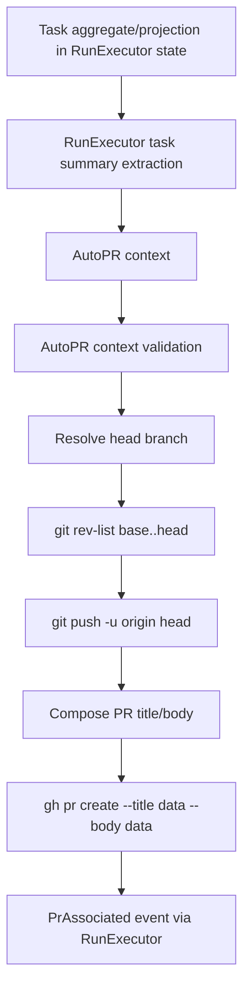
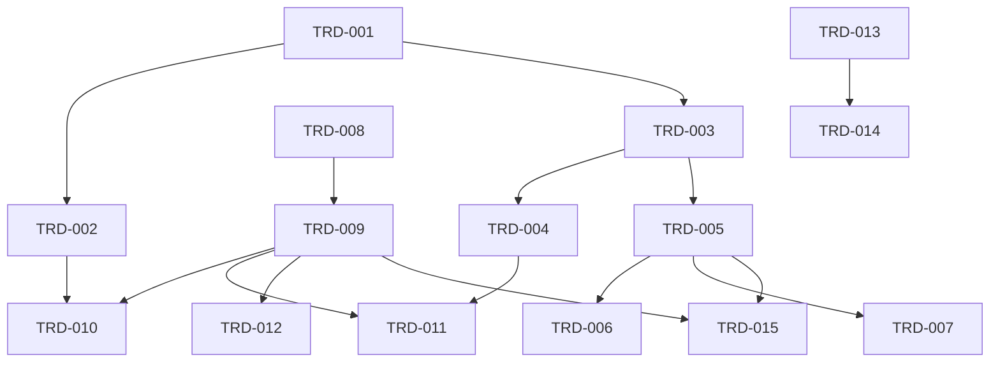

# TRD: Include bead/task title and description in AutoPR-generated PR summary

Foreman task title read from `FOREMAN_TASK_TITLE`: **Include bead/task title and description in AutoPR-generated PR summary**

Source PRD: `docs/PRD/PRD-2026-1c4f4a55-autopr-task-pr-summary.md` (`PRD-2026-1c4f4a55`).

## PRD Validation Summary

- Foreman source PRD contract honored: only `FOREMAN_SOURCE_PRD_PATH` was consumed.
- Subject match: PRD title and `FOREMAN_TASK_TITLE` both describe adding task title/description to final AutoPR PR summaries.
- Required sections present: Executive Summary, Problem Statement, Users, Scope, Requirements, Acceptance Criteria, Dependency Map, Technical Dependency Mapping, Adversarial Self-Review, Readiness Gate.
- Requirements: 13 sequential `REQ-NNN` IDs.
- Acceptance criteria: 33 `AC-NNN-M` items in Given/When/Then style.
- PRD readiness score: **4.7 PASS**.

## Domain Analysis

| Domain | Requirements | Notes |
|---|---|---|
| RunExecutor finalization | REQ-001, REQ-006, REQ-007, REQ-008, REQ-010 | Build final AutoPR context from run state without changing branch/base/PhasePR behavior. |
| AutoPR context contract | REQ-001, REQ-005, REQ-009 | Add typed task metadata validation while preserving no-task fallback. |
| GitHub PR composition | REQ-002, REQ-003, REQ-004, REQ-006, REQ-012 | Compose title/body as data arguments, preserve artifact/findings, avoid logging descriptions. |
| Tests and verification | REQ-010, REQ-011 | Use deterministic ExUnit/system-command boundary tests; live Beads/GitHub check is conditional. |
| Documentation | REQ-013 | Review README, user guide, CLI reference, CLAUDE, AGENTS. |

Brownfield system. Existing seams: `ForemanServer.Workflow.RunExecutor.auto_pr/1`, `ForemanServer.Workflow.AutoPR.maybe_create_pr/1`, `AutoPR.open_pr/5`, `ReviewFindings.extract/1`, and task state fields `:title`, `:description`, `:task_id`.

## Reused Capabilities

`trd-graph-cli capabilities docs/TRD --json` returned an empty capability registry, and `trd-graph-cli overlap docs/TRD` reported no overlapping target files. No foundational TRD dependency is reusable for this scope.

## Architecture Alternatives

| Option | Approach | Pros | Cons | Risk |
|---|---|---|---|---|
| A — inline RunExecutor title/body | Have `RunExecutor` compose PR title/body and pass them to AutoPR. | Smallest diff in AutoPR context. | Splits PR composition across modules; weakens AutoPR ownership and makes direct AutoPR tests less valuable. | Medium |
| B — read task metadata from providers during AutoPR | Let AutoPR look up Beads/task provider data at PR creation time. | Could include freshest provider data. | Violates PRD no-shell/no-provider-internal boundary; adds external failure modes; duplicates task state authority. | High |
| C — typed task summary in AutoPR context | `RunExecutor` passes existing task metadata/id fields; `AutoPR` validates and composes title/body. | Fits existing codebase, keeps provider access out of AutoPR, preserves branch behavior, centralizes composition tests. | Requires careful partial-metadata distinction between task-backed and ad-hoc runs. | Low |

Foreman mode: auto-selected Option C (typed task summary fields in final AutoPR context).

## Architecture Decision

Implement task-aware final AutoPR through typed optional task summary fields on the AutoPR context. `RunExecutor` extracts task title, description, and available identifiers from its existing task state/projection. `AutoPR` owns context validation plus safe title/body composition. Ad-hoc contexts with no task summary keep exact fallback title/body. Task-backed contexts with incomplete or malformed task summary fail before branch push or PR creation.

### Key Decisions

1. **AutoPR owns composition.** Title/body builder helpers live in `ForemanServer.Workflow.AutoPR`, keeping `RunExecutor` responsible only for context assembly.
2. **Atomic task summary.** A task-aware context is valid only when both title and description are non-blank binaries. Partial/blank/non-string task metadata returns a typed error before `push_head/3` or `open_pr`.
3. **Explicit no-task fallback.** Absence of all task summary fields means ad-hoc behavior: title remains `feat(run): <run_id>` and body remains run completion text, optional artifact, and findings.
4. **Known keys only.** `RunExecutor` whitelists title, description, and existing IDs; unknown task metadata is ignored.
5. **Safe ID inclusion.** The PR body includes a task identifier only if already in state/projection (`task_id`, provider-facing id/external id if present). No `br`, Beads SQLite, or provider adapter calls.
6. **No branch semantics change.** Base/head resolution, commits-ahead gate, push-before-create, PhasePR skip, PR association, and run completion ordering stay unchanged except typed AutoPR errors are handled explicitly.
7. **Description redaction in logs.** Logs may include run id, branches, PR URL, validation reason, and identifiers; they must not dump full task descriptions or generated PR body.
8. **Docs are surgical.** Update only docs that describe final AutoPR output/operator expectations; record no-change decisions in implementation output.

## System Architecture Design

### Components

| Component | Responsibility | Change |
|---|---|---|
| `ForemanServer.Workflow.RunExecutor` | Final run orchestration and AutoPR context assembly | Add helper that extracts `task_title`, `task_description`, optional `task_id`/provider id from `state.task`; pass whitelisted fields to AutoPR. |
| `ForemanServer.Workflow.AutoPR` | Branch gate, push, PR title/body composition, `gh pr create` | Extend context type; validate task summary; build task-aware title/body; preserve fallback; keep logs redacted. |
| `ForemanServer.Workflow.ReviewFindings` | Existing findings body section | No behavior change; still appended after task summary/artifact section. |
| Tests | Deterministic proof | Add AutoPR command-composition/validation tests and RunExecutor context extraction tests. |
| Docs | Operator-facing behavior | Review/update docs named by PRD/AGENTS. |

### Data Flow

### Interfaces

| Boundary | Protocol | Input | Output/Error |
|---|---|---|---|
| RunExecutor -> AutoPR | Elixir map context | `run_id`, `base_branch`, `artifact_path`, `head_branch`, `cwd`, optional `task_title`, `task_description`, `task_id`, `task_provider_id` | `{:ok, pr_url}` / `:noop` / `{:error, reason}` |
| AutoPR validation | Pure helper | Context map | `{:ok, summary | nil}` or `{:error, {:invalid_task_summary, reason}}` |
| PR composition | Pure helper | run id, artifact path, findings, valid summary | `{title, body}` strings |
| Git/GitHub | `System.cmd/3` argv | `git rev-list`, `git push`, `gh pr create --title title --body body` | existing typed command errors |

### Error Handling

- Missing required `run_id` or `base_branch`: keep existing `{:error, {:invalid_context, context}}` shape unless implementation introduces a narrower typed variant with exhaustive caller handling.
- No task fields at all: valid ad-hoc fallback.
- Any partial, blank, or non-string task title/description: `{:error, {:invalid_task_summary, reason}}` before branch push/PR creation.
- Unknown metadata keys: ignored at RunExecutor extraction boundary.
- Base/head/git/gh failures: existing typed errors preserved.

## Master Task List

### PR 1: AutoPR can safely compose task-aware PR text

**Shippable State:** When AutoPR is called with complete task metadata, reviewers see the task title/body in the PR text; ad-hoc AutoPR calls still produce the legacy generic PR text.

- [ ] **TRD-001**: Extend `ForemanServer.Workflow.AutoPR.context()` with optional whitelisted task summary fields and define an internal typed task-summary representation [satisfies REQ-001, REQ-005, REQ-009] (2h)
  - Validates PRD ACs: AC-001-1, AC-001-2, AC-005-2, AC-009-2
  - Implementation AC:
    - [ ] Given a context includes title, description, and ids, when context validation runs, then only known task summary fields are read.
    - [ ] Given no task fields are present, when validation runs, then the result is valid fallback state rather than error.
    - [ ] Given unknown task metadata keys are present, when validation runs, then they do not affect title/body composition.
- [ ] **TRD-001-TEST**: Add AutoPR context validation tests for full task metadata, no-task fallback, and ignored unknown keys [verifies TRD-001] [satisfies REQ-001, REQ-005, REQ-009] [depends: TRD-001] (2h)
  - Validates PRD ACs: AC-001-1, AC-001-3, AC-005-2, AC-009-2
  - Implementation AC:
    - [ ] Given full task metadata, tests assert validation returns a summary struct/map with title and description.
    - [ ] Given no task metadata, tests assert validation permits fallback.
    - [ ] Given unknown keys, tests assert output is unchanged.

- [ ] **TRD-002**: Implement task-summary validation that rejects partial, blank, and non-string task title/description before push or PR creation [satisfies REQ-005, REQ-009] [depends: TRD-001] (3h)
  - Validates PRD ACs: AC-005-3, AC-009-1, AC-009-3
  - Implementation AC:
    - [ ] Given only title or only description, AutoPR returns a typed validation error before `push_head/3`.
    - [ ] Given blank title or blank description, AutoPR returns a typed validation error before PR composition.
    - [ ] Given non-string metadata, AutoPR returns a typed validation error covered by tests.
- [ ] **TRD-002-TEST**: Add AutoPR tests proving partial/blank/non-string task metadata fails before `git push` or `gh pr create` [verifies TRD-002] [satisfies REQ-005, REQ-009, REQ-010] [depends: TRD-002] (3h)
  - Validates PRD ACs: AC-005-3, AC-009-1, AC-010-1
  - Implementation AC:
    - [ ] Given a temp repo branch with commits and partial metadata, tests assert no push occurs.
    - [ ] Given blank values, tests assert the typed reason identifies blank metadata.
    - [ ] Given non-string values, tests assert the typed reason identifies malformed metadata.

- [ ] **TRD-003**: Extract PR title/body composition into pure AutoPR helpers and preserve byte-for-byte legacy fallback output for no-task contexts [satisfies REQ-002, REQ-003, REQ-005, REQ-010] [depends: TRD-001] (3h)
  - Validates PRD ACs: AC-002-3, AC-003-3, AC-005-1, AC-010-2
  - Implementation AC:
    - [ ] Given no task summary and no artifact, the title is exactly `feat(run): <run_id>` and body starts with existing run completion text.
    - [ ] Given no task summary and artifact/findings, body dynamic sections match existing ordering/content.
    - [ ] Existing `maybe_create_pr/1` branch decision tests continue passing unchanged except helper calls.
- [ ] **TRD-003-TEST**: Add golden fallback composition tests for no-task title/body with and without artifact/findings [verifies TRD-003] [satisfies REQ-003, REQ-005, REQ-010] [depends: TRD-003] (2h)
  - Validates PRD ACs: AC-003-3, AC-005-1, AC-010-2
  - Implementation AC:
    - [ ] Tests compare exact fallback title string.
    - [ ] Tests compare fallback body string for no artifact.
    - [ ] Tests compare fallback body string with artifact and findings fixture.

- [ ] **TRD-004**: Compose task-aware PR title from task title and pass it to `gh pr create` as argv data, not shell interpolation [satisfies REQ-002, REQ-010] [depends: TRD-003] (3h)
  - Validates PRD ACs: AC-002-1, AC-002-2, AC-010-1
  - Implementation AC:
    - [ ] Given task title contains punctuation, slashes, quotes, or issue ids, the captured `gh` argv contains the exact title as the `--title` value.
    - [ ] Given task title is present, title is not only `feat(run): <run_id>`.
    - [ ] No shell string concatenation is introduced for `gh pr create`.
- [ ] **TRD-004-TEST**: Add command-boundary tests that capture `gh pr create` argv and verify task title is passed safely [verifies TRD-004] [satisfies REQ-002, REQ-010] [depends: TRD-004] (3h)
  - Validates PRD ACs: AC-002-1, AC-002-2, AC-010-1
  - Implementation AC:
    - [ ] Tests use a fake `git`/`gh` path or command shim to avoid live GitHub.
    - [ ] Captured argv proves title special characters are not shell-expanded.
    - [ ] Test remains deterministic without network credentials.

- [ ] **TRD-005**: Add task summary section to PR body before artifact/findings while preserving multiline Markdown descriptions [satisfies REQ-003, REQ-004, REQ-012] [depends: TRD-003] (3h)
  - Validates PRD ACs: AC-003-1, AC-003-2, AC-004-1, AC-004-2, AC-012-2
  - Implementation AC:
    - [ ] Given multiline task description, body includes a labeled task summary section preserving line breaks.
    - [ ] Given artifact path, artifact text remains present after task summary.
    - [ ] Given findings, unresolved findings section remains present after task summary/artifact content.
- [ ] **TRD-005-TEST**: Add body composition tests for multiline Markdown, artifact preservation, and findings preservation [verifies TRD-005] [satisfies REQ-003, REQ-004, REQ-010, REQ-012] [depends: TRD-005] (3h)
  - Validates PRD ACs: AC-003-1, AC-003-2, AC-004-1, AC-004-2, AC-010-1, AC-012-2
  - Implementation AC:
    - [ ] Tests assert task summary heading and description text are present.
    - [ ] Tests assert artifact path is retained.
    - [ ] Tests assert findings fixture output is retained.

- [ ] **TRD-006**: Include task/provider identifiers in the task summary only when already present in context [satisfies REQ-006] [depends: TRD-005] (2h)
  - Validates PRD ACs: AC-006-1, AC-006-2
  - Implementation AC:
    - [ ] Given `task_id` is present, body includes it in the task summary.
    - [ ] Given provider-facing id is present, body includes it in the task summary.
    - [ ] Implementation inspection shows no `br`, Beads SQLite, or provider adapter calls in AutoPR.
- [ ] **TRD-006-TEST**: Add identifier inclusion/absence tests and a no-provider-call regression assertion [verifies TRD-006] [satisfies REQ-006, REQ-010] [depends: TRD-006] (2h)
  - Validates PRD ACs: AC-006-1, AC-006-2, AC-010-1
  - Implementation AC:
    - [ ] Tests assert IDs appear when supplied.
    - [ ] Tests assert no placeholder ID appears when absent.
    - [ ] Tests or code review evidence confirms no provider lookup occurs.

- [ ] **TRD-007**: Redact task descriptions from AutoPR logs while preserving existing command-output handling [satisfies REQ-012] [depends: TRD-005] (2h)
  - Validates PRD ACs: AC-012-1, AC-012-2
  - Implementation AC:
    - [ ] Start/success logs include run id/branches/outcome, not full task description or full PR body.
    - [ ] Failure logs do not add a new raw body/description log line.
    - [ ] Existing `gh` failure output handling remains unchanged except no new task body leak.
- [ ] **TRD-007-TEST**: Add log-capture tests or focused assertions proving sensitive-looking descriptions are not logged [verifies TRD-007] [satisfies REQ-012] [depends: TRD-007] (2h)
  - Validates PRD ACs: AC-012-1, AC-012-2
  - Implementation AC:
    - [ ] Given a description containing a sentinel secret string, captured logs do not contain it.
    - [ ] Captured logs still identify run id and outcome.
    - [ ] Test avoids printing the sentinel in failure messages beyond assertion labels.

### PR 2: Task-backed runs supply metadata to final AutoPR

**Shippable State:** Beads/task-backed Foreman runs produce final AutoPRs whose title/body come from the approved task, while ad-hoc runs still use the legacy fallback.

- [ ] **TRD-008**: Add `RunExecutor` helper to extract task title/description and safe ids from existing task state/projection [satisfies REQ-001, REQ-006, REQ-009, REQ-010] (3h)
  - Validates PRD ACs: AC-001-1, AC-001-3, AC-006-1, AC-006-2, AC-009-2, AC-010-3
  - Implementation AC:
    - [ ] Given `state.task` has title and description, helper returns task summary fields.
    - [ ] Given no task aggregate/source is present, helper returns no task summary and does not synthesize from artifacts/docs/git.
    - [ ] Given task ids exist in state, helper includes only safe id fields already present.
- [ ] **TRD-008-TEST**: Add RunExecutor helper tests for task-backed metadata, ad-hoc absence, and id extraction [verifies TRD-008] [satisfies REQ-001, REQ-006, REQ-010] [depends: TRD-008] (3h)
  - Validates PRD ACs: AC-001-1, AC-001-3, AC-006-1, AC-006-2, AC-010-3
  - Implementation AC:
    - [ ] Tests prove title/description originate from task state.
    - [ ] Tests prove no PRD/TRD/artifact text is used as a substitute.
    - [ ] Tests prove id fields are included only when present.

- [ ] **TRD-009**: Wire extracted task summary into `RunExecutor.auto_pr/1` without changing base branch, head branch, artifact path, or cwd fields [satisfies REQ-001, REQ-007, REQ-008, REQ-010] [depends: TRD-008] (3h)
  - Validates PRD ACs: AC-001-2, AC-007-1, AC-007-2, AC-007-3, AC-008-1, AC-010-3
  - Implementation AC:
    - [ ] Existing context fields keep the same values as current code for a representative run state.
    - [ ] Task summary fields are added only when helper returns them.
    - [ ] PhasePR skip path still bypasses final AutoPR exactly as today.
- [ ] **TRD-009-TEST**: Add RunExecutor final AutoPR context capture tests preserving legacy fields and PhasePR skip behavior [verifies TRD-009] [satisfies REQ-001, REQ-007, REQ-008, REQ-010] [depends: TRD-009] (4h)
  - Validates PRD ACs: AC-001-2, AC-007-1, AC-007-2, AC-007-3, AC-008-1, AC-010-3
  - Implementation AC:
    - [ ] Captured AutoPR context includes existing run/base/head/artifact/cwd values unchanged.
    - [ ] Captured context includes task title/description for task-backed state.
    - [ ] Existing phase PR records with `created` or `existing` status still return final AutoPR noop.

- [ ] **TRD-010**: Preserve finalization result handling by explicitly handling any new AutoPR validation error variant [satisfies REQ-007, REQ-009] [depends: TRD-002, TRD-009] (2h)
  - Validates PRD ACs: AC-007-3, AC-009-3
  - Implementation AC:
    - [ ] Given AutoPR returns `{:error, {:invalid_task_summary, reason}}`, finalization logs/handles it as an AutoPR failure, not success.
    - [ ] Existing `:noop`, `{:ok, pr_url}`, and other `{:error, reason}` paths remain total.
    - [ ] No permissive fallback clause treats unexpected AutoPR results as success.
- [ ] **TRD-010-TEST**: Add finalize/AutoPR error handling tests for invalid task summary and existing result variants [verifies TRD-010] [satisfies REQ-007, REQ-009] [depends: TRD-010] (3h)
  - Validates PRD ACs: AC-007-3, AC-009-3
  - Implementation AC:
    - [ ] Invalid task summary path is observable as AutoPR failure before run completion semantics are accepted.
    - [ ] Existing `:noop` path stays no-op.
    - [ ] Existing PR association path still records `PrAssociated` on `{:ok, pr_url}`.

- [ ] **TRD-011**: Verify branch/ahead/push/noop behavior is unchanged when task metadata is present [satisfies REQ-007] [depends: TRD-004, TRD-009] (2h)
  - Validates PRD ACs: AC-007-1, AC-007-2, AC-007-3
  - Implementation AC:
    - [ ] Given no commits ahead, AutoPR with task metadata still returns `:noop` and never calls `gh pr create`.
    - [ ] Given commits ahead, AutoPR still pushes head before PR create.
    - [ ] Given branch resolution fails, branch error wins and title/body fallback does not mask it.
- [ ] **TRD-011-TEST**: Extend existing AutoPR git decision tests to include task metadata on noop, push, and branch error paths [verifies TRD-011] [satisfies REQ-007, REQ-010] [depends: TRD-011] (3h)
  - Validates PRD ACs: AC-007-1, AC-007-2, AC-007-3, AC-010-1
  - Implementation AC:
    - [ ] Existing no-commits test passes with task summary fields added.
    - [ ] Existing commits-ahead test passes with task summary fields added.
    - [ ] Existing branch error test passes with task summary fields added.

- [ ] **TRD-012**: Confirm PhasePR behavior remains separate from final AutoPR behavior [satisfies REQ-008] [depends: TRD-009] (2h)
  - Validates PRD ACs: AC-008-1, AC-008-2
  - Implementation AC:
    - [ ] No changes are made to `ForemanServer.Workflow.PhasePR` title/body composition.
    - [ ] Final AutoPR still skips when phase PR records are `created` or `existing`.
    - [ ] Tests/inspection prove task summary fields are not threaded into PhasePR requests.
- [ ] **TRD-012-TEST**: Add or update tests proving PhasePR title/body behavior is unchanged and final AutoPR skip still applies [verifies TRD-012] [satisfies REQ-008] [depends: TRD-012] (2h)
  - Validates PRD ACs: AC-008-1, AC-008-2
  - Implementation AC:
    - [ ] PhasePR request tests do not include task title/body fields.
    - [ ] Existing phase PR created/existing records prevent final AutoPR.
    - [ ] No regression in phase PR reuse status handling.

### PR 3: Verification and operator-facing docs

**Shippable State:** Operators have docs describing task-aware final AutoPR output, and maintainers have deterministic plus conditional live verification evidence.

- [ ] **TRD-013**: Add deterministic test suite coverage across AutoPR and RunExecutor for task-aware, fallback, malformed metadata, branch preservation, and PhasePR separation [satisfies REQ-010] [depends: TRD-001-TEST, TRD-002-TEST, TRD-003-TEST, TRD-004-TEST, TRD-005-TEST, TRD-008-TEST, TRD-009-TEST, TRD-011-TEST, TRD-012-TEST] (3h)
  - Validates PRD ACs: AC-010-1, AC-010-2, AC-010-3
  - Implementation AC:
    - [ ] Targeted `mix test` command names the AutoPR and RunExecutor test files touched.
    - [ ] Tests require no live GitHub or mutable local credentials.
    - [ ] Failures, if any, are reported with exact blocker and not hidden by broader test noise.
- [ ] **TRD-013-TEST**: Run targeted deterministic verification and record commands/results in implementation output [verifies TRD-013] [satisfies REQ-010] [depends: TRD-013] (2h)
  - Validates PRD ACs: AC-010-1, AC-010-2, AC-010-3
  - Implementation AC:
    - [ ] `mix test` target for AutoPR tests completes or blocker is explicit.
    - [ ] `mix test` target for RunExecutor tests completes or blocker is explicit.
    - [ ] `mix compile` completes or blocker is explicit.

- [ ] **TRD-014**: Define and execute conditional live/staging Beads-backed PR verification when credentials/services allow [satisfies REQ-011] [depends: TRD-013] (3h)
  - Validates PRD ACs: AC-011-1, AC-011-2, AC-011-3
  - Implementation AC:
    - [ ] Given a Beads-backed task run can create a real PR, `gh pr view` shows actual task subject in title/body.
    - [ ] Given an ad-hoc run creates a PR, `gh pr view` shows valid fallback title/body.
    - [ ] Given live verification cannot run, output lists exact credential/service blocker and deterministic proof remains passing.
- [ ] **TRD-014-TEST**: Capture live verification result or explicit blocker in final implementation artifact [verifies TRD-014] [satisfies REQ-011] [depends: TRD-014] (2h)
  - Validates PRD ACs: AC-011-1, AC-011-2, AC-011-3
  - Implementation AC:
    - [ ] Live PR URL/evidence is recorded when available.
    - [ ] Blocker includes missing auth/service reason when unavailable.
    - [ ] No secret tokens or large logs are included in output.

- [ ] **TRD-015**: Review/update operator-facing docs for final AutoPR task-aware title/body behavior [satisfies REQ-013] [depends: TRD-005, TRD-009] (3h)
  - Validates PRD ACs: AC-013-1
  - Implementation AC:
    - [ ] `README.md` reviewed and updated only if it describes final AutoPR output/operator expectations.
    - [ ] `docs/user-guide.md` and `docs/cli-reference.md` reviewed and surgically updated if relevant.
    - [ ] `CLAUDE.md` and `AGENTS.md` reviewed; no-change decisions are documented if no behavior-facing text applies.
- [ ] **TRD-015-TEST**: Run documentation hygiene checks and record doc review/no-change decisions [verifies TRD-015] [satisfies REQ-013] [depends: TRD-015] (1h)
  - Validates PRD ACs: AC-013-1
  - Implementation AC:
    - [ ] `git diff --check` passes.
    - [ ] Implementation output lists docs changed and docs reviewed with no changes.
    - [ ] Docs avoid claiming live behavior that tests did not prove.

## Sprint Planning

## Sprint 1: AutoPR composition contract

- PR 1: `TRD-001` through `TRD-007-TEST`.
- Goal: task-aware title/body composition works at AutoPR boundary with fallback and redaction proof.
- Estimate: 35h.

## Sprint 2: RunExecutor wiring and behavior preservation

- PR 2: `TRD-008` through `TRD-012-TEST`.
- Goal: real task-backed runs pass metadata to final AutoPR without changing branch, push, PR association, or PhasePR behavior.
- Estimate: 29h.

## Sprint 3: Verification and docs

- PR 3: `TRD-013` through `TRD-015-TEST`.
- Goal: deterministic proof, conditional live verification, and operator docs are complete.
- Estimate: 14h.

Total estimate: **78h**.

## Dependency Graph

Critical path: `TRD-001 -> TRD-003 -> TRD-005 -> TRD-015` for docs and `TRD-008 -> TRD-009 -> TRD-010/TRD-011/TRD-012` for run wiring. No circular dependencies identified. No individual task exceeds 5h.

## Acceptance Criteria Traceability

| REQ | Description | Implementation Tasks | Test Tasks |
|---|---|---|---|
| REQ-001 | Thread task metadata into final AutoPR context | TRD-001, TRD-008, TRD-009 | TRD-001-TEST, TRD-008-TEST, TRD-009-TEST |
| REQ-002 | Compose a task-aware PR title | TRD-003, TRD-004 | TRD-003-TEST, TRD-004-TEST |
| REQ-003 | Add a task summary section to PR body | TRD-003, TRD-005 | TRD-003-TEST, TRD-005-TEST |
| REQ-004 | Preserve artifact and review findings body content | TRD-005 | TRD-005-TEST |
| REQ-005 | Preserve legacy fallback for runs without task metadata | TRD-001, TRD-002, TRD-003 | TRD-001-TEST, TRD-002-TEST, TRD-003-TEST |
| REQ-006 | Include task/bead identifiers when safely available | TRD-006, TRD-008 | TRD-006-TEST, TRD-008-TEST |
| REQ-007 | Preserve branch, push, PR creation behavior | TRD-009, TRD-010, TRD-011 | TRD-009-TEST, TRD-010-TEST, TRD-011-TEST |
| REQ-008 | Keep final AutoPR separate from PhasePR behavior | TRD-009, TRD-012 | TRD-009-TEST, TRD-012-TEST |
| REQ-009 | Validate metadata at typed boundaries | TRD-001, TRD-002, TRD-008, TRD-010 | TRD-001-TEST, TRD-002-TEST, TRD-008-TEST, TRD-010-TEST |
| REQ-010 | Provide deterministic unit/integration coverage | TRD-001 through TRD-013 | TRD-001-TEST through TRD-013-TEST |
| REQ-011 | Verify live Beads-backed PR path | TRD-014 | TRD-014-TEST |
| REQ-012 | Avoid leaking sensitive task descriptions in logs | TRD-005, TRD-007 | TRD-005-TEST, TRD-007-TEST |
| REQ-013 | Update relevant operator-facing docs | TRD-015 | TRD-015-TEST |

Traceability check: 13 requirements covered, 0 uncovered, 0 orphaned annotations.

## Architecture Self-Critique

1. **Issue:** AutoPR context validation could treat partial task metadata as no-task fallback and silently create a misleading generic PR.
   - **Resolution:** `TRD-002` requires explicit partial/blank/non-string validation errors before push or PR composition.

2. **Issue:** Moving title/body composition into RunExecutor would duplicate composition rules and make direct AutoPR callers inconsistent.
   - **Resolution:** Option C keeps composition in AutoPR and RunExecutor only passes whitelisted data.

3. **Issue:** Including provider IDs could tempt implementation to query Beads at PR creation time.
   - **Resolution:** `TRD-006`/`TRD-008` limit IDs to values already in context/state and prohibit `br`, SQLite, and provider adapter lookup.

4. **Issue:** Redaction requirements can conflict with existing `gh` failure output logging.
   - **Resolution:** `TRD-007` forbids new body/description logs while preserving existing command-output handling, so behavior changes are explicit and test-backed.

## Coverage Review

- Every PRD requirement has at least one implementation task and one test/verification task.
- All task lines use `- [ ] **TRD-NNN**` or `- [ ] **TRD-NNN-TEST**` checkbox prefixes for `trd-cli` parsing.
- Every PR section includes a user-observable **Shippable State**.
- PR shippability:
  - PR 1 gives AutoPR callers task-aware PR text and preserves ad-hoc fallback.
  - PR 2 makes task-backed Foreman runs surface approved task metadata.
  - PR 3 gives operators docs and verification evidence.
- No tasks reference nonexistent PRD requirements.

## Dependency and Estimate Review

- Longest chain depth is 4 tasks (`TRD-001 -> TRD-003 -> TRD-005 -> TRD-015`), acceptable for a small behavior change.
- No circular dependencies found.
- All tasks are 1h-5h; no 8h+ task requires breakdown.
- Higher-risk tasks (`TRD-009`, `TRD-010`, `TRD-014`) include direct test/verification tasks and explicit blocker reporting.

## Testability Review

- Implementation ACs use observable pass/fail criteria: captured argv, exact fallback strings, context fields, typed errors, log absence, and command results.
- Subjective language is avoided or bounded by concrete assertions.
- Live Beads/GitHub verification is conditional and has an explicit blocker path, so deterministic tests remain the acceptance floor.

## Design Readiness Gate

| Dimension | Score | Notes |
|---|---:|---|
| Architecture completeness | 4.8 | Components, data flow, interfaces, validation, redaction, and no-provider-lookup boundaries are defined. |
| Task coverage | 4.9 | All 13 REQs have implementation and test/verification coverage with traceability. |
| Dependency clarity | 4.7 | Dependencies are explicit and acyclic; PR boundaries are vertical and shippable. |
| Estimate confidence | 4.7 | Tasks are granular and under 5h; live verification has explicit contingency. |

Overall design readiness score: **4.8 PASS**.

## Output and Next Steps

- TRD path: `docs/TRD/TRD-2026-1c4f4a55-autopr-task-pr-summary.md`
- Source PRD correlation id: `1c4f4a55`
- Parsed task count target: 30 tasks (15 implementation + 15 test/verification tasks)
- Suggested next command: `/ensemble-configure-team docs/TRD/TRD-2026-1c4f4a55-autopr-task-pr-summary.md`
- Implementation command after approval: `/ensemble-implement-trd-beads docs/TRD/TRD-2026-1c4f4a55-autopr-task-pr-summary.md`

Stop here and wait for approval before implementation.
