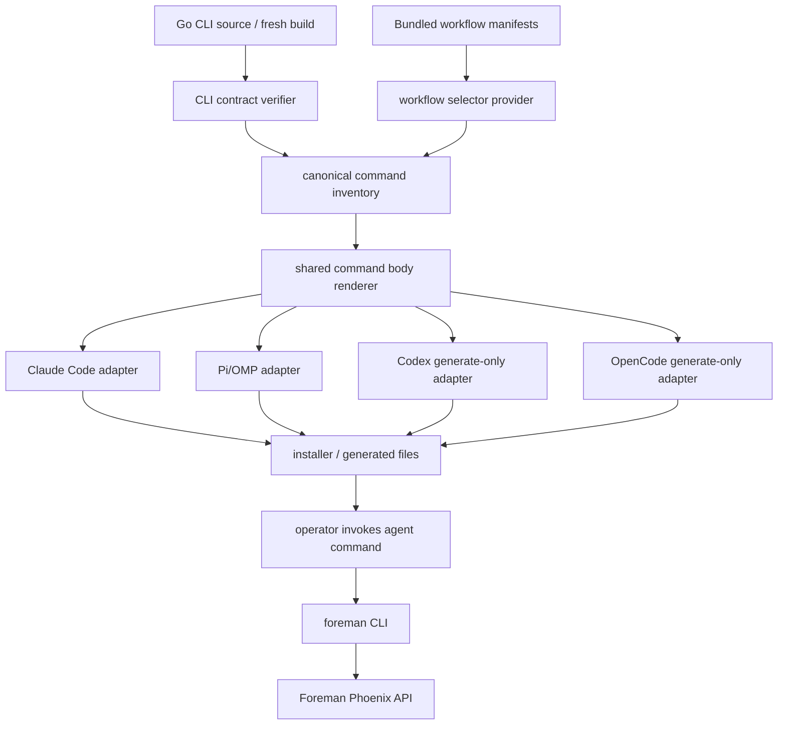

# TRD: OMP, Claude Code, Codex, and OpenCode Foreman Commands

## Metadata

| Field | Value |
|---|---|
| Document ID | TRD-2026-29fd762f |
| Label | trd-agent-foreman-commands |
| PRD Reference | docs/PRD/PRD-2026-29fd762f-agent-foreman-commands.md |
| Version | 1.0.0 |
| Status | Draft |
| Correlation ID | 29fd762f (shared with source PRD) |
| Design Readiness Score | 4.5 (PASS) |

## Foreman Dispatch Contract

Foreman mode subject read before writing: **Add OMP/Claude Code/Codex/OpenCode foreman commands**.

Source PRD subject: **OMP, Claude Code, Codex, and OpenCode Foreman Commands** with frontmatter `foreman_task_title: Add OMP/Claude Code/Codex/OpenCode foreman commands`. The subjects match the dispatched task scope.

This TRD only plans the work. It does not implement command assets, build binaries, or modify runtime workflow state.

## Requirements Validation

| Check | Result |
|---|---|
| Source path | PASS — consumed only `FOREMAN_SOURCE_PRD_PATH`: `docs/PRD/PRD-2026-29fd762f-agent-foreman-commands.md` |
| Required sections present | PASS — Problem Statement, Goals, Non-Goals, Research, Assumptions, Requirements, Dependency Map, Risks, Readiness Gate |
| REQ-NNN sequential and unique | PASS — REQ-001 … REQ-016, no gaps |
| AC format | PASS — 34/34 ACs use Given/When/Then |
| Must requirements have ≥2 ACs | PASS — all Must requirements have at least 2 ACs except none below threshold |
| Constraints and Non-Goals documented | PASS — CLI-boundary, provider caveat, install-scope, non-secret, and unsupported-format constraints recorded |
| Readiness score | PASS — 4.75 (>= 4.0) |
| Open ambiguity markers | PASS — 0 |

## Domain Analysis

**Project type: brownfield.** Foreman already has the Go CLI verbs the command assets must wrap, bundled workflow manifests, and living docs. The missing surface is an agent-command asset generator/installer plus validation.

| Domain | Requirements | Existing / Target Surface |
|---|---|---|
| Real CLI command contract | REQ-007, REQ-015 | `packages/foreman_cli/cmd/foreman/{main.go,task.go,run.go}`; validation through fresh `go build ./cmd/foreman` or source-derived command table |
| Workflow inventory | REQ-002, REQ-011, REQ-013 | `packages/foreman_server/priv/defaults/workflows/*.yaml`; avoid hand-maintained drift where possible |
| Agent command templates | REQ-001, REQ-002, REQ-003, REQ-004, REQ-005, REQ-006, REQ-009, REQ-011, REQ-016 | New template/rendering surface under Foreman CLI or server assets; exact path chosen during implementation to match existing package ownership |
| Install/generate policy | REQ-001, REQ-010, REQ-012 | Project-local default; explicit user-global scope only after verified upstream path; generate-only fallback for unverified targets |
| Input validation and shelling out | REQ-008, REQ-012 | Command bodies validate required args, then call `foreman` with inherited environment |
| Documentation and validation | REQ-013, REQ-014 | `README.md`, `docs/user-guide.md`, `docs/cli-reference.md`, Go/Elixir tests or validation script |

No Phoenix API changes are required unless implementation chooses to expose generation/install as a server feature. The default architecture keeps this as a CLI-owned/operator asset concern.

## Reused Capabilities

`trd-graph-cli capabilities docs/TRD --json` returned an empty capability registry. No foundational TRD is available for cross-TRD reuse.

In-repo mechanisms reused by reference:

| Reused mechanism | Provider | Use |
|---|---|---|
| Go CLI command dispatch and flag validation | `packages/foreman_cli/cmd/foreman` | Source of truth for wrapped verbs/flags |
| Bundled workflow manifests | `packages/foreman_server/priv/defaults/workflows` | Workflow selector inventory for task shortcuts |
| `foreman init --force` runtime asset refresh convention | `packages/foreman_cli/cmd/foreman/init.go` and docs | Documentation reminder when command assets live with bundled source assets |
| Existing docs warning style for stale commands | `docs/cli-reference.md` | Keep unsupported Codex/OpenCode native installs explicit, not guessed |

## Architecture Decision

**Selected: Option C — CLI-owned generator with adapter-specific emitters and source-grounded validation.**

The feature is operator-facing command assets, not Foreman domain state. Keep the canonical behavior in the Go CLI command contract and render agent-specific files/snippets from a shared command inventory. Target-agent adapters handle formatting and install/generate behavior, while validation proves every emitted command calls implemented Foreman CLI verbs/flags.

### Alternatives Considered

| Option | Approach | Pros | Cons | Decision |
|---|---|---|---|---|
| A — static checked-in command files only | Add one file set per agent and maintain by hand | Smallest first patch; easy review | Workflow/flag drift likely; hard to validate consistency across agents; overwrites and unsupported formats remain ad hoc | Rejected |
| B — server-side command asset API | Phoenix exposes command inventory and generated assets over HTTP | Centralizes with workflow catalog; useful for remote UIs | Larger surface, auth/docs/API tests; command asset install is local filesystem work better owned by CLI | Rejected for first slice |
| C — CLI-owned generator/adapters | Shared inventory + renderers for Claude/Pi/OMP/Codex/OpenCode; install only to verified paths; otherwise print files | Thin over real CLI, local filesystem control, easiest source validation, keeps unsupported formats loud | Requires careful adapter contract tests | Selected |

Foreman mode auto-selected Option C (CLI-owned generator with adapter-specific emitters and source-grounded validation).

### Key Technical Decisions

1. **One canonical command inventory.** Define command specs once: task-create-by-workflow, ad-hoc run submit, run list, run detail, and task detail. Agent-specific renderers consume this inventory.
2. **Source wins over docs.** Generator tests validate verbs/flags against `packages/foreman_cli/cmd/foreman`, not the stale root binary and not historical docs sections.
3. **Default to project-local.** Install writes into project-local agent command directories only when the format/path is verified. User-global writes require explicit scope and overwrite policy.
4. **Unsupported formats are first-class outputs.** Codex/OpenCode and unverified OMP/Pi paths emit copyable prompt/CLI snippets plus an unsupported-native-install reason instead of guessed files.
5. **No secrets in assets.** Command files invoke `foreman` and inherit `FOREMAN_API_URL` / `FOREMAN_API_TOKEN`; they never embed credential values.
6. **TRD workflows require `--trd-path`.** `implement-trd` and `implement-trd-beads` task shortcuts refuse locally before calling Foreman when the path is missing.

## System Architecture Design

### Components

| Component | Responsibility | Notes |
|---|---|---|
| Command inventory builder | Produces typed specs for command name, description, args, CLI verb, flags, backend caveat, metadata tags | New code; exact package path selected by implementer near Foreman CLI asset/generation ownership |
| CLI contract verifier | Parses/declares allowed Foreman verbs and flags from Go source or fresh built CLI help | Prevents fabricated commands and doc drift |
| Workflow selector provider | Reads bundled/runtime workflow selectors or an explicit source-derived list with tests | Must include `assess`, `discover`, `fix`, `implement`, `implement-trd`, `implement-trd-beads`, `plan`, `prd`, `release`, `trd`, `verify` unless runtime catalog differs |
| Shared shell/body renderer | Builds safe command bodies that validate required args, then exec `foreman` and preserve exit code/env | Used by all text-based agent formats |
| Claude Code adapter | Emits project-local slash-command Markdown when path contract is verified | First native install target |
| Pi/OMP adapter | Emits native files only after installed format/path is verified; otherwise generate-only fallback | Avoid guessed Pi/OMP writes |
| Codex adapter | Generate-only unless implementation verifies current native command format | Unsupported native install must be explicit |
| OpenCode adapter | Generate-only unless implementation verifies current native command format | Unsupported native install must be explicit |
| Installer | Applies scope, overwrite, and dry-run/generate-only policies | Non-interactive; refuses without `--force`/explicit overwrite when target exists |
| Validation/test fixtures | Render every target and check placeholders, command args, docs examples | Required before shipping |

### Data Flow



### Interfaces and Data Formats

| Boundary | Format | Required Fields / Behavior |
|---|---|---|
| Inventory builder -> adapter | typed command spec / struct | `id`, `display_name`, `description`, `required_args`, `optional_args`, `cli_verb`, `flags`, `examples`, `metadata_tags`, `unsupported_reason?` |
| Adapter -> command asset | agent-native Markdown/config/prompt text where verified; generated text otherwise | Required input validation, shell command, exit-code propagation, no secret literals |
| Installer -> filesystem | project-local path or verified user-global path | Creates parent dirs; refuses overwrite unless explicit non-interactive flag present |
| Command asset -> Foreman | subprocess `foreman ...` | Inherits environment; passes only real verbs/flags; surfaces non-zero exit |
| Docs -> operator | Markdown | Inventory, install/update steps, task-create vs run-submit distinction, unsupported target caveats |

## Master Task List

### PR 1: Source-grounded command inventory

**Shippable State:** Operators and reviewers can inspect a generated Foreman command inventory that names every planned task/run shortcut, proves each shortcut maps to real Foreman CLI verbs/flags, and marks unsupported native targets as generate-only instead of silently guessing.

- [ ] **TRD-001**: Define the canonical Foreman agent-command inventory model and initial command set: workflow task-create shortcuts, ad-hoc run submit, run list, run detail, and task detail [satisfies REQ-001] [satisfies REQ-011] [satisfies REQ-016] (3h)
  - Validates PRD ACs: AC-001-1, AC-011-1, AC-016-1
  - Implementation AC:
    - [ ] Given the inventory is rendered for any adapter, when command names/descriptions are inspected, then equivalent commands share the same required inputs and Foreman CLI behavior.
    - [ ] Given a command supports metadata tags, when its spec is inspected, then tags include `foreman` and either `task`, `run`, or the workflow selector.
- [ ] **TRD-001-TEST**: Unit tests for the inventory model covering command IDs, descriptions, metadata, and required/optional argument declarations [verifies TRD-001] [satisfies REQ-001] [satisfies REQ-011] [satisfies REQ-016] [depends: TRD-001] (2h)
- [ ] **TRD-002**: Implement a CLI contract verifier that grounds inventory verbs and flags in `packages/foreman_cli/cmd/foreman` or a fresh `go build ./cmd/foreman` help surface [satisfies REQ-007] [satisfies REQ-015] [depends: TRD-001] (4h)
  - Validates PRD ACs: AC-007-1, AC-015-1, AC-015-2
  - Implementation AC:
    - [ ] Given a spec references `foreman run list --status --project-id --limit`, when validation runs, then it passes against the Go CLI contract.
    - [ ] Given a spec references a nonexistent command or flag, when validation runs, then it fails and names the offending spec.
- [ ] **TRD-002-TEST**: Tests for the verifier with valid command specs and intentionally invalid verb/flag fixtures [verifies TRD-002] [satisfies REQ-007] [satisfies REQ-015] [depends: TRD-002] (3h)
- [ ] **TRD-003**: Add a workflow selector provider that derives or validates task shortcut selectors against bundled/default workflow manifests and marks drift as a validation failure [satisfies REQ-002] [satisfies REQ-013] [satisfies REQ-015] [depends: TRD-001] (3h)
  - Validates PRD ACs: AC-002-3, AC-013-2, AC-015-1
  - Implementation AC:
    - [ ] Given bundled workflow YAML files are present, when selector discovery runs, then the supported selector set matches the installed/default catalog source used by Foreman.
    - [ ] Given a selector has no backing manifest/catalog entry, when validation runs, then it is omitted or reported rather than emitted as usable.
- [ ] **TRD-003-TEST**: Tests for workflow selector discovery, TRD workflow identification, and drift handling [verifies TRD-003] [satisfies REQ-002] [satisfies REQ-013] [satisfies REQ-015] [depends: TRD-003] (2h)

### PR 2: Shared command body rendering and local validation

**Shippable State:** Generated command bodies can create Foreman tasks, submit ad-hoc runs, list runs, inspect one run, and inspect one task through the real `foreman` CLI while refusing missing required inputs before dispatch.

- [ ] **TRD-004**: Build the shared command body renderer that validates required args, constructs `foreman` invocations, preserves exit codes, and does not rewrite CLI failures into success [satisfies REQ-007] [satisfies REQ-008] [satisfies REQ-012] [depends: TRD-002] (4h)
  - Validates PRD ACs: AC-007-2, AC-008-1, AC-008-2, AC-012-2
  - Implementation AC:
    - [ ] Given a required input is missing, when the rendered command runs, then it exits before calling `foreman` and names the missing input.
    - [ ] Given `foreman` exits non-zero, when invoked through the rendered command, then the non-zero exit status and stderr are preserved.
- [ ] **TRD-004-TEST**: Tests for renderer validation, shell argument escaping/quoting, inherited environment, and non-zero exit propagation [verifies TRD-004] [satisfies REQ-007] [satisfies REQ-008] [satisfies REQ-012] [depends: TRD-004] (4h)
- [ ] **TRD-005**: Render workflow task-create commands using `foreman task create --project <id> --title <title> --workflow-type <workflow>` plus optional description/id/TRD path fields [satisfies REQ-002] [satisfies REQ-008] [depends: TRD-003] [depends: TRD-004] (3h)
  - Validates PRD ACs: AC-002-1, AC-002-2, AC-002-3, AC-008-1, AC-008-3
  - Implementation AC:
    - [ ] Given project and title are supplied, when a workflow task command runs, then it calls `foreman task create` with the selected workflow type.
    - [ ] Given workflow type is `implement-trd` or `implement-trd-beads` and no `--trd-path` is supplied, when the command runs, then it refuses locally naming `--trd-path`.
    - [ ] Given a workflow selector is stale, when the command reaches the CLI/server, then the underlying error is visible to the operator.
- [ ] **TRD-005-TEST**: Tests for rendered workflow task-create commands across normal workflows and TRD-backed workflow refusal cases [verifies TRD-005] [satisfies REQ-002] [satisfies REQ-008] [depends: TRD-005] (3h)
- [ ] **TRD-006**: Render the ad-hoc run-submit command over `foreman run submit --workflow --prompt --project-id` with optional `--work-id`, `--backend`, and `--base-branch` pass-through where supported [satisfies REQ-003] [satisfies REQ-008] [satisfies REQ-009] [depends: TRD-004] (3h)
  - Validates PRD ACs: AC-003-1, AC-003-2, AC-008-2, AC-009-1, AC-009-2
  - Implementation AC:
    - [ ] Given project ID, workflow, and prompt are supplied, when the command runs, then it calls `foreman run submit` with those flags.
    - [ ] Given `--work-id` is supplied, when the command runs, then it forwards that exact ID and does not synthesize another task ID.
    - [ ] Given `--backend` help is rendered, when the operator reads it, then it includes the client-side/provider-readiness caveat and accepted values.
- [ ] **TRD-006-TEST**: Tests for run-submit rendering, required-input refusal, backend accepted-set validation, and `--work-id` preservation [verifies TRD-006] [satisfies REQ-003] [satisfies REQ-008] [satisfies REQ-009] [depends: TRD-006] (3h)
- [ ] **TRD-007**: Render run-list, run-detail, and task-detail commands over `foreman run list`, `foreman run get <run-id>`, and `foreman task get <task-id>` [satisfies REQ-004] [satisfies REQ-005] [satisfies REQ-006] [satisfies REQ-008] [depends: TRD-004] (3h)
  - Validates PRD ACs: AC-004-1, AC-004-2, AC-005-1, AC-005-2, AC-006-1, AC-006-2
  - Implementation AC:
    - [ ] Given no filters are supplied, when run-list executes, then it calls `foreman run list` with no invented flags.
    - [ ] Given status/project/limit filters are supplied, when run-list executes, then it forwards only `--status`, `--project-id`, and `--limit`.
    - [ ] Given run/task ID is absent for detail commands, when invoked, then the command refuses before calling Foreman.
- [ ] **TRD-007-TEST**: Tests for run-list filters, run-detail required ID handling, and task-detail required ID handling [verifies TRD-007] [satisfies REQ-004] [satisfies REQ-005] [satisfies REQ-006] [satisfies REQ-008] [depends: TRD-007] (3h)

### PR 3: Target-agent adapters and safe installation

**Shippable State:** Operators can generate Foreman command assets for Claude Code, OMP/Pi, Codex, and OpenCode; verified formats can install project-locally, and unverified formats return copyable assets with explicit unsupported-native-install reasons.

- [ ] **TRD-008**: Implement the Claude Code adapter for project-local slash-command Markdown assets with consistent names, descriptions, arguments, examples, and command bodies [satisfies REQ-001] [satisfies REQ-010] [satisfies REQ-011] [depends: TRD-004] [depends: TRD-005] [depends: TRD-006] [depends: TRD-007] (4h)
  - Validates PRD ACs: AC-001-1, AC-010-1, AC-011-1
  - Implementation AC:
    - [ ] Given project-local Claude command path support is verified, when generation runs, then Markdown command files are written only under the documented project-local path.
    - [ ] Given the generated files are inspected, when descriptions/examples are compared to other adapters, then semantics match the canonical inventory.
- [ ] **TRD-008-TEST**: Golden-file tests for Claude Code rendered assets and install-path policy [verifies TRD-008] [satisfies REQ-001] [satisfies REQ-010] [satisfies REQ-011] [depends: TRD-008] (3h)
- [ ] **TRD-009**: Implement the OMP/Pi adapter with verified-path native output when the installed format is proven and generate-only fallback otherwise [satisfies REQ-001] [satisfies REQ-010] [satisfies REQ-011] [depends: TRD-004] (4h)
  - Validates PRD ACs: AC-001-1, AC-001-2, AC-010-1, AC-011-2
  - Implementation AC:
    - [ ] Given OMP/Pi command format/path cannot be verified, when install is requested, then Foreman prints copyable assets and an unsupported-format explanation without writing guessed files.
    - [ ] Given the path is verified, when project-local install runs, then files are written only to the documented project-local location.
- [ ] **TRD-009-TEST**: Tests for OMP/Pi verified-path install and unverified generate-only fallback [verifies TRD-009] [satisfies REQ-001] [satisfies REQ-010] [satisfies REQ-011] [depends: TRD-009] (3h)
- [ ] **TRD-010**: Implement Codex and OpenCode adapters as generate-only unless implementation verifies current upstream native command contracts [satisfies REQ-001] [satisfies REQ-010] [satisfies REQ-011] [depends: TRD-004] (3h)
  - Validates PRD ACs: AC-001-2, AC-010-1, AC-011-2
  - Implementation AC:
    - [ ] Given Codex native format is unverified, when generation runs, then Foreman emits copyable prompts/CLI snippets and marks native install unsupported.
    - [ ] Given OpenCode native format is unverified, when generation runs, then Foreman emits copyable prompts/CLI snippets and marks native install unsupported.
- [ ] **TRD-010-TEST**: Tests for Codex/OpenCode generate-only output and explicit unsupported-native-install reason strings [verifies TRD-010] [satisfies REQ-001] [satisfies REQ-010] [satisfies REQ-011] [depends: TRD-010] (2h)
- [ ] **TRD-011**: Implement installer scope and overwrite policy: project-local default, explicit verified user-global scope, dry-run/generate-only output, and non-interactive overwrite refusal unless force/overwrite path is supplied [satisfies REQ-010] [satisfies REQ-012] [depends: TRD-008] [depends: TRD-009] [depends: TRD-010] (4h)
  - Validates PRD ACs: AC-010-1, AC-010-2, AC-012-1, AC-012-2
  - Implementation AC:
    - [ ] Given a target file exists and no overwrite flag/path is supplied, when install runs, then it refuses and prints the existing path.
    - [ ] Given user-global scope is requested for an unverified agent path, when install runs, then it refuses rather than guessing.
    - [ ] Given command files are written, when scanned, then no `FOREMAN_API_TOKEN` values or other secret literals are embedded.
- [ ] **TRD-011-TEST**: Tests for scope resolution, existing-file refusal, explicit overwrite behavior, and secret scanning [verifies TRD-011] [satisfies REQ-010] [satisfies REQ-012] [depends: TRD-011] (4h)

### PR 4: Documentation, validation, and operator-facing polish

**Shippable State:** Operators can find the Foreman command inventory and install/generate workflow in README, user guide, and CLI reference, and CI/test validation proves rendered assets and documented examples stay aligned with the real CLI.

- [ ] **TRD-012**: Add living documentation for command inventory, target-agent support states, install/update/generate-only steps, task-create approval semantics, and run-submit ad-hoc semantics [satisfies REQ-013] [satisfies REQ-009] [satisfies REQ-010] [depends: TRD-008] [depends: TRD-009] [depends: TRD-010] [depends: TRD-011] (4h)
  - Validates PRD ACs: AC-009-1, AC-013-1, AC-013-2
  - Implementation AC:
    - [ ] Given README, user guide, and CLI reference are searched, when the feature ships, then command names and install/update/generate-only steps are documented or explicitly marked not applicable.
    - [ ] Given docs list workflow task commands, when read, then they state that task-create commands require later approval while run-submit is the ad-hoc one-step path.
- [ ] **TRD-012-TEST**: Documentation checks or tests proving required command inventory terms and task-vs-run-submit caveats are present in living docs [verifies TRD-012] [satisfies REQ-013] [satisfies REQ-009] [depends: TRD-012] (2h)
- [ ] **TRD-013**: Add template/asset validation that renders all command assets, checks required placeholders, detects unresolved template variables, and includes unsupported-target skip reasons [satisfies REQ-014] [satisfies REQ-011] [depends: TRD-008] [depends: TRD-009] [depends: TRD-010] (4h)
  - Validates PRD ACs: AC-014-1, AC-014-3, AC-011-1
  - Implementation AC:
    - [ ] Given all templates are rendered with fixture args, when validation runs, then no unresolved template variables remain.
    - [ ] Given a target is unsupported, when validation reports results, then it lists that target as skipped with an explicit reason.
- [ ] **TRD-013-TEST**: Tests for rendered-template validation across all target adapters and unsupported-target reporting [verifies TRD-013] [satisfies REQ-014] [satisfies REQ-011] [depends: TRD-013] (3h)
- [ ] **TRD-014**: Add example-command validation against Go CLI source or a freshly built CLI, and wire it into the appropriate test/check target [satisfies REQ-014] [satisfies REQ-007] [satisfies REQ-015] [depends: TRD-002] [depends: TRD-012] (4h)
  - Validates PRD ACs: AC-014-2, AC-007-1, AC-015-2
  - Implementation AC:
    - [ ] Given docs/examples include `foreman` invocations, when validation runs, then every verb and flag is checked against source or fresh build output.
    - [ ] Given a stale docs-only command appears, when validation runs, then it fails or reports the stale example before shipping.
- [ ] **TRD-014-TEST**: Tests or fixture checks for valid documented examples and a negative stale-command fixture [verifies TRD-014] [satisfies REQ-014] [satisfies REQ-007] [satisfies REQ-015] [depends: TRD-014] (3h)

## Dependency Graph and Critical Path

```text
TRD-001 -> TRD-002 -> TRD-004 -> TRD-005/006/007 -> TRD-008/009/010 -> TRD-011 -> TRD-012 -> TRD-014
        \-> TRD-003 ------------------------------^                    \-> TRD-013
```

Critical path: `TRD-001 -> TRD-002 -> TRD-004 -> TRD-005/006/007 -> TRD-008/009/010 -> TRD-011 -> TRD-012 -> TRD-014`.

All dependencies are explicit and acyclic. No task is estimated at 8h or higher.

## Sprint Planning

## Sprint 1: Inventory and command-body foundation

PR 1 and PR 2. Build source-grounded inventory, CLI contract validation, workflow selector discovery, and shared command rendering.

## Sprint 2: Agent adapters and install policy

PR 3. Add Claude, OMP/Pi, Codex, and OpenCode adapters plus scope/overwrite/secret-safety controls.

## Sprint 3: Docs and release validation

PR 4. Document command inventory and install/update behavior; add validation for rendered assets and documented CLI examples.

## MCP Enhancement

MCP enhancement: skipped (no MCP tools detected in this session).

## Adversarial Review

### Architecture Self-Critique

| Issue | Risk | Resolution |
|---|---|---|
| Agent install formats can drift or be undocumented | Guessed files may pollute user/global config | Adapters must verify a path/format before native writes; otherwise generate-only with explicit unsupported reason |
| Workflow selector source could duplicate server catalog by hand | Task shortcut list becomes stale | Add workflow selector provider and tests against bundled/default workflow manifests or runtime catalog source |
| Shell command rendering can hide CLI failure | Operators see false success | Shared renderer preserves non-zero exit status/stderr and tests negative cases |
| Backend flag may imply Codex/OpenCode execution works | User confusion / failed runs | Help/docs include client-side backend caveat and accepted-value validation |

### Task Coverage Analysis

| Issue | Resolution |
|---|---|
| Every REQ must have implementation and test coverage | Acceptance Criteria Traceability below maps all REQ-001 … REQ-016 to tasks and tests |
| Task parser can miss malformed lines | All task lines begin with `- [ ] **TRD-NNN**` or `- [ ] **TRD-NNN-TEST**`; `trd-cli parse` self-check required before final report |
| PR shippability can become infrastructure-only | Each PR has a user/operator-observable shippable state and all needed tests in the same or earlier PR |

### Dependency and Estimate Review

| Issue | Risk | Resolution |
|---|---|---|
| Adapter work depends on renderer and inventory | Parallel adapter work may diverge | PR 3 starts only after shared renderer and command families are done |
| Long dependency chain reaches docs/example validation | Late discovery of stale CLI examples | CLI contract verifier ships in PR 1 and is reused throughout |
| Estimates for target-agent path verification can be optimistic | External format research may expand | Native installs are explicitly generate-only until verified; tasks stay <=4h |

### Testability Review

| Issue | Resolution |
|---|---|
| “Discoverable” differs per agent | Test concrete generated file names/descriptions and docs entries, not agent UI rendering |
| “Consistent wording” can be subjective | Compare canonical inventory-derived descriptions/arg names across adapters |
| “No secrets” requires objective proof | Add secret-string scan over generated assets and fixture env values |
| Unsupported-native behavior can be skipped accidentally | Golden tests require unsupported reason strings for unverified Codex/OpenCode and OMP/Pi fallback |

## Design Readiness Gate

| Dimension | Score | Notes |
|---|---:|---|
| Architecture completeness | 4.5 | Components, adapters, data flow, install policy, and validation boundaries are defined; exact code paths are left to implementation ownership discovery. |
| Task coverage | 4.5 | Every PRD requirement has implementation and paired test coverage. |
| Dependency clarity | 4.5 | Dependencies are explicit and acyclic; PR boundaries are independently reviewable. |
| Estimate confidence | 4.5 | Tasks are granular (2–4h); external format uncertainty is contained by generate-only fallbacks. |

Overall design readiness score: **4.5 — PASS**.

## Acceptance Criteria Traceability

| REQ | Description | Implementation Tasks | Test Tasks |
|---|---|---|---|
| REQ-001 | Provide agent-native Foreman command assets | TRD-001, TRD-008, TRD-009, TRD-010 | TRD-001-TEST, TRD-008-TEST, TRD-009-TEST, TRD-010-TEST |
| REQ-002 | Support task creation commands by workflow type | TRD-003, TRD-005 | TRD-003-TEST, TRD-005-TEST |
| REQ-003 | Support one-step ad-hoc run submission | TRD-006 | TRD-006-TEST |
| REQ-004 | Support run list/status commands | TRD-007 | TRD-007-TEST |
| REQ-005 | Support single run detail commands | TRD-007 | TRD-007-TEST |
| REQ-006 | Support task detail/status commands | TRD-007 | TRD-007-TEST |
| REQ-007 | Keep commands thin over real `foreman` CLI verbs | TRD-002, TRD-004, TRD-014 | TRD-002-TEST, TRD-004-TEST, TRD-014-TEST |
| REQ-008 | Validate required inputs before dispatch | TRD-004, TRD-005, TRD-006, TRD-007 | TRD-004-TEST, TRD-005-TEST, TRD-006-TEST, TRD-007-TEST |
| REQ-009 | Make backend/provider expectations explicit | TRD-006, TRD-012 | TRD-006-TEST, TRD-012-TEST |
| REQ-010 | Install or expose commands predictably per agent | TRD-008, TRD-009, TRD-010, TRD-011, TRD-012 | TRD-008-TEST, TRD-009-TEST, TRD-010-TEST, TRD-011-TEST |
| REQ-011 | Provide consistent prompt wording across agents | TRD-001, TRD-008, TRD-009, TRD-010, TRD-013 | TRD-001-TEST, TRD-008-TEST, TRD-009-TEST, TRD-010-TEST, TRD-013-TEST |
| REQ-012 | Preserve project and API configuration safety | TRD-004, TRD-011 | TRD-004-TEST, TRD-011-TEST |
| REQ-013 | Document generated command inventory | TRD-003, TRD-012 | TRD-003-TEST, TRD-012-TEST |
| REQ-014 | Test generated assets and command examples | TRD-013, TRD-014 | TRD-013-TEST, TRD-014-TEST |
| REQ-015 | Avoid fabricating unsupported CLI behavior | TRD-002, TRD-003, TRD-014 | TRD-002-TEST, TRD-003-TEST, TRD-014-TEST |
| REQ-016 | Add optional command discovery metadata | TRD-001 | TRD-001-TEST |

Traceability check: 16 requirements covered, 0 uncovered, 0 orphaned annotations.

## Validation Plan

- Run `node <TRD_CLI> parse docs/TRD/TRD-2026-29fd762f-agent-foreman-commands.md` and confirm all intended tasks are parsed.
- Run `git diff --check` after writing the TRD.
- Implementation follow-up must verify CLI commands against Go source or `go build ./cmd/foreman`, never the stale root binary.

## Next Steps

1. Review this TRD for approval.
2. If approved, configure execution with `/ensemble-configure-team docs/TRD/TRD-2026-29fd762f-agent-foreman-commands.md`.
3. Then implement with `/ensemble-implement-trd-beads docs/TRD/TRD-2026-29fd762f-agent-foreman-commands.md`.
