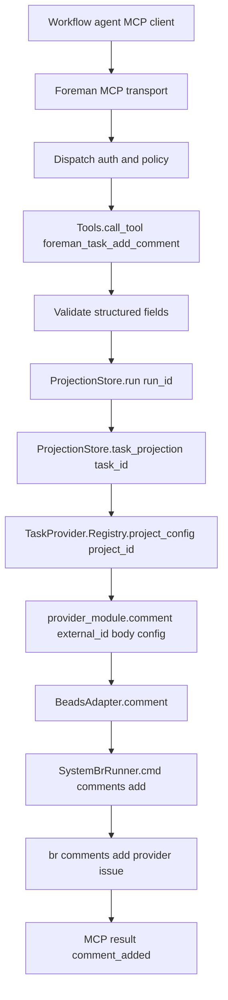

# TRD: Task Work Log Comment Tool via TaskProvider

Foreman task title read from `FOREMAN_TASK_TITLE`: **Add foreman_task_add_comment MCP tool for workflow work-log entries via TaskProvider**

Source PRD: `docs/PRD/PRD-2026-3a76a0f0-task-add-comment-work-log.md` (`PRD-2026-3a76a0f0`).

## PRD Validation Summary

- Required PRD sections present: Executive Summary, personas, scope, requirements, acceptance criteria, non-functional requirements, dependency map, readiness gate, and TRD decisions.
- Requirements: 14 sequential `REQ-NNN` IDs.
- Acceptance criteria: 39 `AC-NNN-M` items, Given/When/Then format.
- PRD readiness score: **4.8 PASS**.
- Subject match: PRD title and `FOREMAN_TASK_TITLE` both describe adding `foreman_task_add_comment` for workflow Work Log entries through TaskProvider.
- Foreman source PRD contract honored: only `FOREMAN_SOURCE_PRD_PATH` was consumed.

## Domain Analysis

| Domain | Requirements | Notes |
|---|---|---|
| TaskProvider contract | REQ-001, REQ-008, REQ-013, REQ-014 | Add a typed comment result and `comment/3` callback without bare maps. |
| Beads adapter and runner | REQ-002, REQ-007, REQ-013, REQ-014 | Route `br comments add` through `SystemBrRunner`; never shell out from workers. |
| MCP tool contract and policy | REQ-003, REQ-004, REQ-006, REQ-008, REQ-012 | Add `foreman_task_add_comment`, default-deny it through existing write policy, and resolve context server-side. |
| Structured Work Log formatting | REQ-005, REQ-010 | Compose stable server-side body from workflow, phase, and description; rely on Beads for timestamp/author. |
| Workflow adoption and docs | REQ-007, REQ-009, REQ-010, REQ-011 | Update bundled prompts, install runtime copies, live verify, and document real behavior. |

Brownfield system. Reuse existing `ForemanServer.MCP.Tools` generated dispatch, `ForemanServer.MCP.Policy`, `ProjectionStore.run/1`, `ProjectionStore.task_projection/1`, `TaskProvider.Registry.project_config/1`, `SystemBrRunner`, prompt install flow, and doc gate discipline.

## Reused Capabilities

`trd-graph-cli capabilities docs/TRD --json` returned `{"capabilities": []}`. No foundational TRD provides a deduplicatable capability token.

In-repo mechanisms reused directly:

| Reused mechanism | Provider | Used by |
|---|---|---|
| MCP write policy | `ForemanServer.MCP.Policy.@write_tools`, `allow_workflow_writes` | REQ-003, REQ-006, REQ-008 |
| Run/task projection lookup | `ProjectionStore.run/1`, `ProjectionStore.task_projection/1` | REQ-004, REQ-008, REQ-010 |
| Per-project provider routing | `TaskProvider.Registry.project_config/1` | REQ-002, REQ-004, REQ-013 |
| Serialized Beads command path | `SystemBrRunner.cmd/3`, `BeadsDbLease`/per-DB runner lock | REQ-002, REQ-007 |
| Inbox prompt cadence | Existing `foreman_inbox_send` prompt guidance | REQ-009, REQ-010 |
| Documentation gate | README, user guide, CLI reference, CLAUDE, AGENTS | REQ-011 |

## Architecture Alternatives

| Option | Approach | Pros | Cons | Risk |
|---|---|---|---|---|
| A — direct worker Beads command | Teach prompts to run `br comments add` from phase worktrees. | Fastest to script. | Violates explicit boundary; leaks Beads internals to workers; impossible to enforce Foreman policy. | High |
| B — route through Foreman task aggregate | Add a `task.add_comment` command/event and let the aggregate invoke provider side effects. | Consistent with existing `foreman_task_*` aggregate tools. | Aggregates should not perform external CLI side effects; creates durable Foreman events for a provider audit-log write; larger design change. | Medium |
| C — provider-backed MCP write tool | Add `TaskProvider.comment/3`, implement Beads through `SystemBrRunner`, and expose `foreman_task_add_comment` that resolves run/task/provider context server-side. | Satisfies PRD boundary, typed contract, minimal new mutation path, default-deny policy reuse. | First MCP-to-TaskProvider direct mutation; needs clear tests/docs to prevent confusion with aggregate-backed task tools. | Low |

Foreman mode: auto-selected Option C (provider-backed MCP write tool).

## Architecture Decision

Implement `foreman_task_add_comment` as a first-class MCP write tool that writes a structured provider comment through `TaskProvider.comment/3`, not through the Foreman task aggregate. The tool uses the existing `allow_workflow_writes` gate for v1.

### Key Decisions

1. **Typed provider result:** add `ForemanServer.TaskProvider.Comment` as a narrow typed result (`provider_issue_id`, `status`, optional provider metadata) and make `TaskProvider.comment/3` return `{:ok, Comment.t()} | {:error, ProviderError.t()}`. Do not reuse `Issue.t()` unless Beads already returns/refetches a full issue cleanly during implementation.
2. **Policy:** add `foreman_task_add_comment` to `MCP.Policy.@write_tools`; v1 is hidden/refused unless `allow_workflow_writes` is enabled. A narrower comment-write flag is deferred until an operator need exists.
3. **Server-side target resolution:** tool accepts `run_id`, `workflow_name`, `phase_name`, and `description` only. It loads the run, loads the bound Foreman task, reads `task.external_id` as provider issue id, resolves project provider config, then calls `provider_module.comment/3`.
4. **No aggregate mutation:** `foreman_task_add_comment` does not dispatch `task.update`, append task events, or mutate projections. Its side effect is the upstream provider comment only.
5. **Structured body:** server composes a stable Work Log body with `Work Log`, `Workflow`, `Phase`, and `Work performed`. It does not fabricate authoritative timestamp or author.
6. **Bounds:** reject blank or oversize structured fields before provider routing. Suggested v1 limits: workflow and phase 1-100 chars each; description 1-2,000 chars; final body no more than 2,500 chars.
7. **Beads path:** extend `SystemBrRunner` with one explicit `:comments_add` action. Because `br comments add --help` verifies `--message`, `--db`, and `--json`, the runner should build `br comments add <id> --message <body> --json --db <database_path>` through a dedicated argv clause; `BeadsAdapter.comment/3` calls only the runner.
8. **Provider scope:** Beads is the only v1 implementation. Other providers that lack `comment/3` return a typed unsupported/configuration error.
9. **Prompt behavior:** agents add concise Work Log comments at phase start, material milestones, blockers, and completion when the tool is available; denial/failure is non-blocking.
10. **Verification:** final implementation proof requires a live Beads-backed Foreman workflow where a phase calls the tool and `br comments list <task-id>` or `br show <task-id>` displays the Work Log.

## System Architecture Design

### Components

| Component | Responsibility | Change |
|---|---|---|
| `ForemanServer.TaskProvider.Comment` | Typed provider comment result | New struct/module with enforced keys and Jason encoder if returned through MCP-adjacent paths. |
| `ForemanServer.TaskProvider` | Provider behavior contract | Add `comment/3`, docs, typedoc for `comment_body` and `comment_result`. |
| `ForemanServer.TaskProviders.SystemBrRunner` | Sole `br` command constructor/executor | Add a dedicated `:comments_add` action, payload validation, nested `comments add` argv construction, and tests for argv shape and DB normalization. |
| `ForemanServer.TaskProviders.BeadsAdapter` | Beads provider implementation | Add `comment/3` using `SystemBrRunner`, map errors to `%ProviderError{}`, and return `Comment.t()`. |
| `ForemanServer.TaskProvider.Registry` | Per-project provider/config resolution | Reused; no code change expected beyond contract tests accepting the new callback. |
| `ForemanServer.MCP.Policy` | Default-deny MCP write list | Add `foreman_task_add_comment` to `@write_tools`; keep `allow_workflow_writes` as v1 gate. |
| `ForemanServer.MCP.Tools` | MCP schema, validation, context lookup, handler, DTO/error mapping | Add schema, result DTO, body builder, projection/provider routing, telemetry, typed errors. |
| `ForemanServer.ProjectionStore` | Run/task read models | Reused for `run_id` -> `project_id`/`task_id` and task `external_id` lookup. |
| Bundled workflow prompts | Agent behavior guidance | Add Work Log instructions alongside inbox progress instructions without direct Beads commands. |
| Docs | Operator/maintainer expectations | Update docs after implementation; fix stale provider capability claims where touched. |

### Data Flow



### Interfaces

| Boundary | Protocol | Request | Response/Error |
|---|---|---|---|
| MCP schema | `foreman_task_add_comment` | `{run_id, workflow_name, phase_name, description}`; no provider issue id, Beads id, or freeform body field | `%TaskAddCommentResult{run_id, task_id, provider, status: "comment_added"}` |
| Projection lookup | Internal read model | `run_id` -> run; `task_id` -> task | `NOT_FOUND` for missing run/task; `INVALID_STATE` for missing project/task/provider issue id |
| Provider registry | GenServer call | `project_id` | `{:ok, %{provider_module, config}}` or typed provider-configuration error |
| Provider callback | `TaskProvider.comment/3` | `provider_issue_id`, composed body, project config | `{:ok, Comment.t()}` or `{:error, ProviderError.t()}` |
| Beads runner | `SystemBrRunner.cmd/3` | `{:comments_add, %{id, body}}` | `br comments add <id> --message <body> --json --db <database_path>` result |

## Master Task List

### PR 1: TaskProvider and Beads can add typed comments

**Shippable State:** Maintainers can call the Beads task provider comment callback in tests and observe a typed provider comment result or typed provider error; no MCP tool is advertised yet.

- [ ] **TRD-001**: Add `ForemanServer.TaskProvider.Comment` typed result and `TaskProvider.comment/3` callback docs for provider issue id, comment body, and project config [satisfies REQ-001, REQ-008, REQ-013] (2h)
  - Validates PRD ACs: AC-001-1, AC-001-2, AC-001-3, AC-008-1, AC-013-1
  - Implementation AC:
    - [ ] Given `ForemanServer.TaskProvider.behaviour_info(:callbacks)` is inspected, when callbacks are listed, then `{:comment, 3}` is present.
    - [ ] Given maintainers read `task_provider.ex`, when they inspect `comment/3`, then args and typed return are documented.
    - [ ] Given comment succeeds, when returned, then the result is `%ForemanServer.TaskProvider.Comment{}` or a deliberately named typed struct, never a bare map.
- [ ] **TRD-001-TEST**: Add behavior/struct tests for `comment/3` reflection, enforced comment result keys, and no bare-map success contract [verifies TRD-001] [satisfies REQ-001, REQ-008, REQ-014] [depends: TRD-001] (2h)
- [ ] **TRD-002**: Extend `SystemBrRunner` with a `:comments_add` action that builds the verified `br comments add <id> --message <body> --json --db <database_path>` command through the existing per-DB runner path [satisfies REQ-002, REQ-007, REQ-014] [depends: TRD-001] (3h)
  - Validates PRD ACs: AC-002-1, AC-002-2, AC-007-2, AC-014-1
  - Implementation AC:
    - [ ] Given request payload has nonblank id and body, when argv is built, then it invokes `br comments add <id> --message <body> --json --db <normalized database path>` using the source-verified Beads comments contract.
    - [ ] Given id or body is blank/non-string, when validation runs, then `ArgumentError` is raised before invoking `br`.
    - [ ] Given a database path is present, when the runner executes, then it uses the existing runner lock/serialization and not a new `System.cmd` site.
- [ ] **TRD-002-TEST**: Add `SystemBrRunner` tests for `:comments_add` argv shape, nested `comments add` ordering, DB leaf normalization, invalid payload rejection, and absence of direct worker shelling assumptions [verifies TRD-002] [satisfies REQ-002, REQ-007, REQ-014] [depends: TRD-002] (2h)
- [ ] **TRD-003**: Implement `BeadsAdapter.comment/3` with input validation, `SystemBrRunner` invocation, provider error mapping, telemetry consistent with other adapter operations, and typed success result [satisfies REQ-002, REQ-008, REQ-013] [depends: TRD-001, TRD-002] (4h)
  - Validates PRD ACs: AC-002-1, AC-002-2, AC-002-3, AC-008-3, AC-013-1
  - Implementation AC:
    - [ ] Given a valid Beads issue id/body/config, when `BeadsAdapter.comment/3` runs, then it calls `@runner.cmd({:comments_add, %{id: issue_id, body: body}}, config, _)` and returns `{:ok, %Comment{status: "comment_added"}}`.
    - [ ] Given `br` returns an error envelope, when mapped, then the adapter returns `%ProviderError{}` with safe bounded diagnostics and retryability from the code map or explicit mapping.
    - [ ] Given issue id/body/config is invalid, when called, then it returns a typed provider error before the runner is invoked.
- [ ] **TRD-003-TEST**: Add Beads adapter tests for successful comment request, invalid id/body/config, `br` error envelope mapping, parse/contract failure, and no direct `System.cmd` use [verifies TRD-003] [satisfies REQ-002, REQ-008, REQ-013, REQ-014] [depends: TRD-003] (4h)
- [ ] **TRD-004**: Update provider capability reporting and registry/route tests so Beads advertises comment support accurately and unsupported providers fail loudly [satisfies REQ-011, REQ-013, REQ-014] [depends: TRD-003] (2h)
  - Validates PRD ACs: AC-011-2, AC-013-1, AC-013-2, AC-014-1
  - Implementation AC:
    - [ ] Given `BeadsAdapter.capabilities/0` is inspected, when supports are listed, then comment support is present, `:annotate` is not used as a synonym for comments, and any stale unsupported capability claims touched by this feature are corrected only when source-proven.
    - [ ] Given a provider cannot satisfy the new behavior callback, when registered, then registry contract checks reject it rather than silently routing comment writes.
- [ ] **TRD-004-TEST**: Update provider capability/registry tests for comment support and contract enforcement [verifies TRD-004] [satisfies REQ-011, REQ-013, REQ-014] [depends: TRD-004] (2h)

### PR 2: MCP exposes a policy-gated Work Log comment tool

**Shippable State:** With MCP workflow writes enabled, agents can call `foreman_task_add_comment` for a run and receive a typed result after Foreman resolves the task/provider target; with writes disabled, the tool is hidden/refused before provider routing.

- [ ] **TRD-005**: Add `foreman_task_add_comment` schema, generated handler entry, and `%TaskAddCommentResult{}` DTO to `ForemanServer.MCP.Tools` [satisfies REQ-003, REQ-005, REQ-008] [depends: TRD-001] (3h)
  - Validates PRD ACs: AC-003-1, AC-005-1, AC-008-1
  - Implementation AC:
    - [ ] Given writes are enabled, when `tools/list` is called, then the tool appears with required `run_id`, `workflow_name`, `phase_name`, and `description` fields.
    - [ ] Given schema properties are inspected, when field names are listed, then no provider issue id, Beads id, or raw body input exists.
    - [ ] Given success is returned, when encoded, then the DTO includes at least `run_id`, `task_id`, `provider`, and `status: "comment_added"`.
- [ ] **TRD-005-TEST**: Add MCP schema/list tests proving declared fields, no provider-id input, generated dispatch wiring, and typed success DTO shape [verifies TRD-005] [satisfies REQ-003, REQ-005, REQ-008, REQ-014] [depends: TRD-005] (2h)
- [ ] **TRD-006**: Implement structured-field validation and server-side Work Log body composition with bounded `workflow_name`, `phase_name`, `description`, and final body length [satisfies REQ-005, REQ-008] [depends: TRD-005] (3h)
  - Validates PRD ACs: AC-005-1, AC-005-2, AC-005-3, AC-008-2
  - Implementation AC:
    - [ ] Given valid structured fields, when the body is composed, then it includes `Work Log`, `Workflow`, `Phase`, and `Work performed` labels.
    - [ ] Given any field is blank, non-string, or over limit, when validation runs, then `INVALID_PARAMS` returns before registry/provider calls.
    - [ ] Given the body is composed, when inspected, then it does not include a fabricated authoritative timestamp or author.
- [ ] **TRD-006-TEST**: Add tool helper tests for body composition, blank/non-string rejection, over-limit rejection, no timestamp/author fabrication, and safe final body length [verifies TRD-006] [satisfies REQ-005, REQ-008, REQ-014] [depends: TRD-006] (2h)
- [ ] **TRD-007**: Implement run/task/provider context resolution in the MCP handler using `ProjectionStore.run/1`, `ProjectionStore.task_projection/1`, task `external_id`, and `TaskProvider.Registry.project_config/1` [satisfies REQ-004, REQ-007, REQ-008, REQ-012] [depends: TRD-003, TRD-006] (5h)
  - Validates PRD ACs: AC-003-2, AC-003-3, AC-004-1, AC-004-2, AC-004-3, AC-007-2, AC-008-2, AC-012-2
  - Implementation AC:
    - [ ] Given a valid provider-tracked run, when the tool runs, then it derives `project_id`, `task_id`, and provider issue id without trusting caller-supplied target ids.
    - [ ] Given run/task/provider issue id/project provider config is missing, when called, then it returns `NOT_FOUND`, `INVALID_STATE`, or provider-configuration error and writes no comment.
    - [ ] Given implementation is inspected, when code paths are traced, then no `task.update`, aggregate event append, or projection mutation occurs.
- [ ] **TRD-007-TEST**: Add MCP handler tests for successful context resolution, missing run, missing task, missing `external_id`, unconfigured provider, provider failure, and no aggregate dispatch [verifies TRD-007] [satisfies REQ-003, REQ-004, REQ-007, REQ-008, REQ-012, REQ-014] [depends: TRD-007] (5h)
- [ ] **TRD-008**: Add `foreman_task_add_comment` to `MCP.Policy.@write_tools` using existing `allow_workflow_writes` for v1, with direct-call refusal before provider routing [satisfies REQ-003, REQ-006, REQ-008] [depends: TRD-005] (2h)
  - Validates PRD ACs: AC-003-1, AC-006-1, AC-006-2, AC-006-3, AC-008-2
  - Implementation AC:
    - [ ] Given default MCP config, when tools are listed, then `foreman_task_add_comment` is hidden.
    - [ ] Given default MCP config and a direct call, when policy runs, then it returns `POLICY_REFUSED` before projection or provider routing.
    - [ ] Given the policy decision is documented in code/tests, when reviewed, then it states v1 uses `allow_workflow_writes` and why.
- [ ] **TRD-008-TEST**: Add policy and transport tests for default hidden/refused behavior, enabled exposure, and refusal-before-provider-call [verifies TRD-008] [satisfies REQ-003, REQ-006, REQ-008, REQ-014] [depends: TRD-008] (3h)
- [ ] **TRD-009**: Map MCP failures to typed safe errors and telemetry outcomes without leaking provider stdout/stderr or comment body content [satisfies REQ-008, REQ-014] [depends: TRD-007] (2h)
  - Validates PRD ACs: AC-008-2, AC-008-3, AC-014-2
  - Implementation AC:
    - [ ] Given validation, not-found, invalid-state, policy, unsupported-provider, and provider failures occur, when mapped, then each receives a distinct documented MCP code.
    - [ ] Given provider diagnostics include command output, when converted to MCP error, then only safe bounded diagnostic text is returned.
    - [ ] Given telemetry is emitted, when inspected, then it contains tool name/outcome only and omits Work Log content.
- [ ] **TRD-009-TEST**: Add typed error and telemetry redaction tests for all expected failure classes [verifies TRD-009] [satisfies REQ-008, REQ-014] [depends: TRD-009] (3h)
- [ ] **TRD-010**: Run regression checks proving existing `foreman_task_get`, `foreman_task_list`, and `foreman_task_update` aggregate/projection behavior remains unchanged [satisfies REQ-012, REQ-014] [depends: TRD-007, TRD-008] (2h)
  - Validates PRD ACs: AC-012-1, AC-012-2, AC-012-3, AC-014-2
  - Implementation AC:
    - [ ] Given existing task tools are called, when tests run, then they still use current aggregate/projection paths.
    - [ ] Given new tool tests inspect routing, when reviewed, then they document the intentional separate provider-adapter path.
- [ ] **TRD-010-TEST**: Execute targeted MCP task-tool regression tests and record proof in the implementation report [verifies TRD-010] [satisfies REQ-012, REQ-014] [depends: TRD-010] (1h)

### PR 3: Workflow agents write Work Logs and docs match behavior

**Shippable State:** Bundled workflow agents are instructed to write concise non-blocking Work Log comments through `foreman_task_add_comment`, runtime workflow assets can be refreshed, operator docs describe the implemented behavior, and a live Beads-backed run proves a comment was created.

- [ ] **TRD-011**: Update bundled workflow prompts/skills with non-blocking Work Log guidance for phase start, material milestones, blockers, and completion using only `foreman_task_add_comment` [satisfies REQ-007, REQ-009, REQ-010] [depends: TRD-008] (3h)
  - Validates PRD ACs: AC-007-1, AC-009-1, AC-009-2, AC-010-1
  - Implementation AC:
    - [ ] Given bundled prompts are inspected, when Work Log guidance appears, then it names `foreman_task_add_comment` and never tells agents to run `br`, open Beads SQLite, or call adapter internals.
    - [ ] Given the tool is denied/unavailable/fails, when prompt guidance is followed, then the agent continues phase work and reports the failed log attempt only when relevant.
    - [ ] Given cadence guidance is read, when no material progress occurs, then agents are not asked to send timer-only chatter.
- [ ] **TRD-011-TEST**: Add prompt/static tests covering Work Log cadence, non-blocking failure guidance, and no direct Beads access language [verifies TRD-011] [satisfies REQ-007, REQ-009, REQ-014] [depends: TRD-011] (2h)
- [ ] **TRD-012**: Refresh runtime workflow assets after prompt/source changes with `npm run build` and `foreman init --force` or the repository-approved equivalent [satisfies REQ-009, REQ-010] [depends: TRD-011] (1h)
  - Validates PRD ACs: AC-009-3, AC-010-1
  - Implementation AC:
    - [ ] Given prompt sources changed, when live verification starts, then installed runtime copies contain the new Work Log instructions.
- [ ] **TRD-012-TEST**: Record installed prompt refresh proof in the implementation report before live dispatched-run verification [verifies TRD-012] [satisfies REQ-009, REQ-010] [depends: TRD-012] (1h)
- [ ] **TRD-013**: Update `README.md`, `docs/user-guide.md`, `docs/cli-reference.md`, `CLAUDE.md`, and `AGENTS.md` only where implemented behavior changes operator/developer expectations [satisfies REQ-006, REQ-011, REQ-013] [depends: TRD-003, TRD-008, TRD-011] (3h)
  - Validates PRD ACs: AC-006-3, AC-011-1, AC-011-2, AC-013-2
  - Implementation AC:
    - [ ] Given docs mention MCP writes or TaskProvider capabilities, when finalization occurs, then they accurately include `foreman_task_add_comment`, the v1 policy gate, Beads-only scope, and real callback support.
    - [ ] Given docs contain stale unsupported provider callback claims, when touched for this feature, then they are corrected to source-verified behavior.
    - [ ] Given a required doc has no applicable change, when final report is written, then the no-op rationale is recorded.
- [ ] **TRD-013-TEST**: Add docs/reviewer evidence that required docs were updated or explicitly no-op recorded and no speculative provider behavior was documented [verifies TRD-013] [satisfies REQ-011, REQ-013] [depends: TRD-013] (1h)
- [ ] **TRD-014**: Live-verify a Beads-backed `prd` or `fix` workflow with MCP writes enabled where a phase calls `foreman_task_add_comment` and Beads shows the Work Log comment [satisfies REQ-007, REQ-010, REQ-014] [depends: TRD-012, TRD-013] (4h)
  - Validates PRD ACs: AC-007-2, AC-010-1, AC-010-2, AC-010-3, AC-014-3
  - Implementation AC:
    - [ ] Given a Beads-backed run executes, when at least one phase runs, then tool-call proof shows `foreman_task_add_comment` was called by the agent.
    - [ ] Given verification runs `br comments list <task-id>` or `br show <task-id>`, when output is inspected, then it shows correct workflow, phase, work description, Beads timestamp, and Beads author.
    - [ ] Given final report is written, when reviewed, then it includes run id, task id, tool-call proof, Beads comment proof, and no worker direct-`br` use.
- [ ] **TRD-014-TEST**: Archive live verification evidence and targeted automated test commands/results in the implementation report [verifies TRD-014] [satisfies REQ-010, REQ-014] [depends: TRD-014] (1h)

## Sprint Planning

## Sprint 1: Provider contract and Beads implementation

PR 1. Delivers typed provider comment support and Beads-backed runner integration without exposing an agent-facing MCP tool.

## Sprint 2: MCP tool and policy

PR 2. Delivers the policy-gated `foreman_task_add_comment` tool, server-side target resolution, typed errors, and regression proof for existing task tools.

## Sprint 3: Workflow adoption, docs, and live proof

PR 3. Delivers prompt guidance, runtime prompt refresh, operator/developer documentation, and live Beads-backed verification.

## Dependency Graph

| Task | Depends On |
|---|---|
| TRD-001 | — |
| TRD-001-TEST | TRD-001 |
| TRD-002 | TRD-001 |
| TRD-002-TEST | TRD-002 |
| TRD-003 | TRD-001, TRD-002 |
| TRD-003-TEST | TRD-003 |
| TRD-004 | TRD-003 |
| TRD-004-TEST | TRD-004 |
| TRD-005 | TRD-001 |
| TRD-005-TEST | TRD-005 |
| TRD-006 | TRD-005 |
| TRD-006-TEST | TRD-006 |
| TRD-007 | TRD-003, TRD-006 |
| TRD-007-TEST | TRD-007 |
| TRD-008 | TRD-005 |
| TRD-008-TEST | TRD-008 |
| TRD-009 | TRD-007 |
| TRD-009-TEST | TRD-009 |
| TRD-010 | TRD-007, TRD-008 |
| TRD-010-TEST | TRD-010 |
| TRD-011 | TRD-008 |
| TRD-011-TEST | TRD-011 |
| TRD-012 | TRD-011 |
| TRD-012-TEST | TRD-012 |
| TRD-013 | TRD-003, TRD-008, TRD-011 |
| TRD-013-TEST | TRD-013 |
| TRD-014 | TRD-012, TRD-013 |
| TRD-014-TEST | TRD-014 |

Critical path: TRD-001 → TRD-002 → TRD-003 → TRD-007 → TRD-009 → TRD-011 → TRD-012 → TRD-014. Max depth exceeds 3 because provider, MCP, prompt refresh, and live proof are inherently sequential; PR boundaries remain independently shippable.

## Acceptance Criteria Traceability

| REQ | Description | Implementation Tasks | Test Tasks |
|---|---|---|---|
| REQ-001 | Add a TaskProvider comment contract | TRD-001 | TRD-001-TEST |
| REQ-002 | Implement Beads comments through SystemBrRunner | TRD-002, TRD-003 | TRD-002-TEST, TRD-003-TEST |
| REQ-003 | Expose `foreman_task_add_comment` as an MCP write tool | TRD-005, TRD-007, TRD-008 | TRD-005-TEST, TRD-007-TEST, TRD-008-TEST |
| REQ-004 | Resolve run, project, and provider task context server-side | TRD-007 | TRD-007-TEST |
| REQ-005 | Compose structured Work Log bodies server-side | TRD-005, TRD-006 | TRD-005-TEST, TRD-006-TEST |
| REQ-006 | Preserve write-policy safety with an explicit policy decision | TRD-008, TRD-013 | TRD-008-TEST, TRD-013-TEST |
| REQ-007 | Keep workers isolated from Beads internals | TRD-002, TRD-007, TRD-011, TRD-014 | TRD-002-TEST, TRD-007-TEST, TRD-011-TEST, TRD-014-TEST |
| REQ-008 | Return typed successes and typed failures | TRD-001, TRD-003, TRD-005, TRD-006, TRD-007, TRD-008, TRD-009 | TRD-001-TEST, TRD-003-TEST, TRD-005-TEST, TRD-006-TEST, TRD-007-TEST, TRD-008-TEST, TRD-009-TEST |
| REQ-009 | Instruct bundled workflow agents to write useful work logs | TRD-011, TRD-012 | TRD-011-TEST, TRD-012-TEST |
| REQ-010 | Verify with a live dispatched workflow | TRD-006, TRD-011, TRD-012, TRD-014 | TRD-006-TEST, TRD-011-TEST, TRD-012-TEST, TRD-014-TEST |
| REQ-011 | Document implemented operator behavior | TRD-004, TRD-013 | TRD-004-TEST, TRD-013-TEST |
| REQ-012 | Preserve existing task aggregate MCP behavior | TRD-007, TRD-010 | TRD-007-TEST, TRD-010-TEST |
| REQ-013 | Limit v1 provider scope to Beads | TRD-001, TRD-003, TRD-004, TRD-013 | TRD-001-TEST, TRD-003-TEST, TRD-004-TEST, TRD-013-TEST |
| REQ-014 | Provide tests across provider, MCP, and prompt layers | TRD-001 through TRD-014 | TRD-001-TEST through TRD-014-TEST |

Traceability check: 14 requirements covered, 0 uncovered, 0 orphaned annotations.

## Adversarial Review

### Architecture Issues

1. **Issue:** `foreman_task_add_comment` is named like aggregate-backed task tools but deliberately uses provider routing.
   - **Resolution:** TRD-007 and TRD-010 require tests and code comments documenting no aggregate dispatch/projection mutation and preserving existing task tools.
2. **Issue:** `br comments add` output format may not provide a full issue payload.
   - **Resolution:** Architecture selects a narrow `Comment.t()` result so success can remain typed without forcing a fragile issue refetch.
3. **Issue:** Using existing `allow_workflow_writes` may expose comment writes alongside higher-risk write tools.
   - **Resolution:** V1 chooses reuse for consistency and default-deny behavior; TRD-008 and TRD-013 require tests/docs. A separate flag remains future work if operators need it.
4. **Issue:** Prompt guidance could accidentally teach direct Beads access.
   - **Resolution:** TRD-011 static tests forbid `br`, Beads SQLite, or adapter-internal instructions in Work Log guidance.

### Task Coverage Issues

1. **Issue:** Provider callback support without MCP tests would leave the agent-facing contract unproven.
   - **Resolution:** PR 2 includes schema, handler, policy, context-resolution, error, and regression tests.
2. **Issue:** Prompt-only acceptance could pass while agents never call the tool.
   - **Resolution:** TRD-014 requires live dispatched-run evidence plus Beads comment proof.
3. **Issue:** Documentation can drift from source, especially around TaskProvider capabilities.
   - **Resolution:** TRD-013 explicitly checks required docs and corrects only implemented/source-verified behavior.

### Dependency and Estimate Issues

1. **Issue:** Critical path depth is long because live verification depends on provider, MCP, policy, prompts, runtime install, and docs.
   - **Resolution:** Split into three shippable PRs; each PR leaves a testable capability and no half-exposed user-visible route.
2. **Issue:** TRD-007 is high-risk at 5h due to context-resolution edge cases.
   - **Resolution:** It is paired with a 5h test task and isolated after provider/tool validation helpers exist.

### Testability Issues

1. **Issue:** Live proof depends on local Beads-backed Foreman run availability.
   - **Resolution:** Automated tests cover provider/MCP/prompt layers; TRD-014 separately captures live run id, task id, tool-call proof, and Beads output.
2. **Issue:** “No direct worker Beads use” is hard to prove dynamically.
   - **Resolution:** Static prompt tests plus live evidence of MCP tool call provide bounded proof for v1.

## Design Readiness Gate

| Dimension | Score | Notes |
|---|---:|---|
| Architecture completeness | 4.8 | Components, data flow, interfaces, policy, provider boundary, and source-verified Beads comments argv are defined. |
| Task coverage | 4.8 | Every PRD requirement has implementation and test coverage plus live proof. |
| Dependency clarity | 4.7 | Dependencies are explicit and acyclic; critical path is long but PR slices are shippable. |
| Estimate confidence | 4.7 | Estimates are granular; TRD-007/TRD-014 remain environment-sensitive but runner ambiguity is reduced. |
| Overall | 4.8 | PASS |

Gate decision: PASS. Proceed to output; implementation requires approval.

## Output Summary

- TRD path: `docs/TRD/TRD-2026-3a76a0f0-task-add-comment-work-log.md`
- Task count: 28 total tasks (14 implementation, 14 test)
- Design readiness score: 4.8 PASS
- Source PRD correlation id: `3a76a0f0`

Suggested next steps after approval:

```bash
/ensemble-configure-team docs/TRD/TRD-2026-3a76a0f0-task-add-comment-work-log.md
/ensemble-implement-trd-beads docs/TRD/TRD-2026-3a76a0f0-task-add-comment-work-log.md
```

## Changelog

### 2026-09-18 — v1.0.1

- Refined Beads runner design to use a single `:comments_add` action and the source-verified `br comments add <id> --message <body> --json --db <database_path>` contract.
- Tightened `SystemBrRunner`, `BeadsAdapter`, and capability-reporting task acceptance criteria so comments are not conflated with stale `:annotate` support.
- Re-scored Design Readiness from 4.7 to 4.8 after removing runner-contract ambiguity.
- Documentation files were considered and left unchanged because this phase changed only the TRD planning artifact, not implemented runtime behavior.
