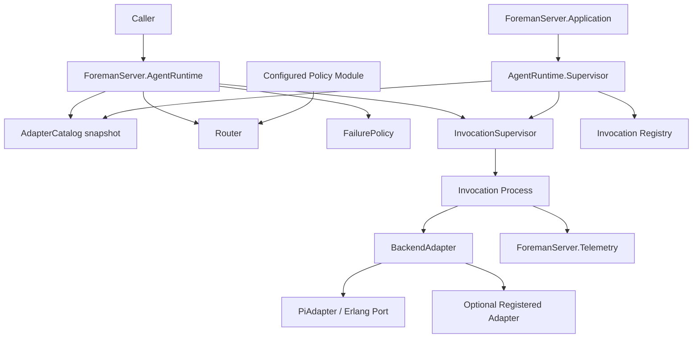
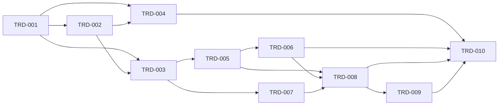

# TRD: OTP Agent Runtime — Swappable Backend Adapters

## Document Purpose

This document defines the implementation architecture and delivery plan for the OTP-supervised agent runtime described by `PRD-2026-6af02293`. It converts the nine product requirements into independently reviewable, tested PR slices for the existing Elixir application under `packages/foreman_server`.

The source repository is brownfield, but no `ForemanServer.AgentRuntime`, `BackendAdapter`, `ProviderRegistry`, backend-routing, or failure-policy implementation exists in this checkout. Existing foundations that this design reuses are the root OTP supervision tree in `ForemanServer.Application`, the `ForemanServer.Telemetry` wrapper, and established ExUnit conventions.

## PRD Validation Summary

| Check | Result |
|---|---|
| Source document | `docs/PRD/PRD-2026-6af02293-otp-agent-runtime.md` |
| Readiness gate | 4.0 — PASS |
| Requirement sequence | `REQ-001` through `REQ-009`, sequential |
| Acceptance criteria | 24, all associated with an existing requirement |
| Must-requirement edge coverage | Every Must requirement has at least two ACs |
| Ambiguities | 11 resolved, 0 open |
| Constraints and non-goals | Documented in PRD §§6–7 |

The PRD uses semantic equivalents for the requested canonical sections: Executive Summary for Product Summary/Goals, Background and Evidence for User Analysis, Requirements for Technical Requirements, and requirement-local Given/When/Then items for Acceptance Criteria.

## Reused Capabilities

The mandatory capability registry returned no foundational capabilities, and the overlap analysis reported no overlapping target files across existing TRDs. This TRD therefore has no cross-TRD foundational dependency.

Commands used:

```text
node "$TRD_GRAPH_CLI" capabilities docs/TRD --json
# {"capabilities": []}

node "$TRD_GRAPH_CLI" overlap docs/TRD
# No overlapping target files across TRDs.
```

The design still reuses existing code-level facilities:

| Existing facility | Reuse |
|---|---|
| `ForemanServer.Application` | Starts the new runtime supervisor as one root child |
| `ForemanServer.Telemetry` | Owns agent execution event names and emission helpers |
| Elixir `Registry` | Unique invocation lookup and lifecycle visibility |
| `DynamicSupervisor` | Isolates concurrent invocation processes |
| Erlang `Port` | Runs and terminates the local `foreman-worker-pi` executable |

## Architecture Decision

### Selected: Option B — Fully Supervised Execution Subsystem

Implement a dedicated `ForemanServer.AgentRuntime.Supervisor` with separate registry, adapter catalog, and invocation supervision responsibilities. Routing and failure-policy resolution remain pure modules. Each call to `AgentRuntime.execute/3` creates a short-lived supervised invocation process that owns selection, timeout, retries, fallback history, telemetry, and adapter execution.

This option was selected because adapter crashes and hung local processes are explicit PRD risks. Separating durable runtime catalog state from short-lived execution state makes failure containment observable and testable without turning the public facade into a stateful bottleneck.

### Alternatives Considered

#### Option A — Minimal Extension

Implement registry, routing, fallback, and adapter invocation primarily in one `AgentRuntime` GenServer with one task supervisor.

- **Pros:** fewest modules; fastest initial delivery; simple startup.
- **Cons:** serial catalog calls and orchestration share one mailbox; policy, ranking, retry, and execution lifecycle become coupled; one defect has a wider blast radius.
- **Complexity impact:** low initial complexity, high extension complexity.
- **Risk profile:** medium-high operational coupling; rejected because a hung or overloaded orchestration process can impair unrelated calls.

#### Option B — Fully Supervised Execution Subsystem (selected)

Use a facade, adapter catalog, invocation registry, dynamic invocation supervisor, pure router, policy behaviour, failure-policy resolver, and adapter modules.

- **Pros:** explicit interfaces; concurrent calls are isolated; deterministic routing is independently testable; invocation crashes do not corrupt adapter registration state.
- **Cons:** more modules and supervision tests; careful ownership is required for timeout and Port termination.
- **Complexity impact:** highest upfront component count, controlled long-term complexity.
- **Risk profile:** low runtime blast radius, medium implementation risk around process lifecycle.

#### Option C — Layered Runtime

Use a stateless facade over a small runtime catalog with `Task.Supervisor` for calls, while keeping routing and fallback in the facade call path.

- **Pros:** balanced module count; leverages standard tasks; simpler than a dedicated invocation process.
- **Cons:** cancellation and fallback history ownership are less explicit; task exits require careful normalization; future streaming would force lifecycle redesign.
- **Complexity impact:** medium.
- **Risk profile:** medium; viable, but less explicit than Option B for timeout and crash recovery.

## System Architecture

### Component Model



### Components and Responsibilities

| Component | Target | Responsibility |
|---|---|---|
| Public facade | `lib/foreman_server/agent_runtime.ex` — `ForemanServer.AgentRuntime` | Validate public arguments, register adapters, synchronously execute prompts, and expose only backend-agnostic results/errors |
| Runtime supervisor | `lib/foreman_server/agent_runtime/supervisor.ex` | Start catalog, invocation registry, and dynamic invocation supervisor under `:one_for_one` |
| Adapter behaviour | `lib/foreman_server/agent_runtime/backend_adapter.ex` | Define `name/0`, `capabilities/0`, `available?/0`, and `execute/2` callbacks and result types |
| Capability schema | `lib/foreman_server/agent_runtime/capabilities.ex` | Validate required capability fields and normalize optional ranking values without silently accepting invalid entries |
| Adapter catalog | `lib/foreman_server/agent_runtime/adapter_catalog.ex` | Store startup registrations with monotonic registration order and return immutable snapshots for routing |
| Router | `lib/foreman_server/agent_runtime/router.ex` | Implement manual, automatic, and policy selection as deterministic pure transformations |
| Policy behaviour | `lib/foreman_server/agent_runtime/routing_policy.ex` | Define `route(task_type, capabilities) :: backend_name` contract |
| Failure policy | `lib/foreman_server/agent_runtime/failure_policy.ex` | Resolve per-task-type retry, fallback, and timeout settings with specified defaults |
| Invocation supervisor | `lib/foreman_server/agent_runtime/invocation_supervisor.ex` | Dynamically supervise one short-lived invocation process per `execute/3` call |
| Invocation process | `lib/foreman_server/agent_runtime/invocation.ex` | Own ranked candidate list, attempts, timeout budget, fallback progression, result normalization, and telemetry metadata |
| Pi adapter | `lib/foreman_server/agent_runtime/adapters/pi_adapter.ex` | Own its Port lifecycle: a `selective receive` loop with a reference-armed deadline; on exit, timeout, or crash, close the Port, await `{:port, #Port, :closed}`, remove the private request file and directory, and return `{:ok, output, %{}}` or `{:error, {:non_zero_exit, code} \| :timeout \| {:port_error, term}}` |
| Telemetry extension | `lib/foreman_server/telemetry.ex` | Define and emit the agent execution event through the existing telemetry wrapper |
| Application integration | `lib/foreman_server/application.ex` | Add `ForemanServer.AgentRuntime.Supervisor` after core infrastructure and before the endpoint |
| Runtime configuration | `config/config.exs` | Define default Pi timeout, adapter registrations, strategy, per-task policies, and optional policy module |

Paths above are relative to `packages/foreman_server/`.

### Public Contracts

```elixir
@spec execute(String.t(), map(), keyword()) ::
        {:ok, String.t()} |
        {:error, :no_available_backend | :backend_not_found | :backend_unavailable | :timeout} |
        {:error, {:non_zero_exit, non_neg_integer()}} |
        {:error, :all_backends_failed, %{attempts: [attempt_result()]}} |
        {:error, term()}

def execute(prompt, context, opts)
```

The backend name MUST NOT appear in the successful public result. It is recorded only in telemetry metadata. `execute/3` does not queue for future availability.

```elixir
@callback name() :: atom()
@callback capabilities() :: map()
@callback available?() :: boolean()
@callback execute(%{prompt: String.t(), context: map()}, keyword()) ::
            {:ok, String.t(), map()} | {:error, term()}
```

Required capabilities are `type`, `strengths`, `weaknesses`, and `supported_contexts`. Optional `cost_per_call` and `typical_latency_ms` participate in ranking. Invalid capability maps return an error during registration and are never inserted.

```elixir
@callback route(task_type :: atom(), capabilities :: %{atom() => map()}) :: atom()
```

A policy result that does not name a registered backend returns `{:error, :backend_not_found}`. A registered but unavailable policy result is skipped through the non-manual fallback path.

### Routing Rules

- **Manual:** require `opts[:backend]`; missing registration returns `:backend_not_found`; unavailable registration returns `:backend_unavailable`; never silently substitutes another backend.
- **Automatic:** filter adapters whose `supported_contexts` contains `opts[:task_type]`, call `available?/0`, then sort by lower declared `cost_per_call`, lower declared `typical_latency_ms`, and earliest registration order. Missing optional numeric values sort after declared values. No random selection is permitted.
- **Policy:** pass task type and the registered capability snapshot to the configured policy module. The selected adapter enters the same availability/fallback pipeline as automatic routing.

### Failure Policy and Attempt Semantics

Configuration is resolved in this precedence order:

1. Per-call `opts` override.
2. Per-task-type application configuration.
3. Global runtime defaults.

Default policy when no task-specific configuration exists:

```elixir
%{fail_fast: true, fallback: false, max_attempts: 1, timeout_ms: 60_000}
```
### Pi Process Protocol and Timeout Ownership

Repository and installed-tool inspection found no `foreman-worker-pi` binary or package in this checkout. The installed equivalent is `/opt/homebrew/bin/pi`, whose observed CLI contract supports non-interactive `--print`, `--mode text`, `--no-session`, `--no-context-files`, positional `@file` inclusion, stdout text, and process exit status. `PiAdapter` therefore defaults `executable` to `"pi"` and resolves it with `System.find_executable/1`; operators may configure an absolute equivalent executable path.

`PiAdapter.execute/2` is synchronous and runs inside the Invocation process. The Invocation cannot close the Port while it is blocked inside `adapter.execute/2`, so the adapter itself owns the receive loop, the timeout, the Port termination, and the request-file cleanup. The Invocation passes the effective timeout (resolved by `FailurePolicy`) as a `timeout_ms` argument; the adapter enforces that deadline on its own clock and returns `{:error, :timeout}` on expiry. PRD AC-003-3's adapter-side termination requirement is satisfied at the adapter layer, not by the Invocation.

Inside `PiAdapter.execute/2`, the adapter creates a fresh per-attempt temporary directory and writes a mode-`0600` UTF-8 request file in that same directory. The request file is a fixed-framing text document with three sections separated by blank lines:

1. A line `# Prompt` followed by a blank line followed by the prompt bytes.
2. A line `# Context (JSON)` followed by a blank line followed by the JSON-segment bytes.
3. A trailing newline.

The JSON segment is the context map encoded with `Jason.encode!/1` (the project-standard JSON dependency). Because `Jason.encode!/1` does not define map-key ordering, the request file is defined **semantically** rather than byte-canonically: the prompt and framing bytes are byte-exact, and the JSON segment is verified by `Jason.decode!/1` round-trip equality against the original context map. Operators relying on byte-stable output must use a fixture rather than live requests; this trade-off is acceptable because the request file is consumed only by the `pi` CLI, which reads the JSON back into a map anyway.

The adapter opens the Port with `Port.open({:spawn_executable, executable}, [:binary, :exit_status, args: argv])`. `Port.open/2` returns a Port, not an OS PID. The adapter immediately calls `Port.info(port, :os_pid)` after the open succeeds and stores the resulting integer as a local `:os_pid` before entering the receive loop. By the time `{port, {:exit_status, _}}` arrives the OS process may already be dead and `Port.info/2` may return `nil`, so capturing the PID at open time is mandatory. The receive loop uses `selective receive` to match correctly-shaped Port messages: `{port, {:data, bytes}}` accumulates UTF-8 stdout; `{port, {:exit_status, status}}` is the natural terminal signal for normal exit (the port driver closes implicitly; no `{port, :closed}` follow-up is sent); a single armed `reference()` carries the timeout. On a zero exit status, the accumulated UTF-8 stdout with one trailing line ending removed is returned as `{:ok, output, %{}}`. On a non-zero exit status, the adapter returns `{:error, {:non_zero_exit, code}}`. On timeout, the adapter calls `safe_close_port/1` (defined below), then verifies OS-process termination using the captured `:os_pid` via `System.cmd("kill", ["-0", "<pid>"])`, treating a non-zero exit as the PID no longer being a live process. If the PID is still alive after a bounded poll (initial 100 ms, escalating to a total of 1 s in 100 ms steps), the adapter explicitly calls `kill -SIGTERM`, then `kill -SIGKILL` on the PID with `System.cmd/2`, awaiting the same `kill -0` confirmation between attempts and a final confirmation that `kill -0` now returns non-zero before returning `{:error, :timeout}`. After every synchronous outcome, partial stdout is dropped and the adapter returns the normalized tuple above; the `try/after` block in `execute/2` always invokes `safe_close_port/1` (idempotent and tolerant of an already-closed port) and removes the temporary directory it created for this attempt. Stderr is treated as diagnostic-only, bounded, and redacted; it is never returned as successful output.

`safe_close_port/1` is a private adapter helper that closes a Port without ever raising an exception into the calling `try/after`:

- It first calls `Port.info(port)`. If the result is `nil`, the port is already closed and the helper returns `:ok` without touching the port driver.
- Otherwise, it calls `Port.close/1` inside a `try/rescue ArgumentError -> :ok` so that the race where the port was closed between `Port.info` and `Port.close/1` does not raise an exception that would override the adapter's intended return value or break `try/after` cleanup.
- The helper is the **only** call site inside `PiAdapter.execute/2` that talks to `Port.close/1`. The timeout path, the success-exit path, the non-zero-exit path, and the `try/after` cleanup all use `safe_close_port/1`. The timeout path uses `safe_close_port/1` rather than a direct `Port.close/1` because the OS process can exit concurrently just before the timeout fires, with its `{port, {:exit_status, status}}` message still in the mailbox — the port driver may have already closed the port by the time the timeout message is selected, and `Port.close/1` would raise `ArgumentError`.

This guarded close means the adapter's `try/after` never raises, the returned `:ok` / `{:error, ...}` tuple is preserved, and the adapter test fixtures can deterministically exercise the close-after-exit-status and close-after-timeout both concurrently.

### Data Flow

1. Caller invokes `AgentRuntime.execute/3` with prompt, context, strategy, task type, and optional overrides.
2. Facade validates public arguments, obtains a point-in-time adapter catalog snapshot, resolves failure policy, and asks the pure router for an ordered candidate list.
3. Facade calls `InvocationSupervisor.start_invocation/1` with an immutable invocation specification containing the validated request, ordered candidates, and the resolved failure policy.
4. `InvocationSupervisor` starts one temporary `Invocation`; the facade monitors it and waits for its tagged result.
5. Invocation rechecks availability according to strategy semantics and calls the first eligible adapter with the effective deadline as a `timeout_ms` argument.
6. The adapter runs `execute/2` synchronously inside the Invocation: it owns the temp directory, the request file, the Port, the receive loop, the timeout, the OS-process termination check, and the `try/after` cleanup for the temp directory and BEAM-side Port. Cleanup is guaranteed for the outcomes handled by the `try/after`. On untrappable process death (e.g., `Process.exit(:kill)`, BEAM-level panic, the OS killing the BEAM), the request file/dir may leak and the caller observes an abnormal exit from the Invocation. The leaked file is **not** reclaimed by any subsequent attempt, any per-process sweep, or any BEAM-restart sweep defined by this TRD; the v1 limitation is that the leak is observable until the OS reclaims the temp directory (typically on reboot or by operator cleanup).
7. Invocation either returns the first successful result, advances to the next candidate under the failure policy, or reports exhaustion; it then emits one completion telemetry event with attempt history and duration, sends the tagged result to the facade, and terminates normally.
8. Facade returns only the backend-agnostic result/error to the caller.

### Supervision and Recovery

`ForemanServer.AgentRuntime.Supervisor` is a root application child using `:one_for_one`. `AdapterCatalog` is permanent because startup registrations are runtime configuration. `InvocationSupervisor` is permanent and uses `DynamicSupervisor`; invocation children are temporary because they represent finite requests and must not restart after returning or crashing. The facade monitors the invocation and converts abnormal exit into a backend-agnostic error while preserving sibling invocations.

A crashed adapter invocation does not mutate catalog state. The adapter owns its Port lifecycle and temp-directory cleanup within its `try/after`; on untrappable process death the request file/dir may leak and the caller observes an abnormal exit from the Invocation. Runtime startup fails if configured adapter registration is invalid, making configuration defects visible rather than silently reducing capacity.

### Telemetry Contract

Event: `[:foreman, :agent_runtime, :execute]`

Measurements:

```elixir
%{duration_ms: non_neg_integer(), attempt_count: pos_integer()}
```

Metadata:

```elixir
%{
  backend: atom() | nil,
  attempted_backends: [atom()],
  status: :ok | :error,
  task_type: atom()
}
```

Telemetry excludes prompt, context, output, credentials, and adapter-private metadata. `backend` is the successful backend or the final attempted backend on failure.

### Configuration Contract

```elixir
config :foreman_server, :agent_runtime,
  adapters: [ForemanServer.AgentRuntime.Adapters.PiAdapter],
  strategy: :automatic,
  policy_module: nil,
  default_timeout_ms: 60_000,
  failure_policies: %{}

config :foreman_server, ForemanServer.AgentRuntime.Adapters.PiAdapter,
  executable: "pi",
  timeout_ms: 60_000
```

Remote/optional adapters are registered only when their modules are explicitly configured. Availability checks for local adapters inspect an executable path; remote adapters validate locally available, parseable credentials without a live network call.

## Master Task List

### PR 1: Stable Runtime Contract and Manual Execution
**Shippable State:** Callers can register a conforming backend and execute a prompt through a stable backend-agnostic API using explicit manual selection, with unavailable and unknown backends returned as typed errors.

- [ ] **TRD-001** Define runtime contracts and validated capability schema (5h) [satisfies REQ-001] [satisfies REQ-002] [satisfies REQ-006]
  - **Target:** `ForemanServer.AgentRuntime.BackendAdapter`, `ForemanServer.AgentRuntime.Capabilities`, and public types in `ForemanServer.AgentRuntime`.
  - **Validates PRD ACs:** AC-001-1, AC-001-3, AC-002-2, AC-006-1
  - **Implementation AC:**
    - Given a conforming adapter module, when its callbacks are checked at compile time, then all required callbacks and return types are defined.
    - Given a capability map missing any required field or containing an invalid field type, when validation runs, then registration returns a field-specific error and stores nothing.
    - Given a successful backend result, when the facade returns it, then the tuple contains output only and no backend identifier.

- [ ] **TRD-001-TEST** Verify runtime contracts and capability validation (4h) [verifies TRD-001] [satisfies REQ-001] [satisfies REQ-002] [satisfies REQ-006] [depends: TRD-001]
  - **Validates PRD ACs:** AC-001-1, AC-001-3, AC-002-2, AC-006-1
  - **Implementation AC:**
    - Given valid and invalid adapter fixtures, when focused ExUnit tests run, then valid maps register and every required-field/type violation is rejected without catalog mutation.
    - Given a successful fake adapter, when execution completes, then the asserted public value contains no adapter name.

- [ ] **TRD-002** Build supervised adapter catalog and invocation lifecycle (6h) [satisfies REQ-001] [satisfies REQ-002] [satisfies ARCH] [depends: TRD-001]
  - **Target:** `AgentRuntime.Supervisor`, `AdapterCatalog`, `InvocationSupervisor`, `Invocation`, and `ForemanServer.Application`.
  - **Validates PRD ACs:** AC-001-1, AC-001-2, AC-002-1
  - **Implementation AC:**
    - Given valid configured adapters, when the application starts, then the catalog assigns stable monotonic registration order and exposes an immutable routing snapshot.
    - Given concurrent executions, when one invocation crashes, then its sibling invocation and adapter catalog remain alive.
    - Given an invocation completes, when its caller receives the result, then the temporary invocation child terminates and is not restarted.

- [ ] **TRD-002-TEST** Verify catalog ordering and invocation isolation (4h) [verifies TRD-002] [satisfies REQ-001] [satisfies REQ-002] [depends: TRD-002]
  - **Validates PRD ACs:** AC-001-1, AC-001-2, AC-002-1
  - **Implementation AC:**
    - Given adapters registered in a known order, when snapshots are read repeatedly, then registration order is stable.
    - Given two supervised invocations and one forced crash, when supervision settles, then the other invocation completes and no crashed invocation is restarted.

- [ ] **TRD-003** Implement manual routing and public execute API (5h) [satisfies REQ-001] [satisfies REQ-004] [satisfies REQ-005] [depends: TRD-001] [depends: TRD-002]
  - **Target:** `AgentRuntime.execute/3`, `AgentRuntime.register_adapter/2`, and `Router.manual/2`.
  - **Validates PRD ACs:** AC-001-1, AC-001-2, AC-004-1, AC-005-2
  - **Implementation AC:**
    - Given a registered available adapter and manual backend name, when execution runs, then the adapter receives the exact prompt/context and the facade returns its normalized result.
    - Given an unknown manual backend, when execution runs, then it returns `{:error, :backend_not_found}` without starting an invocation attempt.
    - Given a known unavailable manual backend, when execution runs, then it returns `{:error, :backend_unavailable}` without selecting a substitute.
    - Given an empty catalog, when execution runs, then it returns `{:error, :no_available_backend}` without waiting.

- [ ] **TRD-003-TEST** Verify manual routing and public error semantics (4h) [verifies TRD-003] [satisfies REQ-001] [satisfies REQ-004] [satisfies REQ-005] [depends: TRD-003]
  - **Validates PRD ACs:** AC-001-1, AC-001-2, AC-004-1, AC-005-2
  - **Implementation AC:**
    - Given available, unavailable, absent, and empty-catalog fixtures, when focused tests invoke manual execution, then each exact PRD error tuple is returned and no fallback adapter is called.

### PR 2: Pi Execution and Deterministic Routing
**Shippable State:** Callers can execute tasks with the local Pi backend and select registered backends automatically by capability or through a configured routing policy.

- [ ] **TRD-004** Implement local Pi process adapter (6h) [satisfies REQ-002] [satisfies REQ-003] [depends: TRD-001] [depends: TRD-002]
  - **Target:** `ForemanServer.AgentRuntime.Adapters.PiAdapter` using `Port.open({:spawn_executable, executable}, [:binary, :exit_status, args: argv])`, the observed non-interactive Pi CLI flags, a private mode-`0600` request file, an adapter-owned `selective receive` loop that asserts a `{port, {:exit_status, status}}` terminal signal (no `{port, :closed}` follow-up is asserted), a private `safe_close_port/1` helper invoked from every Port-close path (success exit, non-zero exit, timeout, and `try/after`), and a `try/after` that closes the Port via `safe_close_port/1` and removes the private request file/dir.
  - **Validates PRD ACs:** AC-002-3, AC-003-1, AC-003-2, AC-003-3
  - **Implementation AC:**
    - Given `pi` or a configured absolute equivalent executable exists and is executable, when `available?/0` runs, then it returns true without checking credentials or making a network call.
    - Given a fixture executable receives the specified argv and mode-`0600` request file, emits UTF-8 stdout, and exits zero, when execution completes, then the adapter returns the complete final text and empty metadata.
    - Given a fixture exits non-zero, when the `{port, {:exit_status, status}}` message arrives, then the adapter returns `{:error, {:non_zero_exit, code}}` and does not return partial stdout as success.
    - Given a fixture exceeds the effective timeout, when the adapter's armed deadline fires, then the adapter calls `safe_close_port/1` (which guards against both an already-closed port and a `Port.close/1` race that raises `ArgumentError`), captures the OS PID via `Port.info(port, :os_pid)` immediately after `Port.open` (before the receive loop), uses `kill -0` against the captured PID with bounded escalation to `kill -SIGTERM` and `kill -SIGKILL` to confirm OS-process termination, removes the private request file and directory, and returns `{:error, :timeout}` — all within the adapter's own `try/after`, without relying on the Invocation to close the Port or run cleanup.
    - Given any terminal outcome handled by the `try/after`, when adapter cleanup runs, then the private request file and directory are removed and neither prompt nor context appears in argv, returned diagnostics, logs, or telemetry.
    - Given a Port that is already closed (by an `exit_status` or by a concurrent close) when `safe_close_port/1` is invoked, then the helper returns `:ok` without raising. Given a port that closes between `Port.info(port)` and `Port.close/1`, when `safe_close_port/1` is invoked, then the helper rescues `ArgumentError` and returns `:ok` without leaking the exception into the `try/after` block. Given the timeout path, when the timeout fires, then `safe_close_port/1` (not a direct `Port.close/1`) is the call site, and the adapter's returned `{:error, :timeout}` tuple is preserved even when the OS process exits concurrently with the timeout.

- [ ] **TRD-004-TEST** Verify Pi protocol success exit and timeout behavior (5h) [verifies TRD-004] [satisfies REQ-002] [satisfies REQ-003] [depends: TRD-004]
  - **Validates PRD ACs:** AC-002-3, AC-003-1, AC-003-2, AC-003-3
  - **Implementation AC:**
    - Given deterministic temporary executables that implement the observed argv/stdout/exit contract for success, failure, and blocking, when adapter tests run, then exact argv, byte-exact request file framing (prompt header + prompt bytes + JSON header + trailing newline), file mode `0600`, output, exact `{port, {:exit_status, status}}` message, OS PID captured immediately after `Port.open`, `kill -0` termination confirmation (with `kill -SIGTERM`/`kill -SIGKILL` escalation under inspection), timeout, and cleanup are asserted without invoking a model or requiring credentials. The JSON segment is verified by: (a) extracting the bytes between the literal `# Context (JSON)\n\n` delimiter and the trailing newline, (b) decoding the segment with `Jason.decode!/1`, and (c) asserting `decoded_segment == Jason.decode!(Jason.encode!(original_context_map))` so that atom-keyed and string-keyed inputs compare equal after canonical JSON round-trip. JSON-segment framing-only tests may additionally use scalar/ordered fixtures to assert exact bytes for stable inputs. The `safe_close_port/1` helper is exercised by direct unit tests: with a closed port, with a port that closes between `Port.info/1` and `Port.close/1` (simulated by stubbing `Port.close/1` to raise `ArgumentError`), and with a port in the timeout path where the OS process exits concurrently — in every case the helper returns `:ok` and the adapter's `:ok` / `{:error, ...}` tuple is preserved.

- [ ] **TRD-005** Implement deterministic automatic capability routing (6h) [satisfies REQ-004] [satisfies REQ-005] [satisfies REQ-006] [depends: TRD-003]
  - **Target:** `Router.automatic/2` and availability-filtered candidate ranking.
  - **Validates PRD ACs:** AC-004-2, AC-005-1, AC-006-1, AC-006-2
  - **Implementation AC:**
    - Given registered adapters, when automatic routing receives a task type, then only available adapters declaring that supported context remain.
    - Given equal context support, when candidates are ranked, then declared lower cost, declared lower latency, and earlier registration break ties in that order.
    - Given repeated identical snapshots, when routing runs, then it returns the same candidate order every time.
    - Given no eligible available candidate, when routing completes, then the facade returns `{:error, :no_available_backend}` immediately.

- [ ] **TRD-005-TEST** Verify automatic filtering and stable tiebreaks (5h) [verifies TRD-005] [satisfies REQ-004] [satisfies REQ-005] [satisfies REQ-006] [depends: TRD-005]
  - **Validates PRD ACs:** AC-004-2, AC-005-1, AC-006-1, AC-006-2
  - **Implementation AC:**
    - Given a ranking matrix that varies availability, cost, latency, and registration order, when tests run repeatedly, then every expected candidate order is stable and unavailable adapters are absent.

- [ ] **TRD-006** Add policy routing behaviour and validation (4h) [satisfies REQ-004] [satisfies REQ-005] [depends: TRD-003] [depends: TRD-005]
  - **Target:** `RoutingPolicy` behaviour and `Router.policy/3`.
  - **Validates PRD ACs:** AC-005-3, AC-004-1, AC-004-2
  - **Implementation AC:**
    - Given a configured policy module, when policy routing runs, then it receives task type and capability snapshot but no direct backend override from the caller.
    - Given the policy names a registered available backend, when routing completes, then that backend is the first candidate.
    - Given the policy names an unknown backend, when routing completes, then it returns `{:error, :backend_not_found}`.
    - Given the policy names an unavailable backend, when fallback candidates exist, then non-manual routing advances according to failure policy.

- [ ] **TRD-006-TEST** Verify policy routing and invalid selections (3h) [verifies TRD-006] [satisfies REQ-005] [satisfies REQ-004] [depends: TRD-006]
  - **Validates PRD ACs:** AC-005-3, AC-004-1, AC-004-2
  - **Implementation AC:**
    - Given policy fixtures returning available, unavailable, and unknown names, when focused tests run, then selection, fallback eligibility, and exact errors match the contract.

### PR 3: Failure Policies, Fallback, and Observability
**Shippable State:** Callers can apply per-task retry and fallback policies across available backends and observe one privacy-safe completion event containing deterministic attempt history.

- [ ] **TRD-007** Resolve per-task failure and timeout policies (5h) [satisfies REQ-007] [satisfies REQ-008] [depends: TRD-003]
  - **Target:** `FailurePolicy.resolve/2` and runtime application configuration.
  - **Validates PRD ACs:** AC-007-1, AC-007-3, AC-008-1, AC-008-2
  - **Implementation AC:**
    - Given a configured task type, when policy resolves, then its fallback flag, attempt count, and timeout are returned.
    - Given no task-type policy, when policy resolves, then it returns fail-fast, no fallback, one attempt, and the global timeout.
    - Given fallback enabled with no attempt count, when policy resolves, then `max_attempts` is 2.
    - Given per-call overrides, when policy resolves, then only supplied fields override task and global values.

- [ ] **TRD-007-TEST** Verify failure policy precedence and defaults (4h) [verifies TRD-007] [satisfies REQ-007] [satisfies REQ-008] [depends: TRD-007]
  - **Validates PRD ACs:** AC-007-1, AC-007-3, AC-008-1, AC-008-2
  - **Implementation AC:**
    - Given global, task-type, and per-call policy tables, when resolution tests cover every precedence boundary, then exact fallback, attempt, and timeout values match the PRD defaults and overrides.

- [ ] **TRD-008** Orchestrate bounded fallback and attempt history (6h) [satisfies REQ-004] [satisfies REQ-007] [satisfies REQ-008] [depends: TRD-005] [depends: TRD-006] [depends: TRD-007]
  - **Target:** `Invocation` attempt loop and normalized attempt-result structure.
  - **Validates PRD ACs:** AC-004-2, AC-007-1, AC-007-2, AC-007-3, AC-008-1, AC-008-2
  - **Implementation AC:**
    - Given fallback enabled and the first backend fails, when another eligible backend exists, then the invocation attempts the next ranked backend without exceeding `max_attempts`.
    - Given fallback disabled, when the first backend fails, then no other backend executes.
    - Given every allowed attempt fails, when the final attempt completes, then the facade returns `{:error, :all_backends_failed, %{attempts: attempts}}` in execution order.
    - Given no backend is available, when `fail_on_unavailable: true`, then execution returns `:no_available_backend` without an adapter call or wait.

- [ ] **TRD-008-TEST** Verify bounded fallback and exhaustion results (5h) [verifies TRD-008] [satisfies REQ-004] [satisfies REQ-007] [satisfies REQ-008] [depends: TRD-008]
  - **Validates PRD ACs:** AC-004-2, AC-007-1, AC-007-2, AC-007-3, AC-008-1, AC-008-2
  - **Implementation AC:**
    - Given ordered fake adapters with scripted availability and outcomes, when integration tests exercise fail-fast, one fallback, explicit attempt limits, and total exhaustion, then call order, call count, and exact returned attempt history are asserted.

- [ ] **TRD-009** Emit privacy-safe runtime completion telemetry (4h) [satisfies REQ-001] [satisfies REQ-009] [depends: TRD-008]
  - **Target:** `ForemanServer.Telemetry.agent_runtime_execute/3` and invocation completion emission.
  - **Validates PRD ACs:** AC-001-3, AC-009-1, AC-009-2
  - **Implementation AC:**
    - Given success or failure, when an invocation terminates, then exactly one completion event contains duration, attempt count, status, task type, attempted backends, and final/successful backend.
    - Given a fallback succeeds, when telemetry is observed, then attempted backends preserve execution order and identify the successful backend.
    - Given prompt, context, output, credentials, and adapter metadata, when telemetry is observed, then none appear in measurements or metadata.

- [ ] **TRD-009-TEST** Verify telemetry fields attempts and redaction (4h) [verifies TRD-009] [satisfies REQ-001] [satisfies REQ-009] [depends: TRD-009]
  - **Validates PRD ACs:** AC-001-3, AC-009-1, AC-009-2
  - **Implementation AC:**
    - Given attached test handlers for success, direct failure, and fallback success, when executions complete, then one event per call has all required fields and no sensitive payload values.

- [ ] **TRD-010** Document runtime configuration and adapter extension workflow (4h) [satisfies REQ-002] [satisfies REQ-004] [satisfies REQ-008] [satisfies ARCH] [depends: TRD-004] [depends: TRD-006] [depends: TRD-008] [depends: TRD-009]
  - **Target:** `README.md`, `docs/user-guide.md`, `docs/cli-reference.md` where relevant, and `CLAUDE.md` for durable developer architecture conventions; update only behavior implemented by preceding tasks.
  - **Validates PRD ACs:** AC-002-1, AC-002-3, AC-002-4, AC-004-1, AC-008-1, AC-008-2
  - **Implementation AC:**
    - Given an operator configures Pi and per-task policies, when following the documented keys and examples, then every key maps to an implemented configuration path and stated default.
    - Given a developer adds an optional adapter, when following the extension guide, then the required callbacks, capability fields, registration configuration, availability semantics, and test expectations are explicit.

## Dependency Graph and Critical Path



Paired `-TEST` tasks depend only on the implementation task they verify and belong to the same PR boundary. The critical implementation path is `TRD-001 → TRD-002 → TRD-003 → TRD-005 → TRD-006 → TRD-008 → TRD-009 → TRD-010`. To keep reviewable task units below 8h, each node is 4–6h; PR-level sequencing, rather than oversized tasks, carries the cross-cutting dependency depth.

No circular dependencies exist.

## Sprint Planning

## Sprint 1: Runtime Contract and Manual Backend

Deliver PR 1 tasks `TRD-001` through `TRD-003` with their paired tests. Exit condition: a fake conforming adapter registers and executes through the public facade; unknown, unavailable, and empty-catalog paths return exact typed errors.

## Sprint 2: Pi and Routing Strategies

Deliver PR 2 tasks `TRD-004` through `TRD-006` with their paired tests. Exit condition: Pi process success/failure/timeout are verified using deterministic fixture executables, and automatic/manual/policy routing select the expected backend without randomness.

## Sprint 3: Reliability and Observability

Deliver PR 3 tasks `TRD-007` through `TRD-010` with paired tests for behavioral tasks. Exit condition: per-task policies bound fallback attempts, exhaustion reports ordered outcomes, telemetry is complete and privacy-safe, and implemented configuration is documented.

## Acceptance Criteria Traceability

| REQ | Description | Implementation Tasks | Test Tasks |
|---|---|---|---|
| REQ-001 | Backend-agnostic runtime contract | TRD-001, TRD-002, TRD-003, TRD-009 | TRD-001-TEST, TRD-002-TEST, TRD-003-TEST, TRD-009-TEST |
| REQ-002 | Backend adapter behaviour | TRD-001, TRD-002, TRD-004, TRD-010 | TRD-001-TEST, TRD-002-TEST, TRD-004-TEST |
| REQ-003 | Required Pi backend adapter | TRD-004 | TRD-004-TEST |
| REQ-004 | Optional pluggable adapters | TRD-003, TRD-005, TRD-006, TRD-008, TRD-010 | TRD-003-TEST, TRD-005-TEST, TRD-006-TEST, TRD-008-TEST |
| REQ-005 | Automatic, manual, and policy routing | TRD-003, TRD-005, TRD-006 | TRD-003-TEST, TRD-005-TEST, TRD-006-TEST |
| REQ-006 | Capability declaration and tiebreaks | TRD-001, TRD-005 | TRD-001-TEST, TRD-005-TEST |
| REQ-007 | Policy-controlled automatic fallback | TRD-007, TRD-008 | TRD-007-TEST, TRD-008-TEST |
| REQ-008 | Per-task-type failure policy | TRD-007, TRD-008, TRD-010 | TRD-007-TEST, TRD-008-TEST |
| REQ-009 | Telemetry and attempt audit metadata | TRD-009 | TRD-009-TEST |

Traceability check: 9 requirements covered, 0 uncovered, 0 orphaned annotations.

## Team Configuration

> **Complexity Metrics** (auto-injected by ensemble:configure-team)
> - task_count: 10 implementation + 9 test = **19 total**
> - estimated_hours: **89**
> - domain_count: **5** (elixir, routing, process-integration, telemetry, testing)
> - cross_cutting: 10
> - dependency_depth: 7
> - tier: **Complex** (89h > 60; 5 distinct technical domains)
>
> **⚠ Discovery warning:** No agent registry (`packages/*/agents/*.yaml`), skills directories (`**/skills/`), marketplace (`marketplace.json`), or router rules (`.claude/router-rules.json`) were found. All agent assignments below are default/fallback assignments based on domain-keyword heuristics — they have **not** been validated against a live registry. Review and replace role names with actual discovered agents before implementation.

```yaml
team:
  roles:
    - name: lead
      agent: tech-lead-orchestrator
      owns: [task-selection, architecture-review, final-approval]
    - name: builder
      agents:
        - backend-developer  # tasks: TRD-001–TRD-010; domains: elixir, otp, routing, process-integration, telemetry
        - qa-orchestrator  # tasks: TRD-001-TEST, TRD-002-TEST, TRD-003-TEST, TRD-004-TEST, TRD-005-TEST, TRD-006-TEST, TRD-007-TEST, TRD-008-TEST, TRD-009-TEST; domains: testing
      owns: [implementation, test-execution]
    - name: reviewer
      agent: code-reviewer
      owns: [pull-request-review, architecture-gate]
    - name: qa
      agent: qa-orchestrator
      owns: [test-planning, test-execution, quality-sign-off]
```

## Quality Requirements

### Security and Privacy

- Spawn local executables with argument lists and Erlang `Port`; never interpolate prompts or paths into a shell command.
- Never include prompt, context, output, credentials, or adapter-private metadata in telemetry or logs.
- Remote adapter `available?/0` implementations validate credential presence and parseability locally; they do not make synchronous health requests.
- Reject malformed capability and policy configuration during startup rather than silently weakening routing.

### Reliability

- Temporary invocation children never restart after a completed/failed request.
- Catalog state survives individual invocation crashes.
- Timeout closes the owned Port and verifies termination before returning.
- Attempt limits include the first attempt and are enforced before every adapter call.
- Manual routing never falls back to a different backend.

### Performance

- Adapter catalog snapshots and routing are in-memory; no database or network lookup occurs during selection.
- Availability checks must be bounded local checks. Independent async remote health checks may update adapter-specific state but are outside this TRD.
- Candidate sorting is deterministic with complexity `O(n log n)` for `n` registered adapters; expected `n` is small.
- The public call blocks only for configured execution attempts and their timeouts, never for backend availability.

### Accessibility

This runtime exposes no direct UI. Any future UI consuming runtime status must translate typed errors into accessible text and must not infer backend identity from the public result. UI work is outside this TRD.

### Testing Standards

- Use ExUnit fixtures and temporary executables; tests must not require installed vendor CLIs, credentials, or network access.
- Assert observable public tuples, adapter call order/count, child lifecycle, Port termination, and telemetry fields.
- Keep tests deterministic by using explicit registration order and controlled fixture responses.
- Run focused tests for the changed contract, followed by the existing `packages/foreman_server` suite. Do not alter test helpers to mask lifecycle leaks or timing failures.

## Adversarial Review

### Architecture Findings and Resolutions

1. **Issue: A generic task-based design leaves ambiguous ownership of timeout and child-process termination.**  
   **Resolution:** the selected architecture assigns each call to a dedicated temporary `Invocation` process that owns the adapter call, timeout, Port, attempt history, and final telemetry event.

2. **Issue: Availability can change between candidate ranking and execution.**  
   **Resolution:** routing produces an ordered snapshot, but the invocation rechecks `available?/0` immediately before each non-manual attempt. Manual routing returns `:backend_unavailable`; automatic/policy routing skips according to the resolved failure policy.

3. **Issue: The PRD names a `ProviderRegistry`, but none exists in this checkout and introducing both provider and adapter registries would create duplicate authority.**  
   **Resolution:** `AgentRuntime.AdapterCatalog` is the single authority for runtime backend registration. It does not modify unrelated provider/tool validation concepts.

4. **Issue: Adapter errors are arbitrary terms, while fallback audit results must be stable and safe.**  
   **Resolution:** preserve the original term only in the returned error path where required; store normalized outcome categories in attempt telemetry and never serialize prompt/context or private adapter metadata.

### Coverage Findings and Resolutions

1. **Issue: REQ-004 could be misread as requiring four vendor integrations in v1, despite the PRD describing them as registered-but-optional examples.**  
   **Resolution:** TRD-001/002 define the generic behaviour/catalog extension point; TRD-003/005/006/008 test absent, unavailable, and selected optional adapters with fixtures. Only Pi is implemented as a required concrete adapter.

2. **Issue: REQ-009 is Could priority and could be omitted, leaving no objective evidence for backend choice/fallback.**  
   **Resolution:** TRD-009 includes telemetry in PR 3 and pairs it with redaction and fallback-history tests.

3. **Issue: An infrastructure-only first PR would violate the shippability rule.**  
   **Resolution:** PR 1 includes manual end-to-end execution through a registered adapter, providing an observable public capability rather than stopping at supervision scaffolding.

### Dependency and Estimate Finding

**Issue:** A single routing/fallback implementation task would exceed 8h and hide dependencies between ranking, policy selection, and failure-policy resolution.  
**Resolution:** split the work into TRD-005 (automatic ranking), TRD-006 (policy routing), TRD-007 (failure policy), and TRD-008 (attempt orchestration), each 4–6h with explicit prerequisites. The resulting critical path is long but each PR remains independently testable and reviewable.

### Testability Findings and Resolutions

- “Available,” “deterministic,” and “terminated” are defined by observable checks: executable presence/permissions, repeated exact candidate ordering, and confirmed Port/OS-process exit.
- Timeout tests use blocking fixture executables and assert both the exact `:timeout` tuple and process termination.
- Telemetry completeness is verified through attached handlers, exact required keys, event count, ordered attempts, and absence of sensitive fixture values.
- Pi protocol tests assert the exact non-interactive argv, framing-exact request file (byte-exact prompt and section headers; JSON segment via `Jason.decode!` round-trip equality), file mode `0600`, stdout normalization, exit mapping, timeout termination, and cleanup without invoking a model.

## Design Readiness Scorecard

| Dimension | Score (1–5) | Evidence |
|---|---:|---|
| Architecture completeness | 5.0 | Components, ownership, supervision, public/adapter/policy contracts, facade-to-invocation interface, data flow, error paths, configuration, telemetry, and the observed Pi argv/request/stdout/exit protocol are defined. |
| Task coverage | 5.0 | All nine requirements have implementation coverage; every behavioral implementation task has paired verification; traceability has no uncovered or orphaned requirement. |
| Dependency clarity | 4.0 | Dependencies are explicit and acyclic with shippable PR boundaries. The critical path exceeds depth three but is intentionally decomposed into reviewable 4–6h units. |
| Estimate confidence | 4.5 | All implementation and test tasks are below 8h and comparable work has comparable estimates; Port lifecycle work retains moderate uncertainty. |
| **Overall** | **4.6** | **PASS — ready for implementation.** |

### Gate Decision

**PASS.** The 4.6 overall score exceeds the 4.0 output threshold. Every component shown in the architecture has a target and owner: the facade performs catalog/policy/routing coordination directly and starts a temporary invocation through `InvocationSupervisor`. The Pi integration is bound to the observed installed `pi` non-interactive CLI contract, including exact request-file, argv, stdout, exit, timeout, and cleanup semantics.

## Out of Scope

- Dynamic adapter registration/unregistration after application startup.
- Streaming tokens through the public runtime API.
- Backend spend limits or cost accounting beyond declared ranking hints.
- JSON/YAML policy languages; v1 uses an Elixir policy behaviour.
- Queuing until a backend becomes available.
- Concrete Claude Code, Codex, Goose, or OpenCode integrations.
- User interface changes.

## Verification Commands

During implementation, use focused tests named for the new modules, then the package suite:

```bash
cd packages/foreman_server
mix format --check-formatted
mix test test/foreman_server/agent_runtime_test.exs \
  test/foreman_server/agent_runtime/router_test.exs \
  test/foreman_server/agent_runtime/failure_policy_test.exs \
  test/foreman_server/agent_runtime/pi_adapter_test.exs \
  test/foreman_server/agent_runtime/telemetry_test.exs
mix test
```

Documentation must describe only behavior implemented and verified in the corresponding PR.

## Changelog

- **1.0.2** (2026-08-04) — Team configuration pass via `/ensemble:configure-team`. Complexity classified as **Complex** (89h > 60h; 5 distinct technical domains). Injected `## Team Configuration` section with the canonical `team.roles` schema (lead/builder/reviewer/qa; singular `agent` for lead/reviewer/qa; plural `agents` for builder; role-level `owns`). Builder agent name aligned with the repository's canonical fallback (`backend-developer`, with elixir/otp/routing/process-integration/telemetry domain annotation). No `packages/*/agents/*.yaml` registry, `**/skills/`, `marketplace.json`, or `.claude/router-rules.json` were discovered in this checkout, so the agent assignments are unvalidated defaults — review and replace with locally discovered agents before running `/ensemble:implement-trd-beads`. No task, dependency, behavioral, or traceability content changed; design readiness score remains 4.6 (PASS).
- **1.0.1** (2026-08-04) — Refinement pass via `/ensemble:refine-trd`. Synced frontmatter `design_readiness_score` with scorecard body (4.5 → 4.6). Aligned `TRD-006` title line `[satisfies]` annotations with the implementation list in the REQ-004 traceability matrix (added `[satisfies REQ-004]`; TRD-006 already validates AC-004-1/2 and is paired with `TRD-006-TEST` which already carried the same annotation). Added this changelog section. No task, dependency, or behavioral content changed; review selections and PRD mapping are unchanged.
- **1.0.0** (2026-08-04) — Initial TRD created via `/ensemble:create-trd` from `PRD-2026-6af02293-otp-agent-runtime.md`. Architecture Option B (Fully Supervised Execution Subsystem) selected; 10 implementation tasks and 9 paired test tasks across 3 PRs; design readiness score 4.6 (PASS).
