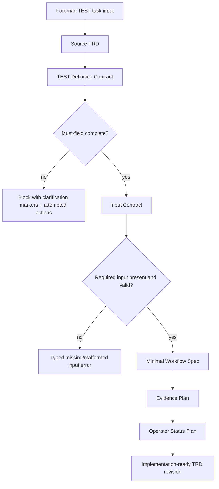
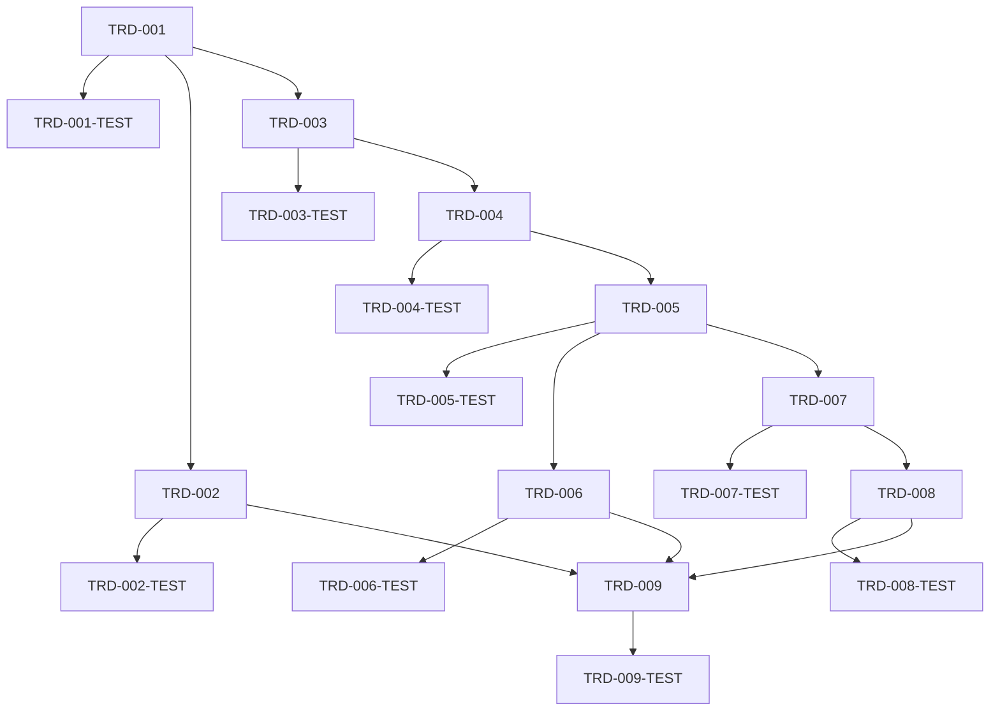

# TRD: TEST

## Metadata

| Field | Value |
|---|---|
| Document ID | TRD-2026-814a1118 |
| Label | trd-test |
| PRD Reference | docs/PRD/PRD-2026-814a1118-test.md |
| Version | 1.0.0 |
| Status | Draft |
| Correlation ID | 814a1118 |
| Design Readiness Score | 3.5 (CONCERNS) |

## Source Task

Foreman task title read from `FOREMAN_TASK_TITLE`: **TEST**.

Source PRD subject: **PRD: TEST**. The PRD frontmatter `foreman_task_title` is **TEST**, so the Foreman task subject matches the only permitted source PRD.

This TRD is design only. It does not implement TEST. Because the source PRD still has 17 `[NEEDS CLARIFICATION: ...]` markers and explicitly says it is a refinement agenda, this TRD designs a safe technical path for converting TEST from ambiguous input into an implementation-ready, auditable Foreman capability. It does not guess the final TEST product behavior.

## Requirements Validation

| Check | Result |
|---|---|
| Required sections present | PASS — source PRD includes Problem Statement, Goals, Non-Goals, Requirements, Acceptance Criteria, Dependency Map, and Implementation Readiness Gate |
| REQ-NNN sequential and unique | PASS — PRD REQ-001 … REQ-010, no gaps |
| ACs in Given/When/Then | PASS — 17/17 source ACs use Given/When/Then language |
| Every Must has ≥2 ACs | PASS — 7 Must requirements, each with 2 ACs |
| Constraints and Non-Goals documented | PASS — non-goals, assumptions, and technical constraints exist |
| Open ambiguity markers | CONCERNS — 17 markers remain; implementation must start by resolving or preserving them explicitly |
| PRD readiness score | CONCERNS — 3.5; Foreman mode auto-proceeded and logged this warning |
| TRD task parseability | PASS — all implementation/test tasks use checkbox-prefixed TRD IDs |

## Domain Analysis

**Project type: brownfield.** The repository already contains PRD/TRD workflows, Foreman phase artifacts, docs, CLI/server operator surfaces, and parser conventions. TEST is not yet scoped enough to justify changes in runtime modules.

| Domain | Requirements | Technical concern |
|---|---|---|
| Product-definition gate | REQ-001, REQ-002, REQ-003, REQ-010 | Preserve missing decisions as explicit blockers; never infer from repo recency or nearby documents |
| Foreman boundary contracts | REQ-004, REQ-006 | Normalize known keys at boundaries; reject malformed required input loudly |
| Minimal workflow specification | REQ-005 | Define a smallest end-to-end TEST journey before runtime implementation |
| Evidence and status | REQ-007, REQ-008 | Ensure artifacts, status, blockers, and attempted actions are durable and operator-readable |
| Accessibility and docs | REQ-009, REQ-010 | Plain-text status, no color-only meaning, assumptions visible in PRD/TRD artifacts |

### Existing-Code Inventory

| Surface | Current use | Design implication |
|---|---|---|
| `docs/PRD/PRD-2026-814a1118-test.md` | Source product artifact with unresolved subject | Treat as the authoritative input; do not scan or substitute another PRD |
| `docs/TRD/` | Machine-parsed technical planning artifacts | Save this TRD with the shared micro UUID and checkbox task lines |
| Foreman dispatch env | Provides `FOREMAN_TASK_TITLE`, `FOREMAN_TASK_DESCRIPTION`, `FOREMAN_SOURCE_PRD_PATH`, and optional artifact path | Enforce exact subject/path contracts in future automation |
| Ensemble PRD/TRD validators | Parse REQ/AC/task lines and readiness metadata | Use parser-compatible IDs and traceability annotations |
| Foreman operator surfaces | CLI/API/log/artifact outputs vary by workflow | Do not pick a final status surface until TEST scope is clarified |

## Reused Capabilities

`trd-graph-cli capabilities docs/TRD --json` returned `{"capabilities":[]}` and `trd-graph-cli overlap docs/TRD --json` returned `{"overlaps":[]}`. No foundational TRD capability is available for deduplication.

Existing repo mechanisms should be reused rather than rebuilt:

| Reused mechanism | Provider | Used by |
|---|---|---|
| PRD/TRD frontmatter correlation ID | Ensemble document conventions | REQ-001, REQ-010 |
| Checkbox-prefixed TRD task parser | `trd-cli.js` | REQ-007, REQ-010 |
| Foreman artifact contract | Foreman workflow dispatch | REQ-007, REQ-008 |
| Loud-failure boundary guidance | `AGENTS.md` typed-boundary rules | REQ-004, REQ-006 |

## Architecture Decision

**Selected in Foreman mode: Option C — clarification-first TEST readiness design.**

TEST proceeds through a technical readiness boundary before runtime implementation. The first deliverable is an explicit TEST Definition Contract that names objective, roles, inputs, success metrics, evidence, and status surfaces. Runtime work remains blocked until that contract is complete. Where the source PRD is ambiguous, the design records blockers and required decisions instead of creating speculative modules, commands, database tables, or UI.

### Alternatives Considered

| Option | Approach | Pros | Cons | Decision |
|---|---|---|---|---|
| A — implement a generic TEST command | Add a minimal CLI/server command named TEST and fill behavior later | Fastest visible change | Violates PRD warnings; would guess user intent and likely create false-positive success | Rejected |
| B — build a configurable validation framework | Create reusable engine for arbitrary validation exercises | Could support future unknown TEST shapes | Overbuilt for an undefined subject; high risk of unused architecture | Rejected |
| **C — clarification-first readiness design** | Treat TEST as an auditable definition workflow until objective, roles, metrics, and surfaces are known | Preserves Foreman contracts, avoids invented behavior, creates implementable next-step tasks | Does not deliver final TEST runtime behavior yet | **Selected** |

### Key Technical Decisions

1. The source PRD remains the only source of product truth for TEST until refined.
2. Runtime behavior for TEST is explicitly out of scope until REQ-001 through REQ-003 are resolved.
3. A TEST Definition Contract will be the handoff artifact from product refinement to implementation.
4. Required TEST inputs must be enumerated and validated before any worker/CLI/server path runs.
5. Optional inputs may only use documented defaults.
6. Evidence must include source subject, input summary, final status, blockers, and attempted actions.
7. Status output must be plain-text readable and not color-only.
8. Any future code change must update operator documentation named by `AGENTS.md` if behavior changes.

## System Architecture Design

### Components

| Component | Responsibility | Design |
|---|---|---|
| TEST Definition Contract | Product/technical handoff schema | Markdown/YAML section in PRD/TRD or successor artifact containing objective, users, success metrics, inputs, workflow, evidence, status surfaces, assumptions |
| Scope Validator | Readiness gate before implementation | Fails when required contract fields remain missing or `[NEEDS CLARIFICATION]` markers cover Must requirements |
| Input Contract | Boundary schema | Lists required and optional TEST inputs, allowed defaults, malformed-input errors, and owner for each field |
| Minimal Workflow Spec | User journey definition | Describes trigger, prerequisites, happy path, edge cases, terminal success/failure states |
| Evidence Plan | Audit record design | Defines durable fields and where operators retrieve them; no final storage chosen until surface is clarified |
| Operator Status Plan | Display design | Maps running/blocked/success/failure to CLI/API/cockpit/log outputs once target surface is chosen |
| Accessibility Checklist | Output constraints | Requires non-color status labels, plain-text summaries, and screen-reader-safe wording |

### Data Flow



### Interfaces and Data Contracts

#### TEST Definition Contract

```yaml
test_definition:
  objective: string              # required
  primary_users: [string]        # required
  affected_roles: [string]       # required
  success_metrics:
    - name: string               # required
      threshold: string          # required
      measurement_source: string # required
  workflow:
    trigger: string              # required
    prerequisites: [string]
    happy_path: [string]         # required
    edge_cases: [string]
  inputs:
    required: [string]
    optional_defaults: object
  evidence:
    storage_surface: string      # required before implementation
    fields: [string]
  status_surfaces: [string]      # e.g. CLI, API, cockpit, logs
  open_questions: [string]
```

#### Scope Validator Result

```elixir
{:ok, %TestDefinition{}}
{:error, {:missing_required_fields, [field :: atom()]}}
{:error, {:unresolved_clarifications, [marker :: String.t()]}}
```

Result handling must be total. Unknown result variants should raise during development/tests instead of being rendered as success.

### Error Handling

| Error | Required behavior |
|---|---|
| Missing objective/users/metrics | Block implementation and list missing fields |
| Unknown required input | Fail with field name and remediation owner |
| Malformed optional input | Reject or use only documented default; never infer product intent |
| Evidence surface unknown | Block runtime implementation of auditability tasks |
| Status surface unknown | Produce a TRD concern and require follow-up before UI/API work |

### MCP Enhancement

MCP enhancement: skipped (no MCP tools detected).

## Master Task List

### PR 1: TEST definition contract and readiness boundary
**Shippable State:** Operators and maintainers can read the TEST definition contract and see exactly which product decisions block implementation.

- [ ] **TRD-001** (3h) Draft the TEST Definition Contract template with objective, users, affected roles, success metrics, workflow, inputs, evidence, status surfaces, and open questions. [satisfies REQ-001, REQ-002, REQ-003, REQ-010]
  - Validates PRD ACs: AC-001-1, AC-001-2, AC-002-1, AC-002-2, AC-003-1, AC-010-1
  - Implementation AC:
    - Given the contract is opened, when required fields are reviewed, then each field has an owner, purpose, and completion rule.
    - Given a product question remains unresolved, when the contract is reviewed, then it appears as an explicit open question.

- [ ] **TRD-001-TEST** (2h) Add document-validation checks for the TEST Definition Contract completeness rules. [verifies TRD-001] [satisfies REQ-001, REQ-002, REQ-003, REQ-010] [depends: TRD-001]
  - Validates PRD ACs: AC-001-1, AC-002-1, AC-003-1, AC-010-1
  - Implementation AC:
    - Given the contract lacks an objective, when validation runs, then it reports objective as missing.
    - Given all required fields are present, when validation runs, then it reports the contract as complete.

- [ ] **TRD-002** (2h) Define the Scope Validator behavior that blocks implementation while Must-level clarification markers remain unresolved. [satisfies REQ-001, REQ-004, REQ-006, REQ-010] [depends: TRD-001]
  - Validates PRD ACs: AC-001-1, AC-004-1, AC-006-1, AC-010-1
  - Implementation AC:
    - Given Must-level clarification markers remain, when readiness is checked, then implementation is blocked with the marker list.
    - Given no Must-level blockers remain, when readiness is checked, then the validator returns an explicit ok result.

- [ ] **TRD-002-TEST** (2h) Verify Scope Validator pass/block outcomes for unresolved and resolved TEST definitions. [verifies TRD-002] [satisfies REQ-001, REQ-004, REQ-006, REQ-010] [depends: TRD-002]
  - Validates PRD ACs: AC-001-1, AC-004-1, AC-006-1, AC-010-1
  - Implementation AC:
    - Given unresolved markers exist, when tests execute, then they assert a blocking result, not success.
    - Given markers are resolved, when tests execute, then they assert the ok path and no inferred defaults.

- [ ] **TRD-003** (2h) Record the TEST role model, including primary users, affected roles, excluded roles, and role-specific desired outcomes. [satisfies REQ-002] [depends: TRD-001]
  - Validates PRD ACs: AC-002-1, AC-002-2
  - Implementation AC:
    - Given a primary role is listed, when the contract is reviewed, then its pain and desired outcome are documented.
    - Given a role is excluded, when the contract is reviewed, then the exclusion reason is visible.

- [ ] **TRD-003-TEST** (1h) Validate that role entries include pain, outcome, and exclusion fields where applicable. [verifies TRD-003] [satisfies REQ-002] [depends: TRD-003]
  - Validates PRD ACs: AC-002-1, AC-002-2
  - Implementation AC:
    - Given a role lacks an outcome, when validation runs, then that role fails validation.
    - Given excluded roles have reasons, when validation runs, then exclusions pass.

### PR 2: TEST workflow, input contracts, and boundary failures
**Shippable State:** Operators can inspect the proposed minimal TEST journey and see how valid, missing, and malformed inputs will behave before code is written.

- [ ] **TRD-004** (3h) Specify the minimal TEST workflow with trigger, prerequisites, happy path, edge cases, terminal success state, and terminal failure states. [satisfies REQ-005, REQ-006] [depends: TRD-001, TRD-003]
  - Validates PRD ACs: AC-005-1, AC-005-2, AC-006-1, AC-006-2
  - Implementation AC:
    - Given a valid TEST scenario, when the workflow spec is followed, then the expected user-visible result is defined.
    - Given a prerequisite is missing, when the workflow spec is followed, then a remediation message is defined.

- [ ] **TRD-004-TEST** (2h) Verify workflow-spec coverage for happy path, missing prerequisite, and failure cases. [verifies TRD-004] [satisfies REQ-005, REQ-006] [depends: TRD-004]
  - Validates PRD ACs: AC-005-1, AC-005-2, AC-006-1
  - Implementation AC:
    - Given the workflow lacks a terminal success state, when validation runs, then it fails.
    - Given a prerequisite lacks remediation text, when validation runs, then it fails.

- [ ] **TRD-005** (3h) Define the TEST Input Contract with required fields, optional defaults, malformed-value errors, and normalization rules. [satisfies REQ-004, REQ-006] [depends: TRD-004]
  - Validates PRD ACs: AC-004-1, AC-004-2, AC-006-1, AC-006-2
  - Implementation AC:
    - Given required input is absent, when input is evaluated, then the missing field is named.
    - Given an optional input is absent, when input is evaluated, then only documented defaults are applied.

- [ ] **TRD-005-TEST** (2h) Verify input-contract handling for valid input, missing required input, malformed values, unknown keys, and optional defaults. [verifies TRD-005] [satisfies REQ-004, REQ-006] [depends: TRD-005]
  - Validates PRD ACs: AC-004-1, AC-004-2, AC-006-1, AC-006-2
  - Implementation AC:
    - Given an unknown key is supplied, when validation runs, then it is ignored or rejected per documented policy without altering behavior.
    - Given a malformed required value is supplied, when validation runs, then success is not reported.

- [ ] **TRD-006** (2h) Document Foreman boundary constraints for TEST, including subject matching, no fallback PRD selection, typed results, and total error handling. [satisfies REQ-004, REQ-006, REQ-010] [depends: TRD-005]
  - Validates PRD ACs: AC-004-1, AC-004-2, AC-006-1, AC-010-1
  - Implementation AC:
    - Given a source subject mismatch occurs, when TEST planning starts, then execution halts with both subjects quoted.
    - Given an unknown result variant occurs, when rendering status, then it fails loudly rather than returning success.

- [ ] **TRD-006-TEST** (2h) Verify Foreman boundary-failure scenarios and result handling are total. [verifies TRD-006] [satisfies REQ-004, REQ-006] [depends: TRD-006]
  - Validates PRD ACs: AC-004-1, AC-004-2, AC-006-1
  - Implementation AC:
    - Given a missing source PRD path, when the boundary check runs, then no directory scan fallback occurs.
    - Given an unsupported result variant, when tests render it, then the test expects a loud failure.

### PR 3: Evidence, status, accessibility, and handoff readiness
**Shippable State:** Operators can review durable TEST planning evidence, terminal status semantics, and accessibility-safe output rules for the approved TEST workflow.

- [ ] **TRD-007** (3h) Design the TEST Evidence Plan with input summary, run/action identity, final status, blocker, attempted actions, and retrieval surface. [satisfies REQ-003, REQ-007] [depends: TRD-004, TRD-005]
  - Validates PRD ACs: AC-003-1, AC-003-2, AC-007-1, AC-007-2
  - Implementation AC:
    - Given TEST produces an outcome, when evidence is reviewed later, then input summary and final status are available.
    - Given TEST blocks, when evidence is reviewed later, then blocker and attempted actions are available.

- [ ] **TRD-007-TEST** (2h) Verify evidence examples cover success, failure, and blocked TEST outcomes. [verifies TRD-007] [satisfies REQ-003, REQ-007] [depends: TRD-007]
  - Validates PRD ACs: AC-003-1, AC-003-2, AC-007-1, AC-007-2
  - Implementation AC:
    - Given a success example, when checked, then it includes the success metric source.
    - Given a blocked example, when checked, then it includes blocker and attempted actions.

- [ ] **TRD-008** (2h) Define operator-visible status states and messages for pending, running, blocked, failed, and succeeded TEST outcomes. [satisfies REQ-008, REQ-009] [depends: TRD-007]
  - Validates PRD ACs: AC-008-1, AC-009-1
  - Implementation AC:
    - Given TEST is blocked, when status is rendered, then the operator sees the current state and next action.
    - Given plain-text output is used, when status is rendered, then color is not required to understand the result.

- [ ] **TRD-008-TEST** (1h) Verify status message examples are actionable and plain-text readable. [verifies TRD-008] [satisfies REQ-008, REQ-009] [depends: TRD-008]
  - Validates PRD ACs: AC-008-1, AC-009-1
  - Implementation AC:
    - Given each terminal status example, when reviewed, then it includes a next action or final outcome.
    - Given output is stripped of color, when reviewed, then status remains understandable.

- [ ] **TRD-009** (2h) Create the implementation-readiness handoff checklist covering resolved objective, users, metrics, input contract, workflow, evidence, status surface, and docs impact. [satisfies REQ-001, REQ-003, REQ-007, REQ-010] [depends: TRD-002, TRD-006, TRD-008]
  - Validates PRD ACs: AC-001-1, AC-003-1, AC-007-1, AC-010-1
  - Implementation AC:
    - Given the checklist is complete, when an implementer reviews it, then no Must-level ambiguity remains.
    - Given behavior changes are proposed, when docs impact is reviewed, then required doc files are listed.

- [ ] **TRD-009-TEST** (2h) Verify the handoff checklist rejects unresolved Must-level ambiguity and missing documentation-impact review. [verifies TRD-009] [satisfies REQ-001, REQ-003, REQ-007, REQ-010] [depends: TRD-009]
  - Validates PRD ACs: AC-001-1, AC-003-1, AC-007-1, AC-010-1
  - Implementation AC:
    - Given a Must-level question remains, when the checklist is evaluated, then handoff readiness fails.
    - Given docs impact is omitted, when the checklist is evaluated, then handoff readiness fails.

## Dependency Graph



Critical path: TRD-001 → TRD-002 → TRD-004 → TRD-005 → TRD-006 → TRD-009. No circular dependencies identified. No task is estimated at 8h or more.

## Sprint Planning

## Sprint 1: Definition and boundary readiness

- PR 1: TEST definition contract and readiness boundary.
- Exit: Must-level product questions are visible with owners and validation rules.

## Sprint 2: Workflow and input behavior

- PR 2: TEST workflow, input contracts, and boundary failures.
- Exit: Valid/missing/malformed input behavior is specified without inferred product intent.

## Sprint 3: Evidence and operator handoff

- PR 3: Evidence, status, accessibility, and handoff readiness.
- Exit: Implementation can begin only after the checklist proves objective, users, metrics, workflow, and surfaces are resolved.

## Acceptance Criteria Traceability

| REQ | Description | Implementation Tasks | Test Tasks |
|---|---|---|---|
| REQ-001 | Define the TEST objective and scope | TRD-001, TRD-002, TRD-009 | TRD-001-TEST, TRD-002-TEST, TRD-009-TEST |
| REQ-002 | Identify TEST users and affected roles | TRD-001, TRD-003 | TRD-001-TEST, TRD-003-TEST |
| REQ-003 | Capture success metrics for TEST | TRD-001, TRD-007, TRD-009 | TRD-001-TEST, TRD-007-TEST, TRD-009-TEST |
| REQ-004 | Respect Foreman product constraints | TRD-002, TRD-005, TRD-006 | TRD-002-TEST, TRD-005-TEST, TRD-006-TEST |
| REQ-005 | Provide a minimal TEST workflow | TRD-004 | TRD-004-TEST |
| REQ-006 | Handle invalid or incomplete TEST input | TRD-002, TRD-004, TRD-005, TRD-006 | TRD-002-TEST, TRD-004-TEST, TRD-005-TEST, TRD-006-TEST |
| REQ-007 | Preserve auditability of TEST outcomes | TRD-007, TRD-009 | TRD-007-TEST, TRD-009-TEST |
| REQ-008 | Provide operator-visible status and errors | TRD-008 | TRD-008-TEST |
| REQ-009 | Support accessibility and usability expectations | TRD-008 | TRD-008-TEST |
| REQ-010 | Document assumptions and open questions | TRD-001, TRD-002, TRD-006, TRD-009 | TRD-001-TEST, TRD-002-TEST, TRD-009-TEST |

Traceability check: 10 requirements covered, 0 uncovered, 0 orphaned annotations.

## Adversarial Review

### Architecture Self-Critique

| Issue | Impact | Recommended resolution |
|---|---|---|
| TEST runtime surface is undefined | Any CLI/API/server design would be speculative | Keep runtime module selection blocked until the Definition Contract names the surface |
| Evidence storage location is unknown | Auditability cannot be implemented with confidence | Require evidence storage/retrieval surface in the Definition Contract before code tasks are added |
| Success metrics are placeholders | Tests could verify formatting but not real business value | Require named metric, threshold, and measurement source before final implementation TRD revision |

### Task Coverage Analysis

| Issue | Impact | Recommended resolution |
|---|---|---|
| Source PRD contains 17 clarification markers | TRD cannot safely define final runtime behavior | Task scope is limited to readiness, contracts, and handoff checks |
| PRD itself recommends not creating a TRD yet | Design confidence remains below PASS | Treat this TRD as a concerns-band bridge artifact, not implementation authorization |
| No foundational capability exists | No cross-TRD dedup dependency can be used | Reuse repo conventions directly and avoid new generalized frameworks |

Task parser self-check passed with `trd-cli.js parse`: all intended TRD task lines are visible because each begins with `- [ ] **TRD-...**`.

### Dependency and Estimate Review

| Issue | Impact | Recommended resolution |
|---|---|---|
| Dependency chain reaches depth 5 | Later handoff checklist depends on multiple earlier definitions | Keep tasks small and doc/validation-focused; do not add runtime build tasks in this TRD |
| Estimates rely on documentation/validation scope | If stakeholders expand TEST, estimates become stale | Re-run TRD refinement after REQ-001 through REQ-003 are resolved |

### Testability Review

| Issue | Impact | Recommended resolution |
|---|---|---|
| Several tests validate artifact completeness, not runtime behavior | This is appropriate for readiness work but insufficient for final TEST runtime | Add runtime/user tests in a future TRD revision after TEST journey and surfaces are known |
| Evidence and status examples need a final surface | Examples may need rewriting once CLI/API/cockpit/log choice is made | Treat examples as contract tests for content fields, not final renderer tests |

## Design Readiness Gate

| Dimension | Score | Notes |
|---|---:|---|
| Architecture completeness | 3 | Readiness components and contracts are defined; final TEST runtime architecture remains blocked by PRD ambiguity |
| Task coverage | 4 | Every PRD REQ has implementation and test task coverage, but coverage is definition-focused |
| Dependency clarity | 4 | Dependencies are explicit and acyclic; critical path is visible |
| Estimate confidence | 3 | Estimates are reasonable for contract/readiness work but not for final TEST runtime implementation |
| Overall | 3.5 | CONCERNS |

Design Readiness Gate: **CONCERNS**. Foreman mode auto-proceeded to output. This TRD should not be treated as authorization to implement final TEST runtime behavior until the source PRD ambiguity is resolved.

## Next Steps

1. Resolve the 17 `[NEEDS CLARIFICATION: ...]` markers in `docs/PRD/PRD-2026-814a1118-test.md`.
2. Re-run `/ensemble-refine-prd docs/PRD/PRD-2026-814a1118-test.md`.
3. Re-run `/ensemble-create-trd docs/PRD/PRD-2026-814a1118-test.md` after the PRD reaches PASS.
4. Only then run `/ensemble-implement-trd-beads docs/TRD/TRD-2026-814a1118-test.md` if implementation is explicitly approved.
