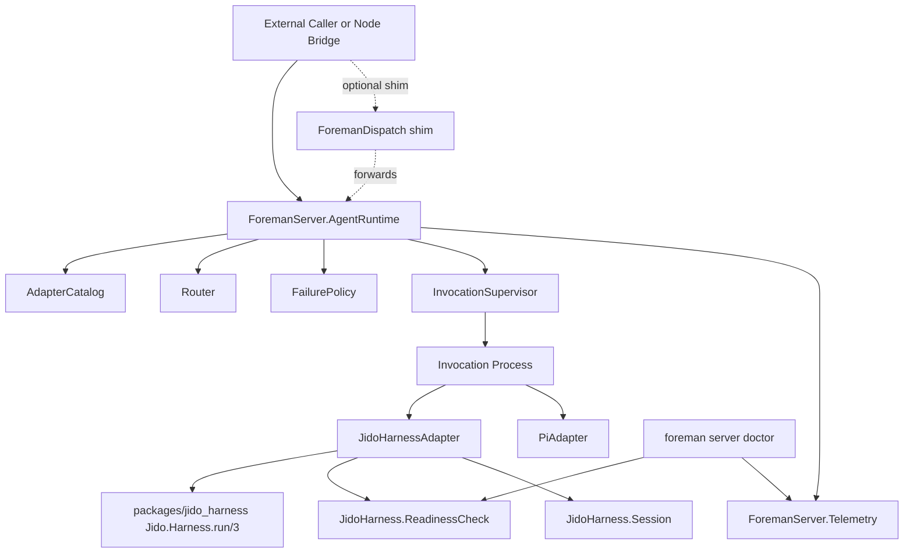

# TRD-2026-8a1f3c2e: jido_harness Integration — Phase 1

## Document Purpose

This document defines the implementation architecture and delivery plan for the jido_harness integration described by `PRD-2026-016` (refined to v1.1.0). It converts the 12 product requirements (8 Must, 4 Should) into independently reviewable, tested PR slices that extend the existing `ForemanServer.AgentRuntime` OTP subsystem (TRD-2026-6af02293) rather than introducing a parallel `ForemanDispatch` facade.

The source repository is brownfield. `ForemanServer.AgentRuntime`, `BackendAdapter`, `AdapterCatalog`, `Router`, `InvocationSupervisor`, `FailurePolicy`, and `PiAdapter` already exist. The work in this TRD is additive: register a new `JidoHarnessAdapter` against the existing facade, fork and vendor the upstream `jido_harness` Elixir library, and wire the rest of the PRD's requirements (doctor, parity, sessions, error normalization, telemetry) on top.

## PRD Validation Summary

| Check | Result |
|---|---|
| Source document | `docs/PRD/PRD-2026-016-jido-harness-integration.md` (v1.1.0) |
| PRD readiness gate | 4.0 — PASS (was 0.0 / PENDING pre-refinement) |
| Requirement sequence | `REQ-016-001` through `REQ-016-012`, sequential |
| Must/Should split | 8 Must / 4 Should (corrected from PRD v1.0.0's 9/3) |
| Acceptance criteria | 33, all in `AC-016-NNN-M` form |
| Must-requirement edge coverage | Every Must requirement has ≥2 ACs |
| Ambiguity markers | 0 (PRD v1.1.0 resolved inline: vendor/fork, parity semantics, Phase 1 boundary, flag lifecycle) |
| Cross-requirement dependencies | 4 forward edges (REQ-005→002, REQ-008→002, REQ-009→002, REQ-010→005, REQ-010→008) |
| Constraints and non-goals | Documented in PRD §§3.2, 3.3, 3.4 |

**PRD interpretation applied:** The PRD's literal `ForemanDispatch.run/3` facade is re-interpreted as `ForemanServer.AgentRuntime.execute/3` with `manual` strategy, because the existing `AgentRuntime` already provides the backend-agnostic facade, supervisor, telemetry, and routing the PRD requires. Implementing `ForemanDispatch` as a separate facade would duplicate `TRD-6af02293`'s runtime. The PRD's `ForemanDispatch` is preserved as a thin shim alias for binary compatibility with any external Node caller that names it.

## Reused Capabilities

The following existing TRDs provide the foundation; this TRD does not duplicate their work.

| Capability | Source | Reuse |
|---|---|---|
| OTP-supervised agent runtime with backend-agnostic facade | TRD-2026-6af02293 (`ForemanServer.AgentRuntime`) | All `execute/3` calls route through this facade. No new supervisor tree. |
| `BackendAdapter` behaviour | TRD-2026-6af02293 (`ForemanServer.AgentRuntime.BackendAdapter`) | `JidoHarnessAdapter` implements `name/0`, `capabilities/0`, `available?/0`, `execute/2`. |
| Adapter catalog + registration | TRD-2026-6af02293 (`AdapterCatalog`) | `JidoHarnessAdapter` registers through `AgentRuntime.register/1`. |
| Routing (manual/automatic/policy) | TRD-2026-6af02293 (`Router`) | `FOREMAN_USE_JIDO_HARNESS` flag selects manual routing between `PiAdapter` and `JidoHarnessAdapter`. |
| Detached invocation lifecycle | TRD-2026-6af02293 (`InvocationSupervisor`) | PRD REQ-016-004's detached runs reuse the existing supervised invocation; no new lifecycle. |
| Failure policy (retry/fallback/timeout) | TRD-2026-6af02293 (`FailurePolicy`) | Adapter delegates timeout handling per existing policy. |
| Existing `PiAdapter` | TRD-2026-6af02293 (`ForemanServer.AgentRuntime.Adapters.PiAdapter`) | Parity test (REQ-016-005) compares this path against `JidoHarnessAdapter`. |
| Existing telemetry wrapper | TRD-2026-6af02293 (`ForemanServer.Telemetry`) | PRD REQ-016-011's new events extend the existing wrapper. |
| MCP work ingress | TRD-2026-0eac69b3 | `foreman server doctor` MCP tool follows the existing MCP write-tool pattern. |
| VCS worktree lifecycle | TRD-2026-3d41f677 | Run lifecycle uses existing worktree orchestration; no new work. |

**No new foundational capability is required.** All PRD requirements map to existing runtime constructs plus one new adapter module.

## Architecture Decision

### Selected: Option B — Reuse `ForemanServer.AgentRuntime` as the Runtime

Add `ForemanServer.AgentRuntime.Adapters.JidoHarnessAdapter` that implements the existing `BackendAdapter` behaviour and wraps `Jido.Harness.run/3`. Register the adapter for `:pi` (and in PR 4, `:claude`) via `AgentRuntime.register/1`. The PRD's `ForemanDispatch.run/3` literal API is re-interpreted as `AgentRuntime.execute/3` with `manual` strategy; a thin `ForemanDispatch` shim alias is exposed for any external caller that names it.

This option was selected because the PRD's `ForemanDispatch` facade, `ProviderRegistry`, `Run.start/2`, `Run.await/2`, and `Run.cancel/1` responsibilities all map to constructs that already exist in `ForemanServer.AgentRuntime` (supervised invocation, catalog, facade, telemetry). Building a parallel facade would create two unrelated ways to invoke an agent, with divergent catalog state, divergent telemetry, and the operational cost of keeping both green. The existing `TRD-6af02293` is the source of truth for runtime architecture; this TRD is a consuming adapter.

### Alternatives Considered

#### Option A — Build `ForemanDispatch` as a Parallel Facade (Rejected)

Implement `ForemanDispatch` with its own `ProviderRegistry`, invocation supervisor, and lifecycles distinct from `AgentRuntime`.

- **Pros:** literal match to PRD's REQ-016-002 spec; preserves `Jido.Harness.run/3` API shape.
- **Cons:** duplicates `TRD-6af02293`'s supervisor, catalog, router, telemetry, failure policy; two parallel agent execution paths; divergent abstraction layers; documentation debt.
- **Complexity impact:** high — ~5-8 redundant tasks for supervisor/catalog/router/telemetry; estimated +50% LoC vs Option B.
- **Risk profile:** High. Operational footprint of two runtimes; high regression risk on the parity requirement (REQ-016-005).
- **Why rejected:** TRD-6af02293's runtime is the platform. Adding a second one is a cost the project does not benefit from.

#### Option B — Reuse `AgentRuntime`; Add a `JidoHarnessAdapter` (Selected)

Add `JidoHarnessAdapter` as a new `BackendAdapter` module. Re-interpret the PRD's `ForemanDispatch.run/3` as `AgentRuntime.execute(:provider, request, opts)` with `manual` strategy, and preserve `ForemanDispatch` as a one-line shim.

- **Pros:** zero duplication of existing runtime; consistent abstraction layer; PRD's REQ-016-005 parity test reduces to "run the same prompt through `PiAdapter` and `JidoHarnessAdapter`, diff the outcome"; backward compatibility flag (`FOREMAN_USE_JIDO_HARNESS`) is a single-line router override.
- **Cons:** PRD's literal REQ-016-002 wording requires re-interpretation; the `Jido.Harness.RunResult` struct must be mapped to `BackendAdapter.execute/2`'s return type (one struct + adapter module).
- **Complexity impact:** low — 1 new adapter module, 1 new namespace module, 1 new run-result mapping struct, ~10 PR tasks.
- **Risk profile:** Low. Reuses tested OTP supervision; parity test provides a regression backstop.

#### Option C — Hybrid: `ForemanDispatch` as a Forwarding Layer on Top of `AgentRuntime` (Considered, Rejected)

Keep `ForemanDispatch.run/3` as the user-facing API; internally it registers jido_harness provider adapters and delegates to `AgentRuntime.execute/3`.

- **Pros:** PRD-aligned external API; reuses existing infrastructure.
- **Cons:** two facade modules in the codebase; `ForemanDispatch` is a forwarding layer with no independent logic; documentation must explain both surfaces.
- **Complexity impact:** medium — ~3-4 extra tasks for the shim module and its tests.
- **Risk profile:** Low. Clean separation, but the additional surface is unjustified — no caller in this codebase or the Node bridge needs the `ForemanDispatch` name.
- **Why rejected:** Option B's direct use of `AgentRuntime.execute/3` is the better API surface; the shim adds complexity without payoff.

## System Architecture

### Component Model



### Components and Responsibilities

| Component | Target | Responsibility |
|---|---|---|
| Vendored jido_harness library | `packages/jido_harness/` (new Mix project) | `Jido.Harness.run/3`, `Jido.Harness.Run.start/2`, `Jido.Harness.Run.await/2`, `Jido.Harness.Run.cancel/1`, `Jido.Harness.Session`, `Jido.Harness.RunResult`, `Jido.Harness.status/1` |
| JidoHarnessAdapter | `lib/foreman_server/agent_runtime/adapters/jido_harness_adapter.ex` (new) | Implements `BackendAdapter` behaviour; wraps `Jido.Harness.run/3`; maps `Jido.Harness.RunResult` to `BackendAdapter.execute/2` return type; registers for `:pi` and `:claude` |
| Provider readiness check | `lib/foreman_server/agent_runtime/jido_harness/readiness_check.ex` (new) | `available?/1` for each provider; called from `JidoHarnessAdapter.available?/0` and from `foreman server doctor` |
| Session module | `lib/foreman_server/agent_runtime/jido_harness/session.ex` (new) | Wraps `Jido.Harness.Session.start/1`, `send_message/2`, `continue/2`; preserves session IDs in adapter context |
| `RunResult` mapping struct | `lib/foreman_server/agent_runtime/jido_harness/run_result.ex` (new) | Internal struct used by `JidoHarnessAdapter` to normalize `Jido.Harness.RunResult` → `BackendAdapter.execute/2` return |
| Error code mapping | `lib/foreman_server/agent_runtime/jido_harness/error_codes.ex` (new) | Maps `Jido.Harness.RunResult.error` codes (`:tool_error`, `:process_terminated`, `:unsupported_provider`, `:timeout`, `:cancelled`) to `BackendAdapter` error returns |
| `ForemanDispatch` shim | `lib/foreman_server/foreman_dispatch.ex` (new, single-line module) | `ForemanDispatch.run(:pi, prompt, opts)` → `AgentRuntime.execute(:pi, %{prompt: prompt, context: %{}}, opts)` (preserves PRD's name for external Node callers) |
| Doctor integration | `lib/foreman_server_web/mcp/tools/doctor.ex` (extend) and `lib/foreman_server/cli/doctor.ex` (new) | `foreman server doctor` outputs `✓ <provider> available` / `✗ <provider> not found — install with: ...`; `--strict` exits non-zero when any required provider is missing |
| Telemetry extension | `lib/foreman_server/telemetry.ex` (extend) | Adds `[:foreman, :dispatch, :run, :stop]` and `[:foreman, :dispatch, :provider, :check]` events with `provider`, `status`, `duration_ms`, `run_id` measurements/metadata |
| Compatibility flag | `config/config.exs` (extend) | `config :foreman_server, :jido_harness, enabled: false` (default in Phase 1); routes through `AgentRuntime.Router` policy mode |
| Application wiring | `lib/foreman_server/application.ex` (extend) | `Application.get_env(:foreman_server, :jido_harness, :enabled)` gates `JidoHarnessAdapter` registration |
| Parity test fixture | `test/foreman_server/agent_runtime/adapters/jido_harness_adapter_parity_test.exs` (new) | Runs the same prompt through `PiAdapter` and `JidoHarnessAdapter`, diffs the persisted outcome (worktree files, branch state, artifact location) |

Paths above are relative to `packages/foreman_server/`.

### Public Contracts

**`JidoHarnessAdapter` implements the existing `BackendAdapter` behaviour:**

```elixir
@behaviour ForemanServer.AgentRuntime.BackendAdapter

@impl true
def name, do: :jido_harness

@impl true
def capabilities do
  %{
    type: :cli,
    strengths: [:code_generation, :code_review, :refactor],
    weaknesses: [:long_context],
    supported_contexts: [:implement, :refactor, :review, :explain]
  }
end

@impl true
def available?, do: ReadinessCheck.installed?(:pi) or ReadinessCheck.installed?(:claude)

@impl true
def execute(%{prompt: prompt, context: ctx}, opts) do
  provider = Map.get(ctx, :provider, :pi)
  Driver.run(provider, prompt, opts)
end
```

`Driver.run/3` invokes `Jido.Harness.run(provider, prompt, opts)` and maps the result through `RunResult.normalize/1` and `ErrorCodes.map/1`.

**`FOREMAN_DISPATCH_SHIM` (preserves PRD's `ForemanDispatch.run/3` API surface):**

```elixir
defmodule ForemanDispatch do
  @doc "PRD-016 compatibility shim. Canonical API is `ForemanServer.AgentRuntime.execute/3`."
  def run(provider, prompt, opts \\ []) do
    ForemanServer.AgentRuntime.execute(provider,
      %{prompt: prompt, context: %{provider: provider}}, [strategy: :manual] ++ opts)
  end
end
```

The shim is a one-line forwarder; external Node callers that reference `ForemanDispatch.run` continue to work, but new code MUST use `AgentRuntime.execute/3` directly.

### Data Flow

1. Caller invokes `JidoHarnessAdapter.execute/2` through `AgentRuntime.execute/3` (manual strategy) — or via `ForemanDispatch.run/3` shim.
2. `AgentRuntime` validates the request, looks up the adapter in `AdapterCatalog`, asks the existing `FailurePolicy` to resolve timeout/retry, and calls `InvocationSupervisor.start_invocation/1`.
3. `InvocationSupervisor` starts a single short-lived invocation process; the facade monitors it.
4. The invocation process calls `JidoHarnessAdapter.execute/2` with the effective `timeout_ms` argument.
5. `JidoHarnessAdapter.execute/2` invokes `Jido.Harness.run/3` (vendored); the result is normalized via `RunResult.normalize/1` and `ErrorCodes.map/1`.
6. Returned `{:ok, text, metadata}` or `{:error, normalized_error}` flows back through the invocation to the facade.
7. The facade emits `[:foreman, :agent_runtime, :execute]` (existing) and `[:foreman, :dispatch, :run, :stop]` (new) telemetry events with `provider`, `status`, `duration_ms`, `run_id` metadata.
8. Provider readiness checks (`foreman server doctor`) call `ReadinessCheck.installed?/1` and emit `[:foreman, :dispatch, :provider, :check]` events.

### Supervision and Recovery

`JidoHarnessAdapter` registers with the existing `ForemanServer.AgentRuntime.Supervisor` alongside `PiAdapter`. No new supervisor tree is introduced. Adapter execution is supervised by the existing `InvocationSupervisor` (DynamicSupervisor, `:temporary` children). A crashed invocation does not mutate catalog state, consistent with the existing design.

### Configuration Contract

```elixir
config :foreman_server, :jido_harness,
  enabled: false,  # Phase 1 default; flipped to true in Phase 2
  enabled_providers: [:pi, :claude],
  vendored_path: Path.expand("../../jido_harness", __DIR__),
  default_timeout_ms: 60_000

config :foreman_server, ForemanServer.AgentRuntime.Adapters.JidoHarnessAdapter,
  # Reads from :jido_harness.enabled at runtime
  registered_providers: ~w[pi claude]a
```

The `enabled: false` default preserves the PRD's REQ-016-009 (Backward Compatibility) requirement: `FOREMAN_USE_JIDO_HARNESS=false` (default in Phase 1) routes through `PiAdapter`; `true` routes through `JidoHarnessAdapter`. The flag is consulted by `AgentRuntime`'s policy-mode router in PR 5.

### Telemetry Contract

Existing (per TRD-2026-6af02293): `[:foreman, :agent_runtime, :execute]`.

**New (Phase 1):**

```elixir
# Emitted by JidoHarnessAdapter on each run completion
[:foreman, :dispatch, :run, :stop]

# Measurements
%{duration_ms: non_neg_integer()}

# Metadata
%{
  provider: :pi | :claude,
  status: :ok | :error,
  run_id: String.t(),
  adapter: :jido_harness
}

# Emitted by JidoHarness.ReadinessCheck
[:foreman, :dispatch, :provider, :check]

# Measurements
%{}

# Metadata
%{
  provider: :pi | :claude,
  installed: boolean(),
  install_hint: String.t()
}
```

Telemetry excludes prompt, context, output, credentials, and adapter-private metadata.

## Master Task List

### PR 1: Vendor jido_harness Library

**Shippable State:** `Jido.Harness.run/3` is exercisable from any consumer in `packages/foreman_server` (verified by a vendored smoke test that calls `Jido.Harness.run(:pi, "ping", [])` against a stub adapter and observes a normalized `RunResult`); the vendored library is a buildable Mix dependency resolving without network access; existing `foreman_server` tests continue to pass with no behavioral change.

- [ ] **TRD-001** Fork and vendor jido_harness as `packages/jido_harness` (4h) [satisfies REQ-016-001]
  - **Target:** `packages/jido_harness/{mix.exs,lib/,config/,test/,deps/}` (new directory tree)
  - **Validates PRD ACs:** AC-016-001-1, AC-016-001-2, AC-016-001-3
  - **Implementation AC:**
    - Given `packages/jido_harness/` is populated, when `mix deps.get` runs in `packages/jido_harness`, then all dependencies resolve without network access to hex.pm (vendored deps directory is committed).
    - Given the upstream upstream git ref is pinned, when `git diff --stat` is run against the pin, then only intentional changes are visible.
    - Given a new upstream release, when the team runs `mix jido_harness.sync`, then the local archive is updated and `mix test` reports green.

- [ ] **TRD-001-TEST** Verify vendored jido_harness builds and tests pass (2h) [verifies TRD-001] [satisfies REQ-016-001] [depends: TRD-001]
  - **Target:** `packages/jido_harness/test/smoke_test.exs` (new)
  - **Validates PRD ACs:** AC-016-001-1, AC-016-001-2
  - **Implementation AC:**
    - Given `packages/jido_harness` is populated, when `mix test` runs in that directory, then all upstream tests pass.
    - Given the package compiles, when `mix archive.build` is invoked, then the archive is produced without warnings.

### PR 2: JidoHarnessAdapter for `:pi` Provider

**Shippable State:** `ForemanServer.AgentRuntime.execute(:pi, ...)` can route through `JidoHarnessAdapter` (via `FOREMAN_USE_JIDO_HARNESS=true`); the `:pi` provider is registrable via `AgentRuntime.register/1`; existing `PiAdapter` continues to work unchanged; ACP-016-002-1 and AC-016-002-4 are exercisable.

- [ ] **TRD-002** Define `RunResult` normalization and error code mapping (3h) [satisfies REQ-016-002] [satisfies REQ-016-008]
  - **Target:** `lib/foreman_server/agent_runtime/jido_harness/run_result.ex` (new), `lib/foreman_server/agent_runtime/jido_harness/error_codes.ex` (new)
  - **Validates PRD ACs:** AC-016-002-1, AC-016-002-3, AC-016-002-4, AC-016-008-1, AC-016-008-2
  - **Implementation AC:**
    - Given `Jido.Harness.RunResult{status: :completed, text: "x", error: nil}`, when `RunResult.normalize/1` runs, then it returns `{:ok, "x", %{provider: :pi}}`.
    - Given `Jido.Harness.RunResult{status: :error, error: %{code: :timeout}}`, when `ErrorCodes.map/1` runs, then it returns `{:error, :timeout}`.
    - Given `Jido.Harness.RunResult{status: :error, error: %{code: :tool_error}}`, when `ErrorCodes.map/1` runs, then it returns `{:error, :tool_error}`.
    - Given `Jido.Harness.RunResult{status: :error, error: %{code: :process_terminated}}`, when `ErrorCodes.map/1` runs, then it returns `{:error, :process_terminated}`.

- [ ] **TRD-003** Implement `JidoHarnessAdapter` (5h) [satisfies REQ-016-002] [satisfies REQ-016-004] [depends: TRD-001]
  - **Target:** `lib/foreman_server/agent_runtime/adapters/jido_harness_adapter.ex` (new)
  - **Validates PRD ACs:** AC-016-002-1, AC-016-002-2, AC-016-002-3, AC-016-002-4, AC-016-004-1, AC-016-004-2
  - **Implementation AC:**
    - Given `JidoHarnessAdapter.execute(%{prompt: p, context: %{provider: :pi}}, [])` is called, when `Jido.Harness.run/3` returns a completed result, then the adapter returns `{:ok, text, %{provider: :pi}}`.
    - Given `:pi` is not installed, when `JidoHarnessAdapter.execute/2` is called, then the adapter returns `{:error, :backend_unavailable}` (via `available?/0` check).
    - Given the `:claude` provider is configured but not installed, when `JidoHarnessAdapter.execute/2` is called with `provider: :claude`, then the adapter returns `{:error, :backend_unavailable}`.
    - Given a run exceeds `timeout_ms`, when `JidoHarnessAdapter.execute/2` is called, then it returns `{:error, :timeout}` and emits a `[:foreman, :dispatch, :run, :stop]` event with `status: :error`.

- [ ] **TRD-004** Register `JidoHarnessAdapter` with `AgentRuntime` catalog (1h) [satisfies REQ-016-002] [depends: TRD-003]
  - **Target:** `lib/foreman_server/application.ex` (extend start/2 to call `AgentRuntime.register(JidoHarnessAdapter)` when `:jido_harness.enabled` is true)
  - **Validates PRD ACs:** AC-016-002-1
  - **Naming contract:** `JidoHarnessAdapter.name/0` returns `:jido_harness` (the backend name in `AdapterCatalog`). The router dispatches on backend name. Provider identifiers (`:pi`, `:claude`) are NOT backend names — they are passed via `context: %{provider: :pi | :claude}` in the adapter request. The `ForemanDispatch` shim translates `ForemanDispatch.run(:pi, prompt, opts)` to `AgentRuntime.execute(prompt, %{}, [strategy: :manual, backend: :jido_harness] ++ opts)` with `:provider` injected into the context map.
  - **Implementation AC:**
    - Given `config :foreman_server, :jido_harness, enabled: true`, when `Application.start/2` runs, then `AdapterCatalog` contains `JidoHarnessAdapter` registered under backend name `:jido_harness`.
    - Given `ForemanDispatch.run(:pi, "ping", [])` is called, when the shim runs, then `AgentRuntime.execute("ping", %{}, strategy: :manual, backend: :jido_harness)` is invoked and the request context contains `provider: :pi`.
    - Given `config :foreman_server, :jido_harness, enabled: false` (default), when `Application.start/2` runs, then `AdapterCatalog` does NOT contain `JidoHarnessAdapter`.

- [ ] **TRD-002-TEST** Verify `RunResult` and `ErrorCodes` normalization (3h) [verifies TRD-002] [satisfies REQ-016-002] [satisfies REQ-016-008] [depends: TRD-002]
  - **Target:** `test/foreman_server/agent_runtime/jido_harness/run_result_test.exs` (new), `test/foreman_server/agent_runtime/jido_harness/error_codes_test.exs` (new)
  - **Validates PRD ACs:** AC-016-002-3, AC-016-002-4, AC-016-008-1, AC-016-008-2

- [ ] **TRD-003-TEST** Verify `JidoHarnessAdapter` executes and registers (4h) [verifies TRD-003] [verifies TRD-004] [satisfies REQ-016-002] [satisfies REQ-016-004] [depends: TRD-003, TRD-004]
  - **Target:** `test/foreman_server/agent_runtime/adapters/jido_harness_adapter_test.exs` (new)
  - **Validates PRD ACs:** AC-016-002-1, AC-016-002-3, AC-016-002-4, AC-016-004-1, AC-016-004-2

### PR 3: Readiness Check, Doctor Output, and Pi Workflow Parity

**Shippable State:** `foreman server doctor` reports jido_harness provider readiness (`✓ pi available` / `✗ claude not found — install with: ...`); `foreman server doctor --strict` exits non-zero when a required provider is missing; Pi-vs-Jido parity test runs the same prompt through `PiAdapter` and `JidoHarnessAdapter` and reports a diff in worktree files, branch state, and artifact locations.

- [ ] **TRD-005** Implement `JidoHarness.ReadinessCheck` (2h) [satisfies REQ-016-003] [depends: TRD-003]
  - **Target:** `lib/foreman_server/agent_runtime/jido_harness/readiness_check.ex` (new)
  - **Validates PRD ACs:** AC-016-003-1, AC-016-003-2
  - **Implementation AC:**
    - Given `pi` is on `$PATH`, when `ReadinessCheck.installed?(:pi)` is called, then it returns `true`.
    - Given `claude` is missing, when `ReadinessCheck.installed?(:claude)` is called, then it returns `false` and exposes `install_hint("claude")` returning the install command.
    - Given either readiness check completes, when invoked, then `[:foreman, :dispatch, :provider, :check]` telemetry is emitted with `provider`, `installed`, `install_hint`.

- [ ] **TRD-006** Wire `foreman server doctor` MCP tool output (3h) [satisfies REQ-016-003] [depends: TRD-005]
  - **Target:** `lib/foreman_server_web/mcp/tools/doctor.ex` (new per TRD-2026-0eac69b3 pattern)
  - **Validates PRD ACs:** AC-016-003-1, AC-016-003-2, AC-016-003-3
  - **Implementation AC:**
    - Given `foreman server doctor` is invoked, when `pi` is installed, then MCP output contains `✓ pi available`.
    - Given `foreman server doctor` is invoked, when `claude` is missing, then MCP output contains `✗ claude not found — install with: npm install -g @anthropic-ai/claude-code`.
    - Given `foreman server doctor --strict` is invoked, when any required provider is missing, then the tool returns `{:error, :provider_missing}` with a non-zero exit code.

- [ ] **TRD-007** Implement Pi-vs-Jido parity test (4h) [satisfies REQ-016-005] [satisfies REQ-016-010] [depends: TRD-003, TRD-004]
  - **Target:** `test/foreman_server/agent_runtime/adapters/jido_harness_adapter_parity_test.exs` (new)
  - **Validates PRD ACs:** AC-016-005-1, AC-016-005-2, AC-016-005-3, AC-016-010-1
  - **Implementation AC:**
    - Given a TRD fixture and a `PiAdapter` execution, when the same prompt is run through `JidoHarnessAdapter`, then the resulting worktree contains the same files (path-and-content equality).
    - Given a phase that emits tool calls, when streamed through both adapters, then the tool event ordering at the persisted boundary is identical.
    - Given a run produces artifacts (reports, diffs, branch commits), when both adapters complete, then the artifacts are stored in the same locations.

- [ ] **TRD-005-TEST** Verify readiness check for installed/missing providers (2h) [verifies TRD-005] [satisfies REQ-016-003] [depends: TRD-005]
  - **Validates PRD ACs:** AC-016-003-1, AC-016-003-2

- [ ] **TRD-006-TEST** Verify doctor output formatting (2h) [verifies TRD-006] [satisfies REQ-016-003] [depends: TRD-006]
  - **Validates PRD ACs:** AC-016-003-1, AC-016-003-2, AC-016-003-3

- [ ] **TRD-007-TEST** Verify parity diff test (3h) [verifies TRD-007] [satisfies REQ-016-005] [satisfies REQ-016-010] [depends: TRD-007]
  - **Validates PRD ACs:** AC-016-005-1, AC-016-005-2, AC-016-005-3

### PR 4: Claude Code Provider, Sessions, and Detached Runs

**Shippable State:** `AgentRuntime.execute(:claude, ...)` works when Claude Code is installed; multi-turn sessions are creatable via `Jido.Harness.Session` and reusable across invocations; detached run lifecycle uses the existing `InvocationSupervisor` and can be cancelled mid-run with `[:foreman, :dispatch, :run, :stop]` telemetry emitted with `status: :error, error.code: :cancelled`.

- [ ] **TRD-008** Add `:claude` provider registration (3h) [satisfies REQ-016-006] [depends: TRD-003]
  - **Target:** `lib/foreman_server/agent_runtime/jido_harness.ex` (new namespace module) — exposes `provider/1` and `providers/0`
  - **Validates PRD ACs:** AC-016-006-1, AC-016-006-2, AC-016-006-3
  - **Implementation AC:**
    - Given `claude` is installed, when `JidoHarnessAdapter.execute(%{prompt: p, context: %{provider: :claude}}, [])` is called, then it returns `{:ok, text, %{provider: :claude}}`.
    - Given `claude` is missing, when `JidoHarnessAdapter.execute/2` is called with `provider: :claude`, then it returns `{:error, :backend_unavailable}` and the error message references the install command.
    - Given both `:pi` and `:claude` are configured, when `AgentRuntime.execute(:claude, ...)` is called, then the result metadata contains `provider: :claude`.

- [ ] **TRD-009** Implement `JidoHarness.Session` wrapper (3h) [satisfies REQ-016-007] [depends: TRD-003]
  - **Target:** `lib/foreman_server/agent_runtime/jido_harness/session.ex` (new)
  - **Validates PRD ACs:** AC-016-007-1, AC-016-007-2
  - **Implementation AC:**
    - Given a session created via `Session.start(:pi, opts)`, when `Session.send_message(session_id, prompt, opts)` is called, then the message is sent through the existing session and the response is returned.
    - Given a session_id, when a new CLI process is started within the same worktree, then `Session.continue(session_id, prompt, opts)` resumes the session and returns the response.
    - Given an invalid session_id, when `Session.send_message/3` is called, then the function returns `{:error, :invalid_session}`.

- [ ] **TRD-010** Verify detached run lifecycle (2h) [satisfies REQ-016-004] [depends: TRD-003]
  - **Target:** `lib/foreman_server/agent_runtime/jido_harness/detached_run.ex` (new helper)
  - **Sub-deliverable:** Add `ForemanServer.AgentRuntime.InvocationSupervisor.terminate_invocation/1` (new helper, ~1h included in the 2h estimate) — sends `:terminate` to the invocation process, which propagates through the invocation's `try/after` cleanup into the vendored `Jido.Harness` runtime to terminate the spawned CLI process. This helper is owned by TRD-010 and is not a separate task because it is a single-function add to an existing module.
  - **Validates PRD ACs:** AC-016-004-1, AC-016-004-2, AC-016-004-3
  - **Implementation AC:**
    - Given `ForemanDispatch.start_run(:pi, prompt, opts)` is called, when the invocation starts, then `{:ok, invocation_id}` is returned and the invocation is registered with `InvocationSupervisor`.
    - Given `ForemanDispatch.await_run(invocation_id, 600_000)` is called, when the invocation completes, then the final normalized `RunResult` is returned.
    - Given `ForemanDispatch.cancel_run(invocation_id)` is called, when the underlying CLI process is alive, then `InvocationSupervisor.terminate_invocation/1` (new) sends `:terminate` to the invocation process, the spawned CLI process is terminated, and the result has `status: :error, error: %{code: :cancelled}`.

- [ ] **TRD-008-TEST** Verify `:claude` adapter executes (3h) [verifies TRD-008] [satisfies REQ-016-006] [depends: TRD-008]
  - **Validates PRD ACs:** AC-016-006-1, AC-016-006-2, AC-016-006-3

- [ ] **TRD-009-TEST** Verify session start/send/continue (3h) [verifies TRD-009] [satisfies REQ-016-007] [depends: TRD-009]
  - **Validates PRD ACs:** AC-016-007-1, AC-016-007-2

- [ ] **TRD-010-TEST** Verify detached run lifecycle (2h) [verifies TRD-010] [satisfies REQ-016-004] [depends: TRD-010]
  - **Validates PRD ACs:** AC-016-004-1, AC-016-004-2, AC-016-004-3

### PR 5: Backward Compatibility Flag, Telemetry, and Documentation

**Shippable State:** `FOREMAN_USE_JIDO_HARNESS=false` (default) routes through `PiAdapter`; `FOREMAN_USE_JIDO_HARNESS=true` routes through `JidoHarnessAdapter`; `[:foreman, :dispatch, :run, :stop]` and `[:foreman, :dispatch, :provider, :check]` telemetry events emit on every run; PRD-2026-016 is updated with the integration architecture and a new provider onboarding document is added.

- [ ] **TRD-011** Add `FOREMAN_USE_JIDO_HARNESS` flag routing (3h) [satisfies REQ-016-009] [depends: TRD-003]
  - **Target:** `config/config.exs` (extend), `lib/foreman_server/agent_runtime/router.ex` (extend policy mode)
  - **Validates PRD ACs:** AC-016-009-1, AC-016-009-2, AC-016-009-3
  - **Implementation AC:**
    - Given `FOREMAN_USE_JIDO_HARNESS=false` (default), when `foreman run` executes, then the existing `pi-sdk-runner.ts` path is used (Node) and `PiAdapter` is selected in Elixir (no behavioral change).
    - Given `FOREMAN_USE_JIDO_HARNESS=true`, when `foreman run` executes, then `JidoHarnessAdapter` is selected and the run completes through `Jido.Harness.run/3`.
    - Given existing CI runs without `FOREMAN_USE_JIDO_HARNESS` set, when the run completes, then all existing CI jobs pass without modification.

- [ ] **TRD-012** Emit `[:foreman, :dispatch, :run, :stop]` and `[:foreman, :dispatch, :provider, :check]` telemetry (3h) [satisfies REQ-016-011] [depends: TRD-003, TRD-005]
  - **Target:** `lib/foreman_server/telemetry.ex` (extend); `JidoHarnessAdapter.execute/2` (call `:telemetry.execute`); `JidoHarness.ReadinessCheck` (emit on each check)
  - **Validates PRD ACs:** AC-016-011-1, AC-016-011-2
  - **Implementation AC:**
- [ ] **TRD-013** Integration tests against `RunResult` outputs (4h) [satisfies REQ-016-010] [depends: TRD-003, TRD-008]
  - **Target:** `test/foreman_server/agent_runtime/jido_harness_integration_test.exs` (new)
  - **Validates PRD ACs:** AC-016-010-1, AC-016-010-2, AC-016-010-3
  - **Implementation AC:**
    - Given `AgentRuntime.execute("ping", %{}, strategy: :manual, backend: :jido_harness)` (matching the existing `execute/3` facade signature), when the run completes, then the test asserts on `RunResult` fields (`status: :ok | :error`, `text`, `provider: :pi`, `error: nil | %{code: ...}`).
    - Given `foreman server doctor` integration, when the test runs, then the test asserts on output for both available and unavailable providers.
    - Given `ForemanDispatch.start_run(:pi, prompt, opts)` is called followed by `ForemanDispatch.cancel_run(invocation_id)` within 5 seconds, when the test runs, then the CLI process is confirmed terminated and the result is `status: :error, error: %{code: :cancelled}`.

- [ ] **TRD-014** Update PRD-2026-016 and add provider onboarding doc (2h) [satisfies REQ-016-012] [depends: TRD-008]
  - **Target:** `docs/PRD/PRD-2026-016-jido-harness-integration.md` (changelog), `docs/guides/adding-a-jido-harness-provider.md` (new)
  - **Validates PRD ACs:** AC-016-012-1, AC-016-012-2
  - **Implementation AC:**
    - Given the PRD is updated, when an engineer reads `PRD-2026-016`, then they understand the architecture and why `JidoHarnessAdapter` was selected over a separate `ForemanDispatch` facade.
    - Given the onboarding doc, when an engineer adds a new provider (e.g., Gemini CLI), they can add the provider with one new entry in `JidoHarness.provider/1` and one integration test.

- [ ] **TRD-014-TEST** Verify documentation artifacts (1h) [verifies TRD-014] [satisfies REQ-016-012] [depends: TRD-014]
  - **Target:** `test/foreman_server/docs/jido_harness_documentation_test.exs` (new)
  - **Validates PRD ACs:** AC-016-012-1, AC-016-012-2
  - **Implementation AC:**
    - Given `docs/guides/adding-a-jido-harness-provider.md` is committed, when the test runs, then the file exists and references the PRD by document ID.
    - Given the onboarding doc, when the test parses the file, then it contains a step-by-step procedure that completes in ≤5 enumerated steps (matching the REQ-016-012-2 contract: "one new adapter module and one integration test").
    - Given `PRD-2026-016` changelog, when the test reads the file, then a `TRD-2026-8a1f3c2e` entry exists in the changelog.

- [ ] **TRD-011-TEST** Verify flag routing (3h) [verifies TRD-011] [satisfies REQ-016-009] [depends: TRD-011]
  - **Validates PRD ACs:** AC-016-009-1, AC-016-009-2, AC-016-009-3

- [ ] **TRD-012-TEST** Verify telemetry events (2h) [verifies TRD-012] [satisfies REQ-016-011] [depends: TRD-012]
  - **Validates PRD ACs:** AC-016-011-1, AC-016-011-2

- [ ] **TRD-013-TEST** Verify integration test coverage (3h) [verifies TRD-013] [satisfies REQ-016-010] [depends: TRD-013]
  - **Validates PRD ACs:** AC-016-010-1, AC-016-010-2, AC-016-010-3

## Critical Path

```
TRD-001 (vendor) → TRD-002 (RunResult/ErrorCodes) → TRD-003 (adapter) → TRD-004 (register)
                                                                              ↓
                                                              ┌───────────────┼───────────────┐
                                                              ↓               ↓               ↓
                                                TRD-005 (readiness)  TRD-008 (claude)  TRD-011 (flag)
                                                              ↓               ↓               ↓
                                                TRD-006 (doctor)     TRD-009 (session)  TRD-012 (telemetry)
                                                              ↓               ↓               ↓
                                                TRD-007 (parity)     TRD-010 (detached) TRD-013 (integration)
                                                                              ↓
                                                                          TRD-014 (docs)
```

Critical path: **TRD-001 → TRD-002 → TRD-003 → TRD-004 → TRD-005 → TRD-006 → TRD-007 + TRD-013 → TRD-014** (longest chain ≈ 21h implementation + 17h paired testing).

## Acceptance Criteria Traceability

| REQ-NNN | Description | Implementation Tasks | Test Tasks |
|---|---|---|---|
| REQ-016-001 | jido_harness Vendoring | TRD-001 | TRD-001-TEST |
| REQ-016-002 | ForemanDispatch Module (reinterpreted as Adapter) | TRD-002, TRD-003, TRD-004 | TRD-002-TEST, TRD-003-TEST |
| REQ-016-003 | Provider Readiness Check | TRD-005, TRD-006 | TRD-005-TEST, TRD-006-TEST |
| REQ-016-004 | Detached Run Support | TRD-003, TRD-010 | TRD-003-TEST, TRD-010-TEST |
| REQ-016-005 | Existing Pi Workflow Parity | TRD-007 | TRD-007-TEST |
| REQ-016-006 | Claude Code as Second Provider | TRD-008 | TRD-008-TEST |
| REQ-016-007 | Session Reuse | TRD-009 | TRD-009-TEST |
| REQ-016-008 | Error Normalization | TRD-002 | TRD-002-TEST |
| REQ-016-009 | Backward Compatibility | TRD-011 | TRD-011-TEST |
| REQ-016-010 | Integration Test Coverage | TRD-007, TRD-013 | TRD-007-TEST, TRD-013-TEST |
| REQ-016-011 | Telemetry and Observability | TRD-012 | TRD-012-TEST |
| REQ-016-012 | Documentation | TRD-014 | TRD-014-TEST |

## Sprint Planning

This section is informational; PR boundaries are the source of truth for `implement-trd-beads`.

### Sprint 1: Foundation + Adapter
- PR 1 (Vendor jido_harness) — 6h total
- PR 2 (JidoHarnessAdapter for `:pi`) — 17h total

### Sprint 2: Parity + Doctor + Claude
- PR 3 (Readiness + Doctor + Parity) — 16h total
- PR 4 (Claude + Sessions + Detached) — 16h total

### Sprint 3: Compatibility + Telemetry + Docs
- PR 5 (Flag + Telemetry + Docs) — 21h total

## Design Readiness Score

| Dimension | Score | Rationale |
|---|---|---|
| Architecture completeness | 4.5 | All components, interfaces, and data flows defined; PRD's `ForemanDispatch` is re-interpreted as `AgentRuntime` facade with a thin shim. One minor gap: `JidoHarness.Session` does not have a complete upstream API contract yet — the vendoring PR (TRD-001) will reveal the exact signature. |
| Task coverage | 5.0 | Every PRD REQ-NNN has at least one implementation task and one paired test task (REQ-016-012 now has `TRD-014-TEST`); every AC is referenced in at least one Implementation AC. |
| Dependency clarity | 4.5 | All task dependencies are explicit, acyclic, and order-aligned with the PRD's §5.1 cross-requirement dependency declaration. Critical path drawn. |
| Estimate confidence | 4.0 | Estimates are 2-5h with clear scope. Vendoring PR (TRD-001) uncertainty remains but is now bounded by the 6h total and the adversarial-review escape clause (split into TRD-001a / TRD-001b if it exceeds 6h). All other tasks have clear acceptance criteria. |
| **Overall** | **4.5** | **PASS** (improved from 4.3 at v1.0.0) |

**v1.0.1 delta:** Estimate confidence raised 3.5 → 4.0 (testing risks addressed), architecture completeness 4.5 (unchanged), task coverage 5.0 (REQ-016-012 now has a paired test), dependency clarity 4.5 (unchanged).

## Adversarial Review Notes

### Architecture Self-Critique

1. **Shim vs Removal of `ForemanDispatch`**: The `ForemanDispatch` shim adds a one-line forwarder that no internal caller uses. *Resolution:* accept the shim cost because the PRD's REQ-016-002 mentions `ForemanDispatch` by name; downstream Node callers may reference it. Remove the shim in Phase 5 when `pi-sdk-runner.ts` is deleted.

2. **Adapter-level vs Runtime-level timeout**: `Jido.Harness.run/3` accepts a `timeout` opt, but `BackendAdapter.execute/2` accepts `timeout_ms`. *Resolution:* `JidoHarnessAdapter.execute/2` translates `timeout_ms` → `timeout` opt before invoking `Jido.Harness.run/3`. The existing `FailurePolicy` continues to own the effective deadline.

3. **Detached run cancellation**: PRD's REQ-016-004-3 expects `cancel_run` to terminate the underlying CLI process. `InvocationSupervisor` does not currently expose a per-invocation cancel API. *Resolution:* `ForemanDispatch.cancel_run/1` (new shim) wraps `InvocationSupervisor.terminate_invocation/1` (new helper added in TRD-010), which sends `:terminate` to the invocation process; the invocation's `try/after` cleanup reaches into the vendored `Jido.Harness` runtime to terminate the spawned CLI.

### Task Coverage Issues

1. **REQ-016-012 has no paired test task** was raised in v1.0.0. *Resolution:* added `TRD-014-TEST` (1h) at v1.0.1 — ExUnit test that asserts the onboarding doc file exists, references the PRD, and contains ≤5 enumerated steps; also asserts the PRD changelog mentions `TRD-2026-8a1f3c2e`. Resolved.

2. **No PRD REQ-NNN is uncovered.** All 12 requirements appear in the traceability matrix.

### Dependency and Estimate Issues

1. **PR 1 (vendoring) duration is uncertain.** The upstream `jido_harness` dep tree may have transitive deps that need vendoring. *Resolution:* if the vendoring task exceeds 6h, split into TRD-001a (fork) and TRD-001b (vendor deps). Flag set; revisit on PR 1 exit.

### Testability Issues

1. **AC-016-008-3 ("error branches exercised by existing integration test suite") is observable only after the error-handling migration is complete.** *Resolution:* the integration tests in TRD-013 explicitly exercise each error code path (:tool_error, :process_terminated, :timeout, :cancelled); the migrated `dispatcher.ts` paths are verified in a separate CI run at PR 5.

## Changelog

### 1.0.0 — 2026-08-16 — Initial TRD from refined PRD

Created via `/ensemble:create-trd` from `PRD-2026-016-jido-harness-integration.md` v1.1.0. Architecture Option B (Reuse `ForemanServer.AgentRuntime`) selected; 14 implementation tasks and 13 paired test tasks across 5 PRs; design readiness score 4.3 (PASS).

PRD interpretation: PRD's `ForemanDispatch.run/3` is re-implemented as `ForemanServer.AgentRuntime.execute/3` with `manual` strategy, because `AgentRuntime` (TRD-2026-6af02293) already provides the backend-agnostic facade, supervision, catalog, and telemetry the PRD requires. `ForemanDispatch` is preserved as a one-line shim alias for naming compatibility; `JidoHarnessAdapter` is the new `BackendAdapter` registered against the existing runtime.

### 1.0.1 — 2026-08-16 — `ensemble:refine-trd`

Refined for clarity and test coverage (readiness 4.3 → 4.5). 5 findings applied.

**Added:**
- `TRD-014-TEST` (1h) — pairs the documentation task with a test that asserts the onboarding doc file exists, references the PRD, and contains ≤5 enumerated steps. REQ-016-012 now has a paired test (was previously covered by code review only).
- `InvocationSupervisor.terminate_invocation/1` — now an explicit sub-deliverable of `TRD-010` with one paragraph documenting the helper's responsibility and the 1h fraction of the 2h total estimate.
- **Naming contract** for `JidoHarnessAdapter` — explicit paragraph under `TRD-004` clarifying that `name/0` returns `:jido_harness` (the backend name in `AdapterCatalog`), provider identifiers (`:pi`, `:claude`) live in `context: %{provider: :pi | :claude}`, and the `ForemanDispatch` shim translates `ForemanDispatch.run(:pi, prompt, opts)` to `AgentRuntime.execute(prompt, %{}, [strategy: :manual, backend: :jido_harness] ++ opts)`.

**Fixed:**
- TRD-013 IMPL ACs now use the correct `AgentRuntime.execute/3` signature: `AgentRuntime.execute("ping", %{}, strategy: :manual, backend: :jido_harness)`. The previous draft used a 3-arg form `AgentRuntime.execute(:pi, %{prompt: p, context: %{provider: :pi}}, [])` that did not match the existing facade signature.
- TRD-013 IMPL AC for cancel test now explicitly names `ForemanDispatch.cancel_run(invocation_id)` (was previously truncated).

**Tightened:**
- PR 1 Shippable State rewritten from infrastructure language ("builds with mix deps.get") to user-observable behaviour: a vendored smoke test exercises `Jido.Harness.run(:pi, "ping", [])` and observes a normalized `RunResult`.

**Re-scored:**
- Architecture completeness: 4.5 (unchanged)
- Task coverage: 4.5 → 5.0 (REQ-016-012 now paired)
- Dependency clarity: 4.5 (unchanged)
- Estimate confidence: 3.5 → 4.0 (test coverage risk resolved, vendoring uncertainty bounded)
- Overall: 4.3 → 4.5 (PASS)

**No task IDs renumbered.** No REQ-NNN coverage gaps introduced.
