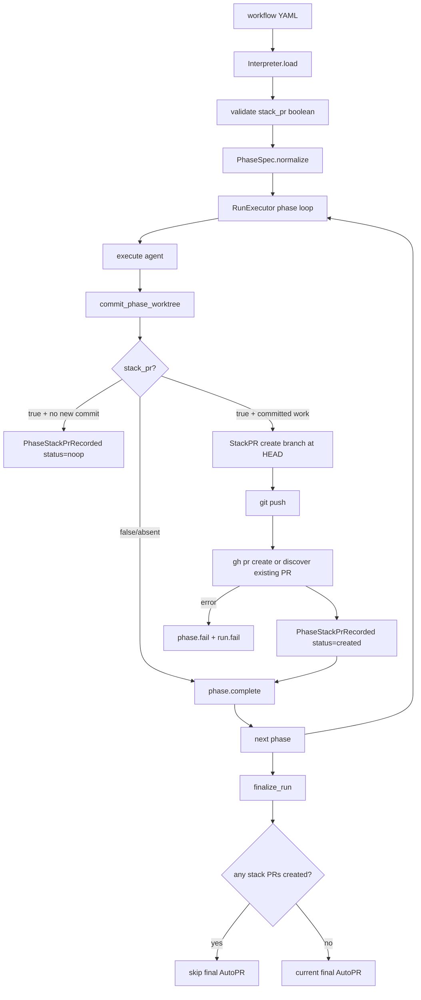
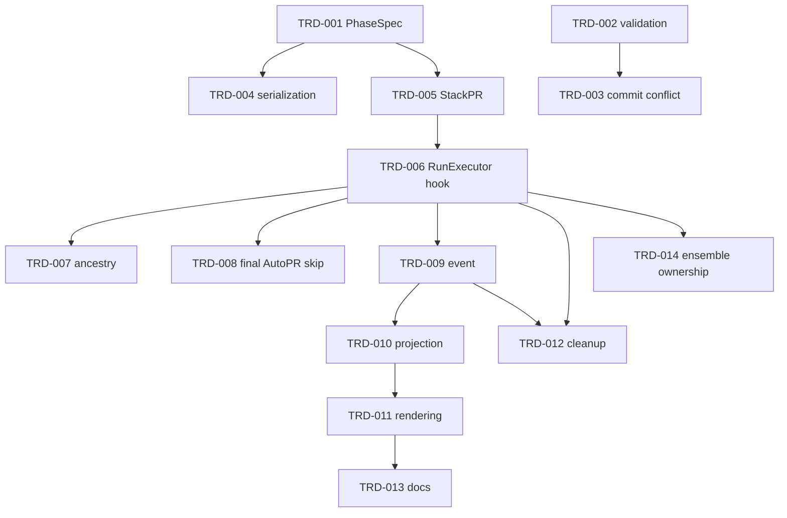

# TRD: Phase-Level `stack_pr:` Tag for Stacked Pull Requests

## Metadata

| Field | Value |
|---|---|
| Document ID | TRD-2026-aa1a81da |
| Label | trd-stack-pr-phase-tag |
| PRD Reference | docs/PRD/PRD-2026-aa1a81da-stack-pr-phase-tag.md |
| Version | 1.0.1 |
| Status | Draft |
| Correlation ID | aa1a81da (shared with source PRD) |
| Design Readiness Score | 4.5 (PASS) |

## Source Task

Foreman task title read from `FOREMAN_TASK_TITLE`: **Add stack_pr phase tag for stacked PRs v8**.

Plan the PRD `PRD-2026-aa1a81da`: add a phase-level boolean `stack_pr:` manifest tag. When a stacking phase commits work, Foreman opens a GitHub PR for that phase. The first stack PR targets the run's recorded base branch. Later stack PRs target the previous stack head branch. Existing workflows without `stack_pr:` keep current final AutoPR behavior.

This TRD is design only. It does not implement the feature.

## Requirements Validation

| Check | Result |
|---|---|
| Required sections present | PASS — Product context, Goals, Non-Goals, Assumptions, Requirements, Dependency Map, Readiness Gate |
| REQ-NNN sequential and unique | PASS — REQ-001 … REQ-013, no gaps |
| ACs in Given/When/Then | PASS — 29/29 |
| Every Must has ≥2 ACs | PASS — 9 Must requirements, minimum 2 each |
| Constraints and Non-Goals documented | PASS — 5 Non-Goals, 8 assumptions, 2 external dependencies |
| Readiness score | 4.5 — PASS (≥4.0), proceed normally |
| Open ambiguity markers | 0 |

## Domain Analysis

**Project type: brownfield.** The feature touches existing workflow parsing, run execution, PR creation, event/projection, operator rendering, and docs.

| Domain | Requirements | Existing surface |
|---|---|---|
| Manifest schema / normalization | REQ-001, REQ-006, REQ-010 | `Workflow.Interpreter`, `Workflow.PhaseSpec`, `Workflow.ManifestWriter`, catalog writer/tests |
| Default behavior and final AutoPR | REQ-002 | `RunExecutor.finalize_run/1`, `Workflow.AutoPR.maybe_create_pr/1`, `PrAssociate` |
| Phase-boundary PR creation | REQ-003, REQ-004, REQ-009, REQ-011 | `RunExecutor.run_phase_body/5`, `commit_phase_worktree/4`, `Workflow.AutoPR` |
| Stack state persistence | REQ-007, REQ-008, REQ-012 | `EventCodec`, `ProjectionStore`, run/phase projections, web run controller |
| CLI/watch/operator surfaces | REQ-008, REQ-012 | Go CLI run/watch/cockpit rendering; API run payloads |
| Foreman/ensemble ownership | REQ-013 | `FOREMAN_*` env contract, bundled prompts/skills invocation path |
| Documentation | REQ-012 | `CLAUDE.md`, `AGENTS.md`, `README.md`, `docs/user-guide.md`, `docs/cli-reference.md` |

### Existing-Code Inventory

| Area | Current state | Design implication |
|---|---|---|
| `PhaseSpec.@fields` | Carries phase fields incl. `commit`, but no `stack_pr` | Add one canonical boolean field; preserve present `false` |
| `Interpreter` | Parses YAML scalar booleans; validates phase actions, worktree and commit values | Add `stack_pr` value validation and `commit:false` conflict check here |
| Worktree model | One run-scoped worktree and branch; later phases reuse it | Do not create per-phase worktrees; create per-phase stack branches pointing at recorded phase SHAs |
| Commit model | `commit_phase_worktree/4` creates phase commits or defers work | Stack PR evaluation must run after commit and before next phase starts |
| AutoPR | Opens one final GitHub PR from head branch to recorded base branch | Extract/reuse push + PR creation helpers for phase stack PRs with custom head/base/title/body |
| PR persistence | `PrAssociated` stores one run-level `pr_url` | Add phase-stack-specific event/projection instead of overloading run-level association |
| Cleanup | Run worktree cleanup happens after final AutoPR | Phase stack branch must be pushed and recorded before any cleanup path can delete the worktree |

## Reused Capabilities

`trd-graph-cli capabilities docs/TRD --json` produced no reusable foundational capability output in this workspace. No foundational TRD is referenced.

Existing in-repo mechanisms reused rather than rebuilt:

| Reused mechanism | Provider | Used by |
|---|---|---|
| YAML scalar parsing and manifest validation | `Workflow.Interpreter` | REQ-001, REQ-006 |
| Canonical phase normalization | `Workflow.PhaseSpec` | REQ-001, REQ-010 |
| Run-scoped worktree/branch lifecycle | `RunExecutor`, `Workflow.Worktree` | REQ-003, REQ-004, REQ-011 |
| GitHub `gh` AutoPR path | `Workflow.AutoPR` | REQ-002, REQ-003, REQ-004, REQ-009 |
| Event-sourced run/phase projections | `EventCodec`, `ProjectionStore` | REQ-007, REQ-008, REQ-012 |

## Architecture Decision

**Selected: Option C — keep one run worktree, add phase stack checkpoints.**

Foreman continues executing all phases in the single run-scoped worktree/branch. After a `stack_pr: true` phase finishes its commit step, the executor records the current HEAD SHA, creates or updates a phase-specific stack branch at that SHA, pushes it, opens a PR, and emits a stack event. The next phase continues on the same run branch. Later stack PRs use the previous stack branch as their base, so GitHub shows only the delta since the prior layer even though the run branch remains linear.

### Alternatives Considered

| Option | Approach | Pros | Cons | Decision |
|---|---|---|---|---|
| A — final AutoPR only with multiple calls | Reuse `AutoPR.maybe_create_pr/1` at phase boundaries using the run branch as head each time | Smallest code change | Cannot preserve earlier PR heads; later commits mutate the same head branch and rewrite prior PR contents | Rejected |
| B — per-phase worktree/branch execution | Each stacking phase runs on its own branch/worktree based on prior stack branch | Cleanest branch semantics | Reverses current run-scoped worktree design; high risk to artifact discovery, VFS isolation, cleanup, and deferred commits | Rejected |
| **C — run branch plus phase stack checkpoint branches** | Keep run execution branch; at stacking phase boundaries create immutable-ish phase branches at current HEAD | Minimal disruption; true stacked PR bases; compatible with one worktree | Must carefully record branch/SHA and handle intervening non-stacking commits | **Selected** |

### Key Technical Decisions

1. **`stack_pr` is a normalized phase field, not a workflow-level policy.** Absent means `false`; present values must be booleans.
2. **`commit: false` + `stack_pr: true` fails at load.** The manifest alone makes the request unsatisfiable.
3. **Stack PR creation runs after phase commit and before `phase.complete`.** A failed explicit stack request fails the phase/run and prevents a misleading completion event.
4. **Phase stack branches are derived refs.** Branch name pattern: `foreman/<run_id>/stack/<phase_index>-<safe-task-or-phase-token>`. If no task id/name is usable, use `run_id` + phase index.
5. **Previous stack branch is the base for later stack PRs.** First stack PR base is `run_base_branch`; later base is the last successful stack branch.
6. **Intervening non-stacking commits are included in the next stacking PR delta.** This follows linear run execution and keeps no half-hidden branch state. Operators see attribution in stack metadata.
7. **Stack metadata is a separate event family.** Do not overload `PrAssociated`, which means one run-level final PR today.
8. **Final AutoPR is skipped only when phase stack PRs were created.** Workflows with no `stack_pr: true` keep current behavior. Runs with explicit stack PRs should not also open a duplicate final PR for the same run branch.
9. **GitHub-only provider scope.** Use the current `gh` path for this release; provider-neutral VCS abstraction is future work.
10. **Docs are part of done.** `stack_pr` is operator-visible manifest behavior, so the five living docs named by `AGENTS.md` must be considered and edited where relevant.
11. **Typed stack boundaries are mandatory.** `Workflow.StackPR` must expose typed request/result structs and total result handling; no bare maps or permissive fallback may carry PR creation state across the executor boundary.

## System Architecture Design

### Components

| Component | Responsibility | Change |
|---|---|---|
| `Workflow.PhaseSpec` | Canonical atom-keyed phase spec | Add `:stack_pr` with `[:stack_pr, "stack_pr", "stackPr"]` source keys if camel-case compatibility is needed; downstream reads atom only |
| `Workflow.Interpreter` | Load-time workflow validation | Validate boolean `stack_pr`; refuse `commit: false` plus `stack_pr: true`; reject malformed values with phase index |
| `Workflow.ManifestWriter` | YAML round-trip | Preserve explicit `stack_pr` values; omit absent default unless comparable defaults are emitted |
| `Workflow.StackPR` | Phase stack PR orchestration | **New** module for branch naming, branch create/update at a captured SHA, push, `gh pr create`, existing-PR lookup, and typed request/result structs |
| `Workflow.AutoPR` | Final run PR | Keep final AutoPR behavior; optionally expose shared GitHub helpers used by `StackPR` without changing final semantics |
| `Workflow.RunExecutor` | Phase sequencing | Invoke stack creation after phase commit and before phase completion; hold stack state in executor memory |
| `Events.PhaseStackPrRecorded` | Durable success/no-op/failure record | **New** event carrying phase index, phase id, status, URL, head branch, base branch, prior PR, reason |
| `ProjectionStore` | Rebuildable read model | Project stack metadata onto run and phase projections |
| CLI/watch/cockpit renderers | Operator visibility | Render ordered stack PRs from run/phase projection state |
| Docs | Operator contract | Document `stack_pr` syntax, default, failures, and relation to `commit` |

### Data Flow

### Integration Points

| Boundary | Protocol | Payload / Contract |
|---|---|---|
| YAML → Interpreter | manifest load | `stack_pr` accepted only as boolean; string values rejected |
| Interpreter → operator | `Workflow.MissingRequiredPhaseError` | names `stack_pr`, `commit`, and one-based phase index |
| RunExecutor → StackPR | internal typed call | `%Workflow.StackPR.Request{run_id, phase_id, phase_index, phase_name, task_id, worktree_path, run_branch, base_branch, prior_stack}`; returns only documented result structs/tuples |
| StackPR → git | `System.cmd("git", ...)` | branch at current HEAD, push before PR create |
| StackPR → GitHub | `gh pr create`; fallback `gh pr view --head` for existing PR | returns URL and number or typed error |
| RunExecutor → EventStore | command/event append | `PhaseStackPrRecorded` before `PhaseCompleted`; failure before `PhaseFailed` if recordable |
| ProjectionStore → CLI/API | run/phase projection maps | ordered `stack_prs` list and per-phase `stack_pr` status |

### Stack Event Shape

New event struct: `ForemanServer.Events.PhaseStackPrRecorded`.

Required fields:

| Field | Type | Notes |
|---|---|---|
| `run_id` | string | Run aggregate id |
| `phase_id` | string | `Identity.phase_id(run_id, phase_index)` |
| `phase_index` | integer | Existing phase numbering convention |
| `phase_name` | string | For operator display only |
| `status` | `"created" | "noop" | "failed" | "existing"` | Projection-safe status |
| `head_branch` | string or nil | Pushed phase stack branch for PR statuses |
| `head_sha` | string or nil | HEAD used to create the phase branch |
| `base_branch` | string or nil | Run base branch for first PR; previous stack branch after |
| `pr_url` | string or nil | Present for created/existing |
| `pr_number` | integer or nil | Parsed when available |
| `prior_phase_id` | string or nil | Previous successful stack layer |
| `prior_pr_url` | string or nil | Display ancestry |
| `reason` | string or nil | No-op/failure reason |
| `recorded_at` | integer | System time ms |

Projection rules:

- Run projection gets `stack_prs: [event_map]`, ordered by `phase_index`.
- Phase projection gets `stack_pr: event_map | nil`.
- Rebuild from events must reproduce URL, branches, phase index/name, ancestry, and no-op/failure reason.
- Existing `pr_url` remains the final run-level PR URL and is not overwritten by stack PRs.

## Master Task List

### PR 1: Manifest contract and serialization

**Shippable State:** Workflow authors can write `stack_pr: true` or `stack_pr: false`; Foreman loads valid booleans, rejects malformed/conflicting declarations, and preserves explicit values across manifest round-trips. No phase PRs are created yet.

- [x] **TRD-001**: Add `stack_pr` to canonical phase normalization in `Workflow.PhaseSpec` without inserting a default key for absent declarations [satisfies REQ-001, REQ-002] (1h)
  - Validates PRD ACs: AC-001-1, AC-001-2, AC-002-1
  - Implementation AC:
    - [x] Given `stack_pr: true`, when a phase is normalized, then `:stack_pr` is boolean `true`.
    - [x] Given `stack_pr: false`, when a phase is normalized, then `:stack_pr` is boolean `false`.
    - [x] Given the key is absent, when a phase is normalized, then no `:stack_pr` key is inserted.
- [x] **TRD-001-TEST**: Unit tests for `PhaseSpec.normalize/1` covering true, false, absent, string-keyed replay, and optional camelCase input if supported [verifies TRD-001] [satisfies REQ-001, REQ-002] [depends: TRD-001] (1h)
- [x] **TRD-002**: Add load-time validation in `Workflow.Interpreter` that rejects non-boolean `stack_pr` values and reports the phase index [satisfies REQ-006] (2h)
  - Validates PRD ACs: AC-006-1, AC-006-2
  - Implementation AC:
    - [x] Given `stack_pr: "true"`, when the workflow loads, then loading fails and says `stack_pr` must be boolean.
    - [x] Given YAML `stack_pr: yes` parses as boolean true, when the workflow loads, then loading succeeds.
    - [x] Given `stack_pr: maybe`, when the workflow loads, then loading fails with the same typed validation path.
- [x] **TRD-002-TEST**: Interpreter tests for malformed, quoted, and YAML-boolean `stack_pr` values [verifies TRD-002] [satisfies REQ-006] [depends: TRD-002] (1.5h)
- [x] **TRD-003**: Add load-time conflict validation for phases declaring both `commit: false` and `stack_pr: true` [satisfies REQ-005, REQ-009] [depends: TRD-002] (1.5h)
  - Validates PRD ACs: AC-005-1, AC-009-2
  - Implementation AC:
    - [x] Given a phase declares `commit: false` and `stack_pr: true`, when loading runs, then it fails before dispatch.
    - [x] Given the failure, then the message names `commit`, `stack_pr`, and the phase index.
    - [x] Given `commit: true` and `stack_pr: false`, when loading runs, then it succeeds.
- [x] **TRD-003-TEST**: Interpreter tests for `commit:false` conflict and non-conflicting combinations [verifies TRD-003] [satisfies REQ-005] [depends: TRD-003] (1h)
- [x] **TRD-004**: Extend manifest/catalog serialization tests so explicit `stack_pr` values survive load/write/read while absent defaults are not noisily emitted [satisfies REQ-010] [depends: TRD-001] (2h)
  - Validates PRD ACs: AC-010-1, AC-010-2
  - Implementation AC:
    - [x] Given a manifest with `stack_pr: true`, when it is serialized and reloaded, then the value remains true.
    - [x] Given a manifest with `stack_pr: false`, when it is serialized and reloaded, then the explicit false remains present if the writer received it.
    - [x] Given a manifest without `stack_pr`, when it is serialized, then no default `stack_pr: false` is added unless comparable defaults are already emitted.
- [x] **TRD-004-TEST**: Round-trip tests in `manifest_writer_test.exs`, catalog writer tests, and task workflow snapshot replay for `stack_pr` [verifies TRD-004] [satisfies REQ-010] [depends: TRD-004] (1.5h)

### PR 2: Phase stack PR creation path

**Shippable State:** A workflow phase with `stack_pr: true` can create a phase PR at phase completion. The first phase PR targets the run's recorded base branch, no-op phases do not open empty PRs, and failure to create a requested PR fails the phase/run.

- [x] **TRD-005**: Add `Workflow.StackPR` with typed request/result structs (no bare maps) for branch naming, current HEAD capture, commits-ahead/no-op detection, push, PR create, existing-PR handling, and idempotent re-entry [satisfies REQ-003, REQ-009, REQ-011] [depends: TRD-001] (5h)
  - Validates PRD ACs: AC-003-1, AC-003-2, AC-003-3, AC-009-1, AC-009-3, AC-011-1
  - Implementation AC:
    - [ ] Given a stacking phase branch has commits beyond base, when `StackPR.create/1` runs, then it pushes a phase stack branch before invoking `gh pr create`.
    - [ ] Given the branch has no commits beyond base, when `StackPR.create/1` runs, then it returns `:noop` with a reason and does not invoke `gh pr create`.
    - [ ] Given `gh pr create` fails, when `StackPR.create/1` returns, then the error includes exit code and output.
    - [ ] Given GitHub reports an existing PR for the head branch, when it is safely discoverable, then the result returns that URL with status `existing`.
    - [ ] Given `StackPR.create/1` receives an unexpected result shape from git/gh handling, when the executor handles the result, then it fails loudly instead of treating the phase as successful.
- [x] **TRD-005-TEST**: Unit tests for `Workflow.StackPR` command sequencing using controlled git repos and stubbed `gh` command responses [verifies TRD-005] [satisfies REQ-003, REQ-009, REQ-011] [depends: TRD-005] (4h)
- [x] **TRD-006**: Wire `RunExecutor` to invoke stack PR creation after `commit_phase_worktree/4` and before `phase.complete` for phases with `stack_pr: true` [satisfies REQ-003, REQ-005, REQ-009] [depends: TRD-005] (3h)
  - Validates PRD ACs: AC-003-1, AC-003-2, AC-005-2, AC-009-1
  - Implementation AC:
    - [ ] Given phase 1 declares `stack_pr: true` and commits work, when phase 1 finishes, then PR creation is attempted before phase 2 starts.
    - [ ] Given the first stacking phase is phase 3, when phase 3 commits, then the first PR base is the run's recorded base branch.
    - [ ] Given PR creation returns an error, when `RunExecutor` handles it, then the phase and run fail.
- [x] **TRD-006-TEST**: RunExecutor tests for first stacking phase, later first stacking phase, no-op stacking phase, and PR-create failure lifecycle [verifies TRD-006] [satisfies REQ-003, REQ-009] [depends: TRD-006] (4h)
- [x] **TRD-007**: Add executor state for stack ancestry: last stack phase id, head branch, head SHA, and PR URL [satisfies REQ-004, REQ-007] [depends: TRD-006] (2h)
  - Validates PRD ACs: AC-004-1, AC-004-2, AC-004-3, AC-007-1
  - Implementation AC:
    - [ ] Given phase 1 created stack PR A, when phase 2 stacks, then PR B uses A's head branch as base.
    - [ ] Given several stacking phases run, when each completes, then each new base is the immediately prior stack head.
    - [ ] Given a non-stacking phase runs between stacking phases, when the later stacking phase stacks, then its base remains the most recent prior stack head.
- [x] **TRD-007-TEST**: RunExecutor integration tests for consecutive and non-consecutive stacked phases, asserting head/base branch ancestry [verifies TRD-007] [satisfies REQ-004] [depends: TRD-007] (4h)
- [x] **TRD-008**: Prevent duplicate final AutoPR when one or more phase stack PRs were created, while preserving final AutoPR when no `stack_pr` phase created a PR [satisfies REQ-002, REQ-013] [depends: TRD-006] (2h)
  - Validates PRD ACs: AC-002-1, AC-002-2, AC-013-1
  - Implementation AC:
    - [ ] Given no phase declares `stack_pr`, when the run completes with commits, then current final AutoPR still runs once.
    - [ ] Given phase stack PRs were created, when the run completes, then final AutoPR is skipped to avoid a duplicate aggregate PR.
    - [ ] Given all requested stack phases were no-ops and no stack PR exists, when the run completes, then final AutoPR follows existing commit-ahead behavior.
- [x] **TRD-008-TEST**: Tests proving final AutoPR behavior is unchanged for default workflows and suppressed only after actual stack PR creation [verifies TRD-008] [satisfies REQ-002, REQ-013] [depends: TRD-008] (2h)

### PR 3: Durable stack metadata and operator visibility

**Shippable State:** Operators can inspect a run or phase and see ordered phase stack PR status, URLs, branches, ancestry, no-op reasons, and failures from projections rebuilt from events.

- [x] **TRD-009**: Add `PhaseStackPrRecorded` event struct, codec registration, command/router path or executor append helper, and tests [satisfies REQ-007, REQ-008, REQ-009] [depends: TRD-006] (3h)
  - Validates PRD ACs: AC-007-1, AC-007-2, AC-008-1, AC-008-2, AC-009-1
  - Implementation AC:
    - [x] Given a stack PR succeeds, when the event is encoded/decoded, then phase index, branches, URL, and prior ancestry survive.
    - [x] Given a stack PR no-ops, when the event is encoded/decoded, then the skip reason survives.
    - [x] Given stack PR creation fails after command execution, when recordable, then the failure reason survives.
- [x] **TRD-009-TEST**: Event codec and aggregate/router tests for stack PR event append and typed payload validation [verifies TRD-009] [satisfies REQ-007, REQ-009] [depends: TRD-009] (2h)
- [x] **TRD-010**: Project stack PR events onto run and phase read models, with rebuild producing identical stack state [satisfies REQ-007, REQ-008, REQ-012] [depends: TRD-009] (4h)
  - Validates PRD ACs: AC-007-1, AC-007-2, AC-008-1, AC-008-2, AC-012-2
  - Implementation AC:
    - [x] Given events are replayed from an empty projection, when rebuild completes, then run projection lists stack PRs ordered by phase.
    - [x] Given a phase has a stack event, when `phase_projection/1` is read, then its stack status is present.
    - [x] Given a no-op or failure event, when projections rebuild, then the reason is visible.
- [x] **TRD-010-TEST**: ProjectionStore tests for run/phase stack state, ordering, no-op/failure reasons, and rebuild parity [verifies TRD-010] [satisfies REQ-007, REQ-008, REQ-012] [depends: TRD-010] (3h)
- [x] **TRD-011**: Render stack PR state in existing run API/CLI/watch/cockpit summaries without inventing a second source of truth [satisfies REQ-008, REQ-012] [depends: TRD-010] (4h)
  - Validates PRD ACs: AC-008-1, AC-008-2, AC-012-2
  - Implementation AC:
    - [x] Given a created stack PR, when an operator reads the run summary, then the PR URL and phase index are visible.
    - [x] Given a failed stack PR, when an operator reads the run summary/watch view, then the failure reason and phase index are visible.
    - [x] Given multiple stack PRs, when rendered, then they are ordered by phase and show base/head ancestry.
- [x] **TRD-011-TEST**: API/CLI/watch rendering tests or golden fixtures for created, no-op, and failed stack PR states [verifies TRD-011] [satisfies REQ-008, REQ-012] [depends: TRD-011] (3h)

### PR 4: Cleanup safety, docs, and Foreman/ensemble ownership

**Shippable State:** Stacked PR branches are pushed and recorded before cleanup, docs accurately describe `stack_pr`, and Foreman-native stacking does not cause ensemble skills under `--foreman` to create duplicate PR stacks.

- [ ] **TRD-012**: Add cleanup-order tests and guards proving stack branch push/record happens before `cleanup: always` or `cleanup: on_success` can remove the run worktree [satisfies REQ-011] [depends: TRD-006, TRD-009] (3h)
  - Validates PRD ACs: AC-011-1, AC-011-2
  - Implementation AC:
    - [ ] Given `cleanup: always` and a successful stack PR, when the run completes, then the stack branch is pushed and recorded before cleanup.
    - [ ] Given cleanup runs after stack PR creation, when the worktree is removed, then the remote branch and projected PR metadata remain.
    - [ ] Given stack PR creation fails, when cleanup failure-path handling runs, then the failure remains attributable.
- [ ] **TRD-012-TEST**: Worktree cleanup lifecycle tests for successful and failed stack phases under destructive cleanup modes [verifies TRD-012] [satisfies REQ-011] [depends: TRD-012] (3h)
- [ ] **TRD-013**: Document `stack_pr` in living docs and remove/adjust stale statements saying per-phase/stacked PRs are unsupported [satisfies REQ-012] [depends: TRD-011] (3h)
  - Validates PRD ACs: AC-012-1, AC-012-2
  - Implementation AC:
    - [ ] Given `CLAUDE.md`, `AGENTS.md`, `README.md`, `docs/user-guide.md`, and `docs/cli-reference.md` are checked, when `stack_pr` is relevant, then docs state phase-level boolean syntax, default false, relation to `commit`, failure behavior, and visibility surfaces.
    - [ ] Given stale unsupported-PR statements exist, when docs are updated, then they are corrected or marked historical.
    - [ ] Given no doc change is needed in one of the five files, when finalizing, then the reason is stated.
- [ ] **TRD-013-TEST**: Documentation grep check for `stack_pr`, `stacked PR`, and stale `checkpointPr`/unsupported stacked-PR claims in the five living docs [verifies TRD-013] [satisfies REQ-012] [depends: TRD-013] (1h)
- [ ] **TRD-014**: Ensure Foreman dispatch owns native stack PR creation and ensemble skills running under `--foreman` do not run separate stacked-PR operations [satisfies REQ-013] [depends: TRD-006] (2h)
  - Validates PRD ACs: AC-013-1, AC-013-2
  - Implementation AC:
    - [ ] Given an ensemble command runs with `--foreman`, when a phase has `stack_pr: true`, then Foreman performs the PR action and the skill does not call `git town append` or create duplicate PRs.
    - [ ] Given the same ensemble skill runs outside Foreman, when it uses its own stacked PR behavior, then behavior is unchanged.
    - [ ] Given `FOREMAN_ARTIFACT_PATH` remains set, when the skill writes artifacts, then stack PR ownership does not alter artifact delivery.
- [ ] **TRD-014-TEST**: Tests or command-level fixtures proving no duplicate PR behavior under `--foreman` and no regression outside Foreman [verifies TRD-014] [satisfies REQ-013] [depends: TRD-014] (2h)

## Sprint Planning

## Sprint 1: Manifest and first PR creation

Covers PR 1 and the start of PR 2. Goal: `stack_pr` parses, validates, round-trips, and can create the first phase PR in a controlled test.

## Sprint 2: Stacking and persistence

Covers the rest of PR 2 and PR 3. Goal: consecutive/non-consecutive phase stacks work, and projections expose durable stack state.

## Sprint 3: Operator polish and docs

Covers PR 4. Goal: cleanup safety, docs, and Foreman/ensemble ownership are verified.

## Acceptance Criteria Traceability

| REQ | Description | Implementation Tasks | Test Tasks |
|---|---|---|---|
| REQ-001 | Declare phase-level `stack_pr` boolean | TRD-001 | TRD-001-TEST |
| REQ-002 | Preserve default single-PR behavior | TRD-001, TRD-008 | TRD-001-TEST, TRD-008-TEST |
| REQ-003 | Create first stack PR from first stacking phase | TRD-005, TRD-006 | TRD-005-TEST, TRD-006-TEST |
| REQ-004 | Stack later phases onto prior stack PR | TRD-007 | TRD-007-TEST |
| REQ-005 | Keep `commit` and `stack_pr` distinct | TRD-003, TRD-006 | TRD-003-TEST, TRD-006-TEST |
| REQ-006 | Refuse malformed `stack_pr` values | TRD-002 | TRD-002-TEST |
| REQ-007 | Persist stack metadata per run and phase | TRD-007, TRD-009, TRD-010 | TRD-007-TEST, TRD-009-TEST, TRD-010-TEST |
| REQ-008 | Surface stack status to operators | TRD-009, TRD-010, TRD-011 | TRD-009-TEST, TRD-010-TEST, TRD-011-TEST |
| REQ-009 | Handle PR failures loudly | TRD-003, TRD-005, TRD-006, TRD-009 | TRD-003-TEST, TRD-005-TEST, TRD-006-TEST, TRD-009-TEST |
| REQ-010 | Preserve tag across serialization | TRD-004 | TRD-004-TEST |
| REQ-011 | Compatible with worktree cleanup | TRD-005, TRD-012 | TRD-005-TEST, TRD-012-TEST |
| REQ-012 | Document and expose stack state | TRD-010, TRD-011, TRD-013 | TRD-010-TEST, TRD-011-TEST, TRD-013-TEST |
| REQ-013 | Avoid breaking ensemble `--foreman` behavior | TRD-008, TRD-014 | TRD-008-TEST, TRD-014-TEST |

## Dependency Graph

Critical path: TRD-001 → TRD-005 → TRD-006 → TRD-009 → TRD-010 → TRD-011 → TRD-013.

No circular dependencies identified. No task is estimated at 8h or more.

## Adversarial Review

### Architecture Self-Critique

| Issue | Risk | Resolution |
|---|---|---|
| Run branch plus checkpoint branches can include intervening non-stacking commits in the next stack PR | Review scope may include work from a phase that did not set `stack_pr` | Document this as linear-run behavior, surface phase ancestry, and require tests for non-consecutive stacks. A later feature can add per-phase branch isolation if product requires excluding intervening commits. |
| `AutoPR` is currently final-run-specific | Reusing it directly would mutate title/body and run-level association semantics | Add `Workflow.StackPR` and only extract small shared git/gh helpers if useful. Keep `PrAssociated` run-level semantics intact. |
| Event append location could bypass aggregates | Projection-only mutation would violate event-sourced model | Add an event struct/codec and append through the existing command/system path or a small typed executor helper that still writes EventStore events before projection. |
| Existing VCS abstraction has `create_pr`, but current AutoPR uses raw git/gh | Mixed VCS paths can drift | Keep GitHub-only explicit per PRD. Do not claim provider-neutral support. Leave VCS abstraction expansion to a future TRD. |

### Task Coverage Analysis

| Issue | Resolution |
|---|---|
| REQ-012 spans docs and operator views, easy to under-scope | Split into TRD-011 rendering and TRD-013 docs; both have tests/checks. |
| REQ-013 can be missed because code is mostly in external ensemble skills | Add a dedicated task to verify Foreman `--foreman` ownership and standalone skill non-regression. |
| Machine parser can miss tasks without checkbox prefixes | Every implementation/test task begins with `- [ ] **TRD-...**`; parser validation run required below. |

### Dependency and Estimate Review

| Issue | Resolution |
|---|---|
| Stack creation depends on manifest normalization, executor timing, and event persistence | PR boundaries keep valid intermediate states: manifest-only, first PR creation, projection visibility, docs/cleanup. |
| Estimates for RunExecutor + integration tests are high but below 8h | Keep separate tasks for StackPR module, executor hook, ancestry, and final AutoPR suppression. |
| CLI/watch rendering paths may be split across Go and Elixir | TRD-011 explicitly permits API/CLI/watch golden fixtures and must verify actual existing surfaces. |

### Testability Review

| Issue | Resolution |
|---|---|
| Real GitHub `gh pr create` is not deterministic in tests | Use stubbed command runner or controlled test doubles for `gh`, plus real local git repos for branch/commit behavior. |
| Bare maps at the RunExecutor ↔ StackPR boundary could silently drop renamed keys | Require typed request/result structs and total pattern matching, following `AGENTS.md` typed-boundary rules. |
| Cleanup ordering can be race-prone | Assert ordered calls/events: push + stack event before cleanup; avoid timing sleeps. |
| Documentation validation can become subjective | Use grep terms and explicit five-file checklist from `AGENTS.md`; state no-edit reasons where applicable. |

## Design Readiness Gate

| Dimension | Score | Notes |
|---|---:|---|
| Architecture completeness | 4 | Components, event shape, data flow, and branch topology defined; VCS abstraction remains intentionally GitHub-only per PRD. |
| Task coverage | 5 | All 13 PRD requirements map to implementation and test tasks. |
| Dependency clarity | 5 | PR boundaries and critical path are explicit and acyclic. |
| Estimate confidence | 4 | Estimates are granular; highest uncertainty is CLI/watch rendering locations and test doubles for `gh`. |

Overall score: **4.5**

Gate decision: **PASS — ready for implementation after approval.**

## Traceability Validation

Traceability check: 13 requirements covered, 0 uncovered, 0 orphaned annotations.

## Output Summary

- TRD path: `docs/TRD/TRD-2026-aa1a81da-stack-pr-phase-tag.md`
- Source PRD correlation id: `aa1a81da`
- Task count: 28 task lines (14 implementation + 14 test)
- Design readiness score: 4.5 (PASS)

## Refinement Changelog

### 2026-09-01 — v1.0.1

- Auto-applied Foreman-mode refinement findings without live interview.
- Tightened the RunExecutor ↔ StackPR boundary to require typed request/result structs and total result handling instead of bare maps/permissive fallback.
- Added an idempotent re-entry/error-shape acceptance check to TRD-005 so duplicate/existing PR handling cannot silently pass unknown provider results.
- Readiness score unchanged at 4.5 PASS; task count and estimates unchanged.

Suggested next commands:

- `/ensemble-configure-team docs/TRD/TRD-2026-aa1a81da-stack-pr-phase-tag.md`
- `/ensemble-implement-trd-beads docs/TRD/TRD-2026-aa1a81da-stack-pr-phase-tag.md`
