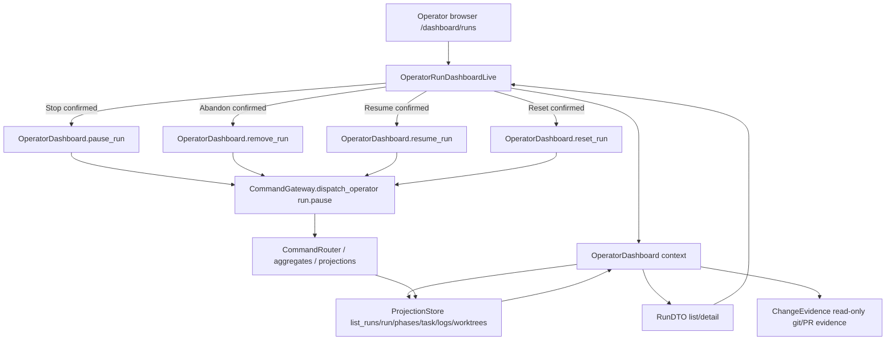

# TRD: Operator Dashboard for Run Management

Foreman task title read from `FOREMAN_TASK_TITLE`: **Add operator dashboard for run management**

Source PRD: `docs/PRD/PRD-2026-c7977e9d-operator-run-dashboard.md` (`PRD-2026-c7977e9d`).

## PRD Validation Summary

- Required PRD sections present: Executive Summary, Background/Evidence, Goals, Non-Goals, Personas, Assumptions, Requirements, Dependency Map, Adversarial Review, Implementation Readiness Gate.
- Requirements: 14 sequential `REQ-NNN` IDs.
- Acceptance criteria: 45 `AC-NNN-M` items, Given/When/Then format.
- PRD readiness score: **4.8 PASS**.
- Subject match: PRD and Foreman task both describe adding a web-first operator dashboard for run management.
- Foreman source PRD path used exactly: `/Users/ldangelo/.foreman/worktrees/foreman/foreman-wktn/run-649b3f39262c2f2a6b6df1b8af4c1511/workspace/docs/PRD/PRD-2026-c7977e9d-operator-run-dashboard.md`.

## Refinement Pass Summary

Refinement tightened the implementation contract against current source:

- Confirmed `/dashboard` is guarded by `ForemanServerWeb.Plugs.RequireAuthenticated`, which accepts `Authorization: Bearer <token>` or `?token=<token>` and fails closed when `:api_bearer_token` is unset.
- Confirmed run reads available through `ProjectionStore.run/1`, `list_runs/1`, `phases_for_run/1`, `run_logs/1`, `pr_association/1`, `worktrees_for_run/1`, and task projections.
- Confirmed durable log DTO shape: `run_logs/1` returns entries plus `count`, `limit`, `truncated`, `omitted_entries`, `omitted_bytes`, and `max_limit`, or `{:error, :run_not_found}`.
- Confirmed operator pause must explicitly send `reason: "operator_pause"`; otherwise the aggregate default is `"crash_loop"`, which is only correct for the crash-loop detector.
- Added exact dashboard command-envelope, auth, evidence-limit, and docs-gate requirements so implementation cannot drift into stale cockpit or private-state assumptions.

## Domain Analysis

| Domain | Requirements | Notes |
|---|---|---|
| Phoenix web surface | REQ-001, REQ-011, REQ-013 | Current `/dashboard` mounts `ForemanServerWeb.LiveDashboard`, a Jido-oriented LiveView behind `:browser` + `:require_authenticated`. The run cockpit needs its own run-management surface or a deliberate replacement. |
| Projection-backed reads | REQ-002, REQ-003, REQ-004, REQ-010, REQ-012 | `RunController` exposes `GET /api/runs` and `GET /api/runs/:id`; `ProjectionStore` owns runs, phases, tasks, worktrees, PR associations, inbox, and durable worker logs. |
| Run-control commands | REQ-006, REQ-007, REQ-008, REQ-010, REQ-011 | `CommandController` and `CommandGateway` allow `run.pause`, `run.resume`, `run.remove`, `run.reset`, and `run.cancel`. Stop maps to `run.pause`; Cancel must stay separately labelled. |
| Durable logs and activity | REQ-003, REQ-004, REQ-012 | `ProjectionStore.run_logs/1` materializes `WorkerStdout` / `WorkerStderr` and returns `{:error, :run_not_found}` for unknown runs. Do not copy server `Logger` output. |
| Code evidence and review targets | REQ-005, REQ-010 | Worktree projections carry path, branch, base ref, cleanup; run projections carry PR URL and phase PR records. Diff generation must be read-only and explicitly handle cleaned worktrees. |
| Historical cockpit baseline | REQ-009, REQ-013 | `origin/fix/cockpit-close-run-row` contains `clients/cockpit/` and `docs/TRD/TRD-2026-019-operator-dashboard.md`. Reuse layout/navigation ideas, not stale command/API assumptions. |
| Tests and docs | REQ-014 | ExUnit/LiveView tests must pin render, polling, action eligibility, command dispatch, rejected-command display, diff/log bounds, and documentation updates. |

Brownfield system. The design adds a Phoenix LiveView operator cockpit and a narrow web context module around existing projections and command gateway behavior. It does not revive the old Go cockpit as the first surface.

## Reused Capabilities

`trd-graph-cli capabilities docs/TRD --json` returned `{"capabilities": []}` and `trd-graph-cli overlap docs/TRD` reported no overlapping target files. No foundational TRD provides a reusable capability token.

In-repo mechanisms reused directly:

| Reused mechanism | Provider | Used by |
|---|---|---|
| Authenticated browser route | `Router` `:browser` + `:require_authenticated` pipeline | Protect the operator cockpit entry point |
| Run/task/phase projections | `ProjectionStore.run/1`, `list_runs/1`, `phases_for_run/1`, task projections | List/detail panes and status rail |
| Durable run logs | `ProjectionStore.run_logs/1`, `foreman_run_get_logs` contract | Bounded log pane and not-found semantics |
| Worktree and PR projections | `ProjectionStore.worktrees_for_run/1`, run `:pr_url`, `:phase_prs`, `PrAssociated` | Code changes and PR tab |
| Operator command boundary | `CommandGateway.dispatch_operator/1`, `CommandController` command shapes | Stop/abandon/restart actions |
| Existing run controls | `run.pause`, `run.resume`, `run.remove`, `run.reset`, separately labelled `run.cancel` | Action mapping |
| Historical cockpit concepts | `clients/cockpit/{README.md,run_actions.go,view.go,diffnav.go,keymap.go}` on `origin/fix/cockpit-close-run-row` | Keyboard-first UI, bounded panes, logs/files/PR tabs, non-color selection markers |

## Historical Cockpit Baseline Review

Source branch inspected: `origin/fix/cockpit-close-run-row` (`51f1ea4cd173fdf3988d305f4c5dfd4566337e8e`).

| Evidence | Reusable | Stale / rejected |
|---|---|---|
| `clients/cockpit/README.md` | Board/list fallback, details tabs (`summary/messages/events/logs/reports/files/pr/metrics`), keyboard canonical behavior, mouse as secondary, bounded panes, reduced motion, non-color focus markers, log panning, file/diff affordances. | `/api/v1` projection reads, `foreman board`, `foreman inbox`, task create/approve/edit/close flows, metrics endpoints, external `omp` attach semantics are not current source-of-truth for this release. |
| `clients/cockpit/run_actions.go` | Clear action affordances for selected run rows and async result messages. | `retryRun`, `attachRun`, `resetRun`, `closeTask` old semantics do not map directly. New web actions must use `run.pause`, `run.resume`, `run.remove`, `run.reset`, and optional separately labelled `run.cancel`. |
| `clients/cockpit/diffnav.go`, `delta_preview.go`, `viewer.go` | Changed-file rows, read-only open/diff targets, bounded previews, explicit missing integration notices. | Do not require `nvim`, `diffnav`, `delta`, `gh dash`, or shelling out from the server as baseline behavior. Web v1 can render safe diffs or links and degrade when evidence is absent. |
| `clients/cockpit/keymap.go`, `view.go` | Keyboard-first navigation, tab selection, help overlay, focus state, list/detail split. | Terminal-specific Bubble Tea implementation is not the v1 surface. |
| `docs/TRD/TRD-2026-019-operator-dashboard.md` | Motivation for one-pane operator visibility. | Node/ANSI/TUI architecture, signal-file polling, direct Postgres store reads, `foreman status/board/inbox/dashboard` replacement framing are obsolete against current Go CLI/Elixir boundaries. |

## Architecture Alternatives

| Option | Approach | Pros | Cons | Risk |
|---|---|---|---|---|
| A — revive old Go cockpit | Port `clients/cockpit` back onto current APIs. | Reuses mature TUI interaction work; keyboard design already explored. | High stale surface area: old commands, `/api/v1`, task mutation assumptions, optional local tools; duplicates web auth and projection access. | High |
| B — extend current `/dashboard` Jido LiveView | Replace or add tabs inside `ForemanServerWeb.LiveDashboard`. | Existing authenticated route; fastest visible path. | Current module is agent/Jido-specific and named/described as such; mixing run cockpit and agent signal dashboard blurs ownership. | Medium |
| C — add dedicated Phoenix LiveView run cockpit | New `OperatorRunDashboardLive` under an authenticated browser route, backed by an `OperatorDashboard` context that reads projections and dispatches operator commands. | Best fit for brownfield. Reuses server auth, projections, PubSub/polling, and typed command gateway; keeps Jido dashboard separate; web-first as PRD selected. | Requires new UI module, context, route, tests, and docs. | Low |
| D — add only JSON APIs and defer UI | Build `/api/runs/:id/logs`, `/api/runs/:id/changes`, and action endpoints. | Useful reusable API layer. | Does not deliver one operator dashboard entry point. | Medium |

Foreman mode: auto-selected Option C (dedicated Phoenix LiveView run cockpit).

## Architecture Decision

Add an authenticated Phoenix LiveView operator cockpit at `/dashboard/runs` and keep the existing Jido dashboard at `/dashboard` unchanged. Introduce `ForemanServerWeb.OperatorDashboard` as the single web-facing context for this cockpit. The context reads from `ProjectionStore` and dispatches run-control commands through `CommandGateway.dispatch_operator/1`; it never reads Beads SQLite, raw event-store tables, or filesystem internals except through a small read-only VCS evidence helper for retained worktrees/branches.

### Rationale

The server already owns auth, projection state, typed commands, PubSub/event subscriptions, and run-control boundaries. A server-side LiveView avoids duplicating auth and CLI command behavior in a revived TUI. Keeping a separate module from `LiveDashboard` preserves the existing Jido dashboard contract and lets `/dashboard/runs` be documented as the run-management entry point.

### Key Decisions

1. **Route:** mount `OperatorRunDashboardLive` at `/dashboard/runs` behind `:browser` and `:require_authenticated`.
2. **Read boundary:** all run/task/phase/log/inbox/PR reads go through `ProjectionStore` or existing approved read APIs. Unknown run logs surface a not-found state, not empty success.
3. **Action boundary:** LiveView actions call a web context that builds public operator commands and calls `CommandGateway.dispatch_operator/1`; command ids are generated per action attempt for idempotency.
4. **Action labels:** Stop means `run.pause`. Terminal cancellation, if exposed, is labelled Cancel and not Stop. Abandon means `run.remove`. Restart means `run.resume` for paused runs and `run.reset` only for eligible failed/stuck runs.
5. **Evidence helper:** changed-file evidence is read-only. It uses projected worktree path/branch/base ref/PR data and returns typed absent/malformed/unavailable states.
6. **Refresh:** use bounded periodic refresh initially (<=2s when connected) plus optional PubSub subscription if available; always keep last known state with stale/error markers.
7. **Accessibility:** implement keyboard-first navigation, non-color status labels/symbols, focus markers, and responsive list/detail layout.
8. **Docs:** document operator entry, status interpretation, logs/changes, and stop/abandon/restart semantics in living docs that expose operator behavior.
9. **Operator pause reason:** dashboard Stop always sends a non-empty reason, defaulting to `"operator_pause"`, so operator stops cannot be projected or audited as crash-loop pauses.
10. **Bounded evidence:** logs, changed files, and diff snippets are always bounded in the context layer before LiveView assigns are updated.

## System Architecture Design

### Components

| Component | Responsibility | Change |
|---|---|---|
| `ForemanServerWeb.Router` | Browser/API routing | Add authenticated `live("/runs", OperatorRunDashboardLive, :index)` inside `/dashboard` scope. |
| `ForemanServerWeb.OperatorRunDashboardLive` | Run cockpit UI state, events, keyboard actions, render | New LiveView with list/detail tabs, action confirmation, bounded refresh, stale/error states. |
| `ForemanServerWeb.OperatorDashboard` | Web context boundary | New module normalizing query DTOs, action eligibility, command dispatch, typed errors, and read-only evidence calls. |
| `ForemanServerWeb.OperatorDashboard.RunDTO` | Stable UI DTO | New struct/map builder for run rows, phase rows, task context, PR/worktree evidence, latest stall, logs summary. |
| `ForemanServerWeb.OperatorDashboard.ChangeEvidence` | Read-only code evidence | New helper using projected worktree path/branch/base ref and safe git commands through existing VCS conventions; returns typed `:available`, `:worktree_missing`, `:branch_unavailable`, `:base_unavailable`, or `:unsupported`. |
| `ProjectionStore` | Source of run/task/phase/log/worktree/PR/inbox projections | Prefer existing reads; add narrow read helpers only if the context needs data already projected but not exposed as a function. |
| `CommandGateway` | Operator mutation boundary | Reused for `run.pause`, `run.resume`, `run.remove`, `run.reset`; optionally `run.cancel` with separate Cancel label. |
| Tests | Regression and boundary proof | Add LiveView, context, command-dispatch, projection DTO, evidence, docs gate tests. |

### Data Flow



### Interfaces

| Boundary | Protocol | Request | Response/Error |
|---|---|---|---|
| Dashboard route | Phoenix LiveView | Authenticated GET `/dashboard/runs` | LiveView HTML; unauthenticated rejected by existing auth guard. |
| Auth | Existing browser guard | `Authorization: Bearer <token>` or `?token=<token>` | `401 unauthorized` when missing, mismatched, or token config absent. |
| Run list | Internal context | `%{status?: binary, project_id?: binary, limit?: pos_integer}` | `{:ok, [%RunDTO{}]}` or typed unavailable error. |
| Run detail | Internal context | `run_id` | `{:ok, %RunDetailDTO{}}` or `{:error, :run_not_found}`. |
| Logs | Internal context | `run_id`, `cursor/limit` UI params | `run_logs/1` DTO with bounded ordered entries plus truncation metadata; unknown run -> `:run_not_found`. |
| Change evidence | Internal context | `run_id` | Changed files + PR/worktree evidence or typed absent/unavailable state. |
| Stop | Operator command | `run.pause` payload with `run_id`, `reason`, actor metadata if available | Success refreshes projection; rejection displayed with typed reason. |
| Abandon | Operator command | `run.remove` payload with `run_id`, `reason` | Success hides from default active list but removed filter can find if projection keeps it. |
| Restart/resume | Operator command | `run.resume` for paused, `run.reset` for eligible failed/stuck | Success refreshes projection; ineligible -> disabled action reason. |

### Command Envelopes

The dashboard context owns envelope construction. LiveView passes intent, `run_id`, optional reason, and operator identity only; it does not build commands inline.

```elixir
%{
  type: "run.pause",
  command_id: "dashboard:run.pause:<run_id>:<unique>",
  aggregate_id: "run:<run_id>",
  payload: %{run_id: run_id, reason: non_blank_reason || "operator_pause"}
}
```

Envelope rules:

- `run.pause`, `run.resume`, `run.remove`, `run.reset`, and optional `run.cancel` all use `CommandGateway.dispatch_operator/1`.
- Stop is `run.pause` only. The context must not omit `reason` for Stop, because the aggregate's absent-reason default is `"crash_loop"`.
- Resume uses `run.resume` only for status `"paused"`; failed/stuck restart uses `run.reset` only when the projection state and command rejection rules allow it.
- Abandon uses `run.remove`; the UI copy says it may clean worktrees/branches via Foreman's existing removal path.
- Cancel, if exposed, uses `run.cancel` and is visually/textually distinct from Stop.
- Every rejection is rendered from the returned typed/domain reason; the previous DTO remains visible.

### DTO and Evidence Limits

| DTO | Required fields | Bound |
|---|---|---|
| Run row | `run_id`, `project_id`, `status`, `workflow`, `task_id`/ad-hoc marker, current phase label, timestamps, `latest_stall`, PR marker | List query default limit 100; operator-selectable limit capped in context. |
| Run detail | Run row fields plus task title/provider ids, phase rows, failure/stall reasons, artifacts, worktree/PR evidence summary | Unknown optional projection fields become explicit `:absent`, never `nil`-poisoned UI logic. |
| Logs | `entries`, `count`, `limit`, `truncated`, `omitted_entries`, `omitted_bytes`, `max_limit` | Use `ProjectionStore.run_logs/1`; do not fetch or copy server Logger output. |
| Changes | file path, status, source (`worktree`, `branch`, `pr`, `artifact`), optional bounded diff/preview | Cap file rows and bytes; reject absolute paths and `..`; no writes. |

Read-only evidence helper rules:

- Use only projected worktree path, branch, base ref/base branch, PR URL, phase PR records, and artifacts.
- Git calls, if needed, are read-only (`status`, `diff --name-status`, `show`, `rev-parse`); no checkout, reset, clean, fetch, push, branch delete, or `br`/Beads calls.
- A missing worktree, missing branch, invalid base ref, or unavailable PR data returns a typed unavailable state with display copy.

## Master Task List

### PR 1: Authenticated run cockpit skeleton

**Shippable State:** Operators can open an authenticated `/dashboard/runs` page, see an empty/error-capable run-management shell, and the existing Jido dashboard remains available.

- [ ] **TRD-001**: Add dedicated `/dashboard/runs` LiveView route and `OperatorRunDashboardLive` skeleton behind existing browser auth [satisfies REQ-001, REQ-011] (3h)
  - Validates PRD ACs: AC-001-1, AC-001-2, AC-001-3, AC-011-1
  - Implementation AC:
    - [ ] Given an authenticated operator opens `/dashboard/runs`, when the server responds, then the page title and H1 identify a run-management dashboard.
    - [ ] Given no projected runs are available, when the page renders, then it shows an explicit empty state and no crash.
    - [ ] Given `/dashboard` is opened, when routing resolves, then the existing Jido dashboard remains separate.
    - [ ] Given the browser auth token is absent, wrong, or not configured, when `/dashboard/runs` is requested, then the existing auth guard returns `401 unauthorized`.
- [ ] **TRD-001-TEST**: Add route/auth/empty-state LiveView tests for `/dashboard/runs` and non-regression coverage for `/dashboard` [verifies TRD-001] [satisfies REQ-001, REQ-011] [depends: TRD-001] (3h)

- [ ] **TRD-002**: Add `ForemanServerWeb.OperatorDashboard` context and run-list DTO builder from `ProjectionStore.list_runs/1` [satisfies REQ-002, REQ-010, REQ-012] [depends: TRD-001] (4h)
  - Validates PRD ACs: AC-002-1, AC-002-4, AC-010-1, AC-012-3
  - Implementation AC:
    - [ ] Given projected runs exist, when the context lists runs, then each DTO includes run id, project id, status, workflow, current phase id/name when resolvable, timestamps, task id, latest stall marker, PR marker, and ad-hoc/no-task marker.
    - [ ] Given status or project filters are present, when the context queries runs, then only matching rows are returned.
    - [ ] Given an unknown or malformed optional field is absent, when DTOs are built, then the UI receives an explicit absent marker rather than raising.
    - [ ] Given no limit is supplied or an excessive limit is supplied, when the context queries runs, then it applies the documented default/cap before calling `ProjectionStore.list_runs/1`.
- [ ] **TRD-002-TEST**: Unit-test run-list DTO fields, filters, ad-hoc/no-task labelling, and empty/error states with projection fixtures [verifies TRD-002] [satisfies REQ-002, REQ-010, REQ-012] [depends: TRD-002] (3h)

### PR 2: Run detail, phase status, logs, and live refresh

**Shippable State:** Operators can select a run and inspect task context, phase progression, stall/failure reasons, and bounded durable worker logs with automatic refresh.

- [ ] **TRD-003**: Implement run detail DTO with task context, phase rail, statuses, timestamps, failure reasons, and latest stall from projections [satisfies REQ-002, REQ-003, REQ-010] [depends: TRD-002] (5h)
  - Validates PRD ACs: AC-002-2, AC-003-1, AC-003-2, AC-003-3, AC-010-1
  - Implementation AC:
    - [ ] Given a selected multi-phase run, when detail loads, then every projected phase id shows name, status, start/completion time, artifact, and failure/stall reason when present.
    - [ ] Given a run status is paused, cancelled, failed, stuck, completed, or in progress, when rendered, then text and non-color symbols distinguish it.
    - [ ] Given `latest_stall` exists on the run or phase projection, when detail loads, then the dashboard displays that projection value and does not recompute stall rules.
- [ ] **TRD-003-TEST**: Add detail DTO and LiveView render tests for phase states, terminal states, latest stall, failure reasons, and task metadata [verifies TRD-003] [satisfies REQ-002, REQ-003, REQ-010] [depends: TRD-003] (4h)

- [ ] **TRD-004**: Add bounded durable log pane backed only by `ProjectionStore.run_logs/1` [satisfies REQ-004, REQ-010, REQ-012] [depends: TRD-003] (4h)
  - Validates PRD ACs: AC-004-1, AC-004-2, AC-004-3, AC-010-1, AC-012-3
  - Implementation AC:
    - [ ] Given worker stdout/stderr events exist, when the log tab renders, then logs appear ordered with stream, timestamp/sequence, and bounded body text.
    - [ ] Given the run id is unknown, when logs are requested, then the dashboard reports `run_not_found` instead of an empty successful log.
    - [ ] Given `ProjectionStore.run_logs/1` returns `truncated`, `omitted_entries`, `omitted_bytes`, `limit`, or `max_limit`, when rendered, then the UI shows the truncation/tail notice.
    - [ ] Given server `Logger` output exists, when logs render, then it is not copied into run logs.
- [ ] **TRD-004-TEST**: Add tests for durable log rendering, unknown-run not-found, long-log bounds, and no server-log fallback [verifies TRD-004] [satisfies REQ-004, REQ-010, REQ-012] [depends: TRD-004] (4h)

- [ ] **TRD-005**: Implement bounded refresh with stale/error indicators and last-known-state preservation [satisfies REQ-012] [depends: TRD-004] (3h)
  - Validates PRD ACs: AC-012-1, AC-012-2, AC-012-3
  - Implementation AC:
    - [ ] Given a connected LiveView, when refresh is healthy, then visible run state updates within 2 seconds under local-server conditions.
    - [ ] Given refresh fails, when the next render occurs, then the last successful state remains visible with a stale/error marker.
    - [ ] Given many runs exist, when refresh executes, then list queries apply limit/filter bounds.
- [ ] **TRD-005-TEST**: Add LiveView timer/refresh tests for update cadence, stale-state display, and bounded query params [verifies TRD-005] [satisfies REQ-012] [depends: TRD-005] (3h)

### PR 3: Code changes, PR evidence, and accessible navigation

**Shippable State:** Operators can inspect read-only changed-file/PR evidence and navigate the run cockpit by keyboard without relying on color.

- [ ] **TRD-006**: Add read-only code evidence helper for retained worktrees, run branches, base refs, PR URL, and phase PR records [satisfies REQ-005, REQ-010] [depends: TRD-003] (6h)
  - Validates PRD ACs: AC-005-1, AC-005-2, AC-005-3, AC-005-4, AC-010-1, AC-010-3
  - Implementation AC:
    - [ ] Given a retained worktree and base ref are projected, when evidence loads, then changed files are listed relative to the recorded base without mutating the repo.
    - [ ] Given only PR or branch metadata remains, when evidence loads, then the UI shows PR/branch evidence and labels missing local worktree evidence explicitly.
    - [ ] Given worktree/base/branch data is absent or malformed, when evidence loads, then the helper returns a typed unavailable reason and no shell fallback to private internals.
    - [ ] Given a projected path is absolute, escapes with `..`, or points outside the worktree, when evidence loads, then it is rejected as malformed.
    - [ ] Given a file is selected, when the operator opens review, then the dashboard renders or links to read-only/diff content only within documented row/byte bounds.
- [ ] **TRD-006-TEST**: Add tests for changed-file evidence, cleaned-worktree fallback, PR metadata display, and typed unavailable states [verifies TRD-006] [satisfies REQ-005, REQ-010] [depends: TRD-006] (5h)

- [ ] **TRD-007**: Implement dashboard layout, tabs, filters, and keyboard-first navigation using old cockpit concepts adapted to LiveView [satisfies REQ-001, REQ-002, REQ-003, REQ-013] [depends: TRD-005, TRD-006] (6h)
  - Validates PRD ACs: AC-001-1, AC-002-3, AC-003-2, AC-013-1, AC-013-2, AC-013-3
  - Implementation AC:
    - [ ] Given keyboard input, when the operator moves through run list, detail tabs, logs, changed files, and actions, then every primary view and action is reachable.
    - [ ] Given color is unavailable, when statuses and focus are rendered, then text labels/symbols and focus markers distinguish them.
    - [ ] Given a narrow viewport, when the dashboard renders, then list/detail content remains usable rather than truncating all actionable data.
    - [ ] Given the old cockpit branch is referenced, when implementation comments/docs cite it, then stale commands/APIs are not copied.
- [ ] **TRD-007-TEST**: Add LiveView render/event tests for filters, tabs, keyboard navigation, non-color status markers, and responsive empty/detail states [verifies TRD-007] [satisfies REQ-001, REQ-002, REQ-003, REQ-013] [depends: TRD-007] (5h)

### PR 4: Stop, abandon, restart controls

**Shippable State:** Authorized operators can safely stop, abandon, resume, or reset eligible runs from the dashboard with confirmation, typed rejection display, and no boundary bypass.

- [ ] **TRD-008**: Add action eligibility and confirmation model for Stop, Abandon, Resume, Reset, and optional separately labelled Cancel [satisfies REQ-006, REQ-007, REQ-008, REQ-011] [depends: TRD-003] (4h)
  - Validates PRD ACs: AC-006-1, AC-007-2, AC-008-3, AC-011-2
  - Implementation AC:
    - [ ] Given an active run, when actions are computed, then Stop is enabled and maps to `run.pause`.
    - [ ] Given a paused run, when actions are computed, then Resume/Restart maps to `run.resume`.
    - [ ] Given a failed or stuck run, when actions are computed, then Reset/Restart maps to `run.reset` only when the command is valid.
    - [ ] Given abandon is shown, when confirmation renders, then it states resource cleanup/evidence consequences.
    - [ ] Given terminal cancellation is exposed, when rendered, then it is labelled Cancel and not Stop.
- [ ] **TRD-008-TEST**: Unit-test eligibility matrix and confirmation copy for active, paused, failed, stuck, completed, cancelled, removed, and ineligible states [verifies TRD-008] [satisfies REQ-006, REQ-007, REQ-008, REQ-011] [depends: TRD-008] (4h)

- [ ] **TRD-009**: Dispatch run-control actions through `CommandGateway.dispatch_operator/1` with idempotent command ids, typed errors, actor/reason metadata, and refresh-on-result [satisfies REQ-006, REQ-007, REQ-008, REQ-010, REQ-011] [depends: TRD-008] (6h)
  - Validates PRD ACs: AC-006-1, AC-006-2, AC-006-3, AC-007-1, AC-007-3, AC-008-1, AC-008-2, AC-008-4, AC-010-2, AC-011-3
  - Implementation AC:
    - [ ] Given Stop is confirmed, when dispatch runs, then the command type is `run.pause`, `aggregate_id` is `run:<run_id>`, payload carries `run_id`, and blank reason defaults to `operator_pause` before dispatch.
    - [ ] Given Abandon is confirmed, when dispatch runs, then the command type is `run.remove` and default active views exclude the run after success while explicit removed filters can query it if projected.
    - [ ] Given Resume is confirmed, when dispatch runs, then the command type is `run.resume` and lineage/audit fields remain visible from projections.
    - [ ] Given Reset is confirmed, when dispatch runs, then the command type is `run.reset` and removed task-retry CLI behavior is not exposed.
    - [ ] Given command dispatch is rejected, when the response is rendered, then the typed rejection reason appears and previous state remains visible.
- [ ] **TRD-009-TEST**: Add command-dispatch tests proving exact command types/payloads, success refresh, typed rejection display, and no direct event-store/Beads/filesystem mutation [verifies TRD-009] [satisfies REQ-006, REQ-007, REQ-008, REQ-010, REQ-011] [depends: TRD-009] (5h)

### PR 5: Documentation, release hardening, and workflow proof

**Shippable State:** The run-management dashboard is documented, covered by operator workflow tests, and final evidence proves docs and tests match the shipped behavior.

- [ ] **TRD-010**: Add end-to-end operator workflow tests covering list, detail, logs, changes, confirmations, rejected actions, and refresh behavior [satisfies REQ-014] [depends: TRD-009] (5h)
  - Validates PRD ACs: AC-014-1
  - Implementation AC:
    - [ ] Given seeded projections, when the LiveView test drives the workflow, then run list, detail tabs, logs, changes, and PR evidence render.
    - [ ] Given action confirmation is accepted, when the command succeeds or fails, then the result state or typed error is shown.
    - [ ] Given refresh runs after a projection change, when the page updates, then the operator sees the new status without manual reload.
- [ ] **TRD-010-TEST**: Run the operator workflow test suite and record command/output summary in the implementation report [verifies TRD-010] [satisfies REQ-014] [depends: TRD-010] (2h)

- [ ] **TRD-011**: Update operator/developer docs for dashboard entry, auth, statuses, logs, changes, Stop/Cancel/Abandon/Restart semantics, and documentation discipline [satisfies REQ-001, REQ-006, REQ-007, REQ-008, REQ-014] [depends: TRD-010] (4h)
  - Validates PRD ACs: AC-001-3, AC-014-2, AC-014-3
  - Implementation AC:
    - [ ] Given `README.md` and `docs/user-guide.md` are read, when dashboard docs are added, then an operator can open `/dashboard/runs`, authenticate by the documented token method, and understand status/action semantics.
    - [ ] Given `docs/cli-reference.md` is checked, when no CLI behavior changed, then it remains unchanged or receives only accurate cross-reference text.
    - [ ] Given `CLAUDE.md` and `AGENTS.md` are checked, when operator expectations or workflow instructions changed, then only relevant stale or new behavior is edited.
    - [ ] Given externally visible identifiers are listed, when finalization completes, then all five required docs have edit/no-op rationale, including new `/dashboard/runs` and any new module names.
- [ ] **TRD-011-TEST**: Add final documentation-gate evidence listing identifiers and the edit/no-op rationale for `CLAUDE.md`, `AGENTS.md`, `README.md`, `docs/user-guide.md`, and `docs/cli-reference.md` [verifies TRD-011] [satisfies REQ-014] [depends: TRD-011] (1h)

- [ ] **TRD-012**: Perform final source-boundary audit and run focused test/build gates before implementation completion [satisfies REQ-010, REQ-014] [depends: TRD-011] (3h)
  - Validates PRD ACs: AC-010-1, AC-010-2, AC-010-3, AC-014-1
  - Implementation AC:
    - [ ] Given the implementation diff is reviewed, when reads are traced, then none read raw event-store tables or Beads SQLite.
    - [ ] Given mutation code is reviewed, when writes are traced, then all run-state mutations route through `CommandGateway`/`CommandRouter`.
    - [ ] Given tests are run, when gates finish, then no failures remain.
- [ ] **TRD-012-TEST**: Record focused ExUnit/build command results and boundary-audit findings in the implementation report [verifies TRD-012] [satisfies REQ-010, REQ-014] [depends: TRD-012] (2h)

## Sprint Planning

## Sprint 1: Cockpit shell and read-only visibility

PR 1 and PR 2. Delivers an authenticated run-management page with list/detail/status/logs and bounded refresh.

## Sprint 2: Evidence and navigation

PR 3. Delivers changed-file/PR evidence and accessible keyboard-first cockpit interaction.

## Sprint 3: Safe run controls

PR 4. Delivers Stop/Abandon/Resume/Reset actions through Foreman's command boundary with confirmation and typed errors.

## Sprint 4: Hardening and documentation

PR 5. Delivers end-to-end workflow tests, docs, source-boundary audit, and release evidence.

## Dependency Graph

| Task | Depends On |
|---|---|
| TRD-001 | none |
| TRD-001-TEST | TRD-001 |
| TRD-002 | TRD-001 |
| TRD-002-TEST | TRD-002 |
| TRD-003 | TRD-002 |
| TRD-003-TEST | TRD-003 |
| TRD-004 | TRD-003 |
| TRD-004-TEST | TRD-004 |
| TRD-005 | TRD-004 |
| TRD-005-TEST | TRD-005 |
| TRD-006 | TRD-003 |
| TRD-006-TEST | TRD-006 |
| TRD-007 | TRD-005, TRD-006 |
| TRD-007-TEST | TRD-007 |
| TRD-008 | TRD-003 |
| TRD-008-TEST | TRD-008 |
| TRD-009 | TRD-008 |
| TRD-009-TEST | TRD-009 |
| TRD-010 | TRD-009 |
| TRD-010-TEST | TRD-010 |
| TRD-011 | TRD-010 |
| TRD-011-TEST | TRD-011 |
| TRD-012 | TRD-011 |
| TRD-012-TEST | TRD-012 |

Critical path: TRD-001 → TRD-002 → TRD-003 → TRD-004 → TRD-005 → TRD-007 → TRD-008/TRD-009 → TRD-010 → TRD-011 → TRD-012. No circular dependencies identified.

## Acceptance Criteria Traceability

| REQ | Description | Implementation Tasks | Test Tasks |
|---|---|---|---|
| REQ-001 | Provide one operator dashboard entry point | TRD-001, TRD-007, TRD-011 | TRD-001-TEST, TRD-007-TEST, TRD-011-TEST |
| REQ-002 | List runs with task context | TRD-002, TRD-003, TRD-007 | TRD-002-TEST, TRD-003-TEST, TRD-007-TEST |
| REQ-003 | Show run and phase status clearly | TRD-003, TRD-007 | TRD-003-TEST, TRD-007-TEST |
| REQ-004 | Show run logs | TRD-004 | TRD-004-TEST |
| REQ-005 | Show code changes and review targets | TRD-006 | TRD-006-TEST |
| REQ-006 | Support stop control | TRD-008, TRD-009, TRD-011 | TRD-008-TEST, TRD-009-TEST, TRD-011-TEST |
| REQ-007 | Support abandon control | TRD-008, TRD-009, TRD-011 | TRD-008-TEST, TRD-009-TEST, TRD-011-TEST |
| REQ-008 | Support restart control | TRD-008, TRD-009, TRD-011 | TRD-008-TEST, TRD-009-TEST, TRD-011-TEST |
| REQ-009 | Reuse old cockpit/dashboard branch as baseline evidence | TRD-007 | TRD-007-TEST |
| REQ-010 | Preserve Foreman source-of-truth boundaries | TRD-002, TRD-003, TRD-004, TRD-006, TRD-009, TRD-012 | TRD-002-TEST, TRD-003-TEST, TRD-004-TEST, TRD-006-TEST, TRD-009-TEST, TRD-012-TEST |
| REQ-011 | Enforce auth and unsafe-action confirmation | TRD-001, TRD-008, TRD-009 | TRD-001-TEST, TRD-008-TEST, TRD-009-TEST |
| REQ-012 | Keep the dashboard live without overloading the server | TRD-002, TRD-004, TRD-005 | TRD-002-TEST, TRD-004-TEST, TRD-005-TEST |
| REQ-013 | Provide accessible, keyboard-first navigation | TRD-007 | TRD-007-TEST |
| REQ-014 | Document and test the operator workflow | TRD-010, TRD-011, TRD-012 | TRD-010-TEST, TRD-011-TEST, TRD-012-TEST |

Traceability check: 14 requirements covered, 0 uncovered, 0 orphaned annotations.

## Adversarial Review

### Architecture Issues

1. **Issue:** Extending `/dashboard` could silently repurpose the Jido dashboard and break operators who expect agent state there.  
   **Resolution:** Use `/dashboard/runs` and keep `LiveDashboard` separate unless a future explicit navigation page is added.

2. **Issue:** A server-side LiveView could bypass public HTTP command routes and mutate state directly.  
   **Resolution:** The web context may call `CommandGateway.dispatch_operator/1` only; no aggregate, event-store, filesystem, or Beads writes are allowed.

3. **Issue:** Changed-file evidence can tempt direct shelling into cleaned worktrees or stale branches.  
   **Resolution:** `ChangeEvidence` returns typed missing/unavailable states and only uses projected worktree/branch/base/PR data through read-only git operations.

4. **Issue:** Log display may accidentally mix server logs with durable worker logs.  
   **Resolution:** The log pane is backed only by `ProjectionStore.run_logs/1`; unknown run means `run_not_found`.

### Task Coverage Issues

1. **Issue:** Code-change viewing has no direct existing HTTP endpoint.  
   **Resolution:** TRD-006 creates a narrow read-only evidence helper; if data is not projected, implementation adds a typed projection/read path instead of scraping.

2. **Issue:** Docs often drift around run-control names.  
   **Resolution:** TRD-011 requires external identifier listing and edit/no-op rationale for all five required docs.

### Dependency and Estimate Issues

1. **Issue:** PR 4 depends on stable detail DTO semantics from PR 2; action eligibility can be wrong if statuses are normalized inconsistently.  
   **Resolution:** TRD-008 starts after TRD-003 and gets a full eligibility matrix test.

2. **Issue:** TRD-006 is the highest uncertainty task because branch/worktree cleanup states vary.  
   **Resolution:** Keep it read-only, typed, and independently shippable before action work.

### Testability Issues

1. **Issue:** Keyboard navigation and responsive layout can be subjective.  
   **Resolution:** Tests must assert concrete focus transitions, tab selection, non-color labels, and presence of content under narrow layout render.

2. **Issue:** Refresh-within-2s can be flaky in CI.  
   **Resolution:** Unit/LiveView tests drive timer messages deterministically; manual/local proof may record actual wall-clock behavior separately.

## Design Readiness Gate

| Dimension | Score | Rationale |
|---|---:|---|
| Architecture completeness | 4.9 | Route, auth guard, context, read model, command envelopes, logs, code evidence, actions, refresh, and accessibility are defined against current source. |
| Task coverage | 4.9 | Every PRD requirement has implementation and test tasks; refinements added auth, bounds, command-envelope, and docs-gate proof. |
| Dependency clarity | 4.8 | PR boundaries are shippable and acyclic; action work waits on detail DTOs; evidence and action risks are isolated. |
| Estimate confidence | 4.8 | Most tasks are 3-6h; highest-risk evidence/action tasks have paired tests, typed fallbacks, and explicit source-contract checks. |

Overall design readiness score: **4.9 / 5.0**  
Gate decision: **PASS**

## Output and Next Steps

Saved TRD path: `docs/TRD/TRD-2026-c7977e9d-operator-run-dashboard.md`  
Task count: 24 task lines (12 implementation, 12 test).  
Source PRD correlation id: `c7977e9d`.  
Refined version: `1.0.1`.

Suggested next commands:

```text
/ensemble-configure-team docs/TRD/TRD-2026-c7977e9d-operator-run-dashboard.md
/ensemble-implement-trd-beads docs/TRD/TRD-2026-c7977e9d-operator-run-dashboard.md
```
