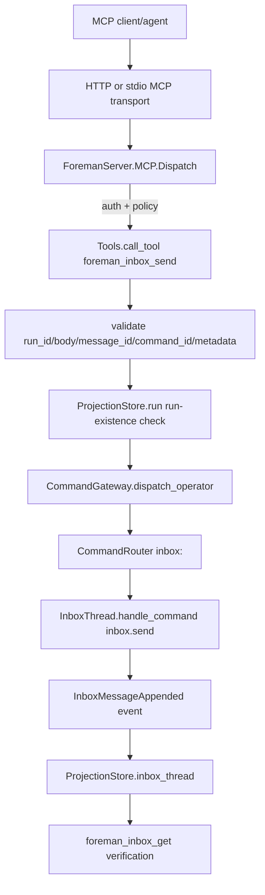

# TRD: Agent-Facing Inbox Write Tool for Run Progress Visibility

Foreman task title read from `FOREMAN_TASK_TITLE`: **Add agent-facing inbox write tool for run progress visibility**

Source PRD: `docs/PRD/PRD-2026-cf992a03-agent-inbox-write-tool-run-progress.md` (`PRD-2026-cf992a03`).

## PRD Validation Summary

- Required PRD sections present: Product Summary/Executive Summary, personas, scope, requirements, acceptance criteria, non-functional requirements, dependencies, readiness gate.
- Requirements: 15 sequential `REQ-NNN` IDs.
- Acceptance criteria: 39 `AC-NNN-M` items, Given/When/Then format.
- PRD readiness score: **4.9 PASS**.
- Subject match: PRD title/Foreman task both describe adding an agent-facing inbox write tool for run progress visibility.

## Domain Analysis

| Domain | Requirements | Notes |
|---|---|---|
| MCP tool contract | REQ-001, REQ-003, REQ-004, REQ-006, REQ-011, REQ-012 | `ForemanServer.MCP.Tools`, `Dispatch`, `Policy`, HTTP and stdio share component/call wiring. |
| Event-sourced command path | REQ-002, REQ-005, REQ-007, REQ-015 | Existing `InboxThread` handles `inbox.send`; `CommandGateway.dispatch_operator/2` must allow and validate the public command. |
| Input safety and DTOs | REQ-004, REQ-006, REQ-010 | Schema-declared top-level fields only; bounded body; JSON-safe metadata; no atom leaks. |
| Agent behavior and prompts | REQ-008, REQ-009, REQ-010 | Bundled prompts under `packages/foreman_server/priv/defaults/workflows/prompts/*.md` need progress guidance. |
| Docs and compatibility | REQ-013, REQ-014, REQ-015 | Operator docs must distinguish inbox progress from logs/activity; existing tools must not regress. |

Brownfield system. Reuse existing MCP transport, policy, telemetry, command gateway, `InboxThread`, `ProjectionStore.inbox_thread/1`, and bundled prompt installation flow.

## Reused Capabilities

`trd-graph-cli capabilities docs/TRD --json` returned `{"capabilities": []}`. No foundational TRD provides a deduplicatable capability token.

In-repo mechanisms reused directly:

| Reused mechanism | Provider | Used by |
|---|---|---|
| Shared MCP dispatch/policy wiring | `ForemanServer.MCP.Dispatch`, `ForemanServer.MCP.Policy` | REQ-001, REQ-003, REQ-012 |
| Run-scoped inbox aggregate | `ForemanServer.Aggregates.InboxThread` | REQ-002, REQ-005, REQ-007, REQ-015 |
| Inbox projection/read tool | `ProjectionStore.inbox_thread/1`, `foreman_inbox_get` | REQ-007, REQ-014 |
| Privacy-safe MCP telemetry helper | `ForemanServer.Telemetry.mcp_tool_call/3` | REQ-011 |
| Runtime prompt install flow | `npm run build`, `foreman init --force` stale asset rules | REQ-008, REQ-013 |

## Architecture Alternatives

| Option | Approach | Pros | Cons | Risk |
|---|---|---|---|---|
| A — minimal MCP wrapper | Add `foreman_inbox_send` in `Tools` and call `CommandRouter`/aggregate directly. | Few files, fastest. | Violates PRD gateway boundary; creates second public mutation path; bypasses operator allowlist. | High |
| B — new inbox-specific write policy and command facade | Add `allow_inbox_writes`, a new gateway function, and separate policy branch. | Fine-grained future policy. | Out of v1 scope; duplicates existing write policy/gateway conventions. | Medium |
| C — gateway-backed write tool using existing write policy | Add `inbox.send` to `CommandGateway.dispatch_operator/2`, add `foreman_inbox_send` to MCP tools and `@write_tools`, keep HTTP/stdio shared wiring. | Satisfies PRD, preserves mutation boundary, minimal new surface, default-deny via existing policy. | Requires careful typed error mapping and idempotent retry split. | Low |

Foreman mode: auto-selected Option C (gateway-backed write tool using existing write policy).

## Architecture Decision

Implement `foreman_inbox_send` as a first-class MCP write tool that dispatches `inbox.send` through `CommandGateway.dispatch_operator/2` and verifies writes through the existing `foreman_inbox_get` read path.

### Key Decisions

1. **Unknown run behavior:** return `NOT_FOUND` before dispatch when `ProjectionStore.run(run_id)` is absent. Progress notes are run visibility, not pre-run inbox creation; this prevents ghost `inbox:<run_id>` streams.
2. **Policy:** add `foreman_inbox_send` to `MCP.Policy.@write_tools`; it remains hidden/refused by default and is enabled by existing `allow_workflow_writes` only.
3. **Gateway:** add `inbox.send` to `CommandGateway` operator allowlist and add a dedicated aggregate-id validator requiring `aggregate_id == "inbox:#{run_id}"`. Do not allow `inbox.delivery.update`.
4. **Retry identity:** require or mint `message_id`; derive default `command_id` deterministically from `run_id` and `message_id`. Exact command retry returns idempotent success; conflicting duplicate message id maps to `ALREADY_EXISTS`.
5. **Input boundary:** accept only schema-declared top-level fields. Metadata is a JSON-safe object limited to declared keys (`phase_id`, `worker_id`, `session_id`, `severity`) and safe scalar/list/map values; unknown metadata keys are rejected with `INVALID_PARAMS` rather than dropped silently; no prompt/output/log bodies.
6. **Body limit:** set the MCP schema and helper limit to 2,000 UTF-8 characters for `body`; reject oversize body with `INVALID_PARAMS`. No truncation in v1.
7. **Operator command docs:** update `CommandGateway`'s operator allowlist/module documentation alongside `@allowed_operator_types` so the public mutation contract does not drift.
8. **Telemetry:** use `Telemetry.mcp_tool_call/3` with `tool` and `outcome` only; never include message body or metadata payload.
9. **Prompts:** instruct agents to post phase start, material milestone, blocker, and phase completion updates when available, but to continue work if the tool is denied/unavailable/fails.

## System Architecture Design

### Components

| Component | Responsibility | Change |
|---|---|---|
| `ForemanServer.MCP.Tools` | Tool schema, handler, validation helpers, success/error DTOs | Add `@schema_foreman_inbox_send`, handler, deterministic ids, metadata/body normalization, error mapping |
| `ForemanServer.MCP.Policy` | Closed write-tool list and default-deny behavior | Add `foreman_inbox_send` to `@write_tools` |
| `ForemanServer.MCP.Dispatch` | Shared HTTP/stdio auth, policy, input normalization | No code change expected; add parity tests around new tool |
| `ForemanServer.CommandGateway` | Public operator mutation boundary | Allow and validate `inbox.send`; keep delivery update disallowed |
| `ForemanServer.Aggregates.InboxThread` | Domain event creation and duplicate message guard | Reused unchanged unless tests reveal missing typed duplicate shape |
| `ForemanServer.ProjectionStore` | Read model for `foreman_inbox_get` and run existence | Reused unchanged |
| `ForemanServer.Telemetry` | Privacy-safe MCP telemetry | Reused unchanged; add tests proving body absent |
| Bundled prompts | Agent progress guidance | Add concise non-blocking inbox progress instructions |
| Docs | Operator/developer behavior | Update docs or record no-op rationale per docs gate |

### Data Flow

### Interfaces

| Boundary | Protocol | Request | Response/Error |
|---|---|---|---|
| MCP schema | `foreman_inbox_send` | `{run_id, body, message_id?, command_id?, metadata?}` where `body` is 1–2,000 UTF-8 chars and `metadata` keys are only `phase_id`, `worker_id`, `session_id`, `severity` | `{run_id, message_id, status: "sent"}` |
| Gateway | `CommandGateway.dispatch_operator/2` | `%{type: "inbox.send", aggregate_id: "inbox:<run_id>", command_id, payload: %{run_id, message_id, body, metadata}}` | `{:ok, event_spec}` or typed error tuple |
| Aggregate | `InboxThread.handle_command/2` | `inbox.send` payload | `%InboxMessageAppended{}` or `{:already_exists, :message, message_id}` |
| Read verification | `foreman_inbox_get` | `{run_id}` | Existing inbox thread or `{run_id, messages: []}` |

## Master Task List

### PR 1: Public command path accepts safe run inbox sends

**Shippable State:** Operators and tests can append a run progress inbox message through the public operator command gateway and read it back through the existing inbox read model; no MCP write tool is advertised yet.

- [x] **TRD-001**: Add `inbox.send` to `CommandGateway` operator allowlist with a dedicated validator requiring nonblank `run_id`, `body`, and `message_id`, and `aggregate_id == "inbox:#{run_id}"` [satisfies REQ-002, REQ-015] (3h)
  - Validates PRD ACs: AC-002-1, AC-002-2, AC-002-3, AC-015-1, AC-015-2
  - Implementation AC:
    - [x] Given an operator `inbox.send` envelope has matching `aggregate_id` and payload `run_id`, when dispatched, then it reaches `InboxThread` through `CommandRouter`.
    - [x] Given `aggregate_id` does not equal `inbox:<run_id>`, when dispatched, then `{:error, {:invalid_envelope, :aggregate_id_mismatch}}` is returned.
    - [x] Given `inbox.delivery.update` is submitted through `dispatch_operator/2`, when the gateway checks the allowlist, then it returns `{:error, {:command_not_allowed, "inbox.delivery.update"}}`.
    - [x] Given `inbox.send` is added to `@allowed_operator_types`, when the change is made, then `CommandGateway` module documentation is updated in the same commit so the public operator-command contract stays accurate.
- [x] **TRD-001-TEST**: Add gateway tests for allowed `inbox.send`, aggregate mismatch, missing required fields, and disallowed delivery update [verifies TRD-001] [satisfies REQ-002, REQ-015] [depends: TRD-001] (2h)
- [x] **TRD-002**: Preserve idempotent command retry semantics for `inbox.send` without changing duplicate-message domain behavior [satisfies REQ-005, REQ-006] [depends: TRD-001] (2h)
  - Validates PRD ACs: AC-005-3, AC-006-2
  - Implementation AC:
    - [x] Given the same `command_id` is dispatched twice after the first commit, when the second dispatch runs, then it returns the already-committed event result.
    - [x] Given a different command uses an existing `message_id`, when `InboxThread` rejects it, then the typed duplicate tuple remains distinguishable for MCP mapping.
- [x] **TRD-002-TEST**: Add command gateway/aggregate integration tests for same-command retry success and conflicting duplicate message failure [verifies TRD-002] [satisfies REQ-005, REQ-006] [depends: TRD-002] (2h)
- [x] **TRD-003**: Add or document a small inbox send command builder/helper used by the MCP handler for deterministic `message_id`, deterministic default `command_id`, and safe payload shape [satisfies REQ-004, REQ-005, REQ-010] [depends: TRD-001] (3h)
  - Validates PRD ACs: AC-004-1, AC-004-2, AC-005-1, AC-005-2, AC-010-1
  - Implementation AC:
    - [x] Given caller supplies `message_id`, when the helper builds the command, then the payload uses that exact validated ID.
    - [x] Given caller omits `message_id`, when the helper builds the command, then it mints a collision-resistant ID and derives `command_id` from `run_id` and `message_id`.
    - [x] Given `body` exceeds 2,000 UTF-8 characters, when validation runs, then it returns `INVALID_PARAMS` before dispatch.
    - [x] Given metadata contains any key outside `phase_id`, `worker_id`, `session_id`, or `severity`, when validation runs, then it returns `INVALID_PARAMS` before dispatch instead of silently dropping or atomizing the key.
- [x] **TRD-003-TEST**: Unit-test ID derivation, caller-supplied IDs, body length rejection, blank field rejection, metadata whitelist rejection, and payload shape [verifies TRD-003] [satisfies REQ-004, REQ-005, REQ-010] [depends: TRD-003] (2h)

### PR 2: MCP exposes `foreman_inbox_send` with default-deny policy and transport parity

**Shippable State:** When MCP writes are enabled, agents can call `foreman_inbox_send` over HTTP or stdio, receive a bounded success/error DTO, and verify the message with `foreman_inbox_get`; when writes are disabled, the tool is hidden/refused.

- [x] **TRD-004**: Add `foreman_inbox_send` schema to `ForemanServer.MCP.Tools` with `run_id`, `body`, optional `message_id`, optional `command_id`, and optional `metadata` fields and matching generated `call_tool/2` handler [satisfies REQ-001, REQ-004, REQ-012] [depends: TRD-003] (3h)
  - Validates PRD ACs: AC-001-1, AC-001-3, AC-004-2, AC-012-1
  - Implementation AC:
    - [x] Given writes are enabled, when `tools/list` is called, then `foreman_inbox_send` appears with schema fields matching handler-declared arguments, including `maxLength: 2000` for `body`.
    - [x] Given undeclared top-level keys arrive through MCP validation, when `Tools.call_tool/2` checks args, then no new atoms are created and unknown args are rejected.
- [x] **TRD-004-TEST**: Add tool schema tests and HTTP/stdio component parity checks for `foreman_inbox_send` [verifies TRD-004] [satisfies REQ-001, REQ-004, REQ-012] [depends: TRD-004] (2h)
- [x] **TRD-005**: Implement `tool_foreman_inbox_send/1` to authorize, validate run existence, dispatch via `CommandGateway.dispatch_operator/2`, and return `%{run_id, message_id, status: "sent"}` [satisfies REQ-001, REQ-002, REQ-006, REQ-007] [depends: TRD-004] (4h)
  - Validates PRD ACs: AC-001-2, AC-002-1, AC-006-1, AC-006-2, AC-006-3, AC-007-1, AC-007-2
  - Implementation AC:
    - [x] Given a valid call for an existing run, when dispatched, then `CommandGateway.dispatch_operator/2` receives `type: "inbox.send"` and `aggregate_id: "inbox:<run_id>"`.
    - [x] Given the gateway succeeds, when the tool responds, then the JSON DTO contains only `run_id`, `message_id`, and `status: "sent"` plus any explicitly approved non-secret fields.
    - [x] Given `ProjectionStore.run(run_id)` is absent, when the tool is called, then it returns `NOT_FOUND` without dispatch.
- [x] **TRD-005-TEST**: Add MCP tool tests for success dispatch, read-back via `foreman_inbox_get`, unknown run, domain failures, and duplicate message mapping [verifies TRD-005] [satisfies REQ-001, REQ-002, REQ-006, REQ-007] [depends: TRD-005] (4h)
- [x] **TRD-006**: Add `foreman_inbox_send` to `MCP.Policy.@write_tools` so default config omits it from discovery and rejects direct calls before dispatch [satisfies REQ-003, REQ-012, REQ-015] [depends: TRD-004] (2h)
  - Validates PRD ACs: AC-003-1, AC-003-2, AC-003-3, AC-012-1, AC-015-2
  - Implementation AC:
    - [x] Given `allow_workflow_writes: false`, when components are built, then `foreman_inbox_send` is not present.
    - [x] Given `allow_workflow_writes: false`, when `Dispatch.call/4` receives `foreman_inbox_send`, then it returns `POLICY_REFUSED` before `Tools.call_tool/2` or `CommandGateway`.
    - [x] Given writes are enabled, when HTTP and stdio components are compared, then both expose the same schema.
- [x] **TRD-006-TEST**: Add policy and transport tests for default hidden/refused behavior and enabled parity [verifies TRD-006] [satisfies REQ-003, REQ-012, REQ-015] [depends: TRD-006] (2h)
- [x] **TRD-007**: Map MCP errors with typed codes: `INVALID_PARAMS`, `NOT_FOUND`, `ALREADY_EXISTS`, `POLICY_REFUSED`, and `DOMAIN_ERROR` only when no narrower safe code exists [satisfies REQ-006, REQ-010] [depends: TRD-005] (2h)
  - Validates PRD ACs: AC-006-2, AC-010-1
  - Implementation AC:
    - [x] Given blank `run_id` or `body`, when called, then the tool returns `INVALID_PARAMS` and dispatches no command.
    - [x] Given `{:already_exists, :message, message_id}`, when mapped, then the tool returns code `ALREADY_EXISTS` with no body content in the error message.
- [x] **TRD-007-TEST**: Add focused typed error mapping tests for invalid params, unknown run, duplicate message, command-not-allowed, and unexpected domain error [verifies TRD-007] [satisfies REQ-006, REQ-010] [depends: TRD-007] (2h)
- [x] **TRD-008**: Verify MCP telemetry for `foreman_inbox_send` uses `Telemetry.mcp_tool_call/3` only and never emits body, metadata, prompt text, command output, or secrets [satisfies REQ-011, REQ-010] [depends: TRD-005] (2h)
  - Validates PRD ACs: AC-011-1, AC-011-2, AC-010-2
  - Implementation AC:
    - [x] Given a send succeeds or fails, when telemetry is captured, then metadata contains `tool: "foreman_inbox_send"` and `outcome` only.
    - [x] Given a secret-like body is supplied, when telemetry is captured, then the body text is absent from measurements and metadata.
- [x] **TRD-008-TEST**: Add telemetry redaction tests for success and failure outcomes [verifies TRD-008] [satisfies REQ-011, REQ-010] [depends: TRD-008] (2h)

### PR 3: Agents are prompted and operators are documented

**Shippable State:** Standard bundled workflow agents know how to send concise non-blocking run progress notes, and operators can read docs that distinguish inbox progress from logs/activity without losing any existing inspection tool behavior.

- [x] **TRD-009**: Update bundled workflow prompts to instruct concise `foreman_inbox_send` progress at phase start, material milestone, blocker, and phase completion when the tool is available [satisfies REQ-008, REQ-009, REQ-010] [depends: TRD-006] (3h)
  - Validates PRD ACs: AC-008-1, AC-008-3, AC-009-1, AC-010-2, AC-010-3
  - Implementation AC:
    - [x] Given a standard phase prompt is installed, when read, then it tells agents to use `foreman_inbox_send` for operator-facing progress updates when available.
    - [x] Given no material progress event occurs, when a phase runs, then prompt guidance does not require timer-only chatter.
    - [x] Given a message would include secrets, prompts, or large logs, when prompt guidance is followed, then the agent is told not to send that content.
- [x] **TRD-009-TEST**: Add prompt/static tests that required bundled prompts include non-blocking inbox progress guidance and safety language [verifies TRD-009] [satisfies REQ-008, REQ-009, REQ-010] [depends: TRD-009] (2h)
- [x] **TRD-010**: Add prompt guidance for tool denial/unavailability/failure: continue work and mention failed status update in the final artifact only if relevant [satisfies REQ-008, REQ-009] [depends: TRD-009] (1h)
  - Validates PRD ACs: AC-008-3, AC-009-2
  - Implementation AC:
    - [x] Given the inbox write tool is denied or unavailable, when an agent reads the prompt, then it is told not to block the phase on progress reporting.
- [x] **TRD-010-TEST**: Add static prompt assertion for non-blocking failure guidance [verifies TRD-010] [satisfies REQ-008, REQ-009] [depends: TRD-010] (1h)
- [x] **TRD-011**: Update operator/developer docs for `foreman_inbox_send`, write policy, progress cadence, stale runtime prompt installation (`npm run build`, `foreman init --force`), and the distinction from logs/activity [satisfies REQ-008, REQ-013, REQ-014] [depends: TRD-005, TRD-009] (3h)
  - Validates PRD ACs: AC-008-2, AC-013-1, AC-013-2, AC-014-2
  - Implementation AC:
    - [x] Given docs are reviewed, when `README.md`, `docs/user-guide.md`, `docs/cli-reference.md`, `CLAUDE.md`, and `AGENTS.md` are considered, then each is updated or explicitly recorded as no-op with reason.
    - [x] Given an operator wants run visibility, when docs are read, then inbox progress, logs, events, and activity are described as complementary evidence.
- [x] **TRD-011-TEST**: Add docs/checklist validation or reviewer evidence that docs were updated/no-op recorded and stale prompt installation steps are covered [verifies TRD-011] [satisfies REQ-008, REQ-013, REQ-014] [depends: TRD-011] (1h)
- [x] **TRD-012**: Run regression verification for existing read/detail tools and no delivery-status MCP tool exposure [satisfies REQ-014, REQ-015] [depends: TRD-006] (2h)
  - Validates PRD ACs: AC-014-1, AC-014-2, AC-015-1, AC-015-3
  - Implementation AC:
    - [x] Given the new write tool is present, when existing run detail tests run, then `foreman_run_get_logs`, `foreman_run_get_events`, `foreman_run_get_activity`, and `foreman_inbox_get` keep current behavior.
    - [x] Given tools are listed, when names are inspected, then `foreman_inbox_delivery_update` is absent.
- [x] **TRD-012-TEST**: Execute targeted MCP/read-detail regression tests and record proof in the implementation report [verifies TRD-012] [satisfies REQ-014, REQ-015] [depends: TRD-012] (1h)

## Sprint Planning

## Sprint 1: Gateway and MCP contract

PR 1 and PR 2. Delivers operator-command inbox send, MCP write surface, policy, parity, typed errors, telemetry, and read-back proof.

## Sprint 2: Agent adoption and operator docs

PR 3. Delivers prompt guidance, docs, stale prompt install guidance, and regression proof for existing tools.

## Dependency Graph

| Task | Depends On |
|---|---|
| TRD-001 | — |
| TRD-001-TEST | TRD-001 |
| TRD-002 | TRD-001 |
| TRD-002-TEST | TRD-002 |
| TRD-003 | TRD-001 |
| TRD-003-TEST | TRD-003 |
| TRD-004 | TRD-003 |
| TRD-004-TEST | TRD-004 |
| TRD-005 | TRD-004 |
| TRD-005-TEST | TRD-005 |
| TRD-006 | TRD-004 |
| TRD-006-TEST | TRD-006 |
| TRD-007 | TRD-005 |
| TRD-007-TEST | TRD-007 |
| TRD-008 | TRD-005 |
| TRD-008-TEST | TRD-008 |
| TRD-009 | TRD-006 |
| TRD-009-TEST | TRD-009 |
| TRD-010 | TRD-009 |
| TRD-010-TEST | TRD-010 |
| TRD-011 | TRD-005, TRD-009 |
| TRD-011-TEST | TRD-011 |
| TRD-012 | TRD-006 |
| TRD-012-TEST | TRD-012 |

Critical path: TRD-001 → TRD-003 → TRD-004 → TRD-005 → TRD-009 → TRD-011. Max depth 6; PRs keep shippable slices and passing tests.

## Acceptance Criteria Traceability

| REQ | Description | Implementation Tasks | Test Tasks |
|---|---|---|---|
| REQ-001 | Expose write-capable inbox send MCP tool | TRD-004, TRD-005 | TRD-004-TEST, TRD-005-TEST |
| REQ-002 | Route through command gateway | TRD-001, TRD-005 | TRD-001-TEST, TRD-005-TEST |
| REQ-003 | Preserve write policy/default safety | TRD-006 | TRD-006-TEST |
| REQ-004 | Validate/normalize without atom leaks | TRD-003, TRD-004 | TRD-003-TEST, TRD-004-TEST |
| REQ-005 | Deterministic identifiers/retries | TRD-002, TRD-003 | TRD-002-TEST, TRD-003-TEST |
| REQ-006 | Typed errors/safe success payloads | TRD-002, TRD-005, TRD-007 | TRD-002-TEST, TRD-005-TEST, TRD-007-TEST |
| REQ-007 | Keep `foreman_inbox_get` verification | TRD-005 | TRD-005-TEST |
| REQ-008 | Prompt agents to post progress | TRD-009, TRD-010, TRD-011 | TRD-009-TEST, TRD-010-TEST, TRD-011-TEST |
| REQ-009 | Useful non-blocking narration | TRD-009, TRD-010 | TRD-009-TEST, TRD-010-TEST |
| REQ-010 | Inbox quality and safety | TRD-003, TRD-007, TRD-008, TRD-009 | TRD-003-TEST, TRD-007-TEST, TRD-008-TEST, TRD-009-TEST |
| REQ-011 | Telemetry without content leaks | TRD-008 | TRD-008-TEST |
| REQ-012 | HTTP and stdio parity | TRD-004, TRD-006 | TRD-004-TEST, TRD-006-TEST |
| REQ-013 | Document operator-visible behavior | TRD-011 | TRD-011-TEST |
| REQ-014 | Preserve logs/activity tools | TRD-011, TRD-012 | TRD-011-TEST, TRD-012-TEST |
| REQ-015 | Leave delivery-status update out | TRD-001, TRD-006, TRD-012 | TRD-001-TEST, TRD-006-TEST, TRD-012-TEST |

Traceability check: 15 requirements covered, 0 uncovered, 0 orphaned annotations.

## Adversarial Review

### Architecture Issues

1. **Run-existence check vs pure event stream creation.** `InboxThread` can create `inbox:<run_id>` without a run, but product intent is run progress visibility. Resolution: MCP handler checks `ProjectionStore.run/1` and returns `NOT_FOUND`; gateway validation remains stream-shape-focused so non-MCP public operator path stays simple and event-sourced.
2. **Policy hiding can drift from handler authorization.** `Policy.list_tools/1` hides write tools and `Dispatch.call/4` refuses direct calls; adding only one side would be unsafe. Resolution: add policy tests for both discovery and direct call refusal.
3. **Metadata could become a secret side channel.** Existing input validator atomizes declared top-level keys safely but nested metadata is caller-controlled. Resolution: whitelist metadata keys and JSON-safe values; drop or reject non-whitelisted nested content before dispatch.
4. **Prompt guidance could create inbox spam.** Agents may overuse a new tool. Resolution: prompts use event-based cadence and explicitly forbid timer-only chatter and large logs.

### Task Coverage Issues

1. **Prompt install proof can be forgotten.** Runtime prompt copies may stay stale unless build/init is run or documented. Resolution: TRD-011 requires stale prompt install documentation/proof; TRD-011-TEST records it.
2. **Delivery update scope can accidentally expand.** `InboxThread` already handles delivery updates. Resolution: TRD-001 and TRD-012 explicitly test no operator/MCP delivery-status tool is exposed.

### Dependency and Estimate Issues

1. **Longest chain crosses backend, MCP, prompts, docs.** Depth is >3 on the critical path, but each PR remains independently shippable. Resolution: PR 1 ships gateway/readback without MCP; PR 2 ships tool/policy; PR 3 ships adoption/docs.
2. **MCP handler task may hide multiple concerns.** TRD-005 is 4h and highest complexity. Resolution: validation/id helper (TRD-003), policy (TRD-006), error mapping (TRD-007), and telemetry (TRD-008) are split out.

### Testability Issues

1. **“Useful” progress is subjective.** Resolution: implementation ACs define concrete cadence, max length behavior, context metadata, and forbidden content.
2. **Telemetry redaction requires negative proof.** Resolution: TRD-008-TEST attaches telemetry handlers and asserts supplied secret-like body text is absent from metadata/measurements.

## Design Readiness Gate

| Dimension | Score | Rationale |
|---|---:|---|
| Architecture completeness | 4.8 | Components, boundaries, data flow, policy, read verification, body bound, metadata whitelist, and gateway contract documentation are defined. |
| Task coverage | 4.9 | Every PRD requirement has implementation and test tasks; delivery-status non-goal, metadata validation, body limits, and docs sync are explicitly pinned. |
| Dependency clarity | 4.7 | Dependencies are explicit and acyclic; critical path is moderate but sliced into shippable PRs with no forward PR dependencies. |
| Estimate confidence | 4.7 | Estimates are granular and under 8h; known MCP handler/error complexity is split across helper, policy, error mapping, and telemetry tasks. |

Overall Design Readiness Score: **4.8 PASS**.

## MCP Enhancement

MCP enhancement: skipped (no `mcp__*` tools detected in this Pi session).

## Suggested Next Steps

1. `/ensemble-configure-team docs/TRD/TRD-2026-cf992a03-agent-inbox-write-tool-run-progress.md`
2. `/ensemble-implement-trd-beads docs/TRD/TRD-2026-cf992a03-agent-inbox-write-tool-run-progress.md`
3. Stop here until implementation is approved.

## Changelog

- 2026-09-17 — v1.0.1: Foreman-mode refinement; specified a concrete 2,000-character body limit, made metadata whitelist failures loud (`INVALID_PARAMS`), required `CommandGateway` operator-contract documentation to stay in sync with the allowlist, and updated the design readiness score.
