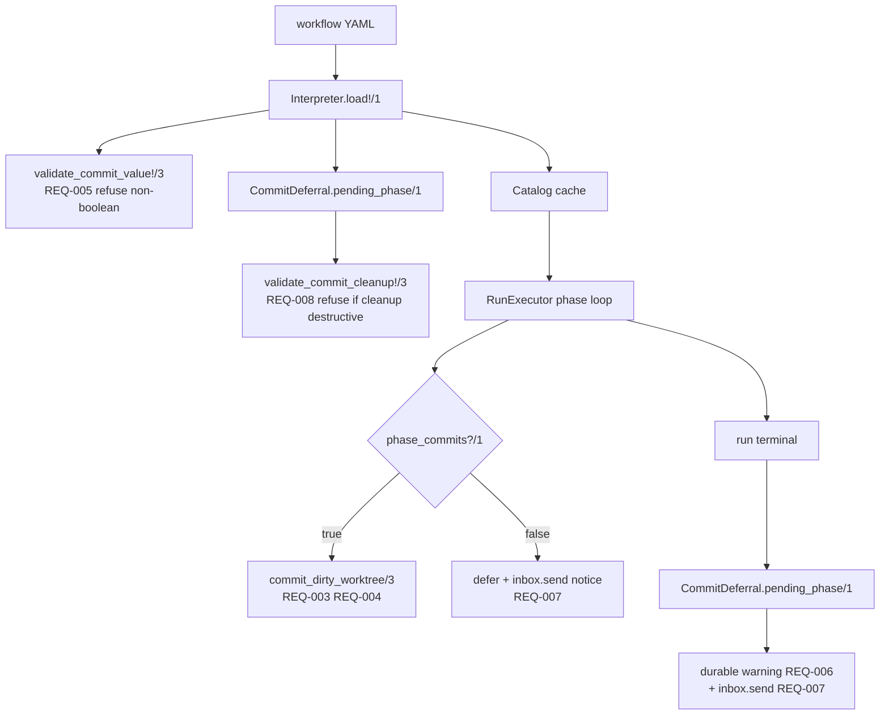

# TRD: Operator-Controlled Phase Commits (`commit:` tag)

## Metadata

| Field | Value |
|---|---|
| Document ID | TRD-2026-d306444f |
| Label | trd-phase-commit |
| PRD Reference | docs/PRD/PRD-2026-d306444f-phase-commit-control.md |
| Version | 1.0.0 |
| Status | Draft |
| Correlation ID | d306444f (shared with source PRD) |
| Design Readiness Score | 4.5 (PASS) |

## Source Task

Implement the phase-level `commit:` manifest tag specified by
`PRD-2026-d306444f` v1.0.3: `commit: true` commits a phase's work, `commit:
false` defers it to the next committing phase, absent means commit.

**This is a reconciliation, not a greenfield build.** An uncommitted
implementation already exists in the working tree, and the PRD explicitly takes
precedence over it (PRD § "Precedence over the working-tree implementation").
The TRD's job is to bring that code to the specification, which means deleting
one mechanism, changing another, and adding two.

## Requirements Validation

Source PRD validated before ingestion:

| Check | Result |
|---|---|
| Required sections present | PASS — Problem Statement, Goals, Non-Goals, Assumptions, Requirements, Dependency Map, Readiness Gate |
| REQ-NNN sequential and unique | PASS — REQ-001 … REQ-009, no gaps |
| ACs in Given/When/Then | PASS — 21/21 |
| Every Must has ≥2 ACs | PASS — 7 Must, minimum 2 each |
| Constraints and Non-Goals documented | PASS — 6 Non-Goals, 8 assumptions, 1 external dependency |
| Readiness score | 5.0 — PASS (≥4.0), proceed normally |
| Open ambiguity markers | 0 |

## Domain Analysis

**Project type: brownfield.** Every touched module exists.

| Domain | Requirements | Surface |
|---|---|---|
| Manifest schema / parsing | REQ-001, REQ-002, REQ-009 | `workflow/phase_spec.ex`, `workflow/manifest_writer.ex` |
| Load-time validation | REQ-005, REQ-008 | `workflow/interpreter.ex` |
| Run execution / VCS | REQ-003, REQ-004 | `workflow/run_executor.ex` |
| Operator reporting | REQ-006, REQ-007 | `run_executor.ex`, `aggregates/inbox_thread.ex` |

No UI, no HTTP route, no database migration, no external integration. The
feature is entirely internal to the workflow subsystem.

**Existing-code inventory** (verified by reading, not inferred):

| PRD requirement | Current state |
|---|---|
| REQ-001 declare tag | **Exists** — `PhaseSpec.@fields` carries `{:commit, [:commit, "commit"]}` |
| REQ-002 absent ⇒ commit | **Exists** — `phase_commits?/1` totals over `nil \| true \| false`; `fetch_any/2` preserves a present `false` |
| REQ-003 defer | **Exists** — `commit_phase_worktree/4` returns `{:ok, :commit_deferred}` |
| REQ-004 absorb | **Exists** — `commit_dirty_worktree/3` stages the whole worktree |
| REQ-005 non-boolean refusal | **Exists** — `validate_commit_value!/3` (`interpreter.ex:368`) |
| REQ-006 durable warning | **Contradicts PRD** — `interpreter.ex:419-422` *raises* instead of warning |
| REQ-007 run-scoped notices | **Absent** |
| REQ-008 cleanup×deferral refusal | **Absent** |
| REQ-009 round-trip | **Partial** — YAML path works; snapshot path unverified |
| *(no PRD requirement)* | **Must be deleted** — `interpreter.ex:404-408` + `gated_phase?/1`, the directory-conditioned refusal the PRD removed |

## Reused Capabilities

`trd-graph-cli capabilities docs/TRD --json` returns `{"capabilities": []}` — no
foundational TRD exists, so there is nothing to dedup against and no cross-TRD
dependency to record. Two in-repo mechanisms are reused rather than rebuilt:

| Reused mechanism | Provider | Used by |
|---|---|---|
| Run-scoped operator inbox (`inbox.send` → `InboxMessageAppended` on `inbox:<run_id>`) | `aggregates/inbox_thread.ex` | REQ-007 |
| Workflow-level `worktree.cleanup` normalization | `workflow/worktree_spec.ex` | REQ-008 |

## Architecture Decision

**Selected: Option C — follow the `WorktreeSpec` precedent.**

Validation stays in `Interpreter` beside `validate_worktree!/2`. The deferral
fold is extracted into one small pure predicate module, `Workflow.CommitDeferral`,
reused by both of its consequences. The never-committed *consequence* moves out
of `Interpreter` to run terminal in `RunExecutor`.

**The forcing constraint, common to every option:** the predicate is a load-time
manifest property, but REQ-007 requires the warning be readable against a
specific run. `Interpreter` runs once at load and its result is cached by
`Catalog`; it has no `run_id` and cannot address `inbox:<run_id>`. Computation
and emission must therefore be split no matter which option is chosen. This is
what disqualified Option A.

### Alternatives Considered

| Option | Approach | Why not chosen |
|---|---|---|
| A — minimal in-place edit | Mutate `validate_commit_deferral!/2`; downgrade the raise to `Logger.warning`; read cleanup inline | Leaves the warning server-wide at load time, so REQ-007's run-scoped readability is unimplementable — it would ship a Should that cannot be satisfied |
| B — `Workflow.CommitPlan` typed struct | A typed commit plan computed once, consumed by `Interpreter` and `RunExecutor` | Strongest §5.1 conformance, but a struct with spans and flags is disproportionate surface for one boolean tag; the predicate answers a single question |
| **C — `WorktreeSpec` precedent** | Pure predicate module + validation in `Interpreter` + emission in `RunExecutor` | **Selected.** Matches the pattern Thread A established for `worktree:`, keeps one predicate implementation, satisfies every REQ including REQ-007 |

### Key Technical Decisions

1. **One predicate, two consequences.** `CommitDeferral.pending_phase/1` returns
   `nil` or the index of the earliest phase whose work is still pending at the
   end of the manifest. REQ-006 (warn) and REQ-008 (refuse) both read it. The
   PRD mandates this sharing; two independent folds would be the drift §5.5
   forbids.
2. **The predicate is pure and total.** It takes the raw phase list and returns
   `nil | non_neg_integer()`. No IO, no run state, callable from load and from
   run terminal.
3. **Deletion, not deprecation.** `gated_phase?/1` and its raise clause are
   removed outright — no flag, no shim. The PRD records the gate coupling as a
   Non-Goal, so the code has no specification to fall back to.
4. **Warning emission is run-terminal, not load-time**, for the reason above.
5. **Notices carry structured payload fields.** `inbox.send` merges extra
   payload keys onto `InboxMessageAppended`, so `phase_index` and
   `deferred_from` travel as fields beside `body` — satisfying AC-007-3 without
   new machinery.
6. **`cleanup: never` is unaffected.** REQ-008 refuses only `always` and
   `on_success`; the default remains a warning. Stated explicitly because
   over-refusal is the risk the PRD flags on REQ-008.

## System Architecture Design

### Components

| Component | Responsibility | Change |
|---|---|---|
| `Workflow.CommitDeferral` | Pure predicate: which phase's work is still pending at manifest end | **NEW** |
| `Workflow.Interpreter` | Load-time refusals: non-boolean value (REQ-005), cleanup conflict (REQ-008) | Modified — one clause deleted, one added |
| `Workflow.PhaseSpec` | Carry `:commit` through normalization | Unchanged |
| `Workflow.RunExecutor` | Commit-or-defer per phase; emit deferral notice and run-terminal warning | Modified |
| `Aggregates.InboxThread` | Append run-scoped operator messages | Unchanged (consumed via `inbox.send`) |
| `Workflow.ManifestWriter` | Round-trip `commit:` | Unchanged (verified only) |

### Data Flow

The predicate appears twice by design: once at load to decide refusal, once at
run terminal to decide the warning. It is the same function both times.

### Integration Points

| Boundary | Protocol | Payload |
|---|---|---|
| `RunExecutor` → inbox | `CommandRouter.dispatch/1`, command type `inbox.send` | `%{run_id, message_id, body, phase_index, deferred_from}` |
| `Interpreter` → operator | raise `Workflow.MissingRequiredPhaseError` | message naming phase index and cleanup mode |
| `RunExecutor` → operator log | `Logger.warning` | durable warning text (REQ-006 independent of REQ-007) |

## Master Task List

### PR 1: Reconcile the loader to the PRD

**Shippable State:** An operator can author a workflow that defers a phase
immediately before a `requiredFile:` phase and Foreman loads and runs it —
previously this was refused at load. The never-committed case still refuses
exactly as before, so no silent-failure window opens. Existing `commit:`
behavior (declaration, default, deferral, absorption, non-boolean refusal,
YAML and snapshot round-trip) is pinned by tests.

- [ ] **TRD-001**: Extract the deferral fold into `Workflow.CommitDeferral` with a pure, total `pending_phase/1` returning `nil | non_neg_integer()` [satisfies ARCH] (2h)
  - Validates PRD ACs: none directly — enables REQ-006 and REQ-008
  - Implementation AC:
    - [ ] Given a phase list where every deferral is followed by a committing phase, when `pending_phase/1` is called, then it returns `nil`.
    - [ ] Given a phase list whose trailing phase declares `commit: false`, when `pending_phase/1` is called, then it returns that phase's zero-based index.
    - [ ] Given a phase list with two consecutive deferrals and no later commit, when `pending_phase/1` is called, then it returns the index of the *earliest* pending phase.
    - [ ] Given a non-map entry in the phase list, when `pending_phase/1` is called, then it is treated as non-deferring rather than raising.
- [ ] **TRD-001-TEST**: Unit tests for `CommitDeferral.pending_phase/1` covering no-deferral, trailing deferral, consecutive deferrals, and malformed entries [verifies TRD-001] [satisfies ARCH] [depends: TRD-001] (1h)
- [ ] **TRD-002**: Delete the directory-conditioned refusal — `gated_phase?/1` and the `requiredFile` raise clause at `interpreter.ex:404-408` [satisfies ARCH] [depends: TRD-001] (1h)
  - Validates PRD ACs: none — removes a mechanism the PRD excludes by Non-Goal
  - Implementation AC:
    - [ ] Given a workflow whose phase 0 declares `commit: false` and whose phase 1 declares `requiredFile:`, when the workflow loads, then it loads successfully.
    - [ ] Given the codebase after this change, when `gated_phase?` is searched for, then no definition or call site remains.
- [ ] **TRD-002-TEST**: Assert a deferral preceding a `requiredFile:` phase loads, and that the removed error is no longer raised [verifies TRD-002] [satisfies ARCH] [depends: TRD-002] (1h)
- [ ] **TRD-003**: Rewrite the Interpreter tests that assert the deleted refusal so they pin the new contract instead of being removed [satisfies ARCH] [depends: TRD-002] (1.5h)
  - Implementation AC:
    - [ ] Given the Interpreter test file after this change, when it runs, then no test asserts the `requiredFile`-plus-deferral refusal.
    - [ ] Given the same file, when it runs, then a test asserts that manifest loads successfully.
- [ ] **TRD-004**: Correct the three stale comments citing `validate_commit_deferral!/2` as a live guarantee — `run_executor.ex:1422-1426`, `run_executor.ex:1868-1872`, `plan_context.ex:120-124` [satisfies ARCH] [depends: TRD-002] (0.5h)
  - Implementation AC:
    - [ ] Given the codebase after this change, when `validate_commit_deferral!` is searched for outside its own definition, then no comment claims it proves a discovery gate is safe.
- [ ] **TRD-005**: Add test coverage for `commit:` being inert when the workflow declares `worktree: enabled: false` [satisfies REQ-003] (1h)
  - Validates PRD ACs: AC-003-1, AC-003-2, AC-003-3
  - Implementation AC:
    - [ ] Given a workflow declaring `worktree: enabled: false` and a phase declaring `commit: false`, when the phase completes, then the phase succeeds and no commit or error occurs.
    - [ ] Given the same workflow with `commit: true`, when the phase completes, then the outcome is identical.
    - [ ] Given a worktree-enabled workflow whose phase declares `commit: false` and wrote a file, when the phase completes, then the branch tip is unchanged and the file is still present in the worktree.
- [ ] **TRD-006**: Add a `prd`-shaped test fixture whose first three phases defer and whose fourth commits, asserting document batching [satisfies REQ-004] (2h)
  - Validates PRD ACs: AC-004-1, AC-004-2
  - Implementation AC:
    - [ ] Given the fixture run, when it reaches the implementation phase, then the PRD and TRD documents are on exactly one commit.
    - [ ] Given the same run, when the implementation phase commits, then its commit is distinct from the document commit.
    - [ ] Given the fixture, when it is compared to `priv/defaults/workflows/prd.yaml`, then the bundled manifest is unmodified and still ships every phase `commit: true`.
- [ ] **TRD-007**: Add test coverage for a quoted `commit: "false"` being refused at load rather than coerced [satisfies REQ-005] (1h)
  - Validates PRD ACs: AC-005-1, AC-005-2
  - Implementation AC:
    - [ ] Given a phase declaring `commit: "false"`, when the workflow loads, then loading raises naming the phase and stating `commit` must be a boolean.
    - [ ] Given a phase declaring `commit: maybe`, when the workflow loads, then loading raises with the same class of error and no run is dispatched.
- [ ] **TRD-008**: Add test coverage for the run-record snapshot round-trip preserving boolean `commit:` [satisfies REQ-009] (1.5h)
  - Validates PRD ACs: AC-009-1, AC-009-2
  - Implementation AC:
    - [ ] Given a phase declaring `commit: false`, when the workflow snapshot is recorded and read back, then the value is boolean `false`, not the string `"false"` and not absent.
    - [ ] Given each of the 11 bundled manifests, when written out and re-read, then every phase's `commit` value is unchanged, including phases where it is absent.

- [ ] **TRD-013**: Add test coverage pinning declaration and default semantics — boolean typing of a present tag, and that an absent tag is neither synthesized nor treated as `false` [satisfies REQ-001] (1.5h)
  - Validates PRD ACs: AC-001-1, AC-001-2, AC-002-1, AC-002-2
  - Implementation AC:
    - [ ] Given a phase declaring `commit: true`, when the workflow loads, then the phase carries boolean `true`, not the string `"true"`.
    - [ ] Given a phase declaring `commit: false`, when the workflow loads, then the phase carries boolean `false` and that value reaches `phase_commits?/1`.
    - [ ] Given a phase with no `commit:` key, when the workflow loads, then the normalized spec has no `:commit` key at all — absent is not backfilled with `true`.
    - [ ] Given that same phase, when it completes with changes in the worktree, then those changes are committed.

### PR 2: Never-committed work warns instead of refusing, and unsatisfiable cleanup refuses

**Shippable State:** An operator can author a workflow whose final phase defers;
it loads, the run executes, and a durable warning records that work was left
uncommitted so an absent PR is attributable. A workflow combining `cleanup:
always` (or `on_success`) with never-committed deferred work is refused at load,
naming the deferring phase and the cleanup mode, instead of failing later as an
unattributable `git worktree remove` error.

- [ ] **TRD-009**: Replace the never-committed raise at `interpreter.ex:419-422` with a run-terminal durable warning emitted from `RunExecutor`, reading `CommitDeferral.pending_phase/1` [satisfies REQ-006] [depends: TRD-001, TRD-002] (3h)
  - Validates PRD ACs: AC-006-1, AC-006-2, AC-006-3
  - Implementation AC:
    - [ ] Given a workflow whose last committing opportunity declares `commit: false` and which declares `cleanup: never`, when it loads, then it loads successfully and the run executes.
    - [ ] Given that run, when it reaches terminal, then a durable warning states that work was left uncommitted and names the deferring phase.
    - [ ] Given a run that defers and then fails before any committing phase, when it reaches terminal, then the same warning is emitted.
    - [ ] Given a run in which every deferral was absorbed, when it reaches terminal, then no warning is emitted.
- [ ] **TRD-009-TEST**: Tests for the durable warning across the manifest-shape path, the run-failure path, and the absorbed (no-warning) path [verifies TRD-009] [satisfies REQ-006] [depends: TRD-009] (2h)
- [ ] **TRD-010**: Add `validate_commit_cleanup!/3` to `Interpreter`, refusing a manifest whose `worktree.cleanup` is `always` or `on_success` when `CommitDeferral.pending_phase/1` is non-nil [satisfies REQ-008] [depends: TRD-001, TRD-009] (2.5h)
  - Validates PRD ACs: AC-008-1, AC-008-2
  - Implementation AC:
    - [ ] Given a workflow declaring `cleanup: always` whose final phase declares `commit: false`, when it loads, then loading fails naming the deferring phase and the cleanup mode, and no run is dispatched.
    - [ ] Given a workflow declaring `cleanup: always` whose deferring phase is followed by a committing phase, when it loads, then it loads successfully.
    - [ ] Given a workflow declaring `cleanup: never` whose final phase defers, when it loads, then it loads successfully and REQ-006's warning path applies instead.
    - [ ] Given a workflow declaring `cleanup: on_success` whose final phase defers, when it loads, then loading fails.
- [ ] **TRD-010-TEST**: Tests covering all four cleanup modes crossed with absorbed and never-absorbed deferrals, asserting refusal only for the unsatisfiable combinations [verifies TRD-010] [satisfies REQ-008] [depends: TRD-010] (2h)

### PR 3: Deferrals and warnings are readable against their run

**Shippable State:** An operator reviewing a specific run sees, in that run's
inbox, which phases deferred their work and — when applicable — that work was
left uncommitted, without consulting server-wide logs. The messages carry
structured `phase_index` and `deferred_from` fields, so the planned
Telegram/Slack channel can deliver them without this feature changing.

- [ ] **TRD-011**: Emit a per-phase deferral notice via `inbox.send` when a phase completes with `commit: false`, naming the phase [satisfies REQ-007] [depends: TRD-009] (2.5h)
  - Validates PRD ACs: AC-007-1
  - Implementation AC:
    - [ ] Given a phase declaring `commit: false`, when it completes, then an `InboxMessageAppended` event exists on `inbox:<run_id>` identifying that phase as having deferred.
    - [ ] Given a phase that commits, when it completes, then no deferral notice is appended.
    - [ ] Given a failure of the inbox dispatch, when the phase completes, then the phase result is unchanged — reporting never fails the run.
- [ ] **TRD-011-TEST**: Tests asserting the deferral notice appears for a deferring phase, is absent for a committing phase, and that dispatch failure does not fail the phase [verifies TRD-011] [satisfies REQ-007] [depends: TRD-011] (1.5h)
- [ ] **TRD-012**: Route REQ-006's run-terminal warning to the run inbox alongside its durable log line, carrying structured `phase_index` and `deferred_from` payload fields [satisfies REQ-007] [depends: TRD-009, TRD-011] (2h)
  - Validates PRD ACs: AC-007-2, AC-007-3
  - Implementation AC:
    - [ ] Given a run that triggered REQ-006's warning, when the operator reads that run's inbox, then the warning is present without consulting server-wide output.
    - [ ] Given any notice this feature emits, when the persisted event is inspected, then `phase_index` and `deferred_from` are present as payload fields, not only inside the body string.
    - [ ] Given REQ-007 were reverted, when a run leaves work uncommitted, then REQ-006's durable log warning still occurs.
- [ ] **TRD-012-TEST**: Tests asserting per-run readability of the warning and the presence of structured payload fields on the persisted event [verifies TRD-012] [satisfies REQ-007] [depends: TRD-012] (1.5h)

## Sprint Planning

Informational grouping only — not parsed by `implement-trd-beads`.

## Sprint 1

PR 1 — loader reconciliation and behavior pinning. 14h across 11 tasks.
Delivers the PRD's precedence item 1 (delete the removed rule) and closes all
four pre-existing AC coverage gaps.

## Sprint 2

PR 2 and PR 3 — the shared predicate's two consequences, then run-scoped
reporting. 17h across 8 tasks. PR 2 must land before PR 3 because REQ-007
routes the warning REQ-006 introduces.

## Acceptance Criteria Traceability

| REQ-NNN | Description | Implementation Tasks | Test Tasks |
|---|---|---|---|
| REQ-001 | Declare a phase-level `commit:` boolean | *(exists)* TRD-013 | TRD-013 |
| REQ-002 | Default to committing when the tag is absent | *(exists)* TRD-013 | TRD-013 |
| REQ-003 | Defer a phase's work when `commit: false` | *(exists)* TRD-005 | TRD-005 |
| REQ-004 | Absorb deferred work into the next committing phase | *(exists)* TRD-006 | TRD-006 |
| REQ-005 | Reject a non-boolean `commit:` value at load | *(exists)* TRD-007 | TRD-007 |
| REQ-006 | Emit a durable warning when deferred work is never committed | TRD-009 | TRD-009-TEST |
| REQ-007 | Make deferrals and warnings readable against their run | TRD-011, TRD-012 | TRD-011-TEST, TRD-012-TEST |
| REQ-008 | Refuse a manifest whose cleanup cannot coexist with a deferral | TRD-010 | TRD-010-TEST |
| REQ-009 | Preserve the tag across serialization round-trips | *(exists)* TRD-008 | TRD-008 |
| ARCH | Predicate extraction, deletion, comment repair | TRD-001, TRD-002, TRD-003, TRD-004 | TRD-001-TEST, TRD-002-TEST |

Requirements marked *(exists)* already have a working implementation; the named
task adds the missing verification rather than building the behavior.

## Target Files

| File | Change |
|---|---|
| `packages/foreman_server/lib/foreman_server/workflow/commit_deferral.ex` | NEW — pure predicate |
| `packages/foreman_server/lib/foreman_server/workflow/interpreter.ex` | Delete gated refusal + `gated_phase?/1`; delete never-committed raise; add `validate_commit_cleanup!/3` |
| `packages/foreman_server/lib/foreman_server/workflow/run_executor.ex` | Run-terminal warning; deferral notice; comment repair ×2 |
| `packages/foreman_server/lib/foreman_server/workflow/plan_context.ex` | Comment repair |
| `packages/foreman_server/test/foreman_server/workflow/commit_deferral_test.exs` | NEW |
| `packages/foreman_server/test/foreman_server/workflow/interpreter_test.exs` | Rewrite deleted-refusal tests; add cleanup-refusal tests |
| `packages/foreman_server/test/foreman_server/workflow/run_executor_run_worktree_test.exs` | Warning, notice, and no-worktree coverage |

## Architecture Self-Critique

1. **Reporting failure could fail the run.** `inbox.send` goes through
   `CommandRouter`, which can reject or time out. A notice is diagnostic; losing
   one must never fail a phase or a run. Resolution: TRD-011 and TRD-012 both
   carry an Implementation AC requiring the phase/run result to be unchanged on
   dispatch failure, and the warning is emitted to the durable log
   independently of the inbox (REQ-006 owns durability, REQ-007 owns
   readability — the PRD's split makes this decomposable).
2. **The predicate is evaluated twice and could diverge.** Load-time refusal and
   run-terminal warning read the manifest at different moments; a hot-reloaded
   manifest (`Catalog` polls every 2s) could differ between them. Resolution:
   both calls take the phase list from the run's own workflow snapshot rather
   than re-reading disk, so a mid-run edit cannot change the answer. Recorded as
   an Implementation AC on TRD-009.
3. **`on_success` refusal is broader than the failure it prevents.** A workflow
   declaring `cleanup: on_success` with a trailing deferral only breaks when the
   run succeeds. Refusing at load rejects it unconditionally. Accepted
   deliberately: the PRD's satisfiability rule treats a guaranteed happy-path
   failure as unsatisfiable, and TRD-010's ACs pin both directions so the
   breadth is a decision rather than an accident.

## Task Coverage Analysis

1. **Every PRD requirement has a task.** All nine REQs appear in the
   traceability matrix with at least one task; no task references a REQ absent
   from the PRD. 19 tasks total across 3 PRs.
2. **Five requirements are verification-only.** REQ-001, REQ-002, REQ-003,
   REQ-004, REQ-005, and REQ-009 already have working implementations, so their
   tasks add tests. This is called out explicitly because a reader could
   otherwise mistake the matrix for greenfield scope and re-implement working
   code — the failure mode AGENTS.md warns about when a document is read as a
   specification for work already done.
3. **No task exceeds 3h.** Largest is TRD-009 at 3h; the 8h breakdown threshold
   is not approached.
4. **Both non-REQ task classes are annotated.** Four tasks carry
   `[satisfies ARCH]` for the extraction, deletion, and comment repair that no
   PRD requirement covers directly.

## Dependency and Estimate Review

- **Longest chain is depth 4**: TRD-001 → TRD-009 → TRD-011 → TRD-012 (and
  TRD-012-TEST at depth 5). Within tolerance, and it reflects a real ordering —
  the predicate must exist before the warning, which must exist before it can
  be routed to the inbox.
- **No cycles.** TRD-010 depends on TRD-009 only for sequencing (the refusal is
  meaningless while the raise still exists), not for code.
- **Estimate consistency:** test-only tasks are 1–2h; implementation tasks
  2–3h. TRD-006 is 2h rather than 1h because it needs a multi-phase fixture with
  real git, matching the existing `run_executor_test.exs` pattern.
- **Estimate risk:** TRD-009 at 3h is the least certain — moving the
  consequence across a module boundary touches two run-terminal paths
  (`finalize_run/1` and `finalize_terminal_and_stop/2`), and missing either
  reintroduces the silent-success mode. Its AC set covers both.

## Testability Review

All Implementation ACs are objectively verifiable: branch-tip equality, file
presence, raise-or-not at load, persisted event fields, absence of a symbol from
the codebase. No AC uses subjective language. The one AC that could have been
vague — "reporting never fails the run" — is stated as an observable outcome
(the phase result is unchanged under dispatch failure) rather than as a quality.

## Design Readiness Gate

| Dimension | Score | Notes |
|---|---:|---|
| Architecture completeness | 5 | Components, data flow, and all three integration boundaries defined; the load-vs-run split that constrains the design is stated and drove the option choice |
| Task coverage | 5 | 9/9 REQs traced; 15 tasks; ARCH work annotated; verification-only requirements flagged |
| Dependency clarity | 4 | Acyclic and explicit, but TRD-010's dependency on TRD-009 is sequencing rather than code — a real coupling that a reader could misread as technical |
| Estimate confidence | 4 | Consistent and granular, none above 3h; TRD-009 carries genuine uncertainty across two terminal paths |
| **Overall** | **4.5** | **PASS** |

## Foreman Compatibility Check

Not dispatched under `--foreman`: `FOREMAN_ARTIFACT_PATH`,
`FOREMAN_TASK_TITLE`, and `FOREMAN_SOURCE_PRD_PATH` are all unset, so no
artifact contract applies and the source PRD came from the conversation's
explicit next-step command. Behavior is unchanged from a normal interactive run.

## Next Step

`/ensemble:implement-trd-beads docs/TRD/TRD-2026-d306444f-phase-commit-control.md`
