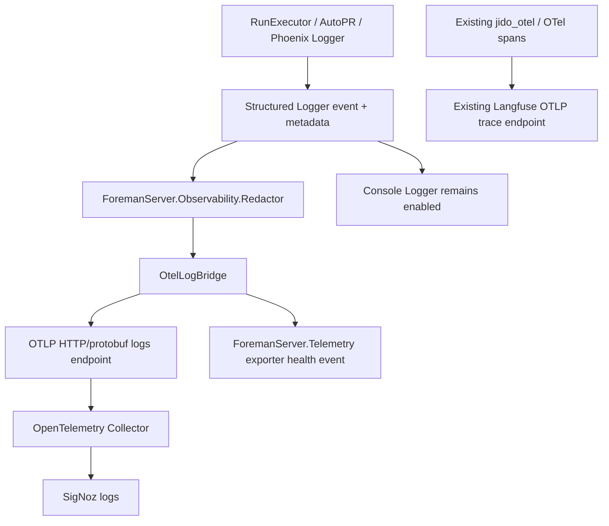
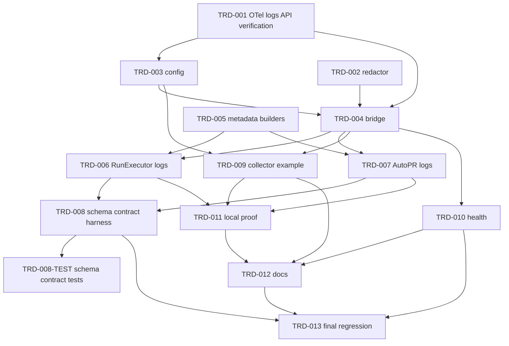

# TRD: Phoenix Logger → OTel → SigNoz Observability Gap

Foreman task title read from `FOREMAN_TASK_TITLE`: **PRD: Phoenix Logger → OTel → SigNoz observability gap**

## Metadata

| Field | Value |
|---|---|
| Document ID | TRD-2026-d852e34b |
| Label | trd-phoenix-otel-signoz-observability |
| PRD Reference | docs/PRD/PRD-2026-d852e34b-phoenix-otel-signoz-observability.md |
| Version | 1.0.0 |
| Status | Draft |
| Correlation ID | d852e34b (shared with source PRD) |
| Design Readiness Score | 4.4 (PASS) |

## Source Task

Scope dual-observability for Foreman: keep Langfuse as the LLM trace destination and add SigNoz as the Phoenix/RunExecutor operational log destination. Plan OTel log instrumentation for `RunExecutor` and `AutoPR`, a collector path into SigNoz, retention expectations, rollout controls, redaction, health signals, tests, and docs.

This TRD creates only the technical plan. It does not implement instrumentation, build dependencies, run collectors, or change runtime behavior.

## Requirements Validation

Source PRD validated before ingestion:

| Check | Result |
|---|---|
| Source PRD path | PASS — `FOREMAN_SOURCE_PRD_PATH` was set and read directly; no recency/glob selection used. |
| Subject match | PASS — PRD title matches `FOREMAN_TASK_TITLE`. |
| Required sections present | PASS — summary, scope, requirements, acceptance criteria, dependency map, readiness gate, TRD decisions. |
| REQ-NNN sequential and unique | PASS — REQ-001 … REQ-016, no gaps. |
| Acceptance criteria format | PASS — 43 ACs use Given/When/Then wording. |
| Every Must has edge coverage | PASS — each Must requirement has at least 2 ACs. |
| Constraints / non-goals | PASS — Langfuse replacement, dashboards, managed SigNoz infra, new lifecycle states, and run-log product expansion are out of scope. |
| PRD readiness score | 4.7 — PASS (≥4.0). |

## Domain Analysis

**Project type: brownfield.** The relevant backend surfaces already exist.

| Domain | Requirements | Source / Target Surface |
|---|---|---|
| Existing trace topology | REQ-001, REQ-016 | `packages/foreman_server/config/config.exs`, `prod.exs`, `mix.exs`, Langfuse OTLP trace config. |
| Logger → OTel logs bridge | REQ-002, REQ-003, REQ-009, REQ-014 | New `ForemanServer.Observability` modules plus application config. |
| RunExecutor log coverage | REQ-004, REQ-006, REQ-008, REQ-013 | `packages/foreman_server/lib/foreman_server/workflow/run_executor.ex` and tests. |
| AutoPR log coverage | REQ-005, REQ-006, REQ-008, REQ-013 | `packages/foreman_server/lib/foreman_server/workflow/auto_pr.ex` and tests. |
| Collector / SigNoz operations | REQ-007, REQ-010, REQ-011, REQ-012, REQ-015 | config examples, docs, validation commands, optional doctor hook. |
| Redaction / metadata policy | REQ-003, REQ-008, REQ-013, REQ-014 | New sanitizer/metadata whitelist shared by bridge and structured emitters. |

Key gaps:

- Current OTel config is trace-focused and Langfuse-authenticated; a SigNoz log path must not reuse or repoint it blindly.
- `RunExecutor` and `AutoPR` log mostly free-form strings; SigNoz needs structured, redacted metadata.
- `ForemanServer.Telemetry` centralizes metrics/events, but there is no app-owned log export contract or exporter-health event.
- Docs currently warn `foreman doctor` behavior may be narrower than ideal; any health check must be verified against actual Go/Elixir source before documenting.

## Reused Capabilities

`trd-graph-cli capabilities docs/TRD --json` returned an empty capability list, and `trd-graph-cli overlap docs/TRD` reported no overlapping target files across TRDs. No foundational TRD provides this capability.

In-repo mechanisms reused rather than duplicated:

| Existing capability | Provider | Use |
|---|---|---|
| OpenTelemetry trace resource / exporter config | `config.exs`, `prod.exs`, `:opentelemetry_exporter` | Preserve Langfuse traces and reuse `service.name = foreman_server`. |
| Telemetry event wrapper | `ForemanServer.Telemetry` | Add exporter-health events with typed helper functions. |
| Run execution context | `RunExecutor` state and phase data | Populate run/task/project/workflow/phase fields without guessing missing values. |
| AutoPR git/GitHub result handling | `Workflow.AutoPR` | Add operation/outcome/branch/PR metadata at existing decision points. |
| Existing docs discipline | `README.md`, `docs/user-guide.md`, `docs/cli-reference.md`, `AGENTS.md` | Document only verified behavior and commands. |

## Architecture Alternatives

| Option | Summary | Pros | Cons | Risk |
|---|---|---|---|---|
| A — config-only exporter | Try to wire an off-the-shelf Logger/OTel handler directly in config and update docs. | Smallest change; fastest if dependency has complete logs support. | High risk of duplicate/noisy logs, weak redaction, trace config coupling, and hidden API mismatch. | High |
| B — full observability subsystem | Build a richer internal observability layer with dashboards, queues, retries, and broad Phoenix instrumentation. | Most scalable; centralizes all operational telemetry. | Over-scoped for this PRD; drifts into managed SigNoz/product work. | Medium |
| C — Foreman-owned log bridge façade + dependency-pinned adapter | Add a small `ForemanServer.Observability` boundary that verifies the selected OTel logs API, sanitizes Logger records, exports to a separate SigNoz log endpoint, and exposes health. | Balanced; keeps Langfuse traces separate; centralizes redaction and tests; avoids vendor coupling. | Requires an upfront dependency/API spike before coding the adapter. | Low/Medium |

Foreman mode: auto-selected Option C (balanced brownfield fit: small owned boundary, dependency-pinned adapter, separate SigNoz log path, no trace repointing).

## Architecture Decision

Selected approach: **Option C — Foreman-owned log bridge façade + dependency-pinned adapter.**

The implementation must introduce one narrow observability boundary rather than spreading OTel calls across `RunExecutor`, `AutoPR`, and config. `RunExecutor` and `AutoPR` will emit structured Logger events or call a small helper that records message + metadata. A log bridge converts those records to the selected OpenTelemetry Logs Data Model, redacts disallowed fields, and exports through a separate OTLP HTTP/protobuf log route aimed at a collector/SigNoz.

### Key Technical Decisions

1. **Trace config is preserved first.** Existing Langfuse trace variables remain the default trace path. New SigNoz log variables are additive and separately named.
2. **OTel logs API is verified before implementation.** First implementation work inspects `:opentelemetry`, `:opentelemetry_api`, and `:opentelemetry_exporter` contracts plus OpenTelemetry Logs Data Model docs, then pins the chosen bridge with tests. No task assumes trace exporter APIs automatically support logs.
3. **One redaction boundary.** A `ForemanServer.Observability.Redactor` (name may be refined during implementation) owns whitelists/denylists for metadata and message/path sanitization. Structured emitters and the bridge both use it.
4. **Separate log export config.** Use app-scoped variables such as `FOREMAN_SIGNOZ_LOGS_ENABLED`, `FOREMAN_SIGNOZ_OTLP_ENDPOINT`, `FOREMAN_SIGNOZ_OTLP_HEADERS`, `FOREMAN_SIGNOZ_LOG_LEVEL`, and timeout/batch settings. Exact names must be verified/locked in implementation docs and tests.
5. **Console logging stays available.** Enabling SigNoz export must not remove local console logs; duplicate SigNoz records are prevented by one bridge registration and tests.
6. **Health is local and observable.** Repeated exporter/collector failures emit a `ForemanServer.Telemetry` event and Logger warning/error; a doctor/troubleshooting path may check config/endpoint health if supported by existing CLI/source.
7. **Missing context is not guessed.** Run/task/phase/project/workflow/worker fields are populated only when state has them; otherwise fields are absent/null per the pinned schema.

## System Architecture Design

### Components

| Component | Responsibility | Change |
|---|---|---|
| `ForemanServer.Observability.OtelLogBridge` | Own Logger/handler integration and OTel log record conversion. | New |
| `ForemanServer.Observability.Redactor` | Sanitize message bodies, metadata, headers, command output, prompts, env values, DB URLs, and paths. | New |
| `ForemanServer.Observability.LogMetadata` | Build whitelisted canonical attributes (`run_id`, `task_id`, `phase_index`, `phase_name`, `worker_id`, branches, outcome, trace/span ids). | New |
| `ForemanServer.Telemetry` | Emit exporter/collector health events through typed helpers. | Modified |
| `RunExecutor` | Add structured lifecycle/failure/worktree/artifact/finalization logs at existing decision points. | Modified |
| `AutoPR` | Add structured PR operation logs for branch resolution, ahead check, push, create, noop, and failure. | Modified |
| Config files | Add opt-in SigNoz log exporter settings without mutating Langfuse trace settings. | Modified |
| Docs / validation | Explain dual observability, retention, env vars, local SigNoz query, and troubleshooting. | Modified |

### Data Flow



### Integration Points

| Boundary | Protocol / API | Payload / Contract |
|---|---|---|
| Foreman Logger → bridge | Selected Erlang/Elixir Logger handler or capture adapter, verified before use. | severity, timestamp, message, source module/function/line, sanitized metadata. |
| Bridge → OTel SDK/exporter | Pinned OpenTelemetry Logs Data Model and dependency API. | log record body, severity, attributes, resource `service.name=foreman_server`, trace/span ids when active. |
| App → collector | OTLP HTTP/protobuf logs over configured endpoint/headers. | logs only by default; trace fan-out explicit. |
| Collector → SigNoz | SigNoz-supported OTLP logs receiver/exporter pipeline. | queryable by service, severity, module, run/task/phase fields. |
| Bridge failures → Telemetry | `ForemanServer.Telemetry` helper. | status, reason class, endpoint host/port without credentials, retry count/backoff if available. |
| Docs / CLI validation | Verified commands only. | env vars, local setup, known log trigger, SigNoz query, retention warning. |

## Master Task List

### PR 1: Prove and install the log bridge foundation

**Shippable State:** Operators can enable the SigNoz log exporter in config and Foreman boots normally with Langfuse traces unchanged; test-captured Logger records are converted to sanitized OTel log payloads without network calls.

- [ ] **TRD-001**: Verify the exact Erlang/Elixir OpenTelemetry Logs Data Model, semantic-convention version, and dependency API supported by the pinned `:opentelemetry`, `:opentelemetry_api`, and `:opentelemetry_exporter` deps; record the chosen adapter contract in code comments/tests [satisfies REQ-003] [satisfies REQ-006] (3h)
  - Validates PRD ACs: AC-003-3, AC-006-2
  - Implementation AC:
    - [ ] Given the pinned deps in `mix.lock`, when implementation inspects source/docs, then the selected logs API/module/function names are documented in a test or module comment.
    - [ ] Given an unsupported or absent logs API is found, when implementation proceeds, then it introduces a tested adapter/fallback rather than pretending trace export covers logs.
- [ ] **TRD-001-TEST**: Add dependency-contract tests or compile-time checks that fail loudly if the selected OTel logs bridge API changes [verifies TRD-001] [satisfies REQ-003] [satisfies REQ-006] [depends: TRD-001] (2h)
- [ ] **TRD-002**: Add `ForemanServer.Observability.Redactor` with explicit metadata whitelist and sensitive-value denylist for headers, credentials, prompts, LLM content, DB URLs, env vars, command output, and local paths [satisfies REQ-008] [satisfies REQ-003] (3h)
  - Validates PRD ACs: AC-003-1, AC-008-1, AC-008-3
  - Implementation AC:
    - [ ] Given metadata includes whitelisted fields, when redacted, then diagnostic fields are preserved.
    - [ ] Given metadata/message text includes sentinel secrets, auth headers, prompt bodies, DB URLs, and home paths, when redacted, then the sensitive values are absent.
    - [ ] Given a field is unknown, when redacted, then it is dropped unless explicitly whitelisted.
- [ ] **TRD-002-TEST**: Unit tests for redaction whitelist/denylist, sentinel secret removal, and path/header/command-output sanitization [verifies TRD-002] [satisfies REQ-008] [satisfies REQ-013] [depends: TRD-002] (2h)
- [ ] **TRD-003**: Add opt-in SigNoz log export configuration separate from existing Langfuse trace configuration, including enable flag, endpoint, headers, level/filter, timeout, and no-op test behavior [satisfies REQ-001] [satisfies REQ-002] [satisfies REQ-009] [satisfies REQ-014] [satisfies REQ-016] [depends: TRD-001] (3h)
  - Validates PRD ACs: AC-001-1, AC-001-2, AC-002-3, AC-009-1, AC-009-2, AC-009-3, AC-014-2, AC-016-2
  - Implementation AC:
    - [ ] Given no SigNoz variables are set in dev/test, when Foreman boots, then no collector is required.
    - [ ] Given Langfuse variables are configured, when SigNoz log variables are added, then existing trace endpoint/header config is unchanged.
    - [ ] Given test config is active, when logs are emitted, then no network call is made.
- [ ] **TRD-003-TEST**: Config tests proving default no-op, explicit enablement, independent Langfuse trace settings, production default level `info`, and test no-network behavior [verifies TRD-003] [satisfies REQ-001] [satisfies REQ-009] [satisfies REQ-014] [satisfies REQ-016] [depends: TRD-003] (2h)
- [ ] **TRD-004**: Implement `ForemanServer.Observability.OtelLogBridge` behind a single registration boundary that converts Logger events to sanitized OTel log payloads and preserves console logging [satisfies REQ-002] [satisfies REQ-003] [satisfies REQ-014] [depends: TRD-001] [depends: TRD-002] [depends: TRD-003] (4h)
  - Validates PRD ACs: AC-002-1, AC-002-2, AC-002-3, AC-003-1, AC-003-2, AC-014-1
  - Implementation AC:
    - [ ] Given export is enabled and a qualifying Logger event is emitted, when captured through the bridge, then one sanitized OTel log payload is produced.
    - [ ] Given export is disabled, when a Logger event is emitted, then local Logger behavior is unchanged and no OTel payload is produced.
    - [ ] Given the collector/exporter is unavailable, when a log is emitted, then Foreman does not crash.
- [ ] **TRD-004-TEST**: Bridge tests for payload shape, duplicate prevention, console-preserving behavior, collector failure tolerance, severity/timestamp/module/message preservation, and trace/span fields when active [verifies TRD-004] [satisfies REQ-002] [satisfies REQ-003] [satisfies REQ-006] [satisfies REQ-014] [depends: TRD-004] (3h)

### PR 2: Add structured workflow operational logs

**Shippable State:** Operators running a Foreman workflow can search SigNoz/captured logs by `run_id` and see structured RunExecutor and AutoPR lifecycle, failure, and PR-decision records with secrets redacted.

- [ ] **TRD-005**: Add canonical log metadata builders for run/task/project/workflow/phase/worker context and active trace/span identifiers, with absent fields left absent/null instead of guessed [satisfies REQ-006] [satisfies REQ-004] [depends: TRD-002] (2h)
  - Validates PRD ACs: AC-004-1, AC-004-4, AC-006-1, AC-006-2, AC-006-3
  - Implementation AC:
    - [ ] Given complete RunExecutor state, when metadata is built, then run, task, project, workflow, phase, worker, and trace/span fields are present where available.
    - [ ] Given partial state, when metadata is built, then unavailable fields are absent/null and no guessed values are introduced.
- [ ] **TRD-005-TEST**: Unit tests for metadata builders covering complete state, partial state, concurrent run IDs, worker IDs, and active/no-active span contexts [verifies TRD-005] [satisfies REQ-006] [depends: TRD-005] (2h)
- [ ] **TRD-006**: Instrument RunExecutor lifecycle logs for run start, task claim, phase start/complete/block/fail, terminal failure, finalization, VFS binding, worktree handling, phase artifact handling, and cleanup warnings/errors [satisfies REQ-004] [satisfies REQ-006] [satisfies REQ-008] [depends: TRD-004] [depends: TRD-005] (5h)
  - Validates PRD ACs: AC-004-1, AC-004-2, AC-004-3, AC-004-4, AC-006-1, AC-008-1, AC-008-3
  - Implementation AC:
    - [ ] Given each named lifecycle transition occurs, when the log is captured, then operation/outcome and correlation metadata are present.
    - [ ] Given a failure reason is logged, when exported, then the reason shape is preserved after redaction.
    - [ ] Given worktree/path/artifact errors include local paths, when exported, then sensitive path components are sanitized.
- [ ] **TRD-006-TEST**: RunExecutor tests for representative lifecycle, failure, worktree, VFS, artifact, cleanup, missing-context, and concurrent-run log records [verifies TRD-006] [satisfies REQ-004] [satisfies REQ-006] [satisfies REQ-013] [depends: TRD-006] (4h)
- [ ] **TRD-007**: Instrument AutoPR logs for branch context resolution, commits-ahead check, git push, PR create, noop decisions, success, and git/gh failures with sanitized command output [satisfies REQ-005] [satisfies REQ-006] [satisfies REQ-008] [depends: TRD-004] [depends: TRD-005] (3h)
  - Validates PRD ACs: AC-005-1, AC-005-2, AC-005-3, AC-006-1, AC-008-1, AC-008-3
  - Implementation AC:
    - [ ] Given AutoPR creates a PR, when logs are captured, then `run_id`, branches, operation, outcome, and PR URL are queryable fields.
    - [ ] Given git/gh fails, when logs are captured, then exit code and sanitized output are present.
    - [ ] Given AutoPR noops, when logs are captured, then the reason is structured.
- [ ] **TRD-007-TEST**: AutoPR tests for push/create success, noop, branch context, non-zero git/gh failures, PR URL fielding, and output redaction [verifies TRD-007] [satisfies REQ-005] [satisfies REQ-013] [depends: TRD-007] (3h)
- [ ] **TRD-008**: Add a reusable schema/contract assertion harness for exported RunExecutor and AutoPR records, including required fields, severity/source data, and secret-leak rejection checks [satisfies REQ-013] [satisfies REQ-008] [satisfies REQ-014] [depends: TRD-006] [depends: TRD-007] (2h)
  - Validates PRD ACs: AC-013-1, AC-013-2, AC-013-3, AC-014-1
  - Implementation AC:
    - [ ] Given representative RunExecutor and AutoPR log fixtures, when the harness inspects exported payloads, then required field assertions pass.
    - [ ] Given sentinel secrets appear in inputs, when the harness inspects exported payloads, then no sentinel value appears.
- [ ] **TRD-008-TEST**: Apply the schema/contract harness to representative RunExecutor and AutoPR fixtures and fail on missing fields, duplicate records, or leaked sentinels [verifies TRD-008] [satisfies REQ-013] [satisfies REQ-008] [satisfies REQ-014] [depends: TRD-008] (2h)

### PR 3: Add collector path, health, local proof, and docs

**Shippable State:** Operators can follow documented env vars and collector setup to trigger a known Foreman log, query it in SigNoz by `run_id`, understand 30-day retention expectations, and troubleshoot missing logs without confusing them with Langfuse traces.

- [ ] **TRD-009**: Add a documented local OTel collector/SigNoz log pipeline example using OTLP HTTP/protobuf logs, with independent trace/log routes and credential-safe endpoint/header diagnostics [satisfies REQ-007] [satisfies REQ-001] [depends: TRD-003] [depends: TRD-004] (3h)
  - Validates PRD ACs: AC-001-2, AC-007-1, AC-007-2, AC-007-3
  - Implementation AC:
    - [ ] Given the example collector config is used, when Foreman exports logs, then the collector accepts logs and forwards them to SigNoz.
    - [ ] Given Langfuse and SigNoz are both configured, when one destination is unavailable, then docs/config do not imply the other is disabled.
    - [ ] Given a malformed endpoint/header is configured, when diagnostics run, then credentials are not printed.
- [ ] **TRD-009-TEST**: Configuration/static validation tests for collector example shape, independent traces/logs settings, and secret-safe diagnostic rendering [verifies TRD-009] [satisfies REQ-007] [depends: TRD-009] (2h)
- [ ] **TRD-010**: Emit exporter/collector health signals through `ForemanServer.Telemetry` and Logger on repeated failures, and add a verified doctor/troubleshooting check only if supported by actual CLI/source contracts [satisfies REQ-015] [satisfies REQ-002] [depends: TRD-004] (3h)
  - Validates PRD ACs: AC-002-2, AC-015-1, AC-015-2
  - Implementation AC:
    - [ ] Given exporter failures repeat, when health handling runs, then a Telemetry event and local warning/error are emitted.
    - [ ] Given a doctor/troubleshooting command is documented, when source is checked, then the documented command exists and reports success/failure truthfully.
- [ ] **TRD-010-TEST**: Tests for health event emission, repeated failure throttling/no-crash behavior, Logger warning shape, and any verified doctor/troubleshooting check [verifies TRD-010] [satisfies REQ-015] [depends: TRD-010] (2h)
- [ ] **TRD-011**: Add local end-to-end validation instructions and fixtures/commands for triggering a known RunExecutor or AutoPR log and querying SigNoz by `run_id` [satisfies REQ-011] [satisfies REQ-006] [depends: TRD-006] [depends: TRD-007] [depends: TRD-009] (2h)
  - Validates PRD ACs: AC-011-1, AC-011-2, AC-006-1
  - Implementation AC:
    - [ ] Given the local stack is running, when the documented trigger is executed, then a query by `run_id` finds the event.
    - [ ] Given the collector is stopped, when validation runs, then output points to the missing collector/SigNoz component.
- [ ] **TRD-011-TEST**: Script or test coverage for local validation preflight/error messages and query examples that avoid real secrets/network in normal test runs [verifies TRD-011] [satisfies REQ-011] [depends: TRD-011] (2h)
- [ ] **TRD-012**: Update operator docs (`README.md`, `docs/user-guide.md`, `docs/cli-reference.md`, and relevant agent/context docs if behavior expectations change) for dual observability, env vars, retention, troubleshooting, local proof, and Langfuse-vs-SigNoz boundaries [satisfies REQ-010] [satisfies REQ-012] [satisfies REQ-015] [satisfies REQ-001] [depends: TRD-009] [depends: TRD-010] [depends: TRD-011] (3h)
  - Validates PRD ACs: AC-001-3, AC-010-1, AC-010-2, AC-012-1, AC-012-2, AC-015-2
  - Implementation AC:
    - [ ] Given docs mention SigNoz logs, when read, then they recommend 30-day default retention and state actual retention is enforced by SigNoz/storage.
    - [ ] Given docs mention Langfuse, when read, then they distinguish LLM traces from SigNoz operational logs.
    - [ ] Given docs mention CLI/doctor commands, when checked against Go/Elixir source or fresh build, then the commands exist and match documented behavior.
- [ ] **TRD-012-TEST**: Documentation validation/checklist proving env vars, retention, troubleshooting, local SigNoz query, and verified commands are present and not stale [verifies TRD-012] [satisfies REQ-010] [satisfies REQ-012] [depends: TRD-012] (1h)
- [ ] **TRD-013**: Run final regression validation for trace behavior, no-network test mode, duplicate/noise controls, and all new log schema/redaction tests [satisfies REQ-001] [satisfies REQ-014] [satisfies REQ-016] [depends: TRD-008] [depends: TRD-010] [depends: TRD-012] (2h)
  - Validates PRD ACs: AC-001-1, AC-014-1, AC-014-2, AC-016-1, AC-016-2
  - Implementation AC:
    - [ ] Given existing trace validation is run after log export changes, then trace behavior still works.
    - [ ] Given logs are disabled, when traces are enabled, then trace export behavior is unchanged.
    - [ ] Given a single operational Logger event is emitted, when export is enabled, then SigNoz/capture receives at most one log record.
- [ ] **TRD-013-TEST**: Final regression suite entries or documented manual validation covering trace preservation, duplicate prevention, production level policy, and no-network tests [verifies TRD-013] [satisfies REQ-001] [satisfies REQ-014] [satisfies REQ-016] [depends: TRD-013] (2h)

## Dependency Graph



Critical path: TRD-001 → TRD-003 → TRD-004 → TRD-006/TRD-007 → TRD-008 → TRD-013, plus TRD-009 → TRD-011 → TRD-012 → TRD-013. No circular dependencies identified. No task exceeds 5h.

## Sprint Planning

## Sprint 1: Log bridge foundation

Covers PR 1. Outcome: dependency-pinned OTel logs contract, redaction, config, and no-network bridge tests.

## Sprint 2: Workflow log coverage

Covers PR 2. Outcome: structured RunExecutor and AutoPR log records with schema/redaction tests.

## Sprint 3: Operations and validation

Covers PR 3. Outcome: collector/SigNoz docs, health signals, local validation path, retention expectations, and final trace/noise regression proof.

## Acceptance Criteria Traceability

| REQ | Description | Implementation Tasks | Test Tasks |
|---|---|---|---|
| REQ-001 | Preserve Langfuse as LLM trace destination | TRD-003, TRD-009, TRD-012, TRD-013 | TRD-003-TEST, TRD-013-TEST |
| REQ-002 | Add SigNoz operational log destination | TRD-003, TRD-004, TRD-010 | TRD-003-TEST, TRD-004-TEST, TRD-010-TEST |
| REQ-003 | Route Phoenix Logger records through OTel logs | TRD-001, TRD-002, TRD-004 | TRD-001-TEST, TRD-002-TEST, TRD-004-TEST |
| REQ-004 | Instrument RunExecutor lifecycle logs | TRD-005, TRD-006 | TRD-005-TEST, TRD-006-TEST |
| REQ-005 | Instrument AutoPR operational logs | TRD-007 | TRD-007-TEST |
| REQ-006 | Correlate logs with run/task/phase/worker/trace context | TRD-001, TRD-005, TRD-006, TRD-007, TRD-011 | TRD-001-TEST, TRD-004-TEST, TRD-005-TEST, TRD-006-TEST |
| REQ-007 | Configure OTel collector pipeline for SigNoz logs | TRD-009 | TRD-009-TEST |
| REQ-008 | Keep secrets and prompts out of logs/metadata | TRD-002, TRD-006, TRD-007, TRD-008 | TRD-002-TEST, TRD-006-TEST, TRD-007-TEST |
| REQ-009 | Provide operator config and rollout controls | TRD-003 | TRD-003-TEST |
| REQ-010 | Define retention behavior | TRD-012 | TRD-012-TEST |
| REQ-011 | Prove local developer observability end to end | TRD-011 | TRD-011-TEST |
| REQ-012 | Document deployment/troubleshooting expectations | TRD-012 | TRD-012-TEST |
| REQ-013 | Add tests for log export shape and redaction | TRD-002, TRD-006, TRD-007, TRD-008 | TRD-002-TEST, TRD-006-TEST, TRD-007-TEST |
| REQ-014 | Avoid duplicate/noisy logs | TRD-003, TRD-004, TRD-008, TRD-013 | TRD-003-TEST, TRD-004-TEST, TRD-008-TEST, TRD-013-TEST |
| REQ-015 | Expose health signals for log pipeline | TRD-010, TRD-012 | TRD-010-TEST, TRD-012-TEST |
| REQ-016 | Preserve existing trace/span behavior | TRD-003, TRD-013 | TRD-003-TEST, TRD-013-TEST |

Traceability check: 16 requirements covered, 0 uncovered, 0 orphaned annotations.

## Adversarial Review

### Architecture Self-Critique

| Issue | Risk | Resolution |
|---|---|---|
| Elixir/Erlang OTel logs support may not match trace exporter assumptions. | A config-only approach could ship a no-op log path. | TRD-001 makes dependency/API verification the first task and TRD-001-TEST pins it. |
| Logger handler registration can duplicate records or break console logs. | Operators see noisy SigNoz data or lose local logs. | TRD-004 owns one bridge registration and TRD-004-TEST/013 prove duplicate prevention and console preservation. |
| Trace and log endpoints may share env var names accidentally. | Adding SigNoz could repoint Langfuse traces. | TRD-003 separates config and tests unchanged Langfuse trace settings. |
| Redaction split across modules would drift. | Prompt/secret leaks in uncommon failure paths. | TRD-002 centralizes redaction; TRD-008 adds representative schema/leak tests. |

### Task Coverage Analysis

| Issue | Finding | Resolution |
|---|---|---|
| Health task could over-document nonexistent `foreman doctor` behavior. | Docs in this repo already warn some doctor behavior may be narrower than expected. | TRD-010/012 require source verification before documenting any CLI/doctor command. |
| Local SigNoz proof can be flaky if normal tests require a live collector. | Network-dependent tests would break CI/dev. | TRD-003 and TRD-011 require no-network test mode and separate local validation instructions. |
| Retention is enforced by SigNoz, not Foreman. | Implementation could imply Foreman guarantees log availability. | TRD-012 explicitly documents 30-day recommendation and SigNoz/storage enforcement boundary. |

Task parser self-check required by command: all intended task lines use `- [ ] **TRD-NNN**` or `- [ ] **TRD-NNN-TEST**` prefixes so `trd-cli.js` can discover them.

### Dependency and Estimate Review

| Issue | Finding | Resolution |
|---|---|---|
| Longest chain reaches bridge → instrumentation → docs → regression. | Depth is acceptable but health/docs depend on implementation facts. | PR boundaries keep each merged state usable; docs happen after collector/health/local proof tasks. |
| OTel logs API uncertainty could invalidate later tasks. | Highest technical unknown. | TRD-001 blocks bridge/config details that depend on exact API. |
| Estimates may be optimistic for RunExecutor coverage. | RunExecutor is broad and failure-heavy. | TRD-006 is capped at 5h but paired with focused representative tests; if more paths are discovered, split before implementation. |

### Testability Review

| Issue | Finding | Resolution |
|---|---|---|
| “Collector accepts logs” can be environmental. | CI should not need SigNoz. | Unit/config tests use captured payloads; local E2E validation is documented and preflighted. |
| “No duplicate logs” requires a precise count. | Subjective without capture harness. | TRD-004-TEST and TRD-013-TEST assert at most one exported record per Logger event. |
| “Trace behavior unchanged” can be under-specified. | Regression proof needs known baseline. | TRD-003/013 require existing trace tests or local Langfuse validation to be rerun/documented. |

## Design Readiness Gate

| Dimension | Score | Rationale |
|---|---:|---|
| Architecture completeness | 4.3 | Components, boundaries, data flow, config split, and health path are defined; exact OTel logs API intentionally deferred to first implementation task. |
| Task coverage | 4.7 | All 16 PRD requirements have implementation and test coverage; no orphaned REQ IDs. |
| Dependency clarity | 4.4 | Dependencies are explicit and acyclic; API verification gates bridge work. |
| Estimate confidence | 4.2 | Tasks are granular and under 6h; RunExecutor breadth and local SigNoz proof remain moderate risks. |

Overall design readiness score: **4.4**

Gate decision: **PASS**. Proceed to output. Concerns are logged above and handled by first-slice verification tasks.

## Output Summary

| Metric | Value |
|---|---:|
| Implementation tasks | 13 |
| Test tasks | 14 |
| Total tasks | 27 |
| PR boundaries | 3 |
| Requirements covered | 16/16 |
| Source PRD correlation ID | d852e34b |

## Next Steps

After human approval:

```bash
/ensemble-configure-team docs/TRD/TRD-2026-d852e34b-phoenix-otel-signoz-observability.md
/ensemble-implement-trd-beads docs/TRD/TRD-2026-d852e34b-phoenix-otel-signoz-observability.md
```
