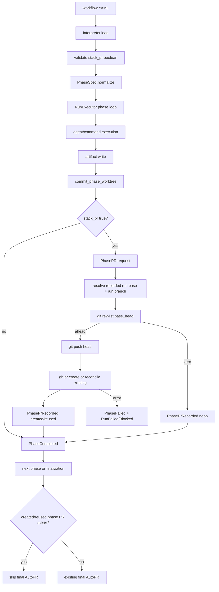

# TRD: Stacked PR Phase Tag (`stack_pr:`)

## Metadata

| Field | Value |
|---|---|
| Document ID | TRD-2026-e33bcab7 |
| Label | trd-stacked-pr-phase-tag |
| PRD Reference | docs/PRD/PRD-2026-e33bcab7-stacked-pr-phase-tag.md |
| Version | 1.0.1 |
| Status | Draft |
| Correlation ID | e33bcab7 |
| Design Readiness Score | 4.75 (PASS) |

## Source Task

Foreman task title read from `FOREMAN_TASK_TITLE`: **Implement stacked PR phase tag**.

Source PRD subject: **PRD: Stacked PR Phase Tag (`stack_pr:`)**. The PRD frontmatter `foreman_task_title` is **Implement stacked PR phase tag**, so the Foreman task subject matches the only permitted source PRD.

This TRD is design only. It does not implement the feature.

## Requirements Validation

| Check | Result |
|---|---|
| Required sections present | PASS — metadata, domain analysis, architecture, contracts, task list, dependencies, traceability, readiness gate |
| REQ-NNN sequential and unique | PASS — PRD REQ-001 … REQ-015, no gaps |
| ACs in Given/When/Then | PASS — 33/33 in source PRD |
| Every Must has ≥2 ACs | PASS — 12 Must requirements, minimum 2 each |
| Constraints and Non-Goals documented | PASS — 6 Non-Goals, 6 assumptions, 2 external dependencies |
| Open ambiguity markers | PASS — 0 |
| TRD task parseability | PASS — every implementation/test task has a checkbox prefix and stable ID |
| Design readiness score | 4.75 — PASS (≥4.0), proceed after explicit approval |

## Domain Analysis

**Project type: brownfield.** This feature extends existing workflow YAML parsing, phase execution, AutoPR, event/projection, CLI/API display, PR monitor behavior, and living docs.

| Domain | Requirements | Existing surface |
|---|---|---|
| Manifest schema / normalization | REQ-001, REQ-002, REQ-009, REQ-010, REQ-012 | `Workflow.Interpreter`, `Workflow.PhaseSpec`, `Workflow.ManifestWriter` |
| Phase PR orchestration | REQ-003, REQ-004, REQ-005, REQ-008, REQ-013 | `Workflow.RunExecutor`, `Workflow.AutoPR`, git, `gh pr create` |
| Durable phase PR model | REQ-006, REQ-007, REQ-011, REQ-014 | `EventCodec`, `ProjectionStore`, run/phase projections, `PrAssociated` |
| Operator surfaces | REQ-011, REQ-014 | Go CLI `foreman run get`, server run API/projections, cockpit/watch render paths |
| Documentation | REQ-015 | `CLAUDE.md`, `AGENTS.md`, `README.md`, `docs/user-guide.md`, `docs/cli-reference.md` |

### Existing-Code Inventory

| Area | Current state | Design implication |
|---|---|---|
| `Workflow.PhaseSpec` | Normalizes known phase fields, including `:commit`, not `:stack_pr` | Add `:stack_pr` as a canonical atom-keyed field; preserve explicit false and absence distinctly |
| `Workflow.Interpreter` | Parses workflow YAML and validates boolean-ish phase fields such as `commit` | Add load-time `stack_pr` boolean validation and keep `commit:` semantics separate |
| `Workflow.ManifestWriter` | Round-trips phase fields and has manifest/catalog tests | Preserve explicit `stack_pr` true/false; do not emit absent values noisily |
| `RunExecutor` | Executes phase body, writes artifacts, commits phase work, emits terminal phase/run events, then advances/finalizes | Invoke phase PR creation after phase commit decision and before `PhaseCompleted`/advance |
| `Workflow.AutoPR` | Opens one final PR from Foreman run branch to recorded run base branch, returning typed outcomes | Extract/reuse git/GitHub helpers without changing final PR semantics |
| `PrAssociated` / `pr_url` | Stores final run PR URL only | Add distinct phase PR event/projection fields; never write phase PRs into final `pr_url` |
| PR monitor | Observes run-level PR state | Keep phase PR monitor state separate or ignored; never treat phase PR merge as final run PR merge |

## Reused Capabilities

`trd-graph-cli capabilities docs/TRD --json` returned no foundational capability entries in this workspace. No foundational TRD dependency is available.

Existing mechanisms reused rather than rebuilt:

| Reused mechanism | Provider | Used by |
|---|---|---|
| YAML scalar parsing and typed manifest refusal | `Workflow.Interpreter` | REQ-001, REQ-009, REQ-012 |
| Canonical phase normalization | `Workflow.PhaseSpec` | REQ-001, REQ-002, REQ-010 |
| Run base/head branch state | `RunExecutor`, `Worktree`, `AutoPR` | REQ-003, REQ-004, REQ-005 |
| GitHub PR shell path | `Workflow.AutoPR` helpers or extracted collaborator | REQ-003, REQ-008, REQ-013 |
| Event-sourced projections | `EventCodec`, `ProjectionStore` | REQ-006, REQ-007, REQ-011, REQ-014 |

## Architecture Decision

**Selected in Foreman mode: Option C — phase PR records over the existing one-branch run model.**

Foreman keeps its current single run worktree and single run branch. A phase with `stack_pr: true` asks the executor to propose the current run branch state to the recorded run base branch after the phase's normal commit decision has been applied. A new phase-PR service reuses AutoPR's branch/base/ahead checks and GitHub operations, emits a distinct phase PR event for created/reused/no-op outcomes, and never writes final run `pr_url`. Final AutoPR is skipped only when the run has a created or reconciled phase PR record.

This intentionally matches the PRD: every phase PR targets the run base branch and uses the run worktree branch as head. It does **not** introduce immutable per-phase branches or true stacked branch topology.

### Alternatives Considered

| Option | Approach | Pros | Cons | Decision |
|---|---|---|---|---|
| A — inline final AutoPR reuse | Call `AutoPR.maybe_create_pr/1` directly from phase finalization and store its URL as final `pr_url` | Smallest code change | Corrupts `pr_url`, lacks phase identity, duplicates error/idempotency policy | Rejected |
| B — true stacked branch topology | Create immutable phase head branches and target phase N at phase N-1 | Clean diffs and multiple unique GitHub PRs | Explicitly out of PRD scope; changes one-branch worktree model | Rejected |
| **C — phase PR records over current run branch** | Keep one run branch; open or reconcile a GitHub PR from that branch to run base at tagged phase boundaries; record each phase separately | Matches PRD target/head constraints, lowest disruption, visible phase records | Same head/base means GitHub usually exposes one open PR object; later tagged phases may reuse the PR URL and show cumulative diff | **Selected** |

### Key Technical Decisions

1. `stack_pr` is a phase field only. It is normalized once in `PhaseSpec`; downstream code reads `:stack_pr` only.
2. Absence and explicit `false` preserve existing PR behavior. Absence remains absent in written manifests; explicit false remains false.
3. Malformed present values fail at manifest load. Strings, numbers, maps, lists, and nil-like nested values are rejected with phase index and key name.
4. `stack_pr` does not imply commit. The phase commit path runs first; `commit: false` is valid. It can only produce a PR if committed branch state is already ahead of base; otherwise it records no-op.
5. Phase PR creation is part of phase finalization. It runs after `commit_phase_worktree/4` and before `PhaseCompleted`; proposable PR errors fail/block that phase.
6. Every phase PR targets the recorded run base branch. No fallback to `main` or current checkout branch is allowed.
7. Every phase PR uses the Foreman-managed run branch as head. No agent marker or per-phase branch is required for this slice.
8. GitHub duplicate open-PR limitation is handled explicitly. Same head/base open PR returns `reused`/`reconciled`, not opaque success or duplicate creation.
9. Closed matching PRs are typed failures. Retrying against a closed matching head/base PR returns actionable error.
10. Final `pr_url` remains final-only. Phase PR metadata lives under new event/projection fields.
11. Final AutoPR skip consults phase PR records. Created/reused phase PR records suppress final AutoPR; no-op records do not.
12. Docs are part of done. Living docs named in `AGENTS.md` must be considered during implementation.

## System Architecture Design

### Components

| Component | Responsibility | Change |
|---|---|---|
| `Workflow.PhaseSpec` | Canonical atom-keyed phase spec | Add `:stack_pr` with accepted source keys `[:stack_pr, "stack_pr"]`; omit permissive aliases unless existing manifest policy requires them |
| `Workflow.Interpreter` | Load-time YAML validation | Add `validate_stack_prs!/2`; reject non-boolean present values with `{phase_index, "stack_pr"}` context |
| `Workflow.ManifestWriter` | Workflow YAML serialization | Preserve explicit `stack_pr: true/false`; omit absent field |
| `Workflow.PhasePR` | New phase PR orchestration boundary | Build typed request/result structs; check ahead count; push head; create/reconcile GitHub PR; classify noop/error |
| `Workflow.AutoPR` | Final PR behavior | Keep public semantics; expose small reusable helpers only if contracts stay typed and total |
| `Workflow.RunExecutor` | Phase sequencing | Call `PhasePR.maybe_create/1` after `commit_phase_worktree/4`; emit phase PR event before completing/advancing phase |
| `Events.PhasePrRecorded` | Durable phase PR fact | New event with run/phase/head/base/status/url/number/provider metadata |
| `ProjectionStore` | Rebuildable read model | Project `phase_prs` on run and the matching phase projection in phase order |
| `Run` aggregate / command router | Command/event contract | Add system command for recording phase PR outcomes or a typed executor append helper that still writes canonical events |
| Go CLI/API renderers | Operator views | Include `phase_prs` in JSON and show phase PR links near phase status |
| `PrMonitor` | PR state observation | Ignore phase PRs explicitly or project them separately; never treat them as final run PR merges |
| Docs | Operator contract | Document syntax, no-op semantics, shared-head/cumulative-diff caveat, final AutoPR skip rules, and failure recovery |

### Data Flow



### Data Contracts

#### `Workflow.PhasePR.Request`

```elixir
%ForemanServer.Workflow.PhasePR.Request{
  run_id: binary(),
  phase_id: binary(),
  phase_index: non_neg_integer(),
  phase_name: binary(),
  base_branch: binary(),
  head_branch: binary(),
  cwd: binary(),
  artifact_path: binary() | nil,
  now: DateTime.t()
}
```

#### `Workflow.PhasePR.Result`

```elixir
{:ok, %PhasePR.Record{status: :created | :reused, pr_url: binary(), pr_number: pos_integer() | nil}}
| {:ok, %PhasePR.Record{status: :noop, reason: :no_commits_ahead}}
| {:error, %PhasePR.Error{reason: atom(), phase_id: binary(), base_branch: binary(), head_branch: binary(), details: term()}}
```

No bare maps cross the `RunExecutor`/`PhasePR` boundary.

#### `PhasePrRecorded` event payload

| Field | Type | Notes |
|---|---|---|
| `run_id` | string | Required |
| `phase_id` | string | Required, stable identity from `Identity.phase_id/2` |
| `phase_index` | integer | Required, matching existing phase projection convention |
| `phase_name` | string | Required display value |
| `status` | enum | `created`, `reused`, or `noop` |
| `pr_url` | string/null | Required for created/reused, nil for noop |
| `pr_number` | integer/null | Parsed from URL or provider JSON when available |
| `base_branch` | string | Recorded run base branch |
| `head_branch` | string | Foreman run worktree branch |
| `provider` | string | `github` for this release |
| `reason` | string/null | Required for noop; error details belong on failure event/log |
| `recorded_at` | ISO8601 | Required |

### Error Handling

| Failure | Behavior |
|---|---|
| Missing run base branch | Return typed `:phase_pr_base_branch_unresolved`; do not default |
| Missing head branch/worktree | Return typed `:phase_pr_head_branch_unresolved`; do not mark created |
| No commits ahead of base | Emit `PhasePrRecorded` with `status: noop`, `reason: no_commits_ahead`; continue |
| `git rev-list` failure | Fail the phase with typed details |
| `git push` failure | Fail/block the phase with command output in logs/events |
| `gh pr create` duplicate open head/base | Reconcile existing open PR, emit `status: reused` |
| `gh pr create` closed matching PR | Fail/block phase with typed `:matching_pr_closed` |
| Projection decode missing required phase PR URL on created/reused | Raise/refuse projection rather than silently dropping URL |

## Master Task List

### PR 1: Manifest schema and round-trip support

**Shippable State:** Workflow authors can declare `stack_pr: true` or `false`; manifests load, validate, normalize, and serialize the new boolean without changing PR creation behavior yet.

- [ ] **TRD-001** Add canonical `stack_pr` support to `Workflow.PhaseSpec` (2h) [satisfies REQ-001, REQ-002, REQ-009]
  - Validates PRD ACs: AC-001-1, AC-001-2, AC-002-2, AC-009-2
  - Implementation ACs:
    - Given `stack_pr: true`, when a phase is normalized, then `:stack_pr == true`.
    - Given `stack_pr: false`, when a phase is normalized, then `:stack_pr == false` and is not dropped.
    - Given `stack_pr` is absent, when normalized, then the field remains absent.
- [ ] **TRD-001-TEST** Cover `PhaseSpec` normalization for present true, present false, and absent `stack_pr` (2h) [verifies TRD-001] [satisfies REQ-001, REQ-002, REQ-009] [depends: TRD-001]

- [ ] **TRD-002** Add `stack_pr` boolean validation to workflow loading (3h) [satisfies REQ-001, REQ-009, REQ-012]
  - Validates PRD ACs: AC-001-1, AC-001-2, AC-009-1, AC-009-2, AC-012-1
  - Implementation ACs:
    - Given `stack_pr: "true"`, when `Interpreter.load/1` runs, then it rejects the value and names phase index plus `stack_pr`.
    - Given non-boolean scalar/list/map values, when the workflow loads, then each malformed value is rejected.
    - Given `commit: false` and `stack_pr: true`, when the workflow loads, then both values are accepted and not conflated.
- [ ] **TRD-002-TEST** Add interpreter regression tests for valid and malformed `stack_pr` values (2h) [verifies TRD-002] [satisfies REQ-001, REQ-009, REQ-012] [depends: TRD-002]

- [ ] **TRD-003** Preserve explicit `stack_pr` values through manifest writer/read round trips (3h) [satisfies REQ-010, REQ-002]
  - Validates PRD ACs: AC-010-1, AC-010-2, AC-002-1
  - Implementation ACs:
    - Given `stack_pr: true`, when written and loaded, then the reloaded phase has boolean true.
    - Given `stack_pr: false`, when written and loaded, then the reloaded phase has boolean false.
    - Given `stack_pr` is absent, when written and loaded, then the writer does not invent `stack_pr: false`.
- [ ] **TRD-003-TEST** Add manifest writer round-trip tests for `stack_pr` (2h) [verifies TRD-003] [satisfies REQ-010, REQ-002] [depends: TRD-003]

### PR 2: Phase PR orchestration and phase-finalization behavior

**Shippable State:** A successful tagged phase can produce or no-op a GitHub phase PR from the run branch to the recorded run base branch; failures stop at the responsible phase.

- [ ] **TRD-004** Extract or add typed git/GitHub PR helper functions for phase PR usage (4h) [satisfies REQ-003, REQ-004, REQ-005, REQ-008]
  - Validates PRD ACs: AC-003-1, AC-004-1, AC-004-2, AC-005-1, AC-005-2, AC-008-1, AC-008-2
  - Implementation ACs:
    - Given valid base/head/cwd and commits ahead, then helper pushes the Foreman-derived head and opens a GitHub PR with `--base <run-base>` and `--head <run-branch>`.
    - Given base or head is absent, then helper returns a typed error and runs no `gh pr create`.
    - Given push or PR creation fails, then command output is preserved in typed error details.
- [ ] **TRD-004-TEST** Characterize phase PR helper success, no-op, missing-branch, push-failure, and create-failure paths (4h) [verifies TRD-004] [satisfies REQ-003, REQ-004, REQ-005, REQ-008] [depends: TRD-004]

- [ ] **TRD-005** Add `Workflow.PhasePR` service with typed request/result structs and no-op detection (5h) [satisfies REQ-003, REQ-004, REQ-005, REQ-008, REQ-012]
  - Validates PRD ACs: AC-003-1, AC-003-3, AC-004-1, AC-005-1, AC-008-1, AC-012-1, AC-012-2
  - Implementation ACs:
    - Given `stack_pr: true` and branch ahead of base, when `PhasePR.maybe_create/1` runs, then it returns a created record with URL/base/head/phase metadata.
    - Given branch has zero commits ahead, when it runs, then it returns a no-op record.
    - Given `commit: false`, when the current committed branch is not ahead, then no PR is created and no commit is forced.
- [ ] **TRD-005-TEST** Add unit tests for `Workflow.PhasePR` typed outcomes and `commit:false` independence (4h) [verifies TRD-005] [satisfies REQ-003, REQ-008, REQ-012] [depends: TRD-005]

- [ ] **TRD-006** Invoke phase PR creation from `RunExecutor` after phase commit and before phase completion (4h) [satisfies REQ-003, REQ-008, REQ-012]
  - Validates PRD ACs: AC-003-1, AC-003-2, AC-003-3, AC-008-1, AC-012-2
  - Implementation ACs:
    - Given a tagged successful phase, when phase finalization runs, then `PhasePR` runs after `commit_phase_worktree/4`.
    - Given the phase fails, blocks, or is skipped, then no phase PR attempt is made.
    - Given `PhasePR` returns an error for proposable commits, then phase/run terminal state records failure instead of completing.
- [ ] **TRD-006-TEST** Add `RunExecutor` integration tests for phase PR invocation order and failure propagation (5h) [verifies TRD-006] [satisfies REQ-003, REQ-008, REQ-012] [depends: TRD-006]

### PR 3: Durable event model, idempotency, and final AutoPR interaction

**Shippable State:** Phase PR outcomes are durable, queryable, idempotent across retries, and prevent duplicate final AutoPR only when a real phase PR exists.

- [ ] **TRD-007** Add `PhasePrRecorded` event/command codec and projection model (5h) [satisfies REQ-006, REQ-011]
  - Validates PRD ACs: AC-006-1, AC-006-2, AC-006-3, AC-011-1
  - Implementation ACs:
    - Given a created/reused phase PR, when events are read, then run id, phase identity/index/name, URL, number, base, head, status, provider, and timestamp are present.
    - Given the event is projected, then run `pr_url` remains unchanged.
    - Given multiple records, then the run projection exposes them in phase order.
- [ ] **TRD-007-TEST** Cover event codec and projection behavior for `PhasePrRecorded` (4h) [verifies TRD-007] [satisfies REQ-006, REQ-011] [depends: TRD-007]

- [ ] **TRD-008** Add phase PR idempotency and existing open/closed PR reconciliation (5h) [satisfies REQ-013, REQ-003, REQ-008]
  - Validates PRD ACs: AC-013-1, AC-013-2, AC-013-3, AC-003-1, AC-008-1
  - Implementation ACs:
    - Given a phase already has a recorded created/reused phase PR, when retry runs, then no duplicate PR is created.
    - Given GitHub reports an open PR for the intended head/base with no local event, then Foreman records/reuses it with phase metadata.
    - Given the only matching PR is closed, then Foreman fails with typed `:matching_pr_closed` details.
- [ ] **TRD-008-TEST** Add idempotency/reconciliation tests for recorded, open-existing, and closed-existing PRs (5h) [verifies TRD-008] [satisfies REQ-013, REQ-008] [depends: TRD-008]

- [ ] **TRD-009** Skip final AutoPR when any created/reused phase PR record exists (3h) [satisfies REQ-007, REQ-002]
  - Validates PRD ACs: AC-007-1, AC-007-2, AC-002-1
  - Implementation ACs:
    - Given at least one phase PR record with status `created` or `reused`, when run finalizes, then final AutoPR is skipped.
    - Given only no-op phase PR records exist and untagged committed work is ahead, then existing final AutoPR eligibility still applies.
    - Given no `stack_pr` is declared, then final AutoPR behavior matches existing tests.
- [ ] **TRD-009-TEST** Add final AutoPR skip/no-op/default regression tests (3h) [verifies TRD-009] [satisfies REQ-007, REQ-002] [depends: TRD-009]

### PR 4: Operator surfaces, PR monitor separation, and docs

**Shippable State:** Operators can inspect phase PR links from CLI/API views, PR monitor state stays distinct, and living docs describe `stack_pr:` behavior and constraints.

- [ ] **TRD-010** Surface `phase_prs` in run/phase API payloads and `foreman run get <id>` JSON (4h) [satisfies REQ-011, REQ-006]
  - Validates PRD ACs: AC-011-1, AC-011-2, AC-006-3
  - Implementation ACs:
    - Given a run has phase PR records, when the server run projection is queried, then records include phase name/index/status/URL.
    - Given `foreman run get <id> --json` reads that payload, then JSON includes ordered phase PR data.
    - Given no phase PR records exist, then payload uses an empty list or omitted optional field consistently with existing API style.
- [ ] **TRD-010-TEST** Add server/API and Go CLI JSON tests for phase PR visibility (4h) [verifies TRD-010] [satisfies REQ-011, REQ-006] [depends: TRD-010]

- [ ] **TRD-011** Render phase PR links in human operator views without confusing final PR URL (4h) [satisfies REQ-011, REQ-014]
  - Validates PRD ACs: AC-011-2, AC-014-1, AC-014-2
  - Implementation ACs:
    - Given phase PR records exist, when a supported human run view renders, then phase PR links appear near phase status.
    - Given final `pr_url` exists separately, then final PR rendering remains labeled as final/run PR.
    - Given phase PRs are reused/no-op, then view labels status accurately.
- [ ] **TRD-011-TEST** Add human renderer/cockpit snapshot tests for phase PR labels and final PR separation (3h) [verifies TRD-011] [satisfies REQ-011, REQ-014] [depends: TRD-011]

- [ ] **TRD-012** Keep PR monitor handling for phase PRs separate from final run PR handling (4h) [satisfies REQ-014, REQ-006]
  - Validates PRD ACs: AC-014-1, AC-014-2, AC-006-2
  - Implementation ACs:
    - Given a phase PR is merged, when monitor events are applied, then the run/task is not marked final-merged solely because of that phase PR.
    - Given final run PR monitor data exists, then it still updates final PR state through existing fields.
    - Given both phase and final PR state exist, then projection distinguishes both records.
- [ ] **TRD-012-TEST** Add PR monitor regression tests for phase PR merge and final PR state separation (4h) [verifies TRD-012] [satisfies REQ-014, REQ-006] [depends: TRD-012]

- [ ] **TRD-013** Update living docs for `stack_pr:` syntax, semantics, failure modes, and stale no-per-phase-PR statements (3h) [satisfies REQ-015]
  - Validates PRD ACs: AC-015-1, AC-015-2
  - Implementation ACs:
    - Given implementation ships, when docs are reviewed, then `CLAUDE.md`, `AGENTS.md`, `README.md`, `docs/user-guide.md`, and `docs/cli-reference.md` are edited or explicitly reported as not needing edits.
    - Given docs previously say there is no per-phase PR setting, then stale statements are updated.
    - Given `stack_pr: true` is documented, then docs include shared-head/cumulative-diff, no-op, failure, idempotency, and final AutoPR skip semantics.
- [ ] **TRD-013-TEST** Verify doc updates and command/source consistency for `stack_pr:` (2h) [verifies TRD-013] [satisfies REQ-015] [depends: TRD-013]

## Dependency Graph

| Task | Depends On | Notes |
|---|---|---|
| TRD-001 | — | Phase field foundation |
| TRD-002 | TRD-001 | Validation can rely on normalized contract |
| TRD-003 | TRD-001, TRD-002 | Writer preserves accepted values |
| TRD-004 | — | Helper extraction can happen in parallel after design approval |
| TRD-005 | TRD-004 | Service composes helper results |
| TRD-006 | TRD-001, TRD-005 | Executor needs normalized field and service |
| TRD-007 | TRD-005, TRD-006 | Event shape records service result |
| TRD-008 | TRD-007 | Idempotency needs readable existing records |
| TRD-009 | TRD-007, TRD-008 | Finalization skip reads created/reused records |
| TRD-010 | TRD-007 | API/CLI consumes projection data |
| TRD-011 | TRD-010 | Human rendering consumes surfaced fields |
| TRD-012 | TRD-007, TRD-010 | Monitor separation needs distinct projected model |
| TRD-013 | TRD-001, TRD-006, TRD-009, TRD-010, TRD-012 | Docs after behavior/API is settled |

Critical path: TRD-004 → TRD-005 → TRD-006 → TRD-007 → TRD-008 → TRD-009 and TRD-010 → TRD-011/TRD-012 → TRD-013. No circular dependencies identified. No task is estimated at 8h or more.

## Sprint Planning

### Sprint 1: Manifest and helper foundation

- PR 1: TRD-001 through TRD-003 and paired tests.
- Begin PR 2 helper work: TRD-004 and TRD-004-TEST.

### Sprint 2: Executor integration and durable model

- Finish PR 2: TRD-005 through TRD-006 and paired tests.
- Begin PR 3: TRD-007 event/projection work.

### Sprint 3: Idempotency, finalization, surfaces, docs

- Finish PR 3: TRD-008 through TRD-009 and paired tests.
- Ship PR 4: TRD-010 through TRD-013 and paired tests/docs verification.

## Acceptance Criteria Traceability

| REQ | Description | Implementation Tasks | Test Tasks |
|---|---|---|---|
| REQ-001 | Declare phase-level `stack_pr:` boolean | TRD-001, TRD-002 | TRD-001-TEST, TRD-002-TEST |
| REQ-002 | Preserve existing behavior when absent/false | TRD-001, TRD-003, TRD-009 | TRD-001-TEST, TRD-003-TEST, TRD-009-TEST |
| REQ-003 | Create phase PR after successful tagged phase | TRD-004, TRD-005, TRD-006, TRD-008 | TRD-004-TEST, TRD-005-TEST, TRD-006-TEST, TRD-008-TEST |
| REQ-004 | Target every phase PR at run base branch | TRD-004, TRD-005 | TRD-004-TEST, TRD-005-TEST |
| REQ-005 | Use run worktree branch as phase PR head | TRD-004, TRD-005 | TRD-004-TEST, TRD-005-TEST |
| REQ-006 | Record phase PRs without overwriting final `pr_url` | TRD-007, TRD-010, TRD-012 | TRD-007-TEST, TRD-010-TEST, TRD-012-TEST |
| REQ-007 | Skip final AutoPR when phase PRs represent run | TRD-009 | TRD-009-TEST |
| REQ-008 | Fail loudly on phase PR creation errors | TRD-004, TRD-005, TRD-006, TRD-008 | TRD-004-TEST, TRD-005-TEST, TRD-006-TEST, TRD-008-TEST |
| REQ-009 | Validate and normalize `stack_pr:` | TRD-001, TRD-002 | TRD-001-TEST, TRD-002-TEST |
| REQ-010 | Preserve `stack_pr:` through serialization | TRD-003 | TRD-003-TEST |
| REQ-011 | Surface phase PRs in projections/CLI/API | TRD-007, TRD-010, TRD-011 | TRD-007-TEST, TRD-010-TEST, TRD-011-TEST |
| REQ-012 | Keep commit deferral independent | TRD-002, TRD-005, TRD-006 | TRD-002-TEST, TRD-005-TEST, TRD-006-TEST |
| REQ-013 | Support retry/idempotency behavior | TRD-008 | TRD-008-TEST |
| REQ-014 | Maintain PR monitor compatibility | TRD-011, TRD-012 | TRD-011-TEST, TRD-012-TEST |
| REQ-015 | Document operator semantics and constraints | TRD-013 | TRD-013-TEST |

Traceability check: 15 requirements covered, 0 uncovered, 0 orphaned annotations.

## Adversarial Review

### Architecture Self-Critique

1. **Issue:** GitHub normally allows only one open PR per head/base pair, while the PRD requires repeated tagged phases to use the same run branch and run base.  
   **Resolution:** `PhasePR` must implement open-or-reuse semantics. The first phase creates the PR; later phases with the same head/base reconcile the existing open PR and emit distinct phase records with `status: reused`. Closed matches fail loudly.
2. **Issue:** Calling `PhasePR` after `PhaseCompleted` would let a phase appear complete even if PR creation failed.  
   **Resolution:** Executor invocation must happen before phase completion/advance, and typed errors must route through existing phase/run failure handling.
3. **Issue:** Reusing `PrAssociated` would overwrite final `pr_url` and confuse PR monitor semantics.  
   **Resolution:** Add `PhasePrRecorded` and project phase records separately from final run `pr_url`.
4. **Issue:** If no-op phase PR records suppress final AutoPR, a run with later untagged commits could produce no PR at all.  
   **Resolution:** Finalization skip only counts `created`/`reused` phase PR statuses; no-op records do not suppress final AutoPR.

### Task Coverage Analysis

1. **Issue:** REQ-013 could be under-tested if idempotency checks only local event replay and not provider-reported open/closed PRs.  
   **Resolution:** TRD-008-TEST explicitly covers recorded, open-existing, and closed-existing provider cases.
2. **Issue:** REQ-015 often gets delayed until after code completion, risking stale docs.  
   **Resolution:** TRD-013 and TRD-013-TEST are explicit PR 4 tasks with named living docs and source verification.
3. **Issue:** Machine task parsing can miss lines without checkbox prefixes.  
   **Resolution:** Every implementation and test task begins with `- [ ] **TRD-NNN**` or `- [ ] **TRD-NNN-TEST**`.

### Dependency and Estimate Review

1. **Issue:** Long chain TRD-004 → TRD-005 → TRD-006 → TRD-007 → TRD-008 → TRD-009/010 could delay visible CLI/API work.  
   **Resolution:** Keep tasks ≤5h, ship PR 2 with phase behavior before PR 3/4, and allow TRD-010 API shape drafting once TRD-007 event fields are stable.
2. **Issue:** Similar tasks across projection/API/CLI could hide estimate variance.  
   **Resolution:** Projection/event work is 5h due codec/rebuild paths; CLI/API/human rendering tasks are 3–4h and scoped to existing fields.
3. **Issue:** Failure-path integration tests may be optimistic because `RunExecutor` setup is heavy.  
   **Resolution:** TRD-006-TEST gets 5h and may reuse existing `run_executor_*` helpers rather than building new harnesses.

### Testability Review

1. **Issue:** Real GitHub `gh pr create` is not deterministic in tests.  
   **Resolution:** Use stubbed command runner or controlled test doubles for `gh`, plus local git repos for branch/commit behavior.
2. **Issue:** "Visible in supported CLI view" is broad unless a first surface is named.  
   **Resolution:** TRD-010 names `foreman run get <id> --json`; TRD-011 covers supported human view snapshots after renderer discovery.
3. **Issue:** "Fail loudly" can be subjective.  
   **Resolution:** ACs require typed error terms with base/head/phase/command output and phase/run failure projection assertions.
4. **Issue:** Docs verification can become subjective.  
   **Resolution:** TRD-013-TEST requires grepping named docs and checking CLI docs against Go/API source fields.

## Design Readiness Scorecard

| Dimension | Score | Rationale |
|---|---:|---|
| Architecture completeness | 5 | Components, data flow, event shape, branch/head/base policy, and error paths are defined. |
| Task coverage | 5 | All 15 PRD requirements map to implementation and test tasks. |
| Dependency clarity | 4 | Dependencies are explicit and acyclic; API/rendering tasks depend on event/projection stability. |
| Estimate confidence | 5 | All tasks are ≤5h with paired verification tasks and scoped surfaces. |

Overall score: **4.75**

Gate decision: **PASS — ready for implementation after explicit approval.**

## Output Summary

- TRD file: `docs/TRD/TRD-2026-e33bcab7-stacked-pr-phase-tag.md`
- Source PRD correlation id: `e33bcab7`
- Implementation tasks: 13
- Test tasks: 13
- Total tasks: 26
- Design readiness score: 4.75 (PASS)

## Refinement Changelog

### 2026-09-01 — v1.0.1

- Repaired malformed/compressed sections in the Master Task List, dependency graph, traceability matrix, and readiness gate.
- Re-aligned architecture with the refined PRD: shared run-branch head, recorded run-base target, cumulative/shared-head PR caveat, no true stacked branch topology.
- Made `commit: false` compatible with `stack_pr: true`, with no-op behavior when no committed branch diff exists.
- Tightened typed `Workflow.PhasePR` boundary and total error handling.
- Added explicit GitHub open/reused and closed-PR idempotency behavior.
- Preserved 26-task scope and raised design readiness from 4.5 to 4.75.

Suggested next commands after approval:

```bash
/ensemble-configure-team docs/TRD/TRD-2026-e33bcab7-stacked-pr-phase-tag.md
/ensemble-implement-trd-beads docs/TRD/TRD-2026-e33bcab7-stacked-pr-phase-tag.md
```
