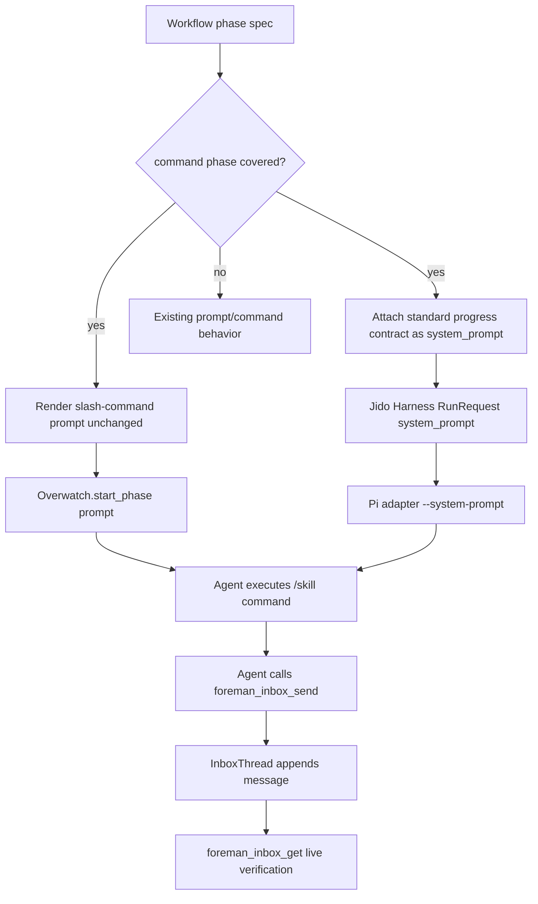

# TRD: Inbox Progress for Command-Driven PRD and Fix Phases

Foreman task title read from `FOREMAN_TASK_TITLE`: **Wire foreman_inbox_send operator updates into prd.yaml and fix.yaml command phases**

Source PRD: `docs/PRD/PRD-2026-f2049b7e-inbox-command-phase-progress.md` (`PRD-2026-f2049b7e`).

## PRD Validation Summary

- Required PRD sections present: Executive Summary, Background/Evidence, Goals, Non-Goals, Personas, Assumptions, Requirements, Dependency Map, TRD Decision Points, Adversarial Review, Implementation Readiness Gate.
- Requirements: 14 sequential `REQ-NNN` IDs.
- Acceptance criteria: 44 `AC-NNN-M` items, Given/When/Then format.
- PRD readiness score: **4.7 PASS**.
- Subject match: PRD and Foreman task both describe adding operator inbox progress to `prd.yaml` and `fix.yaml` command-driven phases.
- Refinement note: v1.0.1 replaces the executor-only lifecycle bridge with a worker `system_prompt` sidecar, because the PRD requires command-dispatched agents to receive the progress contract before work begins.

## Domain Analysis

| Domain | Requirements | Notes |
|---|---|---|
| Workflow manifests | REQ-001, REQ-004, REQ-005, REQ-008, REQ-013 | `prd.yaml` command phases: `create-prd`, `refine-prd`, `create-trd`, `refine-trd`, `implement-trd`; `fix.yaml` command phase: `fix`. Review phases already use prompt files with progress guidance. |
| Command dispatch | REQ-002, REQ-003 | `RunExecutor.dispatch_agent/5` replaces the rendered prompt body with the rendered `command:` string for command phases. `render_command_template/4` shell-quotes `{{input.prompt}}`. |
| Worker sidecar instructions | REQ-002, REQ-006, REQ-012 | `Jido.Harness.RunRequest` accepts `:system_prompt`; the Pi adapter maps it to `--system-prompt`; the command string can remain the user prompt. |
| MCP/inbox path | REQ-006, REQ-007, REQ-010, REQ-014 | Reuse `foreman_inbox_send`, existing write policy, inbox aggregate, and `foreman_inbox_get` verification. |
| Tests/live verification/docs | REQ-008, REQ-009, REQ-010, REQ-011 | Static tests must pin manifest coverage and prompt injection. Live `prd`/`fix` runs must prove delivered inbox messages. |

Brownfield system. The design keeps slash-command prompt text byte-for-byte stable and adds Foreman-owned sidecar guidance through the worker request's `system_prompt`, the provider-supported channel intended for runtime instructions.

## Reused Capabilities

`trd-graph-cli capabilities docs/TRD --json` returned `{"capabilities": []}` and `trd-graph-cli overlap docs/TRD` reported no overlapping target files. No foundational TRD provides a reusable capability token.

In-repo mechanisms reused directly:

| Reused mechanism | Provider | Used by |
|---|---|---|
| Command rendering | `RunExecutor.render_command_template/4`, `prompt_template_assigns/5` | Preserve `{{input.prompt}}` shell quoting and slash-command text |
| Worker launch boundary | `RunExecutor.dispatch_agent/5`, `Overwatch.start_phase/2`, `JidoHarnessWorker` | Carry prompt, env, and driver opts to the worker |
| Provider-neutral system prompt | `Jido.Harness.RunRequest`, `Jido.Harness.Run.start/3`, Pi adapter `--system-prompt` mapping | Deliver progress contract without modifying command prompt |
| Existing plan env | `RunExecutor.foreman_env/4`, `plan_subject_env/1`, `put_source_prd_path/3` | Preserve subject, artifact, and source-PRD handoff |
| Inbox write/read path | `foreman_inbox_send`, `CommandGateway.dispatch_operator/2`, `InboxThread`, `foreman_inbox_get` | Agent-authored progress writes and live proof |
| Prompt progress contract | `packages/foreman_server/priv/defaults/workflows/prompts/*.md` | Source text for cadence/safety language |
| Runtime installer | `go build ./cmd/foreman`, `foreman init --force`, `WorkflowTemplate.Installer` | Refresh installed runtime assets when source workflows/prompts change |

## Architecture Alternatives

| Option | Approach | Pros | Cons | Risk |
|---|---|---|---|---|
| A — convert command phases to prompt files | Replace each `command:` with a `prompt:` file that tells the agent to run the equivalent `/skill:ensemble-*` command. | Normal prompt carries progress guidance. | Slash-command execution may not happen identically inside prose; subject, quoting, artifact, and `--foreman` semantics can drift. | High |
| B — append guidance to command strings | Keep `command:` but append progress text after `/skill:...`. | Small manifest diff. | Extra text becomes slash-command args or breaks slash-command parsing; no structured instruction channel. | High |
| C — executor-only lifecycle bridge | Executor sends start/terminal inbox messages for covered command phases. | Does not touch worker prompt. | Does not satisfy PRD AC-002-3: the command-dispatched agent does not receive the standard guidance before work and cannot post material milestones. | Medium |
| D — worker `system_prompt` sidecar | Keep `command:` prompt exactly unchanged. Add standard inbox-progress guidance as `system_prompt` only for covered command phases. | Satisfies source contract, preserves slash-command prompt, lets the executing agent post start/milestone/blocker/completion notes, and reuses provider-supported system prompt plumbing. | Must prove all active providers used by these workflows support `system_prompt`; must keep sidecar absent for non-covered phases unless explicitly needed. | Low |

Foreman mode: auto-selected Option D (worker `system_prompt` sidecar).

## Architecture Decision

Implement a Foreman-owned command-phase inbox guidance sidecar in `RunExecutor`. For the target command phases in `prd.yaml` and `fix.yaml`, `RunExecutor` passes the existing standard progress contract to the worker through `driver_opts[:system_prompt]` or the equivalent request option consumed by `Jido.Harness.Run.start/3`. The `prompt` passed to `Overwatch.start_phase/2` remains the rendered slash-command string.

### Rationale

Source validation shows a `command:` phase has no reliable in-prompt body: `dispatch_agent/5` chooses the rendered command string instead of `request.prompt`, and `read_phase_prompt/4` only supplies prompt-file content for prompt phases. The command string is the slash-command invocation itself, so appending text risks parsing and argument delivery. Jido Harness already has a provider-neutral `:system_prompt` field, and the Pi adapter maps it to `--system-prompt`, so it is the narrowest existing channel that can deliver runtime instructions without changing the user prompt.

### Key Decisions

1. **Preserve command prompt:** do not convert `command:` to `prompt:` and do not append guidance to slash-command strings.
2. **Use sidecar guidance:** pass standard inbox-progress instructions through worker `system_prompt` for covered command phases.
3. **Cover only target command phases in v1:** `prd.yaml` phases `create-prd`, `refine-prd`, `create-trd`, `refine-trd`, `implement-trd`; `fix.yaml` phase `fix`.
4. **Reuse existing standard text:** keep cadence and safety aligned with bundled prompt files: phase start, material milestones, blockers, completion; no timer-only chatter; no prompts, credentials, secrets, large logs, or command output.
5. **Non-blocking:** the instruction tells agents to continue if `foreman_inbox_send` is denied/unavailable/fails; no executor hard dependency is introduced.
6. **Provider-gated:** tests must prove the provider path used by Foreman supports `system_prompt`; if a provider does not support it, implementation must fail the provider-readiness/manifest test instead of silently claiming coverage.
7. **Static + live proof:** tests prove prompt preservation and sidecar delivery; live `prd` and `fix` runs prove actual inbox writes through `foreman_inbox_get`.

## System Architecture Design

### Components

| Component | Responsibility | Change |
|---|---|---|
| `RunExecutor` | Owns phase action selection and `Overwatch.start_phase/2` launch opts | Add covered-command-phase detection and sidecar system-prompt wiring |
| Workflow phase specs | Declare phase action/name/workflow | No semantic conversion; optionally add explicit metadata only if source tests show allowlist-by-name is too implicit |
| `JidoHarnessWorker` / driver opts | Forward provider request options to `Jido.Harness.Run.start/3` | Preserve env/cwd/timeouts; include `system_prompt` when supplied |
| Jido Harness provider adapters | Translate `system_prompt` to provider-native instruction channel | Reuse existing Pi `--system-prompt`; add tests around supported providers |
| MCP/inbox tool | Agent progress write path | Reuse existing `foreman_inbox_send` and policy behavior |
| Prompt files | Prompt-driven progress guidance | Preserve existing progress block for prompt phases |
| Tests | Prevent regressions | Add command prompt byte-preservation, sidecar presence/absence, provider option, manifest, and live proof tests |
| Docs | Operator/developer expectations | Update or record no-op rationale for required living docs |

### Data Flow

### Interfaces

| Boundary | Protocol | Request | Response/Error |
|---|---|---|---|
| Phase coverage | Internal helper | workflow name + phase name + action `:command` | Covered/uncovered boolean |
| Worker launch | `Overwatch.start_phase/2` opts | existing `prompt`, `driver_opts`, `env_map`; add `system_prompt` in driver opts or request options | Existing worker result; sidecar must not alter prompt |
| Provider adapter | Jido Harness `RunRequest` | `%RunRequest{prompt: slash_command, system_prompt: progress_contract}` | Provider argv/request includes native system prompt flag/field |
| Inbox write | MCP `foreman_inbox_send` | Agent-supplied `{run_id, body, message_id?, command_id?, metadata?}` | Existing success/error DTO; failures remain non-blocking to phase |
| Verification | MCP `foreman_inbox_get` | `{run_id}` | Existing inbox projection with messages |

## Master Task List

### PR 1: Source-validated sidecar design

**Shippable State:** Maintainers have a source-backed implementation decision that delivers progress guidance to command-dispatched agents without changing slash-command prompt text.

- [ ] **TRD-001**: Document command dispatch, prompt dispatch, worker launch, Jido Harness `system_prompt`, Pi adapter `--system-prompt`, env, and MCP tool contracts [satisfies REQ-001, REQ-002, REQ-003] (3h)
  - Validates PRD ACs: AC-001-1, AC-001-2, AC-001-3, AC-002-1, AC-002-3, AC-002-4, AC-003-4
  - Implementation AC:
    - [ ] Given `prd.yaml` is inspected, when phase actions are listed, then `create-prd`, `refine-prd`, `create-trd`, `refine-trd`, and `implement-trd` are named as command-driven.
    - [ ] Given `fix.yaml` is inspected, when phase actions are listed, then `fix` is named as command-driven.
    - [ ] Given `RunExecutor.dispatch_agent/5` is inspected, when command dispatch is described, then the report states the rendered command replaces prompt-file content.
    - [ ] Given Jido Harness source is inspected, when sidecar delivery is described, then `RunRequest.system_prompt` and provider adapter support are cited.
- [ ] **TRD-001-TEST**: Add static workflow/provider inventory tests proving target phases are command phases, prompt phases retain prompt files, and the configured provider supports `system_prompt` [verifies TRD-001] [satisfies REQ-001, REQ-002] [depends: TRD-001] (3h)

### PR 2: Command-phase system-prompt sidecar

**Shippable State:** Covered `prd.yaml` and `fix.yaml` command phases receive the standard inbox-progress guidance before work starts, while the slash-command prompt and Foreman env contracts are unchanged.

- [ ] **TRD-002**: Add a covered-command-phase helper in `RunExecutor` for `prd.yaml` and `fix.yaml` target phases [satisfies REQ-004, REQ-005, REQ-009] [depends: TRD-001] (3h)
  - Validates PRD ACs: AC-004-1, AC-004-2, AC-004-3, AC-004-4, AC-004-5, AC-005-1
  - Implementation AC:
    - [ ] Given each target `prd.yaml` command phase launches, when coverage is checked, then sidecar guidance is selected.
    - [ ] Given the `fix.yaml` `fix` phase launches, when coverage is checked, then sidecar guidance is selected.
    - [ ] Given a non-target phase launches, when coverage is checked, then no command-phase sidecar is added unless explicitly covered by future work.
- [ ] **TRD-002-TEST**: Unit-test covered and uncovered phase detection against parsed bundled manifests [verifies TRD-002] [satisfies REQ-004, REQ-005, REQ-009] [depends: TRD-002] (2h)
- [ ] **TRD-003**: Build the standard command-phase progress sidecar text from the existing prompt progress contract [satisfies REQ-006, REQ-007, REQ-012, REQ-013] [depends: TRD-002] (2h)
  - Validates PRD ACs: AC-006-1, AC-006-2, AC-006-3, AC-006-4, AC-007-1, AC-007-2, AC-012-1, AC-012-2, AC-012-3, AC-013-1
  - Implementation AC:
    - [ ] Given a covered phase starts, when the agent receives the system prompt, then it is instructed to send start, material milestone, blocker, and completion notes when `foreman_inbox_send` is available.
    - [ ] Given no material progress occurred, when the instruction is followed, then it does not require timer-only chatter.
    - [ ] Given the inbox tool is denied/unavailable/fails, when the instruction is followed, then the agent continues and only records the failed status update if relevant.
    - [ ] Given sensitive data exists in task context, when the instruction is followed, then prompts, credentials, secrets, large logs, and command output are excluded.
- [ ] **TRD-003-TEST**: Add static text tests proving sidecar guidance and bundled prompt guidance stay aligned on cadence, non-blocking behavior, and safety exclusions [verifies TRD-003] [satisfies REQ-006, REQ-007, REQ-012, REQ-013] [depends: TRD-003] (2h)
- [ ] **TRD-004**: Thread sidecar guidance through worker launch as `system_prompt` without changing `prompt`, `env_map`, cwd, timeout, provider, model, artifact, or source-PRD behavior [satisfies REQ-002, REQ-003, REQ-004, REQ-005] [depends: TRD-003] (4h)
  - Validates PRD ACs: AC-002-2, AC-003-1, AC-003-2, AC-003-3, AC-003-4, AC-004-1, AC-005-1
  - Implementation AC:
    - [ ] Given `create-prd` receives `{{input.prompt}}` containing spaces, quotes, newlines, and shell metacharacters, when the phase launches, then the prompt remains the shell-quoted command produced by existing rendering.
    - [ ] Given `--foreman` is present in the command string, when the sidecar is enabled, then the worker prompt still includes `--foreman` unchanged.
    - [ ] Given phase env is built, when the sidecar is attached, then `FOREMAN_TASK_TITLE`, `FOREMAN_TASK_DESCRIPTION`, `FOREMAN_ARTIFACT_PATH`, and `FOREMAN_SOURCE_PRD_PATH` behavior is unchanged.
    - [ ] Given the worker request is inspected, when the phase is covered, then the standard progress contract is present in `system_prompt` before the provider starts.
- [ ] **TRD-004-TEST**: Add executor/worker launch tests proving prompt byte-preservation, system-prompt presence for covered phases, absence for uncovered command phases, and env preservation [verifies TRD-004] [satisfies REQ-002, REQ-003, REQ-004, REQ-005] [depends: TRD-004] (4h)

### PR 3: Regression coverage, runtime install, and live proof

**Shippable State:** Source and installed runtime assets agree, tests prevent silent coverage loss, and live `prd`/`fix` runs prove actual operator inbox messages from formerly silent command phases.

- [ ] **TRD-005**: Add manifest/prompt regression tests that fail if target command phases lose sidecar coverage or review prompt phases lose progress guidance [satisfies REQ-008, REQ-009, REQ-013] [depends: TRD-004] (3h)
  - Validates PRD ACs: AC-008-1, AC-009-1, AC-009-2, AC-009-3, AC-013-1, AC-013-2
  - Implementation AC:
    - [ ] Given bundled `prd.yaml` is parsed, when coverage is checked, then all five core command phases are covered.
    - [ ] Given bundled `fix.yaml` is parsed, when coverage is checked, then `fix` is covered.
    - [ ] Given review phases are parsed, when prompt paths are checked, then `review-coderabbit.md` and `review-repo-rules.md` remain prompt-driven and keep progress guidance.
- [ ] **TRD-005-TEST**: Run the manifest/prompt regression assertions and record results [verifies TRD-005] [satisfies REQ-009, REQ-013] [depends: TRD-005] (1h)
- [ ] **TRD-006**: Refresh installed runtime workflows/prompts after source changes using a freshly built CLI path [satisfies REQ-008] [depends: TRD-005] (2h)
  - Validates PRD ACs: AC-008-1, AC-008-2
  - Implementation AC:
    - [ ] Given bundled workflow or prompt sources changed, when verification runs, then `go build ./cmd/foreman` succeeds and the resulting CLI runs `foreman init --force`.
    - [ ] Given installed runtime copies are inspected after install, when `prd.yaml` and `fix.yaml` are read from the runtime catalog, then the accepted coverage source is present or derivable.
- [ ] **TRD-006-TEST**: Add or run installer regression evidence proving source and installed workflow copies match for affected files [verifies TRD-006] [satisfies REQ-008] [depends: TRD-006] (2h)
- [ ] **TRD-007**: Dispatch a live `prd` workflow with MCP writes enabled and verify formerly command-driven phase messages via `foreman_inbox_get` [satisfies REQ-010, REQ-014] [depends: TRD-006] (4h)
  - Validates PRD ACs: AC-010-1, AC-010-3, AC-010-4, AC-014-1, AC-014-2
  - Implementation AC:
    - [ ] Given a live `prd` run reaches a formerly command-driven core phase, when `foreman_inbox_get` is called, then at least one message from that phase is present.
    - [ ] Given inbox message bodies are reviewed, when evidence is recorded, then they are concise operator notes and not prompts, logs, credentials, secrets, or command output.
    - [ ] Given verification completes, when the implementation report is written, then it includes run ID, dispatch command, inbox-get command, and message excerpts.
- [ ] **TRD-007-TEST**: Record live `prd` run command, run ID, inbox-get command, and message excerpts in the implementation report [verifies TRD-007] [satisfies REQ-010, REQ-014] [depends: TRD-007] (1h)
- [ ] **TRD-008**: Dispatch a live `fix` workflow with MCP writes enabled and verify formerly command-driven `fix` phase messages via `foreman_inbox_get` [satisfies REQ-010, REQ-014] [depends: TRD-006] (3h)
  - Validates PRD ACs: AC-010-2, AC-010-3, AC-010-4, AC-014-1, AC-014-2
  - Implementation AC:
    - [ ] Given a live `fix` run reaches the `fix` phase, when `foreman_inbox_get` is called, then messages from the `fix` phase are present.
    - [ ] Given verification completes, when the implementation report is written, then it includes run ID, dispatch command, inbox-get command, and message excerpts.
- [ ] **TRD-008-TEST**: Record live `fix` run command, run ID, inbox-get command, and message excerpts in the implementation report [verifies TRD-008] [satisfies REQ-010, REQ-014] [depends: TRD-008] (1h)
- [ ] **TRD-009**: Check and update `CLAUDE.md`, `AGENTS.md`, `README.md`, `docs/user-guide.md`, and `docs/cli-reference.md` for command-phase inbox progress behavior and runtime-install expectations [satisfies REQ-011] [depends: TRD-007, TRD-008] (3h)
  - Validates PRD ACs: AC-011-1, AC-011-2, AC-011-3
  - Implementation AC:
    - [ ] Given living docs mention command phases, prompt phases, inbox progress, bundled workflows, or `foreman init --force`, when finalization runs, then stale claims are corrected surgically.
    - [ ] Given a required doc file does not need edits, when the implementation report is written, then the no-op reason is recorded.
- [ ] **TRD-009-TEST**: Add final documentation-gate evidence listing all five required files and edit/no-op rationale [verifies TRD-009] [satisfies REQ-011] [depends: TRD-009] (1h)

## Sprint Planning

### Sprint 1: Decision and sidecar plumbing

PR 1 and PR 2. Delivers source-backed mechanism selection plus command-phase sidecar injection while preserving current command prompts.

### Sprint 2: Coverage guards and runtime proof

PR 3. Adds manifest/prompt regression protection, installs runtime copies, dispatches live verification runs, and completes documentation gate.

## Dependency Graph

| Task | Depends On |
|---|---|
| TRD-001 | — |
| TRD-001-TEST | TRD-001 |
| TRD-002 | TRD-001 |
| TRD-002-TEST | TRD-002 |
| TRD-003 | TRD-002 |
| TRD-003-TEST | TRD-003 |
| TRD-004 | TRD-003 |
| TRD-004-TEST | TRD-004 |
| TRD-005 | TRD-004 |
| TRD-005-TEST | TRD-005 |
| TRD-006 | TRD-005 |
| TRD-006-TEST | TRD-006 |
| TRD-007 | TRD-006 |
| TRD-007-TEST | TRD-007 |
| TRD-008 | TRD-006 |
| TRD-008-TEST | TRD-008 |
| TRD-009 | TRD-007, TRD-008 |
| TRD-009-TEST | TRD-009 |

Critical path: TRD-001 → TRD-002 → TRD-003 → TRD-004 → TRD-005 → TRD-006 → TRD-007/TRD-008 → TRD-009. Max task estimate: 4h.

## Acceptance Criteria Traceability

| REQ | Description | Implementation Tasks | Test Tasks |
|---|---|---|---|
| REQ-001 | Identify command-phase inbox coverage gaps | TRD-001 | TRD-001-TEST |
| REQ-002 | Select a source-validated delivery mechanism | TRD-001, TRD-004 | TRD-001-TEST, TRD-004-TEST |
| REQ-003 | Preserve Foreman subject and skill argument semantics | TRD-001, TRD-004 | TRD-004-TEST |
| REQ-004 | Cover every `prd.yaml` core phase | TRD-002, TRD-003, TRD-004, TRD-005 | TRD-002-TEST, TRD-003-TEST, TRD-004-TEST, TRD-005-TEST |
| REQ-005 | Cover the `fix.yaml` core phase | TRD-002, TRD-003, TRD-004, TRD-005 | TRD-002-TEST, TRD-003-TEST, TRD-004-TEST, TRD-005-TEST |
| REQ-006 | Apply the standard operator progress contract | TRD-003, TRD-004 | TRD-003-TEST, TRD-004-TEST |
| REQ-007 | Keep inbox-send failures non-blocking | TRD-003 | TRD-003-TEST |
| REQ-008 | Refresh installed runtime workflows/prompts | TRD-006 | TRD-006-TEST |
| REQ-009 | Pin manifest/prompt behavior with tests | TRD-002, TRD-005 | TRD-002-TEST, TRD-005-TEST |
| REQ-010 | Verify live dispatched workflow inbox delivery | TRD-007, TRD-008 | TRD-007-TEST, TRD-008-TEST |
| REQ-011 | Update operator/developer documentation | TRD-009 | TRD-009-TEST |
| REQ-012 | Protect secrets, prompts, and large output | TRD-003, TRD-004 | TRD-003-TEST, TRD-004-TEST |
| REQ-013 | Preserve existing review-tail behavior | TRD-003, TRD-005 | TRD-003-TEST, TRD-005-TEST |
| REQ-014 | Provide operator-readable evidence | TRD-007, TRD-008 | TRD-007-TEST, TRD-008-TEST |

Traceability check: 14 requirements covered, 0 uncovered, 0 orphaned annotations.

## Adversarial Review

### Architecture Issues

1. **Issue:** `system_prompt` support may differ by provider or transport.
   **Resolution:** Treat provider support as part of acceptance. Static tests must prove the configured provider exposes and forwards `system_prompt`; no silent fallback to uncovered command phases.
2. **Issue:** System-prompt sidecar can still alter model behavior even when user prompt is unchanged.
   **Resolution:** Sidecar text is limited to operational progress behavior, not task content or deliverable instructions. Tests assert no subject/prompt/artifact/env mutation.
3. **Issue:** If a slash command implementation replaces the full agent context after dispatch, system-prompt guidance could be lost.
   **Resolution:** Live `prd` and `fix` verification with `foreman_inbox_get` remains mandatory. Static proof alone cannot close REQ-010.
4. **Issue:** Reusing prompt guidance text in two places can drift.
   **Resolution:** Build sidecar text from a shared helper/constant or pin equivalence with static tests; do not copy untested prose.

### Task Coverage Issues

1. **Issue:** PRD asks for material milestone updates, but executor cannot observe internal milestones.
   **Resolution:** Agent-side sidecar guidance, not executor lifecycle messages, is selected so the worker can send material milestones it observes.
2. **Issue:** Non-blocking progress failures can be confused with missing coverage.
   **Resolution:** Tests cover instruction text and launch wiring; live proof must record both inbox evidence and any denied/unavailable tool failures.

### Dependency and Estimate Issues

- Longest chain is deliberate because live proof depends on source changes, tests, build, and runtime install.
- No task exceeds 4h; provider-support and executor launch tests get the larger estimates.

### Testability Issues

- Observable artifacts: parsed manifests, rendered command prompt bytes, launch opts, Jido Harness argv/request fields, env map, installed runtime files, live run IDs, and `foreman_inbox_get` output.
- Safety terms are bounded by explicit exclusions: no prompts, credentials, secrets, large logs, command output, or timer-only chatter.

## Design Readiness Gate

| Dimension | Score | Rationale |
|---|---:|---|
| Architecture completeness | 4.8 | Selects a source-backed sidecar channel that satisfies command-prompt preservation and agent-visible guidance. Provider support is explicit acceptance evidence. |
| Task coverage | 4.8 | Every PRD requirement has implementation and test coverage, including live `prd`/`fix` proof and docs gate. |
| Dependency clarity | 4.7 | Dependencies are acyclic and grouped into shippable PRs; live verification waits for runtime install. |
| Estimate confidence | 4.7 | Estimates are bounded; highest-risk executor/provider tests get 4h. |

Overall design readiness score: **4.8**

Gate decision: **PASS** — ready for implementation after approval.

## Next Steps

- Suggested: `/ensemble-configure-team docs/TRD/TRD-2026-f2049b7e-inbox-command-phase-progress.md`
- Suggested: `/ensemble-implement-trd-beads docs/TRD/TRD-2026-f2049b7e-inbox-command-phase-progress.md`

Stop here. Do not implement until approved.
