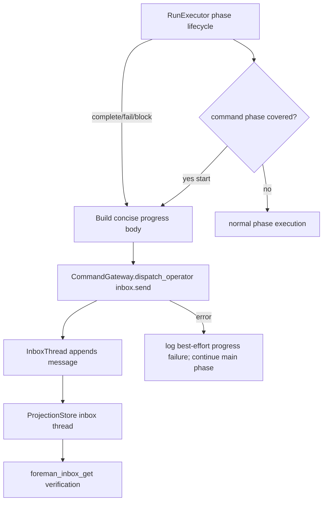

# TRD: Inbox Progress for Command-Driven PRD and Fix Phases

Foreman task title read from `FOREMAN_TASK_TITLE`: **Wire foreman_inbox_send operator updates into prd.yaml and fix.yaml command phases**

Source PRD: `docs/PRD/PRD-2026-f2049b7e-inbox-command-phase-progress.md` (`PRD-2026-f2049b7e`).

## PRD Validation Summary

- Required PRD sections present: Executive Summary, Background/Evidence, Goals, Non-Goals, Personas, Assumptions, Requirements, Dependency Map, TRD Decision Points, Adversarial Review, Implementation Readiness Gate.
- Requirements: 14 sequential `REQ-NNN` IDs.
- Acceptance criteria: 44 `AC-NNN-M` items, Given/When/Then format.
- PRD readiness score: **4.7 PASS**.
- Subject match: PRD and Foreman task both describe adding operator inbox progress to `prd.yaml` and `fix.yaml` command-driven phases.

## Domain Analysis

| Domain | Requirements | Notes |
|---|---|---|
| Workflow manifests | REQ-001, REQ-004, REQ-005, REQ-008, REQ-013 | `prd.yaml` command phases: `create-prd`, `refine-prd`, `create-trd`, `refine-trd`, `implement-trd`; `fix.yaml` command phase: `fix`. Review phases already use prompt files with progress guidance. |
| RunExecutor dispatch | REQ-002, REQ-003, REQ-006, REQ-007 | `RunExecutor.dispatch_agent/5` replaces prompt content with rendered `command:` text for command phases; `foreman_env/4` provides subject/artifact/source-PRD env. |
| Inbox command path | REQ-006, REQ-007, REQ-010, REQ-012, REQ-014 | Reuse existing run inbox aggregate and `foreman_inbox_get` read proof; progress must be concise and non-blocking. |
| Tests and live verification | REQ-009, REQ-010 | Need static coverage tests plus live `prd` and `fix` dispatch proof. |
| Docs and runtime install | REQ-008, REQ-011, REQ-014 | Source changes to bundled workflows/runtime require `go build ./cmd/foreman` and `foreman init --force`; living docs must be checked. |

Brownfield system. This TRD preserves current skill command prompts and adds the narrowest Foreman-owned bridge for command phases instead of changing slash-command invocation semantics.

## Reused Capabilities

`trd-graph-cli capabilities docs/TRD --json` returned `{"capabilities": []}` and `trd-graph-cli overlap docs/TRD` reported no overlapping target files. No foundational TRD provides a reusable capability token.

In-repo mechanisms reused directly:

| Reused mechanism | Provider | Used by |
|---|---|---|
| Existing command rendering | `RunExecutor.render_command_template/4`, `input.prompt_argument` assign | Preserve task prompt quoting and command behavior |
| Existing plan env | `RunExecutor.foreman_env/4`, `plan_subject_env/1`, `put_source_prd_path/3` | Preserve subject, artifact, and PRD handoff contracts |
| Run inbox write path | `CommandGateway.dispatch_operator/2`, `InboxThread` | Append runtime-authored progress messages |
| Inbox read path | `foreman_inbox_get` / `ProjectionStore.inbox_thread/1` | Verify live delivery |
| Prompt progress contract | `packages/foreman_server/priv/defaults/workflows/prompts/*.md` | Source text for cadence/safety language |
| Template installer | `foreman init --force` / `WorkflowTemplate.Installer` | Refresh installed runtime workflows/prompts |

## Architecture Alternatives

| Option | Approach | Pros | Cons | Risk |
|---|---|---|---|---|
| A — convert command phases to prompt files | Replace each `command:` phase with a `prompt:` file containing progress guidance and instructions to run the equivalent `/skill:ensemble-*` command. | Puts guidance in normal prompt body. | High risk: slash command may not execute identically inside a larger natural-language prompt; `{{input.prompt}}`, `--foreman`, artifact, and subject semantics can drift. | High |
| B — append progress guidance to command strings | Keep `command:` but append text after `/skill:...`. | Small manifest diff. | Extra text becomes slash-command arguments or can break slash-command parsing; still not a structured channel. | High |
| C — runtime command-phase progress bridge | Keep `command:` prompts unchanged. RunExecutor emits concise start/completion/failure inbox messages for selected command phases through the existing inbox command path. | Preserves skill invocation exactly; source-validates command prompt replacement; provides real inbox delivery from formerly silent phases. | Runtime cannot know agent-internal milestones; only lifecycle milestones are safe unless later phase-specific signals are added. | Low |

Foreman mode: auto-selected Option C (runtime command-phase progress bridge) as the best fit for this brownfield codebase.

## Architecture Decision

Implement a Foreman-owned command-phase progress bridge in `RunExecutor` for command-driven phases in `prd.yaml` and `fix.yaml`. The bridge appends concise run inbox messages through the same domain path used by `foreman_inbox_send` (`CommandGateway.dispatch_operator/2` with `inbox.send`) when workflow writes/inbox progress are enabled for the run. It never changes the prompt sent to the worker.

### Rationale

Source validation shows a `command:` phase has no reliable in-prompt guidance channel: `dispatch_agent/5` replaces `request.prompt` with the rendered command string for `:command`, while `read_phase_prompt/4` only supplies prompt-file content for prompt phases. The existing command string is the slash-command invocation itself, so modifying it risks argument parsing and subject/artifact behavior. Runtime lifecycle events are already known at the executor boundary, and the inbox aggregate already supports safe run-scoped progress notes.

### Key Decisions

1. **Preserve command semantics:** do not convert `command:` to `prompt:` in v1 and do not append guidance to slash-command strings.
2. **Bridge only configured phases:** enable runtime progress for `prd.yaml` phases `create-prd`, `refine-prd`, `create-trd`, `refine-trd`, `implement-trd`, and `fix.yaml` phase `fix`. Review phases keep their prompt guidance unchanged.
3. **Lifecycle-only cadence:** send start and terminal messages; send failure/blocker messages when the phase fails or is blocked. Do not invent timer chatter or agent-internal milestones the executor cannot observe.
4. **Non-blocking:** inbox-send failure is logged/recorded as best-effort evidence and never changes phase result.
5. **Safe body contract:** messages include workflow, phase, status, and short handoff/result. They never include prompts, env values, credentials, command output, logs, or large artifacts.
6. **Use existing domain path:** route writes through the existing operator command gateway and inbox aggregate so behavior is visible via `foreman_inbox_get` and shares duplicate/idempotency rules.
7. **Static + live proof:** tests must prove source manifests mark the target command phases for bridge coverage, and live `prd`/`fix` runs must prove inbox delivery.

## System Architecture Design

### Components

| Component | Responsibility | Change |
|---|---|---|
| `RunExecutor` | Owns phase lifecycle and already emits phase start/complete/fail events | Add best-effort command-phase progress hooks around start/terminal transitions |
| Workflow phase specs | Declare phase action/metadata | Add explicit bridge metadata or derive from an allowlisted workflow+phase table for target command phases |
| `CommandGateway` | Public operator mutation boundary | Reuse `inbox.send`; no new command type expected |
| `InboxThread` / projections | Persist and project run inbox messages | Reuse unchanged |
| Prompt files | Prompt-driven agent guidance | Preserve existing progress block for review/prompt phases |
| Tests | Prevent manifest/bridge regressions | Add workflow and executor tests for covered command phases and non-blocking errors |
| Docs | Operator/developer expectations | Update or record no-op rationale for required living docs |

### Data Flow

### Interfaces

| Boundary | Protocol | Request | Response/Error |
|---|---|---|---|
| Phase marker | Workflow phase metadata or executor allowlist | workflow name + phase name + action `:command` | Covered/uncovered boolean |
| Progress bridge | Internal helper | `%{run_id, phase_id, phase_name, workflow_name, status, body}` | `:ok` or `{:error, reason}` ignored by main phase |
| Inbox command | `CommandGateway.dispatch_operator/2` | `type: "inbox.send"`, `aggregate_id: "inbox:<run_id>"`, payload with generated `message_id`, `body`, safe metadata | Existing gateway/aggregate result |
| Verification | `foreman_inbox_get` | `{run_id}` | Existing inbox projection with messages |

## Master Task List

### PR 1: Source-validated command-phase bridge design

**Shippable State:** Maintainers can see an explicit source-backed decision for how command phases get inbox progress without changing slash-command prompts; no runtime behavior changes yet.

- [ ] **TRD-001**: Document command and prompt dispatch contracts from `RunExecutor`, worker adapter, workflow manifests, and prompt files [satisfies REQ-001, REQ-002, REQ-003] (3h)
  - Validates PRD ACs: AC-001-1, AC-001-2, AC-001-3, AC-002-1, AC-002-4, AC-003-4
  - Implementation AC:
    - [ ] Given `prd.yaml` is inspected, when phase actions are listed, then all five core PRD/TRD phases are named as command-driven.
    - [ ] Given `fix.yaml` is inspected, when phase actions are listed, then `fix` is named as command-driven.
    - [ ] Given `RunExecutor.dispatch_agent/5` is inspected, when command dispatch is described, then the report states the rendered command replaces prompt-file content.
    - [ ] Given existing prompt files are inspected, when prompt phases are described, then their current `foreman_inbox_send` guidance is cited.
- [ ] **TRD-001-TEST**: Add static workflow inventory tests proving the target `prd.yaml` and `fix.yaml` phases are command phases and review phases are prompt phases [verifies TRD-001] [satisfies REQ-001] [depends: TRD-001] (2h)

### PR 2: Runtime bridge appends safe lifecycle progress for covered command phases

**Shippable State:** Formerly silent `prd.yaml` and `fix.yaml` command phases produce concise start and terminal run inbox messages through the existing inbox domain path while preserving the exact slash-command prompt sent to agents.

- [ ] **TRD-002**: Add a command-phase progress bridge helper in `RunExecutor` that builds safe `inbox.send` commands for covered command phases [satisfies REQ-004, REQ-005, REQ-006, REQ-012] [depends: TRD-001] (4h)
  - Validates PRD ACs: AC-004-1, AC-004-2, AC-004-3, AC-004-4, AC-004-5, AC-005-1, AC-006-1, AC-006-3, AC-012-1, AC-012-2, AC-012-3
  - Implementation AC:
    - [ ] Given a covered command phase starts, when the bridge runs, then it appends a concise start message naming the workflow and phase intent.
    - [ ] Given a covered command phase completes, when the bridge runs, then it appends a concise completion/handoff message.
    - [ ] Given a covered command phase fails or blocks, when the bridge runs, then it appends a concise blocker/failure message without logs, prompts, credentials, or command output.
    - [ ] Given a covered phase has no observable executor lifecycle change, when time passes, then the bridge sends no timer-only chatter.
- [ ] **TRD-002-TEST**: Unit-test bridge message bodies, metadata, generated message IDs, and no prompt/log/env leakage [verifies TRD-002] [satisfies REQ-006, REQ-012] [depends: TRD-002] (3h)
- [ ] **TRD-003**: Invoke the progress bridge at phase start and terminal paths without changing the `prompt` value passed to `Overwatch.start_phase/2` [satisfies REQ-002, REQ-003, REQ-004, REQ-005] [depends: TRD-002] (4h)
  - Validates PRD ACs: AC-002-2, AC-003-1, AC-003-2, AC-003-3, AC-003-4, AC-004-1, AC-005-1
  - Implementation AC:
    - [ ] Given `create-prd` receives `{{input.prompt}}` containing spaces, quotes, newlines, and shell metacharacters, when the phase launches, then the rendered slash-command prompt remains the shell-quoted command produced by existing rendering.
    - [ ] Given `--foreman` is present in the existing command string, when the bridge is enabled, then the worker prompt still includes `--foreman` unchanged.
    - [ ] Given later PRD workflow phases rely on artifact discovery, when the bridge runs, then `FOREMAN_ARTIFACT_PATH` and `FOREMAN_SOURCE_PRD_PATH` behavior is unchanged.
- [ ] **TRD-003-TEST**: Add executor tests proving covered command-phase prompt text is byte-for-byte unchanged while inbox progress writes are attempted [verifies TRD-003] [satisfies REQ-002, REQ-003] [depends: TRD-003] (4h)
- [ ] **TRD-004**: Make bridge failures non-blocking and observable without changing phase success/failure outcome [satisfies REQ-007] [depends: TRD-003] (2h)
  - Validates PRD ACs: AC-007-1, AC-007-2, AC-007-3
  - Implementation AC:
    - [ ] Given `inbox.send` is denied, unavailable, or returns an error, when the main phase succeeds, then the phase remains successful.
    - [ ] Given bridge dispatch fails, when evidence is collected, then the failure is logged or included in the final implementation report without exposing message bodies beyond the concise attempted note.
- [ ] **TRD-004-TEST**: Add failure-injection tests proving bridge dispatch errors do not fail covered phases [verifies TRD-004] [satisfies REQ-007] [depends: TRD-004] (3h)

### PR 3: Manifest coverage and regression protection

**Shippable State:** Bundled workflow sources and tests make it impossible for target command phases or existing review prompts to silently lose inbox-progress coverage.

- [ ] **TRD-005**: Mark or derive bridge coverage for all target phases in `prd.yaml` and `fix.yaml` while preserving review-tail prompt phases [satisfies REQ-004, REQ-005, REQ-013] [depends: TRD-003] (2h)
  - Validates PRD ACs: AC-004-1, AC-004-2, AC-004-3, AC-004-4, AC-004-5, AC-005-1, AC-013-1, AC-013-2
  - Implementation AC:
    - [ ] Given `prd.yaml` is parsed, when bridge coverage is checked, then `create-prd`, `refine-prd`, `create-trd`, `refine-trd`, and `implement-trd` are covered.
    - [ ] Given `fix.yaml` is parsed, when bridge coverage is checked, then `fix` is covered.
    - [ ] Given review phases are parsed, when prompt paths are checked, then `review-coderabbit.md` and `review-repo-rules.md` remain prompt-driven and keep artifact/commit/stack PR behavior.
- [ ] **TRD-005-TEST**: Add static manifest tests that fail if any target command phase loses bridge coverage or any review prompt loses the standard progress block [verifies TRD-005] [satisfies REQ-009, REQ-013] [depends: TRD-005] (3h)
- [ ] **TRD-006**: Add prompt static tests for all bundled prompt files to preserve existing non-blocking progress guidance [satisfies REQ-009, REQ-013] [depends: TRD-005] (2h)
  - Validates PRD ACs: AC-009-3, AC-013-1
  - Implementation AC:
    - [ ] Given bundled prompt files are read, when their progress section is checked, then the standard non-blocking safety text is present.
- [ ] **TRD-006-TEST**: Run the bundled prompt guidance assertions and record results [verifies TRD-006] [satisfies REQ-009] [depends: TRD-006] (1h)

### PR 4: Runtime install, live verification, and docs

**Shippable State:** Installed runtime workflows/prompts contain the change, live `prd` and `fix` runs prove inbox messages through `foreman_inbox_get`, and operator/developer docs match real behavior.

- [ ] **TRD-007**: Refresh installed runtime workflows/prompts after source changes using a freshly built CLI path [satisfies REQ-008] [depends: TRD-005] (2h)
  - Validates PRD ACs: AC-008-1, AC-008-2
  - Implementation AC:
    - [ ] Given bundled workflow or prompt sources changed, when verification runs, then `go build ./cmd/foreman` succeeds and the resulting CLI runs `foreman init --force`.
    - [ ] Given installed runtime copies are inspected after install, when `prd.yaml` and `fix.yaml` are read from the runtime catalog, then the accepted bridge coverage is present.
- [ ] **TRD-007-TEST**: Add or run installer regression evidence proving source and installed workflow copies match for affected files [verifies TRD-007] [satisfies REQ-008] [depends: TRD-007] (2h)
- [ ] **TRD-008**: Dispatch a live `prd` workflow with MCP writes/inbox progress enabled and verify formerly command-driven PRD/TRD phase messages via `foreman_inbox_get` [satisfies REQ-010, REQ-014] [depends: TRD-007] (4h)
  - Validates PRD ACs: AC-010-1, AC-010-3, AC-010-4, AC-014-1, AC-014-2
  - Implementation AC:
    - [ ] Given a live `prd` run completes or reaches target phases, when `foreman_inbox_get` is called, then messages from at least one formerly command-driven `prd.yaml` core phase are present.
    - [ ] Given inbox message bodies are reviewed, when evidence is recorded, then they are concise operator notes and not prompts, logs, credentials, or command output.
    - [ ] Given verification completes, when the implementation report is written, then it includes run ID and exact `foreman_inbox_get` evidence.
- [ ] **TRD-008-TEST**: Record live `prd` run command, run ID, inbox get command, and message excerpts in the implementation report [verifies TRD-008] [satisfies REQ-010, REQ-014] [depends: TRD-008] (1h)
- [ ] **TRD-009**: Dispatch a live `fix` workflow with MCP writes/inbox progress enabled and verify formerly command-driven `fix` phase messages via `foreman_inbox_get` [satisfies REQ-010, REQ-014] [depends: TRD-007] (3h)
  - Validates PRD ACs: AC-010-2, AC-010-3, AC-010-4, AC-014-1, AC-014-2
  - Implementation AC:
    - [ ] Given a live `fix` run reaches the `fix` phase, when `foreman_inbox_get` is called, then messages from the formerly command-driven `fix` phase are present.
    - [ ] Given verification completes, when the implementation report is written, then it includes run ID and exact `foreman_inbox_get` evidence.
- [ ] **TRD-009-TEST**: Record live `fix` run command, run ID, inbox get command, and message excerpts in the implementation report [verifies TRD-009] [satisfies REQ-010, REQ-014] [depends: TRD-009] (1h)
- [ ] **TRD-010**: Check and update `CLAUDE.md`, `AGENTS.md`, `README.md`, `docs/user-guide.md`, and `docs/cli-reference.md` for command-phase inbox progress behavior and runtime-install expectations [satisfies REQ-011] [depends: TRD-008, TRD-009] (3h)
  - Validates PRD ACs: AC-011-1, AC-011-2, AC-011-3
  - Implementation AC:
    - [ ] Given living docs mention command phases, prompt phases, inbox progress, bundled workflows, or `foreman init --force`, when finalization runs, then stale claims are corrected surgically.
    - [ ] Given a required doc file does not need edits, when the implementation report is written, then the no-op reason is recorded.
- [ ] **TRD-010-TEST**: Add final documentation-gate evidence listing all five required files and edit/no-op rationale [verifies TRD-010] [satisfies REQ-011] [depends: TRD-010] (1h)

## Sprint Planning

## Sprint 1: Decision and bridge implementation

PR 1 and PR 2. Delivers source-backed mechanism selection plus the runtime bridge, preserving current command prompts.

## Sprint 2: Coverage guards

PR 3. Adds manifest and prompt regression protection.

## Sprint 3: Runtime/live proof/docs

PR 4. Installs runtime copies, dispatches live verification runs, and completes documentation gate.

## Acceptance Criteria Traceability

| REQ | Description | Implementation Tasks | Test Tasks |
|---|---|---|---|
| REQ-001 | Identify command-phase inbox coverage gaps | TRD-001 | TRD-001-TEST |
| REQ-002 | Select a source-validated delivery mechanism | TRD-001, TRD-003 | TRD-001-TEST, TRD-003-TEST |
| REQ-003 | Preserve Foreman subject and skill argument semantics | TRD-001, TRD-003 | TRD-003-TEST |
| REQ-004 | Cover every `prd.yaml` core phase | TRD-002, TRD-003, TRD-005 | TRD-002-TEST, TRD-003-TEST, TRD-005-TEST |
| REQ-005 | Cover the `fix.yaml` core phase | TRD-002, TRD-003, TRD-005 | TRD-002-TEST, TRD-003-TEST, TRD-005-TEST |
| REQ-006 | Apply the standard operator progress contract | TRD-002 | TRD-002-TEST |
| REQ-007 | Keep inbox-send failures non-blocking | TRD-004 | TRD-004-TEST |
| REQ-008 | Refresh installed runtime workflows/prompts | TRD-007 | TRD-007-TEST |
| REQ-009 | Pin manifest/prompt behavior with tests | TRD-005, TRD-006 | TRD-005-TEST, TRD-006-TEST |
| REQ-010 | Verify live dispatched workflow inbox delivery | TRD-008, TRD-009 | TRD-008-TEST, TRD-009-TEST |
| REQ-011 | Update operator/developer documentation | TRD-010 | TRD-010-TEST |
| REQ-012 | Protect secrets, prompts, and large output | TRD-002 | TRD-002-TEST |
| REQ-013 | Preserve existing review-tail behavior | TRD-005, TRD-006 | TRD-005-TEST, TRD-006-TEST |
| REQ-014 | Provide operator-readable evidence | TRD-008, TRD-009 | TRD-008-TEST, TRD-009-TEST |

Traceability check: 14 requirements covered, 0 uncovered, 0 orphaned annotations.

## Adversarial Review

### Architecture Issues

1. **Issue:** Runtime bridge cannot observe agent-internal milestones, so it cannot honestly report all material milestones inside long-running skill work.  
   **Resolution:** Limit v1 to lifecycle milestones the executor owns (start, complete, fail/block). Do not send timer-only chatter or invented progress. If internal milestones are later required, add an explicit worker progress protocol instead of guessing.
2. **Issue:** Reusing `CommandGateway.dispatch_operator/2` from system runtime code can blur policy boundaries if implemented as privileged bypass.  
   **Resolution:** Keep the write path typed and auditable, use `inbox.send` only, and test that failure/refusal is non-blocking. Do not expose `inbox.delivery.update` or new mutation commands.
3. **Issue:** Static tests can prove bridge attempts but not actual live inbox visibility.  
   **Resolution:** Keep live `prd` and `fix` dispatch with `foreman_inbox_get` as required acceptance evidence.

### Task Coverage Issues

1. **Issue:** `REQ-006` asks for material milestones, but runtime lifecycle only gives start/terminal/failure.  
   **Resolution:** The TRD documents this constraint and scopes v1 messages to observable lifecycle milestones; no fake milestones.
2. **Issue:** `REQ-010` depends on a live environment with MCP writes/inbox progress enabled.  
   **Resolution:** Dedicated live verification tasks record run IDs and inbox evidence; if the environment blocks writes, implementation must report blocker rather than substituting static proof.

### Dependency and Estimate Issues

1. **Issue:** Longest chain is PR 1 → PR 2 → PR 3 → PR 4; live verification and docs depend on installed runtime copies.  
   **Resolution:** Keep PR boundaries vertical and shippable; no task exceeds 4h.
2. **Issue:** Executor tests may require existing Overwatch/worker test doubles and fixture setup.  
   **Resolution:** Allocate 4h to prompt-preservation/inbox-attempt tests and reuse existing RunExecutor test helpers where possible.

### Testability Issues

- All implementation ACs use observable artifacts: source paths, parsed manifests, test assertions, bridge call attempts, phase outcomes, installed runtime file contents, live run IDs, and `foreman_inbox_get` output.
- Subjective terms like "concise" are bounded by explicit exclusions: no prompts, credentials, logs, command output, or large artifacts; messages must name workflow/phase/status only.

## Design Readiness Gate

| Dimension | Score | Rationale |
|---|---:|---|
| Architecture completeness | 4.5 | Defines bridge components, domain write path, data flow, interfaces, and command-preservation decision. Internal agent milestones are explicitly out of scope for v1 because no source-visible signal exists. |
| Task coverage | 4.7 | Every PRD requirement has implementation and test tasks; live verification and docs are explicit. |
| Dependency clarity | 4.6 | Dependencies are acyclic and grouped into four independently reviewable PRs. |
| Estimate confidence | 4.5 | Tasks are small (1–4h) with higher estimates reserved for executor/live verification work. |

Overall design readiness score: **4.6**

Gate decision: **PASS** — ready for implementation after approval.

## Next Steps

- Suggested: `/ensemble-configure-team docs/TRD/TRD-2026-f2049b7e-inbox-command-phase-progress.md`
- Suggested: `/ensemble-implement-trd-beads docs/TRD/TRD-2026-f2049b7e-inbox-command-phase-progress.md`

Stop here. Do not implement until approved.
