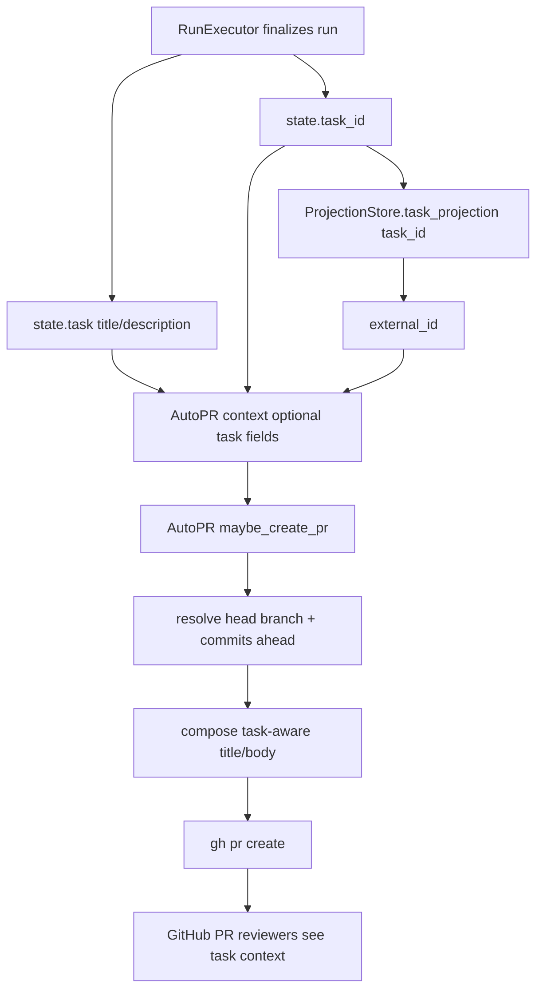

# TRD: Include Task Context in AutoPR-Generated PR Summaries

Foreman task title read from `FOREMAN_TASK_TITLE`: **Include bead/task title and description in AutoPR-generated PR summary**

Source PRD: `docs/PRD/PRD-2026-fe2a98dc-autopr-task-pr-summary.md` (`PRD-2026-fe2a98dc`).

## PRD Validation Summary

- Required PRD sections present: executive summary/product problem, personas, scope, requirements, acceptance criteria, dependency map, adversarial review, and readiness gate.
- Requirements: 12 sequential `REQ-NNN` IDs.
- Acceptance criteria: 27 `AC-NNN-M` items with Given/When/Then style checks.
- PRD readiness score: **4.8 PASS**.
- Subject match: source PRD and Foreman task both describe adding bead/task title and description to AutoPR-generated PR summaries.

## Domain Analysis

| Domain | Requirements | Notes |
|---|---|---|
| AutoPR context contract | REQ-001, REQ-011 | `ForemanServer.Workflow.AutoPR.context()` must carry optional task metadata as typed fields. |
| Run finalization wiring | REQ-001, REQ-005 | `RunExecutor.auto_pr/1` has `state.task`, `state.task_id`, and projections available when building the AutoPR context. |
| PR title/body composition | REQ-002, REQ-003, REQ-004, REQ-006, REQ-012 | `AutoPR.open_pr/5` currently owns `gh pr create` title/body construction and fallback shape. |
| Safety/redaction | REQ-007 | Task metadata must be trimmed, redacted, bounded, and omitted when blank before it reaches `gh`. |
| Tests and live verification | REQ-008, REQ-009 | Need pure composition tests, RunExecutor wiring tests, fallback regression tests, and one live Beads-backed verification. |
| Documentation | REQ-010 | Operator-visible AutoPR summary behavior needs a surgical docs pass after implementation. |

Brownfield system. The change should reuse existing AutoPR branch/base/commit detection, `gh pr create` execution, task aggregate state, task projection `external_id`, and Foreman redaction helpers.

## Reused Capabilities

`trd-graph-cli capabilities docs/TRD --json` returned `{"capabilities": []}` and `trd-graph-cli overlap docs/TRD` reported no overlapping target files across TRDs. No foundational TRD provides a deduplicatable capability token.

In-repo mechanisms reused directly:

| Reused mechanism | Provider | Used by |
|---|---|---|
| AutoPR branch/base/ahead detection | `ForemanServer.Workflow.AutoPR` | REQ-002, REQ-004, REQ-006, REQ-012 |
| Existing `gh pr create` wrapper | `AutoPR.open_pr/5` | REQ-002 through REQ-007 |
| Task aggregate fields | `ForemanServer.Aggregates.Task.State` | REQ-001, REQ-003 |
| Task projection external id | `ForemanServer.ProjectionStore` task projection | REQ-005 |
| Existing redaction boundary | `ForemanServer.Observability.Redactor` or nearest existing safe redaction helper | REQ-007 |

## Architecture Alternatives

| Option | Approach | Pros | Cons | Risk |
|---|---|---|---|---|
| A — inline task formatting in `RunExecutor` | Build final PR title/body fields in `RunExecutor.auto_pr/1` and pass them to AutoPR. | Fast and local at call site. | Duplicates AutoPR ownership; hard to test fallback and `gh` args in one place; weakens typed AutoPR contract. | Medium |
| B — query task projection inside AutoPR | Pass only `task_id`; AutoPR fetches task projection and renders metadata. | Keeps call site small; can find `external_id`. | Couples AutoPR to projection store; hides data dependencies; harder to preserve no-task fallback deterministically. | Medium |
| C — typed task summary in AutoPR context | `RunExecutor` extracts/normalizes task summary identifiers into optional typed context fields; AutoPR owns title/body composition and safety helpers. | Clear boundary, testable composition, preserves current AutoPR ownership and fallback, no hidden projection lookup except optional identifier enrichment at executor boundary. | Requires touching both context type and call-site tests. | Low |

Foreman mode: auto-selected Option C (typed task summary in AutoPR context).

## Architecture Decision

Implement task-aware AutoPR summaries by extending `ForemanServer.Workflow.AutoPR.context()` with optional task summary fields and keeping all PR content composition inside AutoPR.

### Key Decisions

1. **Context shape:** add optional typed fields for `task_title`, `task_description`, `task_id`, and `task_external_id` (or equivalent names with one atom convention) to `AutoPR.context()`.
2. **Executor boundary:** `RunExecutor.auto_pr/1` sources title/description from `state.task`, internal id from `state.task_id` or `state.task.task_id`, and provider-facing id from the task projection when available.
3. **Title:** when normalized `task_title` is nonblank, emit `feat(task): <task title>` capped at 120 visible characters total with deterministic trailing ellipsis on the title portion. When title is blank/absent, emit exactly `feat(run): <run_id>`.
4. **Body fallback:** when no usable task title, description, task id, or external id exists, keep the body exactly as today: `Foreman run `<run_id>` complete.` plus optional artifact and findings sections.
5. **Task body section:** when any usable task metadata exists, render a `## Task` section before artifact/findings, including title, bounded/redacted description, task id, external id, and `br show <id>` for Beads/provider-facing ids.
6. **Additive composition:** existing artifact line and CodeRabbit findings section remain present and ordered after the task summary.
7. **Safety:** trim title/description/ids, omit blanks, redact obvious secrets using the existing Foreman redaction boundary or a small AutoPR-local wrapper around it, and cap rendered description at 4,000 visible characters with a truncation notice pointing to task traceability.
8. **Test seam:** expose pure/private-testable title/body composition through small functions or assert through mocked `System.cmd/3`/existing test seam without network calls.

## System Architecture Design

### Components

| Component | Responsibility | Change |
|---|---|---|
| `ForemanServer.Workflow.AutoPR` | Decide whether to open a PR and compose `gh pr create` args | Extend context type; pass task metadata into `open_pr`; add title/body normalization helpers; preserve fallback exactness |
| `ForemanServer.Workflow.RunExecutor` | Build AutoPR context at finalization | Add task summary fields from state/projection to the context map |
| `ForemanServer.Aggregates.Task.State` | Source title/description/internal task id | Reused; no domain event shape change expected |
| `ForemanServer.ProjectionStore` | Source provider-facing `external_id` if task projection exists | Reused read-only at AutoPR context build boundary |
| Redaction helper | Remove unsafe secret-like content before PR body | Reuse existing `ForemanServer.Observability.Redactor` or closest existing helper; add tests around output |
| Tests | Pin behavior and fallback | Add AutoPR composition tests and RunExecutor context wiring coverage |
| Docs | Operator-facing behavior | Update only real behavior/conventions after implementation |

### Data Flow



### Interfaces

| Boundary | Protocol | Input | Output/Error |
|---|---|---|---|
| RunExecutor → AutoPR | Elixir map typed by `AutoPR.context()` | Required `run_id`, `base_branch`; optional `artifact_path`, `head_branch`, `cwd`, `task_title`, `task_description`, `task_id`, `task_external_id` | `{:ok, pr_url}`, `:noop`, or existing typed error tuples |
| AutoPR title helper | Pure Elixir | `run_id`, optional task title | `feat(task): <capped title>` or exact `feat(run): <run_id>` fallback |
| AutoPR body helper | Pure Elixir | `run_id`, artifact path, task fields | Existing fallback body or task summary + artifact + findings |
| GitHub CLI | `System.cmd("gh", ["pr", "create", ...])` | Existing base/head/title/body args | Existing success/error behavior |

## Master Task List

### PR 1: AutoPR composes safe task-aware PR content

**Shippable State:** AutoPR can render task-aware PR titles and bodies through pure composition helpers while no runtime call site has changed yet, and no-task inputs still produce the exact existing PR title/body.

- [ ] **TRD-001**: Extend `ForemanServer.Workflow.AutoPR.context()` and internal function signatures to accept optional task summary fields without changing branch/base/commit gating [satisfies REQ-001, REQ-011] (2h)
  - Validates PRD ACs: AC-001-1, AC-001-3, AC-011-1
  - Implementation AC:
    - [ ] Given a context includes task title, description, task id, and external id, when `maybe_create_pr/1` validates required run/base fields, then those optional fields are accepted and preserved for PR composition.
    - [ ] Given a context omits every task field, when `maybe_create_pr/1` runs, then its validation and branch/ahead behavior are unchanged.
    - [ ] Given unknown keys exist in the map, when AutoPR runs, then behavior depends only on documented typed fields and required fields.
- [ ] **TRD-001-TEST**: Add AutoPR context tests covering accepted optional task fields and unchanged invalid required-field behavior [verifies TRD-001] [satisfies REQ-001, REQ-011] [depends: TRD-001] (2h)
  - Validates PRD ACs: AC-001-1, AC-001-3, AC-011-1

- [ ] **TRD-002**: Add a task-aware PR title composer that emits `feat(task): <title>` for nonblank task titles and exact `feat(run): <run_id>` fallback otherwise [satisfies REQ-002, REQ-004, REQ-012] [depends: TRD-001] (2h)
  - Validates PRD ACs: AC-002-1, AC-002-2, AC-002-3, AC-004-1, AC-012-1
  - Implementation AC:
    - [ ] Given the task title is `Include bead/task title and description in AutoPR-generated PR summary`, when the title is composed, then the result is `feat(task): Include bead/task title and description in AutoPR-generated PR summary`.
    - [ ] Given the task title is nil, empty, or whitespace, when the title is composed, then the result is exactly `feat(run): <run_id>`.
    - [ ] Given the task title would make the full title exceed 120 visible characters, when composed, then the title portion is deterministically truncated with a trailing ellipsis and the `feat(task): ` prefix remains intact.
- [ ] **TRD-002-TEST**: Add title composition tests for normal task title, nil/blank fallback, whitespace trimming, and 120-character deterministic truncation [verifies TRD-002] [satisfies REQ-002, REQ-004, REQ-012] [depends: TRD-002] (2h)
  - Validates PRD ACs: AC-002-1, AC-002-2, AC-002-3, AC-004-1, AC-012-1

- [ ] **TRD-003**: Add a task-aware PR body composer that renders a `## Task` section before artifact/findings when task metadata exists [satisfies REQ-003, REQ-005, REQ-006] [depends: TRD-001] (3h)
  - Validates PRD ACs: AC-003-1, AC-003-2, AC-003-3, AC-005-1, AC-005-2, AC-006-1, AC-006-2
  - Implementation AC:
    - [ ] Given a task title exists, when the PR body is composed, then a task section containing that title appears before artifact and findings content.
    - [ ] Given a task description exists, when the PR body is composed, then the task section includes the useful markdown/plain text description.
    - [ ] Given task id and provider-facing Beads id exist, when rendered, then the body includes both plain ids and `br show <id>` for the Beads/provider id.
    - [ ] Given `artifact_path` and findings exist, when rendered, then existing artifact and CodeRabbit findings content remains present after the task section.
- [ ] **TRD-003-TEST**: Add body composition tests for title/description/id rendering, Beads `br show` rendering, artifact preservation, and findings preservation [verifies TRD-003] [satisfies REQ-003, REQ-005, REQ-006] [depends: TRD-003] (3h)
  - Validates PRD ACs: AC-003-1, AC-003-2, AC-003-3, AC-005-1, AC-005-2, AC-006-1, AC-006-2

- [ ] **TRD-004**: Preserve exact no-task fallback body shape when no usable task title, description, internal id, or external id exists [satisfies REQ-004, REQ-012] [depends: TRD-003] (2h)
  - Validates PRD ACs: AC-004-2, AC-012-1
  - Implementation AC:
    - [ ] Given all task fields are nil or blank and no artifact exists, when the body is composed, then it is exactly `Foreman run `<run_id>` complete.\n` plus the same findings suffix behavior used today.
    - [ ] Given all task fields are nil or blank and an artifact exists, when the body is composed, then the artifact line matches today's placement and formatting.
- [ ] **TRD-004-TEST**: Add exact string regression tests for current fallback title/body with and without artifact path [verifies TRD-004] [satisfies REQ-004, REQ-012] [depends: TRD-004] (2h)
  - Validates PRD ACs: AC-004-1, AC-004-2, AC-012-1

- [ ] **TRD-005**: Normalize task metadata before rendering: trim fields, omit blanks, redact secret-like content, cap description at 4,000 visible characters, and append a truncation notice [satisfies REQ-007] [depends: TRD-002, TRD-003] (3h)
  - Validates PRD ACs: AC-007-1, AC-007-2, AC-007-3
  - Implementation AC:
    - [ ] Given title, description, or ids have leading/trailing whitespace, when rendered, then output uses trimmed values and omits fields that become blank.
    - [ ] Given description exceeds 4,000 visible characters after trimming/redaction, when rendered, then the body includes only the capped text plus a clear truncation notice pointing to task id or `br show` when available.
    - [ ] Given task metadata contains obvious secret-like tokens, when rendered, then the output uses Foreman's existing redaction boundary or equivalent safe redaction before invoking `gh`.
- [ ] **TRD-005-TEST**: Add safety tests for trimming, blank omission, description cap/truncation notice, and secret redaction [verifies TRD-005] [satisfies REQ-007] [depends: TRD-005] (3h)
  - Validates PRD ACs: AC-007-1, AC-007-2, AC-007-3

### PR 2: RunExecutor wires task context into AutoPR

**Shippable State:** Completed task-backed runs pass task title, description, internal task id, and provider-facing Beads id into AutoPR, so generated PRs can include real task context while ad-hoc runs keep the previous fallback.

- [ ] **TRD-006**: Add a small `RunExecutor` helper that extracts task title and description from `state.task` and internal task id from `state.task_id`/task state using one normalized key convention [satisfies REQ-001, REQ-011] [depends: TRD-001] (2h)
  - Validates PRD ACs: AC-001-1, AC-001-3, AC-011-1
  - Implementation AC:
    - [ ] Given `state.task.title` and `state.task.description` are nonblank, when AutoPR context is built, then `task_title` and `task_description` are included.
    - [ ] Given task fields are nil or blank, when AutoPR context is built, then nil/absent values are passed without crashing.
    - [ ] Given both `state.task_id` and `state.task.task_id` are present, when context is built, then the internal id source is deterministic and documented by the helper.
- [ ] **TRD-006-TEST**: Add RunExecutor helper tests for populated task fields, nil/blank fields, and deterministic internal task id selection [verifies TRD-006] [satisfies REQ-001, REQ-011] [depends: TRD-006] (2h)
  - Validates PRD ACs: AC-001-1, AC-001-3, AC-011-1

- [ ] **TRD-007**: Enrich AutoPR context with provider-facing task/bead id from task projection `external_id` when an internal task id is available [satisfies REQ-001, REQ-005] [depends: TRD-006] (2h)
  - Validates PRD ACs: AC-001-2, AC-005-1, AC-005-2
  - Implementation AC:
    - [ ] Given `ProjectionStore.task_projection(task_id)` returns `external_id`, when AutoPR context is built, then the context includes `task_external_id` distinctly from `task_id`.
    - [ ] Given no projection or no external id exists, when context is built, then AutoPR still receives title/description/internal id without failure.
    - [ ] Given external id is a Beads-style id, when AutoPR body renders it, then the body includes a literal `br show <id>` command.
- [ ] **TRD-007-TEST**: Add tests for external id inclusion, missing projection fallback, and distinction between internal task id and provider-facing id [verifies TRD-007] [satisfies REQ-001, REQ-005] [depends: TRD-007] (2h)
  - Validates PRD ACs: AC-001-2, AC-005-1, AC-005-2

- [ ] **TRD-008**: Wire `RunExecutor.auto_pr/1` to include task summary fields in the `AutoPR.maybe_create_pr/1` context map while preserving existing base branch, artifact path, head branch, and cwd fields [satisfies REQ-001, REQ-006, REQ-012] [depends: TRD-006, TRD-007] (2h)
  - Validates PRD ACs: AC-001-1, AC-001-2, AC-001-3, AC-006-1, AC-006-2, AC-012-1
  - Implementation AC:
    - [ ] Given a finalized task-backed run, when `auto_pr/1` builds the context, then task fields and all existing AutoPR fields are present.
    - [ ] Given an ad-hoc/no-task run, when `auto_pr/1` builds the context, then existing fields are unchanged and optional task fields are nil/absent.
- [ ] **TRD-008-TEST**: Add RunExecutor AutoPR context wiring tests using a test seam/stub that observes the context sent to `AutoPR.maybe_create_pr/1` [verifies TRD-008] [satisfies REQ-001, REQ-006, REQ-008, REQ-012] [depends: TRD-008] (4h)
  - Validates PRD ACs: AC-001-1, AC-001-2, AC-001-3, AC-006-1, AC-006-2, AC-008-3, AC-012-1

### PR 3: Verify generated PR behavior and document operator-visible changes

**Shippable State:** AutoPR task summaries are covered by unit/integration checks, one Beads-backed PR path is verified live when environment permits, and operator docs describe the resulting PR summary behavior.

- [ ] **TRD-009**: Add AutoPR `gh pr create` argument tests proving task-backed context produces task title/body sections without making network calls [satisfies REQ-002, REQ-003, REQ-005, REQ-006, REQ-008] [depends: TRD-003, TRD-008] (3h)
  - Validates PRD ACs: AC-002-1, AC-003-1, AC-003-2, AC-003-3, AC-005-1, AC-005-2, AC-006-1, AC-006-2, AC-008-1
  - Implementation AC:
    - [ ] Given task title/description/id fields and a pushed head branch with commits, when the AutoPR test captures `gh pr create` args, then `--title` and `--body` contain the expected task summary.
    - [ ] Given CodeRabbit findings are present, when args are captured, then findings remain in the body after the task context.
- [ ] **TRD-009-TEST**: Add or extend AutoPR tests with mocked command execution for task-backed `gh pr create` title/body args [verifies TRD-009] [satisfies REQ-002, REQ-003, REQ-005, REQ-006, REQ-008] [depends: TRD-009] (3h)
  - Validates PRD ACs: AC-008-1

- [ ] **TRD-010**: Add exact fallback regression coverage for ad-hoc/no-title runs at the `gh pr create` argument boundary [satisfies REQ-004, REQ-008, REQ-012] [depends: TRD-004, TRD-008] (2h)
  - Validates PRD ACs: AC-004-1, AC-004-2, AC-008-2, AC-012-1
  - Implementation AC:
    - [ ] Given no usable task fields, when AutoPR opens a PR through the test seam, then captured `--title` is exactly `feat(run): <run_id>`.
    - [ ] Given no usable task fields, when AutoPR opens a PR through the test seam, then captured `--body` exactly matches today's run-id/artifact/findings shape.
- [ ] **TRD-010-TEST**: Add no-task `gh pr create` argument regression tests with exact title/body assertions [verifies TRD-010] [satisfies REQ-004, REQ-008, REQ-012] [depends: TRD-010] (2h)
  - Validates PRD ACs: AC-008-2, AC-012-1

- [ ] **TRD-011**: Run compile/test validation and one live Beads-backed AutoPR verification when local credentials and GitHub/Beads environment are available [satisfies REQ-008, REQ-009] [depends: TRD-008, TRD-009, TRD-010] (3h)
  - Validates PRD ACs: AC-008-1, AC-008-2, AC-008-3, AC-009-1, AC-009-2
  - Implementation AC:
    - [ ] Given implementation tests are present, when targeted ExUnit tests run, then task-backed and fallback AutoPR paths pass.
    - [ ] Given a Beads-backed workflow run completes with commits and AutoPR opens a real PR, when `gh pr view <number>` is inspected, then the PR shows the task's actual title and description.
    - [ ] Given live verification is blocked by local credentials/environment, when implementation reports completion, then the report states the blocker and includes all non-live verification completed.
- [ ] **TRD-011-TEST**: Record validation evidence for compile/test commands and live `gh pr view` verification or a truthful environment-blocked status [verifies TRD-011] [satisfies REQ-008, REQ-009] [depends: TRD-011] (2h)
  - Validates PRD ACs: AC-009-1, AC-009-2

- [ ] **TRD-012**: Update operator/developer docs for task-aware AutoPR summaries or explicitly record why a docs file needs no change [satisfies REQ-010] [depends: TRD-011] (2h)
  - Validates PRD ACs: AC-010-1, AC-010-2
  - Implementation AC:
    - [ ] Given AutoPR output changes are operator-visible, when docs are updated, then `README.md`, `docs/user-guide.md`, `docs/cli-reference.md`, `CLAUDE.md`, and `AGENTS.md` are considered and updated only where real behavior or durable conventions changed.
    - [ ] Given a listed docs file does not need a content change, when the implementation report is written, then it states the file was considered and why no change was required.
- [ ] **TRD-012-TEST**: Run documentation diff review and `git diff --check` after docs updates [verifies TRD-012] [satisfies REQ-010] [depends: TRD-012] (1h)
  - Validates PRD ACs: AC-010-1, AC-010-2

## Sprint Planning

## Sprint 1: AutoPR composition contract

- PR 1: Build task-aware title/body composition and safety helpers with exact fallback tests.
- Target outcome: pure AutoPR composition is ready and regression-pinned before executor wiring.

## Sprint 2: Runtime wiring

- PR 2: Wire RunExecutor task context into AutoPR and add integration-level context tests.
- Target outcome: real task-backed runs pass title/description/ids into AutoPR without breaking ad-hoc runs.

## Sprint 3: Verification and docs

- PR 3: Complete gh-argument tests, live verification, and docs pass.
- Target outcome: reviewers see task context in AutoPR PRs and operators know the behavior.

## Acceptance Criteria Traceability

| REQ-NNN | Description | Implementation Tasks | Test Tasks |
|---|---|---|---|
| REQ-001 | Carry task summary fields into AutoPR context | TRD-001, TRD-006, TRD-007, TRD-008 | TRD-001-TEST, TRD-006-TEST, TRD-007-TEST, TRD-008-TEST |
| REQ-002 | Build PR title from task title when available | TRD-002, TRD-009 | TRD-002-TEST, TRD-009-TEST |
| REQ-003 | Add task context section to PR body | TRD-003, TRD-009 | TRD-003-TEST, TRD-009-TEST |
| REQ-004 | Preserve existing fallback PR output | TRD-002, TRD-004, TRD-010 | TRD-002-TEST, TRD-004-TEST, TRD-010-TEST |
| REQ-005 | Include task/bead traceability identifiers | TRD-003, TRD-007, TRD-009 | TRD-003-TEST, TRD-007-TEST, TRD-009-TEST |
| REQ-006 | Keep review-findings and artifact sections intact | TRD-003, TRD-008, TRD-009 | TRD-003-TEST, TRD-008-TEST, TRD-009-TEST |
| REQ-007 | Avoid unsafe or malformed PR content | TRD-005 | TRD-005-TEST |
| REQ-008 | Verify through unit and integration-level tests | TRD-008, TRD-009, TRD-010, TRD-011 | TRD-008-TEST, TRD-009-TEST, TRD-010-TEST, TRD-011-TEST |
| REQ-009 | Verify one live Beads-backed AutoPR path | TRD-011 | TRD-011-TEST |
| REQ-010 | Document operator-visible PR summary behavior | TRD-012 | TRD-012-TEST |
| REQ-011 | Keep AutoPR boundaries typed and explicit | TRD-001, TRD-006 | TRD-001-TEST, TRD-006-TEST |
| REQ-012 | Support ad-hoc/non-Beads-backed runs | TRD-002, TRD-004, TRD-008, TRD-010 | TRD-002-TEST, TRD-004-TEST, TRD-008-TEST, TRD-010-TEST |

## Traceability Validation

Traceability check: 12 requirements covered, 0 uncovered, 0 orphaned annotations.

## Adversarial Review

### Architecture Self-Critique

| Issue | Risk | Resolution |
|---|---|---|
| AutoPR could become coupled to task projections if it fetches `external_id` itself. | Hidden dependency and harder tests. | Keep projection lookup at the RunExecutor boundary; AutoPR only consumes typed optional context fields. |
| Fallback exactness can drift if task body composition always adds headings. | Ad-hoc/non-Beads PR body changes would violate REQ-004. | Detect absence of all usable task metadata and route through the current body string path with exact regression tests. |
| Redaction helper choice may be unclear. | Secret-like content could reach GitHub body. | Implementation must reuse existing Foreman redaction boundary or add a focused wrapper with tests before `gh` args are built. |

### Task Coverage Analysis

| Issue | Risk | Resolution |
|---|---|---|
| Live Beads-backed verification depends on external GitHub/Beads credentials. | A local run may not be able to satisfy AC-009-1 immediately. | TRD-011 requires live verification when available and a truthful blocker report with non-live evidence when unavailable. |
| Documentation updates are easy to skip because this is a small backend change. | Operator-visible behavior changes without docs. | TRD-012 explicitly gates docs consideration for README, user guide, CLI reference, CLAUDE, and AGENTS. |

Task parser self-check passed: all intended implementation and test task lines begin with `- [ ] **TRD-...` and are organized under `### PR N:` headings with shippable states.

### Dependency and Estimate Review

| Issue | Risk | Resolution |
|---|---|---|
| `TRD-011` depends on many tasks and external environment. | Critical path depth is >3 and live verification can delay acceptance. | Keep PR 3 shippable with non-live tests first; report live-verification blocker separately if environment is unavailable. |
| Composition and wiring estimates can be optimistic if existing AutoPR tests lack a command stub seam. | Test work may require small refactor. | Allow task estimates on TRD-008/TRD-009 to include creating or extending a local test seam, without changing runtime behavior. |

No circular dependencies identified. No task is estimated at 8h+.

### Testability Review

| Issue | Risk | Resolution |
|---|---|---|
| “Visible characters” could be interpreted differently for truncation. | Inconsistent title/body bounds. | Define tests around Elixir `String.length/1`/grapheme-aware truncation and document the chosen helper. |
| “Obvious secrets” can be subjective. | Redaction expectations may drift. | Tests should use patterns already covered by Foreman's existing redactor or a fixed AutoPR redaction fixture set. |

## Design Readiness Gate

| Dimension | Score | Notes |
|---|---:|---|
| Architecture completeness | 5 | Components, interfaces, data flow, fallback path, and safety boundary are defined. |
| Task coverage | 5 | Every PRD requirement has implementation and test coverage with traceability. |
| Dependency clarity | 4 | Dependencies are explicit and acyclic; live verification remains environment-dependent. |
| Estimate confidence | 5 | Tasks are granular and under 8h; test-seam risk is isolated. |
| Overall | 4.7 | PASS |

Gate decision: **PASS — ready for implementation after approval**.

## Output Summary

- Document ID: `TRD-2026-fe2a98dc`
- Label: `trd-autopr-task-pr-summary`
- Source PRD correlation id: `fe2a98dc`
- Task count: 24 total (12 implementation, 12 test)
- Design readiness score: 4.7 PASS

Suggested next steps after approval:

```bash
/ensemble-configure-team docs/TRD/TRD-2026-fe2a98dc-autopr-task-pr-summary.md
/ensemble-implement-trd-beads docs/TRD/TRD-2026-fe2a98dc-autopr-task-pr-summary.md
```
