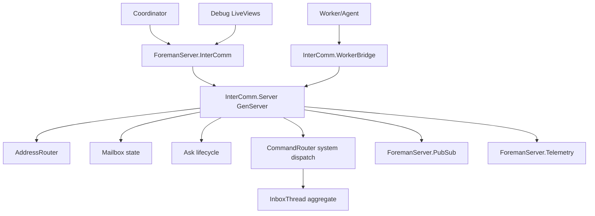

# TRD: InterComm — Inter-Agent Communication Server

## Document Purpose

This TRD converts `PRD-2026-run-test` into an implementation plan for a supervised inter-agent communication subsystem in `packages/foreman_server`. The design adds a named GenServer hub, public API, audited inbox integration, Phoenix.PubSub notifications, worker-safe bridge, tests, and docs.

## PRD Validation Summary

| Check | Result |
|---|---|
| Source document | `docs/PRD/PRD-2026-run-test-intercomm-prd-trd.md` |
| Readiness gate | 3.8 — PASS WITH KNOWN RISKS |
| Requirement sequence | `REQ-001` through `REQ-010`, sequential |
| Acceptance criteria | 27, all mapped |
| Must requirements | 7 |
| Ambiguities | 8 resolved, 0 open |

## Existing Code Reuse

| Existing facility | Reuse |
|---|---|
| `ForemanServer.Application` | Add `InterComm.Supervisor`/`Server` to root supervision tree. |
| `ForemanServer.CommandRouter` | Dispatch `inbox.send` and `inbox.delivery.update` as system commands. |
| `ForemanServer.Aggregates.InboxThread` | Persist message append and delivery transitions in stream `inbox:<run_id>`. |
| `ForemanServer.PubSub` | Broadcast InterComm events to run/worker/role topics. |
| `ForemanServer.Telemetry` | Add InterComm telemetry helpers/events. |
| `ForemanServer.Overwatch.WorkerProtocol` | Add worker-context-safe bridge entry points. |
| Debug LiveViews | Surface pending counts and recent message metadata. |

## Architecture Decision

### Selected: Option B — Live GenServer + Event Audit

Use a supervised `ForemanServer.InterComm.Server` for live mailboxes, pending asks, waiter refs, and timeouts. Use existing inbox aggregate commands for audit. The public facade calls the GenServer; the GenServer dispatches audit commands before mutating accepted state.

### Alternatives

#### Option A — Event-store only

- Pros: fully durable, no volatile mailbox state.
- Cons: slow pending queries, hard ask timeout handling, no live waiter semantics.
- Rejected: PRD asks for a communication server, not just audit events.

#### Option B — Live GenServer + Event Audit (selected)

- Pros: simple OTP ownership, fast pending queries, easy monitor/timeout handling, durable audit trail.
- Cons: live waiters are lost on crash; needs careful audit-before-state ordering.

#### Option C — Phoenix.PubSub only

- Pros: small implementation.
- Cons: no authoritative pending state, no ask lifecycle, no replay/audit.
- Rejected: fails core requirements.

## Component Model



## Target Modules

Paths relative to `packages/foreman_server/`.

| Module | Path | Purpose |
|---|---|---|
| `ForemanServer.InterComm` | `lib/foreman_server/inter_comm.ex` | Public facade: validate options, call server, normalize errors. |
| `ForemanServer.InterComm.Supervisor` | `lib/foreman_server/inter_comm/supervisor.ex` | Start server under OTP supervision. |
| `ForemanServer.InterComm.Server` | `lib/foreman_server/inter_comm/server.ex` | GenServer owning mailboxes, asks, waiter refs, timers, audit dispatch. |
| `ForemanServer.InterComm.Message` | `lib/foreman_server/inter_comm/message.ex` | Message struct/schema validation. |
| `ForemanServer.InterComm.Address` | `lib/foreman_server/inter_comm/address.ex` | Parse/normalize `worker:`, `role:`, `run:` recipients. |
| `ForemanServer.InterComm.Mailbox` | `lib/foreman_server/inter_comm/mailbox.ex` | Pure mailbox transformations. |
| `ForemanServer.InterComm.Ask` | `lib/foreman_server/inter_comm/ask.ex` | Ask state machine and timeout calculations. |
| `ForemanServer.InterComm.WorkerBridge` | `lib/foreman_server/inter_comm/worker_bridge.ex` | Worker-safe API enforcing launch-context sender identity. |
| `ForemanServer.Telemetry` update | `lib/foreman_server/telemetry.ex` | Add InterComm telemetry event helper. |
| Debug view updates | `lib/foreman_server/debug_views.ex` | Show pending counts/recent metadata. |

## Public API Contract

```elixir
@type recipient :: {:worker, String.t()} | {:role, atom() | String.t()} | {:run, String.t()}

@spec send_message(map(), keyword()) :: {:ok, Message.t()} | {:error, term()}
def send_message(attrs, opts \\ [])

@spec ask(map(), keyword()) :: {:ok, Ask.t()} | {:error, term()}
def ask(attrs, opts \\ [])

@spec reply(String.t(), map(), keyword()) :: {:ok, Message.t()} | {:error, term()}
def reply(ask_id, attrs, opts \\ [])

@spec acknowledge(String.t(), keyword()) :: :ok | {:error, term()}
def acknowledge(message_id, opts \\ [])

@spec pending(keyword()) :: {:ok, [Message.t() | Ask.t()]} | {:error, term()}
def pending(filters)

@spec register_recipient(keyword()) :: :ok | {:error, term()}
def register_recipient(opts)
```

Required message fields:

- `run_id :: String.t()`
- `sender :: %{type: :worker | :role | :system, id: String.t()}`
- `recipient :: %{type: :worker | :role | :run, id: String.t()}`
- `body :: String.t()`

Optional metadata:

- `phase_id`, `task_id`, `worker_id`, `correlation_id`, `parent_message_id`, `kind`, `priority`, `ttl_ms`.

Generated IDs:

- `message_id`: `msg_<run_id-safe>_<monotonic_integer>_<random>`.
- `ask_id`: `ask_<run_id-safe>_<monotonic_integer>_<random>`.

## Server State

```elixir
%State{
  sequence: non_neg_integer(),
  mailboxes: %{mailbox_key() => Mailbox.t()},
  asks: %{ask_id() => Ask.t()},
  waiters: %{ask_id() => %{from: GenServer.from(), ref: reference(), timer_ref: reference()}},
  recipient_registry: %{recipient_key() => MapSet.t(pid())},
  config: %{
    default_timeout_ms: 300_000,
    max_messages: 1_000,
    max_pending_asks: 100
  }
}
```

Server invariants:

1. `message_id` is unique in server state.
2. `ask_id` is unique and maps to exactly one originating message.
3. Ask status is monotonic: `pending -> replied | timed_out | orphaned`.
4. Non-test accepted messages are audited before visible live insertion.
5. Cross-run recipient leakage is impossible because every mailbox key includes `run_id`.

## Audit Integration

Accepted send flow:

1. Validate message attrs.
2. Build message struct with IDs/sequence.
3. Dispatch system command:

```elixir
%{
  type: "inbox.send",
  aggregate_id: "inbox:#{run_id}",
  payload: %{
    run_id: run_id,
    message_id: message_id,
    body: body,
    sender: sender,
    recipient: recipient,
    phase_id: phase_id,
    task_id: task_id,
    correlation_id: correlation_id,
    intercomm_kind: kind
  }
}
```

4. On `{:ok, _}`, insert into live mailbox.
5. Broadcast PubSub + telemetry.
6. Return `{:ok, message}`.

Delivery update flow:

```elixir
%{
  type: "inbox.delivery.update",
  aggregate_id: "inbox:#{run_id}",
  payload: %{
    run_id: run_id,
    message_id: message_id,
    delivery_status: "acknowledged" | "replied" | "timed_out" | "orphaned",
    ask_id: ask_id,
    actor: actor,
    updated_at_ms: System.system_time(:millisecond)
  }
}
```

If the existing command gateway cannot route `inbox.*` in system mode, PR 1 must extend aggregate resolution for `"inbox:" <> _` to `ForemanServer.Aggregates.InboxThread` and add focused tests.

## PubSub Topics

| Topic | Event |
|---|---|
| `intercomm:runs:<run_id>` | All accepted messages for run. |
| `intercomm:workers:<run_id>:<worker_id>` | Worker-targeted messages and replies. |
| `intercomm:roles:<run_id>:<role>` | Role-targeted messages. |
| `intercomm:asks:<run_id>:<ask_id>` | Ask terminal update. |

Event shape:

```elixir
{:intercomm, status, %{message_id: id, ask_id: ask_id, run_id: run_id, recipient: recipient}}
```

Bodies are omitted from PubSub debug events by default. Callers can fetch pending/detail through API.

## Timeout and Waiter Semantics

- `ask/2` uses `GenServer.call` only long enough to create the ask.
- For blocking wait, use `ask_and_wait/2` in the facade as a convenience wrapper. It creates an ask, then waits for a direct reply message from the server with caller-side timeout + margin.
- Server monitors waiter PIDs. On `:DOWN`, pending ask becomes orphaned unless already terminal.
- Server owns timer refs and handles `{:ask_timeout, ask_id}` messages.
- Reply to timed-out/orphaned ask returns `{:error, :ask_not_pending}`.

## Worker Bridge

`ForemanServer.InterComm.WorkerBridge` accepts a launch context:

```elixir
%{run_id: run_id, worker_id: worker_id, role: role, phase_id: phase_id, task_id: task_id}
```

Bridge functions inject sender metadata and reject spoofing. The bridge does not expose server PID, mailbox maps, waiter refs, or process-monitor details.

## Testing Strategy

Use ExUnit unit and integration tests under `packages/foreman_server/test/foreman_server/inter_comm/`.

| Test file | Coverage |
|---|---|
| `message_test.exs` | Validation, ID generation, required fields, recipient normalization. |
| `mailbox_test.exs` | Pure mailbox insert/ack/pending/prune ordering. |
| `ask_test.exs` | Ask state transitions and terminal idempotency. |
| `server_test.exs` | Send, ask, reply, timeout, orphan monitor, mailbox creation. |
| `audit_test.exs` | `inbox.send` and `inbox.delivery.update` dispatch; rollback on audit failure. |
| `pubsub_test.exs` | Topic broadcasts for run/worker/role/ask events. |
| `worker_bridge_test.exs` | Sender injection and spoof rejection. |
| `application_test.exs` | Supervision child is started. |
| `debug_views_test.exs` | Pending counts render without message body leakage. |

Required commands:

```text
mix test test/foreman_server/inter_comm
mix test test/foreman_server/command_router_test.exs test/foreman_server/debug_views_test.exs
mix format
```

## PR Plan

### PR 1: Foundation — API, structs, supervisor, command routing

**Shippable State:** InterComm server starts, validates messages, can audit a basic send through `InboxThread`, and has focused unit tests. No ask/reply yet.

Tasks:

1. Add `ForemanServer.InterComm.Message`, `Address`, `Mailbox` pure modules.
2. Add `ForemanServer.InterComm.Server` with `send_message` call path only.
3. Add `ForemanServer.InterComm.Supervisor` and root supervision wiring.
4. Add `ForemanServer.InterComm` facade.
5. Verify or add `CommandRouter` support for aggregate id prefix `inbox:`.
6. Tests: validation, basic send, audit success/failure, supervision.

Acceptance mapping: REQ-001 partial, REQ-002, REQ-003 partial, REQ-006 partial.

### PR 2: Ask/reply and pending lifecycle

**Shippable State:** Agents can ask, reply, timeout, acknowledge, and query pending state with deterministic lifecycle tests.

Tasks:

1. Add `ForemanServer.InterComm.Ask` state machine.
2. Add server pending ask map, timers, waiter monitor support.
3. Implement `ask/2`, `reply/3`, `acknowledge/2`, `pending/1`.
4. Implement delivery audit updates for replied/timed_out/orphaned/acknowledged.
5. Add pruning/capacity config if low-risk; else leave REQ-010 as documented follow-up.
6. Tests: reply idempotency, timeout, orphan handling, pending filters, cross-run isolation.

Acceptance mapping: REQ-001 complete, REQ-004, REQ-005, REQ-006 complete, REQ-010 optional.

### PR 3: PubSub, telemetry, worker bridge

**Shippable State:** InterComm emits live notifications, telemetry, and worker-safe bridge APIs.

Tasks:

1. Add PubSub topic helper and broadcasts for send/reply/timeout/ack.
2. Add telemetry helper to `ForemanServer.Telemetry`.
3. Add `ForemanServer.InterComm.WorkerBridge` with context-enforced sender identity.
4. Add worker bridge tests with spoof rejection.
5. Add PubSub/telemetry tests.

Acceptance mapping: REQ-007, REQ-008, REQ-009 partial.

### PR 4: Debug visibility and docs

**Shippable State:** Operators can inspect pending counts/recent metadata, and docs describe the InterComm contract.

Tasks:

1. Update `DebugViews` run/worker pages to include pending InterComm counts.
2. Ensure message body redaction in debug list by default.
3. Add/extend docs for operator expectations and worker communication examples.
4. Run full server test subset.

Acceptance mapping: REQ-009 complete plus documentation gate.

## Verification Contracts by Requirement

| Requirement | Verification |
|---|---|
| REQ-001 | Facade tests for send/ask/reply success and validation errors. |
| REQ-002 | Application/supervisor test and server restart test. |
| REQ-003 | Address normalization + routing tests for worker/role/run. |
| REQ-004 | Ask lifecycle tests: timeout, one reply, orphan. |
| REQ-005 | Pending query tests with run/worker filters and ack visibility. |
| REQ-006 | Audit command dispatch tests and audit failure rollback tests. |
| REQ-007 | PubSub subscription tests per topic. |
| REQ-008 | Worker bridge spoof-rejection tests. |
| REQ-009 | Telemetry attach/assert tests and debug render tests. |
| REQ-010 | Capacity/pruning tests if implemented in v1. |

## Risks and Mitigations

| Risk | Mitigation |
|---|---|
| Live state lost on server crash | Audit events persist accepted messages; tests document volatile waiter loss. |
| Audit command path missing for `inbox:` | PR 1 verifies/implements aggregate routing before any higher-level feature. |
| Memory pressure | Add config defaults and optional pruning in PR 2; expose mailbox depth telemetry. |
| Message body leakage in debug UI | Debug events/views show metadata/counts by default, not bodies. |
| Worker identity spoofing | WorkerBridge injects sender from launch context and rejects caller-supplied sender mismatch. |

## File Change Summary

Expected new files:

```text
packages/foreman_server/lib/foreman_server/inter_comm.ex
packages/foreman_server/lib/foreman_server/inter_comm/supervisor.ex
packages/foreman_server/lib/foreman_server/inter_comm/server.ex
packages/foreman_server/lib/foreman_server/inter_comm/message.ex
packages/foreman_server/lib/foreman_server/inter_comm/address.ex
packages/foreman_server/lib/foreman_server/inter_comm/mailbox.ex
packages/foreman_server/lib/foreman_server/inter_comm/ask.ex
packages/foreman_server/lib/foreman_server/inter_comm/worker_bridge.ex
packages/foreman_server/test/foreman_server/inter_comm/*_test.exs
```

Expected modified files:

```text
packages/foreman_server/lib/foreman_server/application.ex
packages/foreman_server/lib/foreman_server/command_router.ex
packages/foreman_server/lib/foreman_server/telemetry.ex
packages/foreman_server/lib/foreman_server/debug_views.ex
docs/user-guide.md
docs/cli-reference.md or docs/architecture/* if operator-facing behavior changes
```

## Design Readiness

Score: **4.1 / 5.0**.

Ready for implementation once PR 1 confirms `inbox:` command routing. Biggest unknown is whether existing command-router authorization already supports `inbox.send` in system mode; the PR plan makes this the first verification task.
